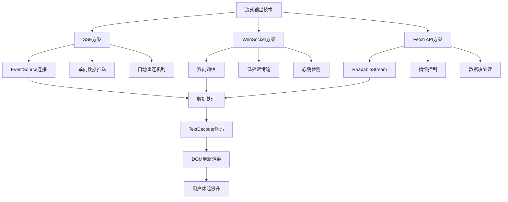

# JavaScript 流式输出技术详解与实践

## 简介

流式输出是现代 Web 开发中提升用户体验的关键技术，它允许服务器在生成内容的同时，将已生成的部分立即发送给客户端，而非等待完整内容生成后一次性传输。这种"边生成边返回"的模式显著降低了用户等待时间，提供了即时反馈，特别适用于 AI 对话、实时日志监控等场景。

## 效果特点

### 视觉特性

- **即时反馈**: 内容边生成边显示，用户无需等待完整内容
- **流畅体验**: 实现类似打字机的效果，提升交互体验
- **实时更新**: 支持实时数据推送和展示
- **低延迟**: 显著降低首屏时间和整体等待时间

### 技术特性

- **资源高效**: 逐块处理数据，大幅减少内存占用
- **灵活适配**: 支持多种技术方案(SSE、WebSocket、Fetch API)
- **广泛兼容**: 适用于各种现代浏览器环境
- **性能优化**: 支持缓冲区管理、错误重连等优化策略

## 工作原理



## 核心实现原理

### 二进制数据处理基础

在实现流式输出时，JavaScript 提供了多种处理二进制数据的 API，其中 ArrayBuffer、Uint8Array 和 TextEncoder/TextDecoder 是核心工具。

```javascript
// ArrayBuffer - 固定长度的原始二进制数据缓冲区
const buffer = new ArrayBuffer(12);
console.log(buffer.byteLength); // 输出：12

// Uint8Array - 8位无符号整型数组
const view = new Uint8Array(buffer);
for (let i = 0; i < view.length; i++) {
	view[i] = i * 2;
}

// TextEncoder/TextDecoder - 文本与二进制数据转换
const encoder = new TextEncoder();
const myBuffer = encoder.encode('你好 HTML5');

const decoder = new TextDecoder();
const originalText = decoder.decode(myBuffer);
```

### 三种主要技术方案

#### 1. Server-Sent Events (SSE)

SSE 是一种允许服务器通过 HTTP 向客户端推送实时更新的技术，专门用于单向的服务器到客户端通信。

```javascript
// 创建EventSource对象
const eventSource = new EventSource('/stream');

// 处理接收到的消息
eventSource.addEventListener('message', function (event) {
	const data = JSON.parse(event.data);
	const outputDiv = document.getElementById('output');
	outputDiv.innerHTML += data.content + '<br>';
});

// 错误处理
eventSource.addEventListener('error', function (error) {
	console.error('SSE连接错误:', error);
});
```

#### 2. WebSocket

WebSocket 是一种在单个 TCP 连接上进行全双工通讯的协议，允许客户端和服务器之间建立持久的连接。

```javascript
// 创建WebSocket对象
const ws = new WebSocket('ws://localhost:8080/chat');

// 连接建立成功
ws.addEventListener('open', function () {
	console.log('WebSocket连接已建立');
	ws.send(JSON.stringify({ type: 'login', userId: '123' }));
});

// 接收消息
ws.addEventListener('message', function (event) {
	const data = JSON.parse(event.data);
	switch (data.type) {
		case 'chunk':
			const outputDiv = document.getElementById('output');
			outputDiv.innerHTML += data.content + '<br>';
			break;
		case 'completion':
			console.log('响应已完成');
			break;
		case 'error':
			console.error('流式响应报错:', data.message);
			break;
	}
});
```

#### 3. Fetch API + ReadableStream

Fetch API 的流式处理是一种利用浏览器原生 API 逐块读取和处理数据的方式。

```javascript
async function fetchStream(url) {
	const response = await fetch(url);
	const reader = response.body.getReader();
	const textDecoder = new TextDecoder();

	while (true) {
		const { done, value } = await reader.read();
		if (done) break;

		const chunkText = textDecoder.decode(value);
		const outputDiv = document.getElementById('output');
		outputDiv.innerHTML += chunkText + '<br>';
	}
}
```

## 参数配置说明

流式输出技术可通过以下参数进行配置和优化：

### 通用配置参数

| 参数名       | 类型   | 默认值 | 说明                               |
| ------------ | ------ | ------ | ---------------------------------- |
| `bufferSize` | Number | 1024   | 缓冲区大小，影响内存占用和传输效率 |
| `retryDelay` | Number | 3000   | 重连延迟时间(ms)                   |
| `maxRetries` | Number | 5      | 最大重连次数                       |
| `timeout`    | Number | 30000  | 连接超时时间(ms)                   |

### SSE 专用参数

| 参数名              | 类型    | 默认值 | 说明             |
| ------------------- | ------- | ------ | ---------------- |
| `withCredentials`   | Boolean | false  | 是否携带认证信息 |
| `heartbeatInterval` | Number  | 30000  | 心跳检测间隔(ms) |

### WebSocket 专用参数

| 参数名         | 类型         | 默认值    | 说明                  |
| -------------- | ------------ | --------- | --------------------- |
| `protocols`    | String/Array | undefined | WebSocket 子协议      |
| `pingInterval` | Number       | 25000     | Ping 消息发送间隔(ms) |

## 实现方案对比

| 方案          | 优点                          | 缺点                     | 适用场景             |
| ------------- | ----------------------------- | ------------------------ | -------------------- |
| **SSE**       | 简单易用、自动重连、HTTP 兼容 | 单向通信、不支持二进制   | 新闻推送、实时日志   |
| **WebSocket** | 全双工、低延迟、支持二进制    | 复杂度高、需处理连接状态 | 聊天应用、在线游戏   |
| **Fetch API** | 灵活性高、精细控制            | 兼容性要求高、实现复杂   | 文件下载、大数据处理 |

## 应用场景

### 1. AI 对话应用

```javascript
// 建立SSE连接实现打字机效果
let eventSource = null;
const abortController = new AbortController();

async function startChat() {
	if (eventSource) {
		eventSource.close();
	}

	eventSource = new EventSource('/api/chat', {
		signal: abortController.signal
	});

	eventSource.addEventListener('message', function (event) {
		const data = JSON.parse(event.data);
		if (data.type === 'chunk') {
			const outputDiv = document.getElementById('output');
			outputDiv.innerHTML += data.content;
		}
		window.scrollTo(0, document.body.scrollHeight);
	});
}
```

### 2. 实时日志监控

```javascript
// WebSocket实现实时日志监控
const ws = new WebSocket('ws://localhost:8080/logs');

ws.addEventListener('open', function () {
	console.log('日志连接已建立');
	ws.send(JSON.stringify({ type: 'subscribe', logs: ['app', 'db'] }));
});

ws.addEventListener('message', function (event) {
	const log = JSON.parse(event.data);
	const logDiv = document.getElementById('logs');
	const logElement = document.createElement('div');
	logElement.className = `log ${log.level}`;
	logElement.textContent = `[${new Date(log.timestamp).toLocaleTimeString()}] ${log.message}`;
	logDiv.appendChild(logElement);
	window.scrollTo(0, document.body.scrollHeight);
});
```

## 性能优化策略

### 1. 缓冲区管理

```javascript
// 使用高水位线控制内存
const readableStream = response.body.pipeThrough(
	new TransformStream({
		transform: function (chunk, controller) {
			controller.enqueue(chunk);
		}
	}),
	{ highWaterMark: 16 }
);
```

### 2. 错误处理与重连

```javascript
// SSE自动重连机制
let reconnectionInterval = 3000;
let reconnectionCount = 0;

eventSource.addEventListener('error', function (error) {
	if (eventSource.readyState === EventSource.CLOSED) {
		console.error('SSE连接已关闭，尝试重新连接...');
		setTimeout(() => {
			eventSource = new EventSource('/api/stream', {
				withCredentials: true
			});
			reconnectionCount = 0;
			reconnectionInterval = 3000;
		}, reconnectionInterval);
		reconnectionInterval *= 2;
		reconnectionCount++;
	}
});
```

### 3. 客户端渲染优化

```javascript
// 节流渲染避免频繁DOM操作
const useThrottleRender = (data, delay = 100) => {
	const [renderData, setRenderData] = useState([]);
	const buffer = useRef([]);

	useEffect(() => {
		buffer.current.push(...data);
		const timer = setTimeout(() => {
			setRenderData(prev => [...prev, ...buffer.current]);
			buffer.current = [];
		}, delay);

		return () => clearTimeout(timer);
	}, [data, delay]);

	return renderData;
};
```

## 故障排除

### 1. 连接失败

**问题**: 无法建立流式连接
**解决方案**:

- 检查服务器地址和端口是否正确
- 确认网络连接正常
- 验证服务器是否支持相应协议
- 查看浏览器控制台错误信息

### 2. 数据接收异常

**问题**: 数据接收不完整或乱序
**解决方案**:

- 检查数据编码和解码是否一致
- 确认缓冲区大小设置合理
- 验证服务器数据分块逻辑
- 使用开发者工具监控网络请求

### 3. 内存泄漏

**问题**: 长时间运行后内存占用持续增加
**解决方案**:

- 正确关闭 EventSource 和 WebSocket 连接
- 及时清理事件监听器
- 合理设置缓冲区大小
- 使用 WeakMap 等弱引用数据结构

## 技术要点

### 1. 浏览器兼容性

- SSE: IE 不支持，其他现代浏览器均支持
- WebSocket: 所有现代浏览器均支持
- Fetch API Stream: Chrome 52+, Firefox 65+, Safari 10.1+

### 2. 服务端实现要点

- 设置正确的响应头(`Content-Type: text/event-stream`)
- 保持连接活跃，避免超时断开
- 合理控制数据分块大小
- 实现优雅的连接关闭机制

### 3. 客户端处理要点

- 正确处理各种连接状态
- 实现健壮的错误处理机制
- 合理使用节流和防抖优化性能
- 注意内存管理和资源释放

## 未来发展趋势

1. **Web Components 普及**: 流式输出组件更容易复用和标准化
2. **WebAssembly 成熟**: 提供更高效的二进制处理能力
3. **新通信协议**: HTTP/3 等新协议提升流式输出性能
4. **AI 集成深化**: 更智能的流式内容生成和推送

掌握 JavaScript 流式输出技术，将帮助开发者创建更流畅、更高效的 Web 应用，为用户提供更好的用户体验。
