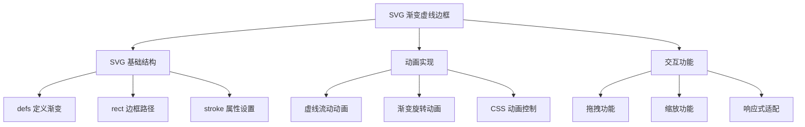
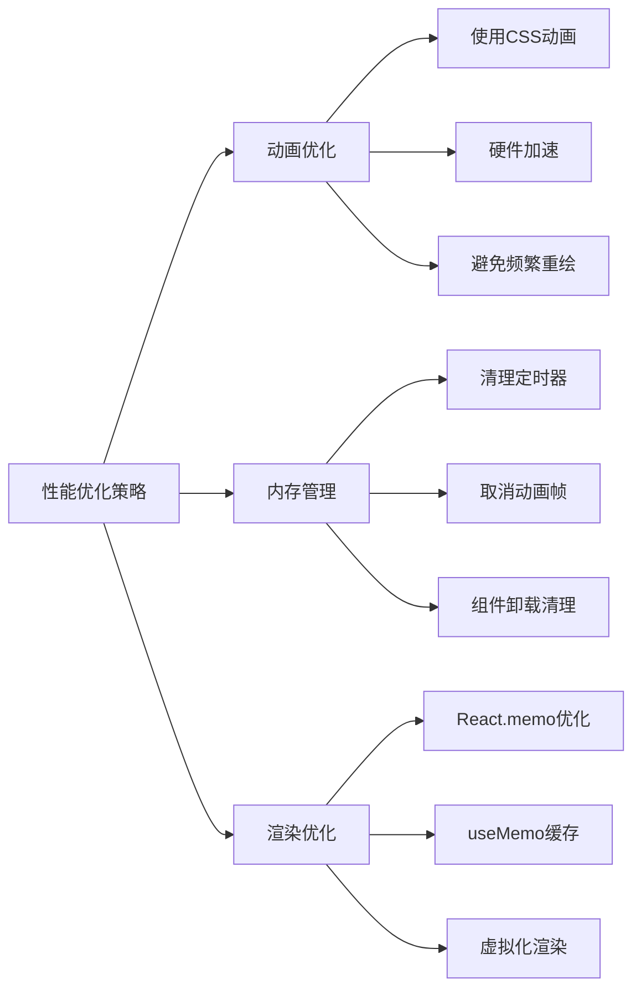

# SVG 渐变色虚线动画边框实现

本文介绍如何使用 SVG 技术实现具有渐变色、虚线样式且带有动画效果的边框组件，支持容器拖拽缩放等交互功能。

## 功能特性

### 核心功能

- **渐变色描边**: 支持线性和径向渐变效果
- **虚线边框**: 可自定义虚线样式和间距
- **动画效果**: 流动的边框动画，增强视觉效果
- **交互支持**: 容器支持拖拽和缩放操作
- **响应式设计**: 自适应不同尺寸的容器

### 技术优势

- **矢量图形**: SVG 确保在任何分辨率下都清晰显示
- **性能优化**: 使用 CSS 动画，硬件加速支持
- **灵活配置**: 支持多种样式参数自定义
- **兼容性好**: 现代浏览器广泛支持

## 📐 工作原理



## 💻 实现演示

<demo react="react/Animate/SvgBorder/index.tsx" 
:reactFiles="['react/Animate/SvgBorder/index.tsx']" 
/>

## 🛠️ 核心实现原理

### SVG 基础结构

```html
<svg width="100%" height="100%" xmlns="http://www.w3.org/2000/svg">
	<defs>
		<!-- 定义渐变色 -->
		<linearGradient id="borderGradient" x1="0%" y1="0%" x2="100%" y2="0%">
			<stop offset="0%" style="stop-color:#ff6b6b;stop-opacity:1" />
			<stop offset="50%" style="stop-color:#4ecdc4;stop-opacity:1" />
			<stop offset="100%" style="stop-color:#45b7d1;stop-opacity:1" />
		</linearGradient>
	</defs>

	<!-- 边框路径 -->
	<rect
		x="2"
		y="2"
		width="calc(100% - 4px)"
		height="calc(100% - 4px)"
		fill="none"
		stroke="url(#borderGradient)"
		stroke-width="4"
		stroke-dasharray="10,5"
		stroke-dashoffset="0"
	/>
</svg>
```

### 动画实现

```css
/* 虚线流动动画 */
@keyframes dash-flow {
	0% {
		stroke-dashoffset: 0;
	}
	100% {
		stroke-dashoffset: -30; /* 负值表示向前流动 */
	}
}

.animated-border {
	animation: dash-flow 2s linear infinite;
}

/* 渐变色旋转动画 */
@keyframes gradient-rotate {
	0% {
		transform: rotate(0deg);
	}
	100% {
		transform: rotate(360deg);
	}
}
```

### React 组件实现

```typescript
interface AnimatedBorderProps {
	width?: number;
	height?: number;
	strokeWidth?: number;
	dashArray?: string;
	animationDuration?: number;
	gradientColors?: string[];
	children?: React.ReactNode;
}

const AnimatedBorder: React.FC<AnimatedBorderProps> = ({
	width = 300,
	height = 200,
	strokeWidth = 4,
	dashArray = '10,5',
	animationDuration = 2,
	gradientColors = ['#ff6b6b', '#4ecdc4', '#45b7d1'],
	children
}) => {
	const gradientId = `gradient-${Math.random().toString(36).substr(2, 9)}`;

	return (
		<div className="animated-border-container" style={{ width, height }}>
			<svg
				width="100%"
				height="100%"
				className="border-svg"
				style={{
					position: 'absolute',
					top: 0,
					left: 0,
					pointerEvents: 'none'
				}}
			>
				<defs>
					<linearGradient id={gradientId} x1="0%" y1="0%" x2="100%" y2="0%">
						{gradientColors.map((color, index) => (
							<stop
								key={index}
								offset={`${(index / (gradientColors.length - 1)) * 100}%`}
								stopColor={color}
								stopOpacity="1"
							/>
						))}
					</linearGradient>
				</defs>

				<rect
					x={strokeWidth / 2}
					y={strokeWidth / 2}
					width={`calc(100% - ${strokeWidth}px)`}
					height={`calc(100% - ${strokeWidth}px)`}
					fill="none"
					stroke={`url(#${gradientId})`}
					strokeWidth={strokeWidth}
					strokeDasharray={dashArray}
					className="animated-stroke"
					style={{
						animation: `dash-flow ${animationDuration}s linear infinite`
					}}
				/>
			</svg>

			<div className="border-content">{children}</div>
		</div>
	);
};
```

## 🎨 高级功能

### 多种边框样式

```typescript
// 圆角边框
const RoundedBorder = () => (
	<rect
		rx="20"
		ry="20"
		// ... 其他属性
	/>
);

// 椭圆边框
const EllipseBorder = () => (
	<ellipse
		cx="50%"
		cy="50%"
		rx="45%"
		ry="40%"
		// ... 其他属性
	/>
);

// 自定义路径边框
const CustomPathBorder = () => (
	<path
		d="M20,20 Q50,5 80,20 T140,20 L140,80 Q125,95 110,80 T50,80 Z"
		// ... 其他属性
	/>
);
```

### 交互功能实现

```typescript
const InteractiveBorder = () => {
	const [isHovered, setIsHovered] = useState(false);
	const [isDragging, setIsDragging] = useState(false);
	const [position, setPosition] = useState({ x: 0, y: 0 });

	const handleMouseDown = (e: React.MouseEvent) => {
		setIsDragging(true);
		// 拖拽逻辑
	};

	const handleMouseMove = (e: React.MouseEvent) => {
		if (isDragging) {
			setPosition({
				x: e.clientX - startPos.x,
				y: e.clientY - startPos.y
			});
		}
	};

	return (
		<div
			className={`interactive-border ${isHovered ? 'hovered' : ''}`}
			onMouseEnter={() => setIsHovered(true)}
			onMouseLeave={() => setIsHovered(false)}
			onMouseDown={handleMouseDown}
			onMouseMove={handleMouseMove}
			style={{
				transform: `translate(${position.x}px, ${position.y}px)`,
				transition: isDragging ? 'none' : 'transform 0.3s ease'
			}}
		>
			{/* SVG 边框内容 */}
		</div>
	);
};
```

### 缩放功能

```typescript
const ScalableBorder = () => {
	const [scale, setScale] = useState(1);

	const handleWheel = (e: React.WheelEvent) => {
		e.preventDefault();
		const delta = e.deltaY > 0 ? 0.9 : 1.1;
		setScale(prev => Math.max(0.5, Math.min(2, prev * delta)));
	};

	return (
		<div
			onWheel={handleWheel}
			style={{
				transform: `scale(${scale})`,
				transformOrigin: 'center',
				transition: 'transform 0.2s ease'
			}}
		>
			{/* 边框内容 */}
		</div>
	);
};
```

## 📊 性能分析



## ⚡ 性能优化

### 1. 动画优化

```css
/* 使用 transform 而不是改变 stroke-dashoffset */
.optimized-animation {
	will-change: transform;
	transform: translateX(0);
	animation: slide-dash 2s linear infinite;
}

@keyframes slide-dash {
	0% {
		transform: translateX(0);
	}
	100% {
		transform: translateX(-30px);
	}
}
```

### 2. 内存管理

```typescript
const useAnimatedBorder = () => {
	const animationRef = useRef<number>();

	useEffect(() => {
		return () => {
			if (animationRef.current) {
				cancelAnimationFrame(animationRef.current);
			}
		};
	}, []);

	const startAnimation = useCallback(() => {
		// 动画逻辑
	}, []);

	return { startAnimation };
};
```

### 3. 渲染优化

```typescript
const MemoizedBorder = React.memo(AnimatedBorder, (prevProps, nextProps) => {
	return (
		prevProps.width === nextProps.width &&
		prevProps.height === nextProps.height &&
		prevProps.gradientColors.join(',') === nextProps.gradientColors.join(',')
	);
});
```

## 🛠️ 技术要点

### 1. SVG 渐变实现

- 使用 `<defs>` 和 `<linearGradient>` 定义渐变
- 通过 `stop` 元素控制颜色分布
- 使用 `url(#gradientId)` 应用渐变到描边

### 2. 虚线动画原理

- `stroke-dasharray` 定义虚线模式
- `stroke-dashoffset` 控制虚线偏移量
- 通过 CSS 动画改变 `stroke-dashoffset` 实现流动效果

### 3. 响应式设计

- 使用百分比单位确保自适应
- 通过 `calc()` 函数精确计算边框位置
- 利用 `viewBox` 属性保持比例

## 应用场景

### 1. 卡片组件增强

```typescript
const EnhancedCard = ({ children, isActive }) => (
	<AnimatedBorder
		gradientColors={isActive ? ['#ff6b6b', '#4ecdc4'] : ['#ccc', '#999']}
		animationDuration={isActive ? 1.5 : 0}
	>
		<div className="card-content">{children}</div>
	</AnimatedBorder>
);
```

### 2. 按钮特效

```typescript
const AnimatedButton = ({ children, onClick }) => (
	<AnimatedBorder width={120} height={40} strokeWidth={2} dashArray="5,3">
		<button onClick={onClick} className="animated-btn">
			{children}
		</button>
	</AnimatedBorder>
);
```

### 3. 加载状态指示

```typescript
const LoadingBorder = ({ isLoading }) => (
	<AnimatedBorder
		gradientColors={['#3498db', '#2ecc71', '#3498db']}
		animationDuration={isLoading ? 1 : 0}
		dashArray="8,4"
	>
		<div className="loading-content">{isLoading ? '加载中...' : '加载完成'}</div>
	</AnimatedBorder>
);
```

## 🧪 故障排除

### 1. 动画卡顿

**问题**: 动画在某些设备上出现卡顿
**解决方案**:

- 使用 CSS 动画替代 JavaScript 动画
- 启用硬件加速: `transform: translateZ(0)`
- 减少动画复杂度和频率

### 2. 渐变显示异常

**问题**: 渐变在不同浏览器中显示不一致
**解决方案**:

- 添加浏览器前缀
- 使用标准的 SVG 渐变语法
- 测试主流浏览器兼容性

### 3. 响应式适配问题

**问题**: 在小屏幕设备上边框显示异常
**解决方案**:

- 使用媒体查询调整边框宽度
- 设置最小尺寸限制
- 优化虚线模式在小尺寸下的显示

## 最佳实践

### 设计原则

1. **适度使用**: 避免过度的动画效果影响用户体验
2. **性能优先**: 使用 CSS 动画而非 JavaScript 动画
3. **可访问性**: 提供禁用动画的选项
4. **响应式**: 确保在不同设备上都有良好表现

### 实施建议

1. **渐进增强**: 从静态边框开始，逐步添加动画效果
2. **用户控制**: 允许用户控制动画的开启和关闭
3. **性能监控**: 监控动画对页面性能的影响
4. **兼容性测试**: 在不同浏览器中测试效果

---

_SVG 动画边框是现代网页设计中的亮点功能，合理使用可以显著提升用户体验和视觉效果。_ ✨
