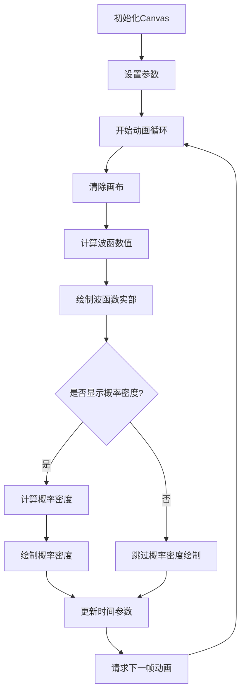

# 波浪动画效果

## 简介

波浪动画效果是一个使用 React 和 Canvas 实现的动态波函数可视化组件，模拟量子力学中的波包传播现象。该组件通过绘制波函数的实部和概率密度，展示波动的动态变化过程。

## 效果演示

<demo react="react/effects/WaveAnimation/example.tsx" 
:reactFiles="['react/effects/WaveAnimation/example.tsx', 'react/effects/WaveAnimation/index.tsx','react/effects/WaveAnimation/index.scss']" />

## 核心实现

### 流程图



### 核心逻辑说明

1. **初始化阶段**：获取 Canvas 上下文，设置初始参数
2. **动画循环**：使用`requestAnimationFrame`实现流畅动画
3. **波函数计算**：基于量子力学原理计算波函数值
4. **绘制过程**：分别绘制波函数实部和概率密度曲线
5. **参数更新**：随时间更新波函数参数，实现动态效果

## React 组件实现

### 主组件

```tsx
import React, { useEffect, useRef } from 'react';
import './index.scss';

interface WaveAnimationProps {
	width?: number;
	height?: number;
	amplitude?: number;
	frequency?: number;
	speed?: number;
	color?: string;
	showProbability?: boolean;
	probabilityColor?: string;
	className?: string;
	style?: React.CSSProperties;
}

const WaveAnimation: React.FC<WaveAnimationProps> = ({
	width = 500,
	height = 300,
	amplitude = 100,
	frequency = 0.2,
	speed = 0.02,
	color = 'cyan',
	showProbability = true,
	probabilityColor = 'yellow',
	className = '',
	style = {}
}) => {
	const canvasRef = useRef<HTMLCanvasElement>(null);
	const timeRef = useRef(0);
	const animationRef = useRef<number>(0);

	useEffect(() => {
		const canvas = canvasRef.current;
		if (!canvas) return;

		const ctx = canvas.getContext('2d');
		if (!ctx) return;

		const N = 500;
		const dx = 1;

		const draw = () => {
			if (!ctx) return;

			// 清除画布
			ctx.clearRect(0, 0, width, height);
			ctx.lineWidth = 2;

			// 绘制波函数实部
			ctx.beginPath();
			ctx.strokeStyle = color;

			for (let i = 0; i < N; i++) {
				let x = (i - N / 2) * dx;
				let sigma = 30;
				let k0 = frequency;

				// 高斯包络
				let envelope = Math.exp((-x * x) / (2 * sigma * sigma));

				// 时间演化的波：Re(ψ) = envelope * cos(kx - ωt)
				let real = envelope * Math.cos(k0 * x - speed * timeRef.current);

				let px = i * (width / N);
				let py = height / 2 - real * amplitude;

				if (i === 0) ctx.moveTo(px, py);
				else ctx.lineTo(px, py);
			}

			ctx.stroke();

			// 绘制概率密度 (|ψ|²)
			if (showProbability) {
				ctx.beginPath();
				ctx.strokeStyle = probabilityColor;
				for (let i = 0; i < N; i++) {
					let x = (i - N / 2) * dx;
					let sigma = 30;
					let k0 = frequency;
					let envelope = Math.exp((-x * x) / (2 * sigma * sigma));
					let prob = envelope * envelope;

					let px = i * (width / N);
					let py = height / 2 - prob * amplitude * 3;

					if (i === 0) ctx.moveTo(px, py);
					else ctx.lineTo(px, py);
				}
				ctx.stroke();
			}

			timeRef.current += 1;
			animationRef.current = requestAnimationFrame(draw);
		};

		animationRef.current = requestAnimationFrame(draw);

		return () => {
			cancelAnimationFrame(animationRef.current);
		};
	}, [width, height, amplitude, frequency, speed, color, showProbability, probabilityColor]);

	return (
		<div className={`wave-animation ${className}`} style={style}>
			<canvas ref={canvasRef} width={width} height={height} />
		</div>
	);
};

export default WaveAnimation;
```

### 示例组件

```tsx
import React, { useState } from 'react';
import WaveAnimation from './index';

const WaveAnimationExample: React.FC = () => {
	const [amplitude, setAmplitude] = useState(100);
	const [frequency, setFrequency] = useState(0.2);
	const [speed, setSpeed] = useState(0.02);
	const [color, setColor] = useState('cyan');
	const [showProbability, setShowProbability] = useState(true);
	const [probabilityColor, setProbabilityColor] = useState('yellow');

	const handleAmplitudeChange = (e: React.ChangeEvent<HTMLInputElement>) => {
		setAmplitude(Number(e.target.value));
	};

	const handleFrequencyChange = (e: React.ChangeEvent<HTMLInputElement>) => {
		setFrequency(Number(e.target.value));
	};

	const handleSpeedChange = (e: React.ChangeEvent<HTMLInputElement>) => {
		setSpeed(Number(e.target.value));
	};

	const handleColorChange = (e: React.ChangeEvent<HTMLSelectElement>) => {
		setColor(e.target.value);
	};

	const handleProbabilityColorChange = (e: React.ChangeEvent<HTMLSelectElement>) => {
		setProbabilityColor(e.target.value);
	};

	return (
		<div style={{ padding: '20px', backgroundColor: '#000', color: '#fff', minHeight: '100vh' }}>
			<h1 style={{ textAlign: 'center', marginBottom: '30px' }}>波浪动画效果演示</h1>

			<div style={{ marginBottom: '30px', textAlign: 'center' }}>
				<h2 style={{ marginBottom: '15px' }}>默认波浪动画效果</h2>
				<div
					style={{
						display: 'inline-block',
						backgroundColor: '#222',
						padding: '20px',
						borderRadius: '8px'
					}}
				>
					<WaveAnimation width={500} height={300} />
				</div>
			</div>

			<div style={{ marginBottom: '30px' }}>
				<h2 style={{ marginBottom: '15px', textAlign: 'center' }}>自定义配置波浪动画</h2>
				<div
					style={{
						display: 'flex',
						flexDirection: 'column',
						alignItems: 'center',
						gap: '20px',
						padding: '20px',
						backgroundColor: '#222',
						borderRadius: '8px'
					}}
				>
					<div style={{ display: 'inline-block' }}>
						<WaveAnimation
							width={500}
							height={300}
							amplitude={amplitude}
							frequency={frequency}
							speed={speed}
							color={color}
							showProbability={showProbability}
							probabilityColor={probabilityColor}
						/>
					</div>

					<div
						style={{
							display: 'grid',
							gridTemplateColumns: 'repeat(auto-fit, minmax(200px, 1fr))',
							gap: '15px',
							width: '100%',
							maxWidth: '800px'
						}}
					>
						<div>
							<label style={{ display: 'block', marginBottom: '5px' }}>振幅: {amplitude}</label>
							<input
								type="range"
								min="10"
								max="200"
								value={amplitude}
								onChange={handleAmplitudeChange}
								style={{ width: '100%' }}
							/>
						</div>

						<div>
							<label style={{ display: 'block', marginBottom: '5px' }}>
								频率: {frequency.toFixed(2)}
							</label>
							<input
								type="range"
								min="0.01"
								max="1"
								step="0.01"
								value={frequency}
								onChange={handleFrequencyChange}
								style={{ width: '100%' }}
							/>
						</div>

						<div>
							<label style={{ display: 'block', marginBottom: '5px' }}>
								速度: {speed.toFixed(3)}
							</label>
							<input
								type="range"
								min="0.001"
								max="0.1"
								step="0.001"
								value={speed}
								onChange={handleSpeedChange}
								style={{ width: '100%' }}
							/>
						</div>

						<div>
							<label style={{ display: 'block', marginBottom: '5px' }}>波形颜色</label>
							<select
								value={color}
								onChange={handleColorChange}
								style={{ width: '100%', padding: '5px' }}
							>
								<option value="cyan">青色</option>
								<option value="red">红色</option>
								<option value="green">绿色</option>
								<option value="blue">蓝色</option>
								<option value="magenta">洋红色</option>
								<option value="orange">橙色</option>
							</select>
						</div>

						<div>
							<label style={{ display: 'block', marginBottom: '5px' }}>
								<input
									type="checkbox"
									checked={showProbability}
									onChange={e => setShowProbability(e.target.checked)}
								/>
								显示概率密度
							</label>
						</div>

						{showProbability && (
							<div>
								<label style={{ display: 'block', marginBottom: '5px' }}>概率密度颜色</label>
								<select
									value={probabilityColor}
									onChange={handleProbabilityColorChange}
									style={{ width: '100%', padding: '5px' }}
								>
									<option value="yellow">黄色</option>
									<option value="white">白色</option>
									<option value="lime">黄绿色</option>
									<option value="pink">粉色</option>
								</select>
							</div>
						)}
					</div>
				</div>
			</div>

			<div
				style={{
					marginTop: '30px',
					padding: '20px',
					backgroundColor: '#333',
					borderRadius: '8px',
					maxWidth: '800px',
					margin: '30px auto 0'
				}}
			>
				<h2 style={{ marginBottom: '15px' }}>波浪动画特点</h2>
				<ul style={{ paddingLeft: '20px' }}>
					<li style={{ margin: '10px 0' }}>基于量子力学波函数原理的可视化实现</li>
					<li style={{ margin: '10px 0' }}>支持自定义振幅、频率、速度等参数</li>
					<li style={{ margin: '10px 0' }}>可选择显示波函数实部和概率密度</li>
					<li style={{ margin: '10px 0' }}>多种颜色选项，满足不同视觉需求</li>
					<li style={{ margin: '10px 0' }}>使用Canvas绘制，性能优异</li>
					<li style={{ margin: '10px 0' }}>使用TypeScript编写，具有完整的类型定义</li>
				</ul>

				<h3 style={{ marginTop: '20px', marginBottom: '10px' }}>使用说明</h3>
				<p>
					波浪动画组件通过Canvas绘制动态波函数图像，模拟量子力学中的波包传播现象。
					用户可以通过调整参数来观察不同参数对波形的影响。
				</p>
				<p style={{ marginTop: '10px' }}>
					<strong>Props说明：</strong>
					<br />
					• width: 画布宽度，默认500px
					<br />
					• height: 画布高度，默认300px
					<br />
					• amplitude: 振幅，默认100
					<br />
					• frequency: 频率，默认0.2
					<br />
					• speed: 动画速度，默认0.02
					<br />
					• color: 波形颜色，默认cyan
					<br />
					• showProbability: 是否显示概率密度，默认true
					<br />
					• probabilityColor: 概率密度颜色，默认yellow
					<br />
					• className: 自定义CSS类名
					<br />• style: 自定义内联样式
				</p>
			</div>
		</div>
	);
};

export default WaveAnimationExample;
```

## 参数说明

### 基础参数

| 参数      | 类型   | 默认值 | 说明           |
| --------- | ------ | ------ | -------------- |
| width     | number | 500    | 画布宽度(像素) |
| height    | number | 300    | 画布高度(像素) |
| amplitude | number | 100    | 波形振幅       |
| frequency | number | 0.2    | 波形频率       |
| speed     | number | 0.02   | 动画播放速度   |

### 颜色参数

| 参数             | 类型    | 默认值   | 说明             |
| ---------------- | ------- | -------- | ---------------- |
| color            | string  | 'cyan'   | 波形颜色         |
| showProbability  | boolean | true     | 是否显示概率密度 |
| probabilityColor | string  | 'yellow' | 概率密度颜色     |

### 样式参数

| 参数      | 类型                | 默认值 | 说明            |
| --------- | ------------------- | ------ | --------------- |
| className | string              | ''     | 自定义 CSS 类名 |
| style     | React.CSSProperties | {}     | 自定义内联样式  |

## 使用说明

### 基本使用

```tsx
import WaveAnimation from './effects/WaveAnimation';

function App() {
	return (
		<div style={{ backgroundColor: 'black', color: 'white', minHeight: '100vh' }}>
			<WaveAnimation />
		</div>
	);
}
```

### 自定义配置

```tsx
import WaveAnimation from './effects/WaveAnimation';

function App() {
	return (
		<div style={{ backgroundColor: 'black', color: 'white', minHeight: '100vh' }}>
			<WaveAnimation
				width={600}
				height={400}
				amplitude={150}
				frequency={0.3}
				speed={0.03}
				color="blue"
				showProbability={false}
			/>
		</div>
	);
}
```

## 实现原理

### 1. 波函数计算

波浪动画基于量子力学中的波包概念，使用以下公式计算波函数：

```
ψ(x,t) = envelope * exp(i(k₀x - ωt))
Re(ψ) = envelope * cos(k₀x - ωt)
|ψ|² = envelope²
```

其中：

- envelope: 高斯包络函数
- k₀: 波数
- ω: 角频率
- t: 时间参数

### 2. Canvas 绘制

使用 HTML5 Canvas API 进行绘制：

1. **清除画布**: 每帧开始前清除之前的内容
2. **绘制波形**: 通过连接点的方式绘制连续曲线
3. **动画循环**: 使用`requestAnimationFrame`实现流畅动画

### 3. 参数控制

通过 React 的 useState 和 useEffect 钩子管理组件状态和副作用：

```tsx
useEffect(() => {
	// 动画逻辑
	animationRef.current = requestAnimationFrame(draw);

	return () => {
		cancelAnimationFrame(animationRef.current);
	};
}, [width, height, amplitude, frequency, speed, color, showProbability, probabilityColor]);
```

## 优化建议

### 1. 性能优化

- 使用`requestAnimationFrame`实现流畅动画
- 通过`useRef`避免不必要的重渲染
- 合理控制采样点数量(N 值)

### 2. 用户体验优化

- 提供丰富的参数配置选项
- 支持多种颜色选择
- 响应式设计适配不同屏幕尺寸

### 3. 功能扩展

- 添加暂停/继续功能
- 支持导出图片功能
- 增加更多波形类型

## 浏览器兼容性

- Chrome 36+
- Firefox 16+
- Safari 9+
- Edge 12+
- IE 10+

## 结语

波浪动画效果通过 React 和 Canvas 技术，实现了量子力学波函数的可视化展示。该组件不仅具有良好的视觉效果，还提供了丰富的配置选项，可以根据实际需求进行定制。通过合理的优化和自定义配置，可以将其应用于各种场景，如科学可视化、教育演示等。
