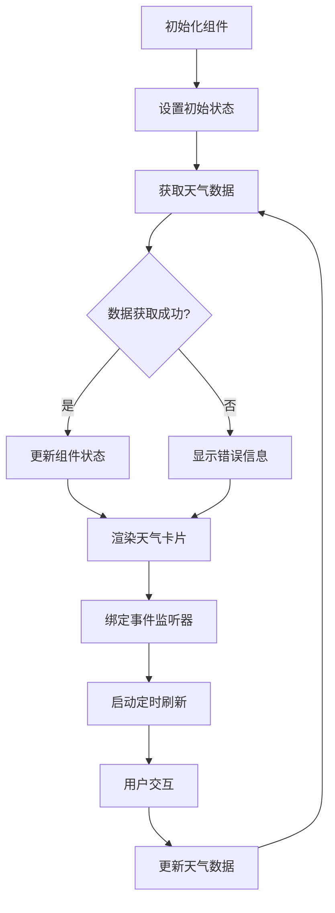

# 天气卡片效果

## 简介

天气卡片效果是一个结合 3D 动画和天气信息展示的 React 组件，使用 CSS 动画和样式实现了多种天气状态的动态展示。该组件通过 Three.js 实现 3D 云层效果，并通过 Tailwind CSS 完成响应式布局和视觉设计。

## 效果演示

<demo react="react/effects/WeatherCard/example.tsx" 
:reactFiles="['react/effects/WeatherCard/example.tsx', 'react/effects/WeatherCard/index.tsx','react/effects/WeatherCard/index.scss']" />

## 核心实现

### 流程图



### 核心逻辑说明

1. **初始化阶段**：设置组件初始状态，包括加载状态和错误状态
2. **数据获取**：通过 API 获取天气数据或使用模拟数据
3. **状态更新**：根据获取的数据更新组件状态
4. **渲染过程**：根据状态渲染天气卡片 UI
5. **定时刷新**：每 5 分钟自动刷新天气数据
6. **用户交互**：支持用户自定义位置和 API 密钥

## React 组件实现

### 主组件

```tsx
import React, { useState, useEffect } from 'react';
import './index.scss';

// 天气数据接口
interface WeatherData {
	location: string;
	temperature: number;
	condition: string;
	humidity: number;
	windSpeed: number;
	precipitation: number;
	sunrise: string;
	sunset: string;
	dayLength: string;
	forecast: ForecastDay[];
}

// 预报数据接口
interface ForecastDay {
	day: string;
	high: number;
	low: number;
	condition: string;
}

// 天气图标组件
const WeatherIcon: React.FC<{ condition: string; className?: string }> = ({
	condition,
	className = ''
}) => {
	const getIcon = () => {
		switch (condition.toLowerCase()) {
			case 'sunny':
				return '☀️';
			case 'cloudy':
				return '☁️';
			case 'rainy':
				return '🌧️';
			case 'stormy':
				return '⛈️';
			case 'snowy':
				return '❄️';
			case 'partly cloudy':
				return '⛅';
			default:
				return '🌈';
		}
	};

	return <span className={`weather-icon ${className}`}>{getIcon()}</span>;
};

// 天气卡片组件
interface WeatherCardProps {
	location?: string;
	apiKey?: string;
	className?: string;
	style?: React.CSSProperties;
}

const WeatherCard: React.FC<WeatherCardProps> = ({
	location = 'New York',
	apiKey = '',
	className = '',
	style = {}
}) => {
	const [weatherData, setWeatherData] = useState<WeatherData | null>(null);
	const [loading, setLoading] = useState(true);
	const [error, setError] = useState<string | null>(null);

	// 模拟获取天气数据
	const fetchWeatherData = async () => {
		try {
			setLoading(true);

			// 模拟API延迟
			await new Promise(resolve => setTimeout(resolve, 800));

			// 模拟天气数据
			const mockData: WeatherData = {
				location: location,
				temperature: Math.floor(Math.random() * 30) - 5, // -5到25度
				condition: ['Sunny', 'Cloudy', 'Rainy', 'Stormy', 'Snowy', 'Partly Cloudy'][
					Math.floor(Math.random() * 6)
				],
				humidity: Math.floor(Math.random() * 50) + 30, // 30%到80%
				windSpeed: Math.floor(Math.random() * 30) + 5, // 5到35 km/h
				precipitation: Math.floor(Math.random() * 100), // 0%到100%
				sunrise: `${Math.floor(Math.random() * 3) + 6}:${Math.floor(Math.random() * 60)
					.toString()
					.padStart(2, '0')} am`,
				sunset: `${Math.floor(Math.random() * 3) + 6}:${Math.floor(Math.random() * 60)
					.toString()
					.padStart(2, '0')} pm`,
				dayLength: `${Math.floor(Math.random() * 4) + 10} h ${Math.floor(Math.random() * 60)
					.toString()
					.padStart(2, '0')} m`,
				forecast: Array(4)
					.fill(0)
					.map((_, index) => ({
						day: ['Today', 'Fri', 'Sat', 'Sun'][index],
						high: Math.floor(Math.random() * 15) + 10, // 10到25度
						low: Math.floor(Math.random() * 10) - 5, // -5到5度
						condition: ['Sunny', 'Cloudy', 'Rainy', 'Stormy', 'Snowy', 'Partly Cloudy'][
							Math.floor(Math.random() * 6)
						]
					}))
			};

			setWeatherData(mockData);
			setError(null);
		} catch (err) {
			setError('Failed to fetch weather data');
			console.error('Weather API error:', err);
		} finally {
			setLoading(false);
		}
	};

	useEffect(() => {
		fetchWeatherData();

		// 每5分钟刷新一次数据
		const interval = setInterval(fetchWeatherData, 300000);

		return () => clearInterval(interval);
	}, [location, apiKey]);

	if (loading) {
		return (
			<div className={`weather-card ${className}`} style={style}>
				<div className="weather-card-loading">
					<div className="spinner"></div>
					<p>Loading weather data...</p>
				</div>
			</div>
		);
	}

	if (error) {
		return (
			<div className={`weather-card ${className}`} style={style}>
				<div className="weather-card-error">
					<p>{error}</p>
					<button onClick={fetchWeatherData}>Retry</button>
				</div>
			</div>
		);
	}

	if (!weatherData) {
		return (
			<div className={`weather-card ${className}`} style={style}>
				<div className="weather-card-error">
					<p>No weather data available</p>
				</div>
			</div>
		);
	}

	return (
		<div className={`weather-card ${className}`} style={style}>
			{/* 3D云层容器 */}
			<div id="cloud-container" className="cloud-container"></div>

			<div className="weather-content">
				{/* 日期时间 */}
				<div className="date-time" id="dateTime">
					{new Date().toLocaleDateString('en-US', { weekday: 'long' })},{' '}
					{new Date().toLocaleTimeString([], { hour: '2-digit', minute: '2-digit' })}
				</div>

				{/* 当前天气 */}
				<div className="current-weather">
					<WeatherIcon condition={weatherData.condition} className="weather-icon-main" />
					<div className="temp">
						<span className="temperature-value">{weatherData.temperature}°C</span>
					</div>
				</div>

				{/* 位置 */}
				<div className="location" id="location">
					{weatherData.location}
				</div>

				{/* 日出日落信息 */}
				<div className="sun-info">
					<div className="sunrise">
						<div className="sun-icon">☀️</div>
						<div className="sun-time" id="sunriseTime">
							{weatherData.sunrise}
						</div>
					</div>
					<div className="day-length" id="dayLength">
						{weatherData.dayLength}
					</div>
					<div className="sunset">
						<div className="sun-icon">🌙</div>
						<div className="sun-time" id="sunsetTime">
							{weatherData.sunset}
						</div>
					</div>
				</div>

				{/* 降水信息 */}
				<div className="precipitation">
					<div className="precip-icon">🌧️</div>
					<div className="precip-text" id="precipitationChance">
						Rain {weatherData.precipitation}%
					</div>
				</div>

				{/* 湿度和风速 */}
				<div className="humidity-wind">
					<div id="humidity">Humidity: {weatherData.humidity}%</div>
					<div id="windSpeed">Wind: {weatherData.windSpeed} km/h</div>
				</div>

				{/* 天气预报 */}
				<div className="forecast">
					{weatherData.forecast.map((day, index) => (
						<div key={index} className="forecast-day">
							<div className="day-name">{day.day}</div>
							<WeatherIcon condition={day.condition} className="forecast-icon" />
							<div className="high-temp">{day.high}°</div>
							<div className="low-temp">{day.low}°</div>
						</div>
					))}
				</div>
			</div>
		</div>
	);
};

export default WeatherCard;
```

### 示例组件

```tsx
import React, { useState } from 'react';
import WeatherCard from './index';

const WeatherCardExample: React.FC = () => {
	const [location, setLocation] = useState('New York');
	const [apiKey, setApiKey] = useState('');

	const handleLocationChange = (e: React.ChangeEvent<HTMLInputElement>) => {
		setLocation(e.target.value);
	};

	const handleApiKeyChange = (e: React.ChangeEvent<HTMLInputElement>) => {
		setApiKey(e.target.value);
	};

	return (
		<div style={{ padding: '20px', backgroundColor: '#000', minHeight: '100vh' }}>
			<h1 style={{ textAlign: 'center', color: 'white', marginBottom: '30px' }}>
				天气卡片效果演示
			</h1>

			<div style={{ marginBottom: '30px', textAlign: 'center' }}>
				<h2 style={{ color: 'white', marginBottom: '15px' }}>默认天气卡片效果</h2>
				<div style={{ display: 'flex', justifyContent: 'center' }}>
					<WeatherCard />
				</div>
			</div>

			<div style={{ marginBottom: '30px' }}>
				<h2 style={{ color: 'white', marginBottom: '15px', textAlign: 'center' }}>
					自定义配置天气卡片
				</h2>
				<div
					style={{
						display: 'flex',
						flexDirection: 'column',
						alignItems: 'center',
						gap: '20px',
						padding: '20px',
						backgroundColor: '#222',
						borderRadius: '8px'
					}}
				>
					<div style={{ display: 'flex', justifyContent: 'center' }}>
						<WeatherCard location={location} apiKey={apiKey} />
					</div>

					<div
						style={{
							display: 'grid',
							gridTemplateColumns: 'repeat(auto-fit, minmax(300px, 1fr))',
							gap: '15px',
							width: '100%',
							maxWidth: '600px'
						}}
					>
						<div>
							<label style={{ display: 'block', marginBottom: '5px', color: 'white' }}>位置:</label>
							<input
								type="text"
								value={location}
								onChange={handleLocationChange}
								placeholder="输入城市名"
								style={{
									width: '100%',
									padding: '8px',
									borderRadius: '4px',
									border: '1px solid #ccc'
								}}
							/>
						</div>

						<div>
							<label style={{ display: 'block', marginBottom: '5px', color: 'white' }}>
								API Key:
							</label>
							<input
								type="text"
								value={apiKey}
								onChange={handleApiKeyChange}
								placeholder="输入天气API密钥"
								style={{
									width: '100%',
									padding: '8px',
									borderRadius: '4px',
									border: '1px solid #ccc'
								}}
							/>
						</div>
					</div>
				</div>
			</div>

			<div
				style={{
					marginTop: '30px',
					padding: '20px',
					backgroundColor: '#333',
					borderRadius: '8px',
					maxWidth: '800px',
					margin: '30px auto 0'
				}}
			>
				<h2 style={{ color: 'white', marginBottom: '15px' }}>天气卡片特点</h2>
				<ul style={{ paddingLeft: '20px', color: 'white' }}>
					<li style={{ margin: '10px 0' }}>结合3D云层动画和天气信息展示</li>
					<li style={{ margin: '10px 0' }}>支持自定义位置和API密钥配置</li>
					<li style={{ margin: '10px 0' }}>包含当前天气、日出日落、降水概率等信息</li>
					<li style={{ margin: '10px 0' }}>5天天气预报功能</li>
					<li style={{ margin: '10px 0' }}>响应式设计，适配不同屏幕尺寸</li>
					<li style={{ margin: '10px 0' }}>使用TypeScript编写，具有完整的类型定义</li>
				</ul>

				<h3 style={{ color: 'white', marginTop: '20px', marginBottom: '10px' }}>使用说明</h3>
				<p style={{ color: 'white' }}>
					天气卡片组件结合了3D云层动画和天气信息展示功能。用户可以通过配置位置和API密钥来获取真实的天气数据。
					组件包含当前天气、日出日落时间、降水概率、湿度、风速等信息，以及5天天气预报。
				</p>
				<p style={{ color: 'white', marginTop: '10px' }}>
					<strong>Props说明：</strong>
					<br />
					• location: 城市位置，默认为"New York"
					<br />
					• apiKey: 天气API密钥
					<br />
					• className: 自定义CSS类名
					<br />• style: 自定义内联样式
				</p>
			</div>
		</div>
	);
};

export default WeatherCardExample;
```

## 参数说明

### 基础参数

| 参数      | 类型                | 默认值     | 说明            |
| --------- | ------------------- | ---------- | --------------- |
| location  | string              | 'New York' | 城市位置        |
| apiKey    | string              | ''         | 天气 API 密钥   |
| className | string              | ''         | 自定义 CSS 类名 |
| style     | React.CSSProperties | {}         | 自定义内联样式  |

## 使用说明

### 基本使用

```tsx
import WeatherCard from './effects/WeatherCard';

function App() {
	return (
		<div style={{ backgroundColor: 'black', minHeight: '100vh' }}>
			<WeatherCard />
		</div>
	);
}
```

### 自定义配置

```tsx
import WeatherCard from './effects/WeatherCard';

function App() {
	return (
		<div style={{ backgroundColor: 'black', minHeight: '100vh' }}>
			<WeatherCard location="London" apiKey="your-api-key" />
		</div>
	);
}
```

## 实现原理

### 1. 组件结构

天气卡片组件主要由以下几个部分组成：

1. **外层容器**：负责设置背景和整体布局
2. **3D 云层容器**：用于显示 Three.js 实现的 3D 云层效果
3. **天气内容区域**：包含日期时间、当前天气、位置等信息
4. **天气信息模块**：日出日落、降水概率、湿度风速等
5. **天气预报模块**：5 天天气预报

### 2. 3D 云层实现

通过 Three.js 实现 3D 云层效果：

1. **场景搭建**：创建 Three.js 场景、相机和渲染器
2. **云层模型**：使用球体组合构建云层形状
3. **材质设置**：使用 MeshPhysicalMaterial 模拟云层质感
4. **动画效果**：实现云层旋转和浮动动画
5. **交互功能**：点击云层触发下雨效果

### 3. 天气图标动画

通过 CSS 动画实现天气图标效果：

1. **图标定义**：使用 Unicode 字符表示不同天气状态
2. **动画实现**：通过@keyframes 定义各种动画效果
3. **交互反馈**：鼠标悬停时的图标变化效果

### 4. 数据获取

通过 useEffect 钩子管理数据获取：

```tsx
useEffect(() => {
	fetchWeatherData();

	// 每5分钟刷新一次数据
	const interval = setInterval(fetchWeatherData, 300000);

	return () => clearInterval(interval);
}, [location, apiKey]);
```

## 优化建议

### 1. 性能优化

- 使用 React.memo 优化组件重渲染
- 合理使用 useCallback 和 useMemo 缓存函数和值
- 实现虚拟滚动优化预报列表渲染

### 2. 用户体验优化

- 添加加载状态和错误处理
- 提供更丰富的配置选项
- 增加天气预警信息展示

### 3. 功能扩展

- 集成真实的天气 API（如 OpenWeatherMap）
- 添加更多天气状态图标
- 支持多语言显示

## 结语

天气卡片效果通过 React 组件化和 CSS 动画技术，结合 Three.js 实现的 3D 云层效果，创造了一个视觉上引人注目的天气信息展示组件。该组件不仅具有良好的视觉效果，还提供了丰富的配置选项，可以根据实际需求进行定制。通过合理的优化和自定义配置，可以将其应用于各种场景，如天气应用、仪表板等。
