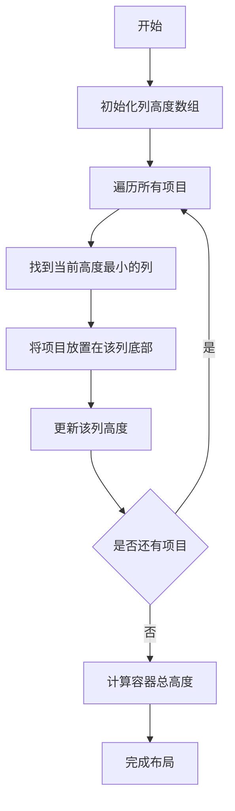

# 瀑布流布局

## 简介

瀑布流布局（Waterfall Layout），又称瀑布流式布局，是一种经典的网页布局方式。其特点是页面内容以参差不齐的多栏形式排列，随着页面滚动条向下滚动，会不断加载数据块并附加至当前尾部，视觉上呈现出类似瀑布流动的效果。

瀑布流布局在图片展示网站（如Pinterest）、电商网站的商品列表等场景中应用广泛，能有效利用页面空间，提供更好的视觉体验。

## 效果演示

<demo react="react/WaterfallLayout/index.tsx" />

## 核心实现原理

瀑布流布局的核心算法是"最短列优先"原则，具体步骤如下：



### 算法详解

1. **初始化列高度数组**：创建一个长度为列数的数组，用于记录每列当前的高度，初始值都为0。

2. **寻找最短列**：对于每个待排列的项目，遍历列高度数组，找到高度最小的列。

3. **定位项目**：将项目放置在最短列的底部，记录其位置信息。

4. **更新列高度**：将该项目的高度累加到该列的高度值中。

5. **重复执行**：对所有项目重复上述过程，直到全部排列完成。

## 自定义参数配置

瀑布流布局支持以下自定义参数配置：

| 参数 | 类型 | 默认值 | 说明 |
|------|------|--------|------|
| columnCount | number | 3 | 瀑布流列数 |
| columnGap | number | 16 | 列间距（单位：px） |
| itemWidth | number | 150 | 项目宽度（单位：px） |

## 核心代码实现

### TypeScript 实现

```typescript
// 实现瀑布流布局的核心算法
const renderWaterfall = () => {
  // 初始化列高度数组
  const columnHeights = new Array(columnCount).fill(0);
  // 存储每个项目的定位信息
  const itemPositions: { 
    item: WaterfallItem; 
    columnIndex: number; 
    top: number; 
    left: number 
  }[] = [];

  // 为每个项目计算位置
  items.forEach(item => {
    // 找到当前高度最小的列
    const minColumnHeight = Math.min(...columnHeights);
    const columnIndex = columnHeights.indexOf(minColumnHeight);
    
    // 记录项目位置信息
    itemPositions.push({
      item,
      columnIndex,
      top: minColumnHeight,
      left: columnIndex * (itemWidth + columnGap)
    });
    
    // 更新该列的高度
    columnHeights[columnIndex] = minColumnHeight + item.height + columnGap;
  });

  // 计算容器总高度
  const containerHeight = Math.max(...columnHeights);
  
  // 渲染项目
  // ... 渲染逻辑
};
```

### 样式实现

通过绝对定位实现项目精确布局：

```css
.waterfall-container {
  position: relative;
}

.waterfall-item {
  position: absolute;
}
```

## 应用场景

1. **图片展示网站**：如Pinterest、花瓣网等，展示不同尺寸的图片
2. **电商网站**：商品列表展示，充分利用页面空间
3. **新闻资讯**：文章列表，提供流畅的浏览体验
4. **作品集展示**：设计师作品、摄影作品等展示

## 总结

瀑布流布局通过"最短列优先"算法实现了高效的动态布局，能够很好地适应不同高度的内容元素。其核心在于精确计算每个元素的位置并进行绝对定位。通过合理配置参数，可以适配不同的展示需求，提供良好的用户体验。