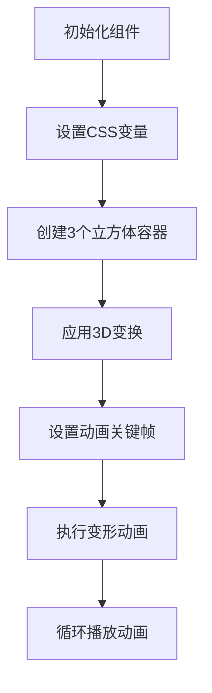

# 3D 立方体变形动画效果

## 简介

3D 立方体变形动画效果是一个使用 HTML 和 CSS 实现的动态 3D 立方体效果。通过 CSS 的 3D 变换和关键帧动画，创建了一个可以在 3D 空间中变形和移动的立方体，具有独特的视觉效果。

## 效果演示

<demo react="react/effects/Cube3DTransform/example.tsx" 
:reactFiles="['react/effects/Cube3DTransform/example.tsx', 'react/effects/Cube3DTransform/index.tsx','react/effects/Cube3DTransform/index.scss']" />

## 流程图说明



核心逻辑说明：

1. 初始化组件并设置 CSS 变量（立方体大小、动画时长等）
2. 创建 3 个立方体容器，每个容器代表一个立方体
3. 通过 CSS 3D 变换定位每个立方体在 3D 空间中的位置
4. 为每个立方体设置关键帧动画，定义变形和移动的关键点
5. 动画循环播放，实现连续的变形效果

## 参数说明

| 参数名            | 类型     | 默认值                            | 说明              |
| ----------------- | -------- | --------------------------------- | ----------------- |
| cubeSize          | number   | 3                                 | 立方体大小 (em)   |
| animationDuration | number   | 4                                 | 动画持续时间 (秒) |
| colors            | string[] | ['#3498db', '#2ecc71', '#e74c3c'] | 立方体各面的颜色  |
| containerWidth    | number   | 500                               | 容器宽度 (px)     |

## 核心实现

### TSX 组件代码

```tsx
import React from 'react';
import './index.scss';

interface Cube3DTransformProps {
	cubeSize?: number;
	animationDuration?: number;
	colors?: string[];
	containerWidth?: number;
}

const Cube3DTransform: React.FC<Cube3DTransformProps> = ({
	cubeSize = 3,
	animationDuration = 4,
	colors = ['#3498db', '#2ecc71', '#e74c3c'],
	containerWidth = 500
}) => {
	return (
		<div className="cube-3d-transform" style={{ width: containerWidth }}>
			<div
				className="container"
				style={
					{
						'--cube-size': `${cubeSize}em`,
						'--animation-duration': `${animationDuration}s`
					} as React.CSSProperties
				}
			>
				{[0, 1, 2].map(index => (
					<div
						className="box-wrapper"
						key={index}
						style={
							{
								'--box-color': colors[index % colors.length],
								'--box-color-dark': darkenColor(colors[index % colors.length], 0.2)
							} as React.CSSProperties
						}
					>
						<div className="box"></div>
					</div>
				))}
			</div>
		</div>
	);
};

export default Cube3DTransform;
```

### 关键帧动画

```css
@keyframes animate {
	8.33% {
		transform: translate3d(-50%, -50%, 0) scaleZ(2);
	}

	16.7% {
		transform: translate3d(-50%, -50%, calc(-1 * var(--cube-size, 3em))) scaleZ(1);
	}

	25% {
		transform: translate3d(-50%, calc(-2 * var(--cube-size, 3em)), calc(-1 * var(--cube-size, 3em)))
			scaleY(2);
	}

	33.3% {
		transform: translate3d(-50%, calc(-3 * var(--cube-size, 3em)), calc(-1 * var(--cube-size, 3em)))
			scaleY(1);
	}

	41.7% {
		transform: translate3d(
				calc(-2 * var(--cube-size, 3em)),
				calc(-3 * var(--cube-size, 3em)),
				calc(-1 * var(--cube-size, 3em))
			) scaleX(2);
	}

	50% {
		transform: translate3d(
				calc(-3 * var(--cube-size, 3em)),
				calc(-3 * var(--cube-size, 3em)),
				calc(-1 * var(--cube-size, 3em))
			) scaleX(1);
	}

	58.3% {
		transform: translate3d(calc(-3 * var(--cube-size, 3em)), calc(-3 * var(--cube-size, 3em)), 0) scaleZ(
				2
			);
	}

	66.7% {
		transform: translate3d(calc(-3 * var(--cube-size, 3em)), calc(-3 * var(--cube-size, 3em)), 0) scaleZ(
				1
			);
	}

	75% {
		transform: translate3d(calc(-3 * var(--cube-size, 3em)), calc(-2 * var(--cube-size, 3em)), 0) scaleY(
				2
			);
	}

	83.3% {
		transform: translate3d(calc(-3 * var(--cube-size, 3em)), calc(-1 * var(--cube-size, 3em)), 0) scaleY(
				1
			);
	}

	91.7% {
		transform: translate3d(calc(-2 * var(--cube-size, 3em)), calc(-1 * var(--cube-size, 3em)), 0) scaleX(
				2
			);
	}

	100% {
		transform: translate3d(-50%, -50%, 0) scaleX(1);
	}
}
```

## 实现原理

### 1. 3D 场景设置

通过以下 CSS 属性创建 3D 场景：

```css
.container {
	transform-style: preserve-3d;
	perspective: 2000px;
	transform: rotateX(-30deg) rotateY(-45deg);
}
```

- `transform-style: preserve-3d` 保持 3D 空间
- `perspective: 2000px` 设置透视效果
- `rotateX` 和 `rotateY` 旋转整个场景

### 2. 立方体结构

立方体通过以下元素构建：

1. `.box-wrapper`：立方体容器，用于定义立方体的位置和旋转状态
2. `.box`：表示立方体本身
3. `.box::before` 和 `.box::after`：定义立方体的侧面

### 3. 3D 变换

通过 CSS 3D 变换实现立方体的各个面：

```css
.box:before {
	left: 100%;
	bottom: 0;
	transform: rotateY(90deg);
	transform-origin: 0 50%;
}

.box:after {
	left: 0;
	bottom: 100%;
	transform: rotateX(90deg);
	transform-origin: 0 100%;
}
```

### 4. 动画效果

通过关键帧动画实现立方体的变形和移动：

```css
.box {
	animation: animate var(--animation-duration, 4s) infinite;
}
```

## 使用说明

### 基本使用

```tsx
import Cube3DTransform from './effects/Cube3DTransform';

function App() {
	return (
		<div style={{ height: '300px' }}>
			<Cube3DTransform />
		</div>
	);
}
```

### 自定义配置

```tsx
import Cube3DTransform from './effects/Cube3DTransform';

function App() {
	return (
		<div style={{ height: '400px' }}>
			<Cube3DTransform
				cubeSize={4}
				animationDuration={6}
				colors={['#ff6b6b', '#4ecdc4', '#45b7d1']}
				containerWidth={600}
			/>
		</div>
	);
}
```

## 优化建议

### 1. 性能优化

- 使用 CSS 变量提高代码可维护性
- 合理设置动画持续时间，避免过度消耗 CPU 资源
- 使用 `transform3d` 启用硬件加速

### 2. 响应式设计

```css
@media (max-width: 768px) {
	.cube-3d-transform {
		padding: 10px;
	}
}
```

## 浏览器兼容性

- Chrome 36+
- Firefox 16+
- Safari 9+
- Edge 12+
- IE 10+

## 结语

3D 立方体变形动画效果通过 CSS 3D 变换和关键帧动画技术，创造出独特的视觉效果。该效果展示了 CSS 在 3D 空间中的强大功能，为网页增添了动态和立体感。通过合理的优化和自定义配置，可以将其应用于各种场景，如加载动画、页面装饰等。
