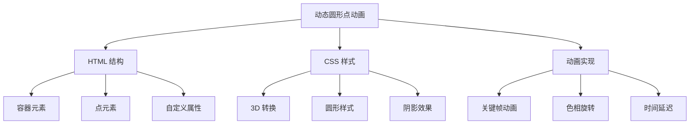
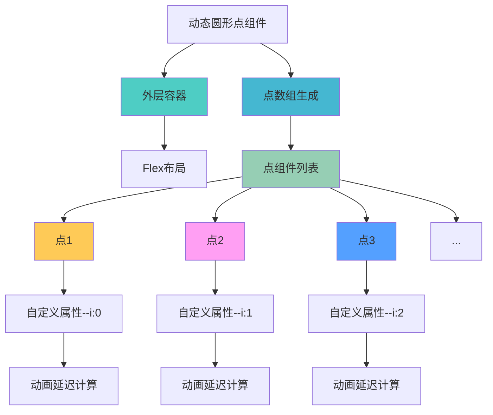
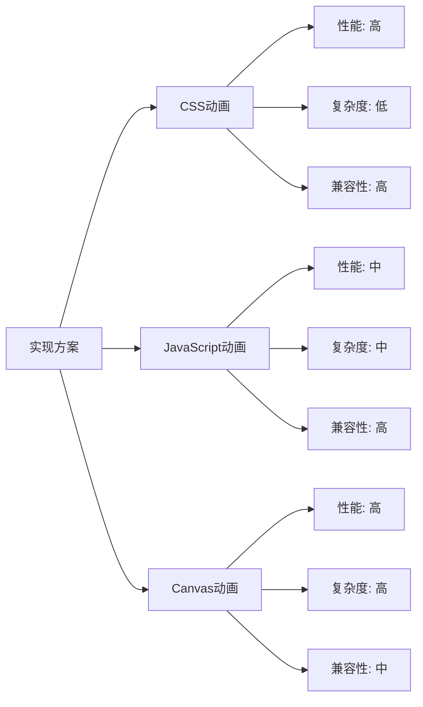

# 动态圆形点动画效果

本文介绍如何使用 CSS 3D 转换和关键帧动画创建一个包含多个动态移动的圆形点的动画效果。每个点都有自己的动画，它们在容器内上下移动，并在移动过程中改变色相，创建一种动态的视觉效果。

## 🎯 功能特性

### 核心功能

- **3D 视觉效果**: 使用 CSS 3D 转换创建立体感
- **动态动画**: 圆形点在容器内上下移动
- **色相变化**: 移动过程中颜色渐变变化
- **层次感**: 通过阴影和透明度营造深度感
- **响应式设计**: 自适应不同尺寸的容器

### 技术优势

- **纯 CSS 实现**: 无需额外的 JavaScript 库
- **性能优化**: 使用硬件加速的 CSS 动画
- **灵活配置**: 支持自定义点的数量和样式
- **兼容性好**: 现代浏览器广泛支持

## 📐 工作原理



## 💻 实现演示

<demo react="react/effects/FloatingDotsAnimation/index.tsx" 
:reactFiles="['react/effects/FloatingDotsAnimation/index.tsx','react/effects/FloatingDotsAnimation/index.scss']" 
/>

## 🛠️ 核心实现原理

### HTML 结构设计

动态圆形点动画效果的核心结构包括：

1. **容器元素**: 用于包含所有动画点
2. **点元素**: 每个圆形点作为一个独立元素
3. **自定义属性**: 使用 CSS 变量控制每个点的样式和动画

### 流程图说明



### 自定义参数配置

| 参数                   | 类型   | 默认值             | 说明         |
| ---------------------- | ------ | ------------------ | ------------ |
| `dotCount`             | number | 21                 | 圆形点的数量 |
| `containerWidth`       | string | 500px              | 容器宽度     |
| `animationDuration`    | string | 3s                 | 动画持续时间 |
| `animationDelayFactor` | number | 0.08               | 动画延迟因子 |
| `borderColor`          | string | rgb(0, 200, 255)   | 边框颜色     |
| `shadowColor`          | string | rgb(124, 124, 124) | 阴影颜色     |
| `translateDistance`    | string | -50vmin            | 垂直移动距离 |
| `hueRotation`          | string | 180deg             | 色相旋转角度 |

### React 组件实现

```typescript
import React from 'react';
import './index.scss';

interface FloatingDotProps {
	index: number;
}

const FloatingDot: React.FC<FloatingDotProps> = ({ index }) => {
	return <div className="floating-dot-item" style={{ '--i': index } as React.CSSProperties} />;
};

const FloatingDotsAnimation: React.FC = () => {
	// 创建21个点
	const dots = Array.from({ length: 21 }, (_, index) => <FloatingDot key={index} index={index} />);

	return (
		<div className="floating-dots-container">
			<div className="floating-dots-wrapper">
				<div className="floating-dots-container-inner">{dots}</div>
			</div>
		</div>
	);
};

export default FloatingDotsAnimation;
```

### CSS 动画实现

```scss
.floating-dots-container {
	width: 500px;
	margin: 0 auto;
	display: flex;
	justify-content: center;
	align-items: center;
	height: 400px;
	background: #212121;

	.floating-dots-wrapper {
		position: relative;
		width: 100%;
		height: 100%;
		display: flex;
		justify-content: center;
		align-items: center;
	}

	.floating-dots-container-inner {
		position: absolute;
		top: 40%;
		height: 90%;
		display: flex;
		justify-content: center;
		align-items: center;
	}

	.floating-dot-item {
		position: absolute;
		background-color: transparent;
		width: calc(var(--i) * 2.5vmin);
		aspect-ratio: 1;
		border-radius: 50%;
		border: 0.9vmin solid rgb(0, 200, 255);
		transform-style: preserve-3d;
		transform: rotateX(70deg) translateZ(50px);
		animation: my-move 3s ease-in-out calc(var(--i) * 0.08s) infinite;
		box-shadow: 0px 0px 15px rgb(124, 124, 124), inset 0px 0px 15px rgb(124, 124, 124);
	}

	@keyframes my-move {
		0%,
		100% {
			transform: rotateX(70deg) translateZ(50px) translateY(0px);
			filter: hue-rotate(0deg);
		}

		50% {
			transform: rotateX(70deg) translateZ(50px) translateY(-50vmin);
			filter: hue-rotate(180deg);
		}
	}
}
```

## 🎨 设计要点

### 1. 3D 转换效果

- 使用 `transform-style: preserve-3d` 保持 3D 转换效果
- 通过 `rotateX(70deg)` 创建透视角度
- 结合 `translateZ(50px)` 增加立体感

### 2. 动画实现

- 使用 `@keyframes` 定义关键帧动画
- 通过 `calc(var(--i) * 0.08s)` 为每个点设置不同的动画延迟
- 结合 `hue-rotate` 实现色相变化效果

### 3. 视觉效果

- 使用 `box-shadow` 创建内外阴影效果
- 通过 `aspect-ratio: 1` 保持正方形比例
- 使用 `border-radius: 50%` 创建圆形效果

## 🎯 应用场景

### 1. 背景装饰

- **网站背景**: 作为动态背景增强视觉效果
- **登录页面**: 创建吸引人的登录界面
- **产品展示**: 为产品页面添加动态元素

### 2. 加载动画

- **页面加载**: 替代传统的加载指示器
- **数据加载**: 在数据获取时提供视觉反馈
- **转场动画**: 页面切换时的过渡效果

### 3. UI 增强

- **按钮效果**: 为按钮添加悬停动画
- **卡片组件**: 增强卡片的视觉吸引力
- **导航菜单**: 创建动态导航效果

## 🔧 技术要点

### 1. CSS 变量使用

```scss
// 使用 CSS 变量控制每个点的样式
.floating-dot-item {
	width: calc(var(--i) * 2.5vmin);
	animation: my-move 3s ease-in-out calc(var(--i) * 0.08s) infinite;
}
```

### 2. 3D 转换技巧

```scss
// 创建 3D 效果的关键属性
.transform-element {
	transform-style: preserve-3d;
	transform: rotateX(70deg) translateZ(50px);
}
```

### 3. 动画性能优化

```scss
// 使用硬件加速优化动画性能
.animated-element {
	will-change: transform, filter;
	transform: translateZ(0); // 触发硬件加速
}
```

## 📊 性能对比

不同实现方案的性能对比：



## 🔒 安全与维护

### 1. 代码维护

- 使用 SCSS 变量管理样式参数
- 保持代码结构清晰
- 添加详细的注释说明

### 2. 性能监控

- 监控动画对页面性能的影响
- 避免过度使用复杂动画
- 在移动设备上测试性能表现

---

_动态圆形点动画效果为网页增添了现代感和动态美，合理运用可以显著提升用户界面的视觉吸引力。_
