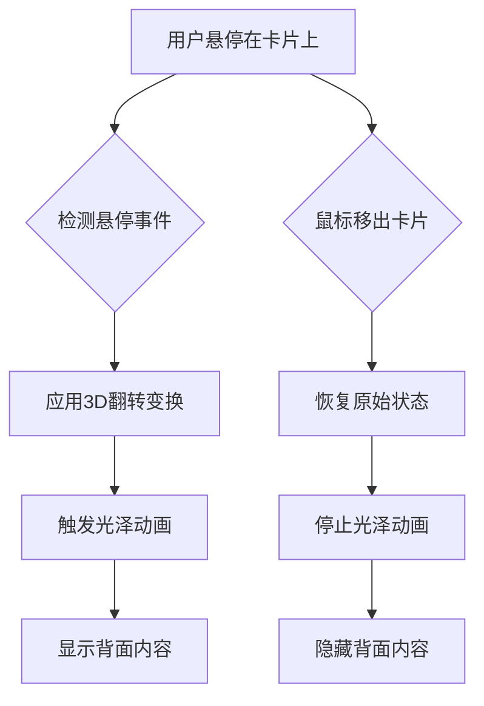
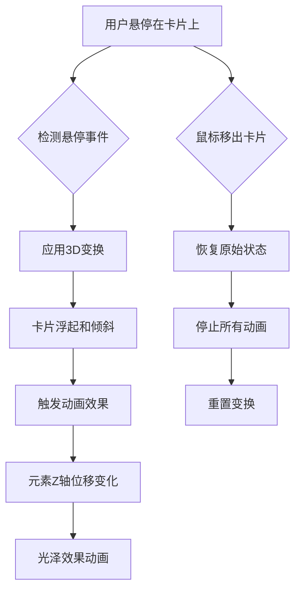

# 3D 卡片翻转动画

## 简介

3D 卡片翻转动画是一种使用 CSS 3D 变换技术实现的视觉效果，当鼠标悬停在卡片上时，卡片会以 3D 方式翻转展示背面内容。这种效果非常适合产品展示、功能介绍等场景，能够显著提升网页的视觉吸引力和交互体验。

本文将介绍两种不同的 3D 卡片翻转效果：

1. **3D 翻转卡片**：基础的 3D 翻转效果，带有光泽流动动画
2. **3D 悬停卡片**：更复杂的 3D 悬停效果，具有浮起、倾斜和动态光泽效果

## 效果演示

<demo react="react/effects/CardFlip3D/example.tsx" 
:reactFiles="['react/effects/CardFlip3D/example.tsx', 'react/effects/CardFlip3D/index.tsx','react/effects/CardFlip3D/index.scss']" />

<demo react="react/effects/HoverCard3D/example.tsx" 
:reactFiles="['react/effects/HoverCard3D/example.tsx', 'react/effects/HoverCard3D/index.tsx','react/effects/HoverCard3D/index.scss']" />

## 3D 翻转卡片

### 核心特性

- **3D 翻转效果**：使用 CSS 3D 变换实现卡片翻转
- **光泽流动动画**：悬停时的光泽流动效果
- **渐变色背景**：正面和背面使用不同的渐变色背景
- **响应式设计**：适配不同屏幕尺寸

### 实现原理

3D 翻转卡片的核心实现基于以下 CSS 技术：

1. **perspective 属性**：为父元素设置透视，创建 3D 空间感
2. **transform-style: preserve-3d**：保持子元素在 3D 空间中的位置关系
3. **backface-visibility: hidden**：隐藏元素背面，避免翻转时内容重叠
4. **cubic-bezier 过渡**：使用自定义缓动函数使动画更生动
5. **伪元素动画**：使用::before 创建光泽流动效果

### 核心实现

```typescript
// React组件核心代码
const CardFlip3D: React.FC<CardFlip3DProps> = ({
	frontIcon = '💡',
	frontTitle = '创意设计',
	frontContent = '探索无限创意可能性',
	backTitle = '创意解决方案',
	backContent = '我们提供独特的设计思路和创意解决方案，帮助您的项目脱颖而出。'
}) => {
	return (
		<div className="card-flip-3d">
			<div className="card">
				<div className="card-inner">
					<div className="card-face card-front shine-effect">
						<div className="card-icon">{frontIcon}</div>
						<div className="card-title">{frontTitle}</div>
						<div className="card-content">{frontContent}</div>
					</div>
					<div className="card-face card-back">
						<div className="card-title">{backTitle}</div>
						<div className="card-content">{backContent}</div>
						<button className="card-button">了解更多</button>
					</div>
				</div>
			</div>
		</div>
	);
};
```

## 3D 悬停卡片

### 核心特性

- **3D 悬停效果**：鼠标悬停时卡片会浮起、倾斜并产生动态的光泽效果
- **玻璃态设计**：使用毛玻璃效果增强现代感
- **多层次动画**：卡片整体变换与内部元素独立动画相结合
- **动态光泽效果**：使用渐变和动画创造光斑移动效果

### 实现原理

3D 悬停卡片的核心实现基于以下 CSS 技术：

1. **perspective 属性**：在卡片容器上设置透视，创建 3D 空间感
2. **transform-style: preserve-3d**：保持子元素在 3D 空间中的位置关系
3. **translateZ()变换**：为不同元素设置不同的 Z 轴位移，创造层次感
4. **玻璃态效果(Glassmorphism)**：使用半透明背景和 backdrop-filter 实现
5. **多层次动画**：卡片整体变换与内部元素独立动画相结合
6. **动态光泽效果**：使用渐变和动画创造光斑移动效果

### 核心实现

```typescript
// React组件核心代码
const HoverCard3D: React.FC<HoverCard3DProps> = ({
	icon = 'fas fa-rocket',
	title = '创新技术',
	content = '采用前沿技术栈，打造高性能、高可用的现代化应用解决方案。'
}) => {
	return (
		<div className="hover-card-3d">
			<div className="card">
				<div className="card-glare"></div>
				<div className="card-icon">
					<i className={icon}></i>
				</div>
				<h3 className="card-title">{title}</h3>
				<p className="card-content">{content}</p>
				<button className="card-button">探索更多</button>
			</div>
		</div>
	);
};
```

## 流程图说明

### 3D 翻转卡片流程



### 3D 悬停卡片流程



## 参数配置说明

### 3D 翻转卡片参数

| 参数         | 类型   | 默认值                                                         | 说明     |
| ------------ | ------ | -------------------------------------------------------------- | -------- |
| frontIcon    | string | '💡'                                                           | 正面图标 |
| frontTitle   | string | '创意设计'                                                     | 正面标题 |
| frontContent | string | '探索无限创意可能性'                                           | 正面内容 |
| backTitle    | string | '创意解决方案'                                                 | 背面标题 |
| backContent  | string | '我们提供独特的设计思路和创意解决方案，帮助您的项目脱颖而出。' | 背面内容 |

### 3D 悬停卡片参数

| 参数    | 类型   | 默认值                                                     | 说明     |
| ------- | ------ | ---------------------------------------------------------- | -------- |
| icon    | string | 'fas fa-rocket'                                            | 图标类名 |
| title   | string | '创新技术'                                                 | 卡片标题 |
| content | string | '采用前沿技术栈，打造高性能、高可用的现代化应用解决方案。' | 卡片内容 |

## React 组件实现

### 1. 3D 翻转卡片组件

```typescript
import React from 'react';
import './index.scss';

interface CardFlip3DProps {
	frontIcon?: string;
	frontTitle?: string;
	frontContent?: string;
	backTitle?: string;
	backContent?: string;
}

const CardFlip3D: React.FC<CardFlip3DProps> = ({
	frontIcon = '💡',
	frontTitle = '创意设计',
	frontContent = '探索无限创意可能性',
	backTitle = '创意解决方案',
	backContent = '我们提供独特的设计思路和创意解决方案，帮助您的项目脱颖而出。'
}) => {
	return (
		<div className="card-flip-3d">
			<div className="card">
				<div className="card-inner">
					<div className="card-face card-front shine-effect">
						<div className="card-icon">{frontIcon}</div>
						<div className="card-title">{frontTitle}</div>
						<div className="card-content">{frontContent}</div>
					</div>
					<div className="card-face card-back">
						<div className="card-title">{backTitle}</div>
						<div className="card-content">{backContent}</div>
						<button className="card-button">了解更多</button>
					</div>
				</div>
			</div>
		</div>
	);
};

export default CardFlip3D;
```

### 2. 3D 悬停卡片组件

```typescript
import React from 'react';
import './index.scss';

interface HoverCard3DProps {
	icon?: string;
	title?: string;
	content?: string;
}

const HoverCard3D: React.FC<HoverCard3DProps> = ({
	icon = 'fas fa-rocket',
	title = '创新技术',
	content = '采用前沿技术栈，打造高性能、高可用的现代化应用解决方案。'
}) => {
	return (
		<div className="hover-card-3d">
			<div className="card">
				<div className="card-glare"></div>
				<div className="card-icon">
					<i className={icon}></i>
				</div>
				<h3 className="card-title">{title}</h3>
				<p className="card-content">{content}</p>
				<button className="card-button">探索更多</button>
			</div>
		</div>
	);
};

export default HoverCard3D;
```

## 使用说明

### 基本使用

```tsx
import CardFlip3D from './effects/CardFlip3D';
import HoverCard3D from './effects/HoverCard3D';

function App() {
	return (
		<div style={{ padding: '20px' }}>
			<h1>3D卡片翻转效果演示</h1>

			{/* 3D翻转卡片 */}
			<CardFlip3D />

			{/* 3D悬停卡片 */}
			<HoverCard3D />
		</div>
	);
}
```

### 自定义配置

```tsx
import CardFlip3D from './effects/CardFlip3D';
import HoverCard3D from './effects/HoverCard3D';

function App() {
	return (
		<div style={{ padding: '20px' }}>
			<h1>自定义3D卡片翻转效果</h1>

			{/* 自定义3D翻转卡片 */}
			<CardFlip3D
				frontIcon="🚀"
				frontTitle="极致性能"
				frontContent="体验卓越的性能表现"
				backTitle="性能优化"
				backContent="通过先进的技术优化，确保您的应用运行流畅、响应迅速。"
			/>

			{/* 自定义3D悬停卡片 */}
			<HoverCard3D
				icon="fas fa-paint-brush"
				title="精美设计"
				content="注重每一个细节，为用户提供直观、愉悦的视觉与交互体验。"
			/>
		</div>
	);
}
```

## 样式实现

### 3D 翻转卡片样式

```scss
.card-flip-3d {
	.card {
		width: 300px;
		height: 400px;
		perspective: 1500px;
		cursor: pointer;
		margin: 20px auto;
	}

	.card-inner {
		position: relative;
		width: 100%;
		height: 100%;
		transform-style: preserve-3d;
		transition: transform 0.8s cubic-bezier(0.175, 0.885, 0.32, 1.275);
		box-shadow: 0 15px 35px rgba(0, 0, 0, 0.3);
		border-radius: 15px;
	}

	.card:hover .card-inner {
		transform: rotateY(180deg);
	}

	.card-face {
		position: absolute;
		width: 100%;
		height: 100%;
		backface-visibility: hidden;
		border-radius: 15px;
		display: flex;
		flex-direction: column;
		justify-content: center;
		align-items: center;
		padding: 20px;
		overflow: hidden;
	}

	.card-front {
		background: linear-gradient(135deg, #6a11cb 0%, #2575fc 100%);
		color: white;
	}

	.card-back {
		background: linear-gradient(135deg, #ff758c 0%, #ff7eb3 100%);
		color: white;
		transform: rotateY(180deg);
	}

	.shine-effect::before {
		content: '';
		position: absolute;
		top: -50%;
		left: -50%;
		width: 200%;
		height: 200%;
		background: rgba(255, 255, 255, 0.1);
		transform: rotate(45deg);
		transition: all 0.6s ease;
		pointer-events: none;
	}

	.card:hover .shine-effect::before {
		transform: translate(50%, 50%) rotate(45deg);
	}
}
```

### 3D 悬停卡片样式

```scss
.hover-card-3d {
	.card {
		width: 300px;
		height: 380px;
		border-radius: 20px;
		background: rgba(255, 255, 255, 0.1);
		backdrop-filter: blur(10px);
		border: 1px solid rgba(255, 255, 255, 0.2);
		padding: 30px;
		display: flex;
		flex-direction: column;
		align-items: center;
		transition: all 0.5s cubic-bezier(0.175, 0.885, 0.32, 1.275);
		transform-style: preserve-3d;
		box-shadow: 0 10px 20px rgba(0, 0, 0, 0.2);
		position: relative;
		overflow: hidden;
		cursor: pointer;
		margin: 20px auto;
	}

	.card:hover {
		transform: translateY(-15px) rotateX(5deg) rotateY(-5deg) scale(1.03);
		box-shadow: 0 20px 30px rgba(0, 0, 0, 0.3);
	}

	.card-icon {
		font-size: 60px;
		margin-bottom: 25px;
		color: #fff;
		transition: all 0.3s ease;
		transform: translateZ(30px);
	}

	.card:hover .card-icon {
		transform: translateZ(50px) scale(1.2);
		color: #ffdb58;
	}

	.card-glare::after {
		content: '';
		position: absolute;
		top: -50%;
		left: -50%;
		width: 200%;
		height: 200%;
		background: linear-gradient(45deg, transparent, rgba(255, 255, 255, 0.1), transparent);
		transform: rotate(45deg);
		transition: all 0.5s ease;
		opacity: 0;
	}

	.card:hover .card-glare::after {
		opacity: 1;
		animation: glare 1.5s ease-in-out;
	}

	@keyframes glare {
		0% {
			transform: rotate(45deg) translate(-50%, -50%);
		}
		100% {
			transform: rotate(45deg) translate(50%, 50%);
		}
	}
}
```

## 优化建议

### 1. 性能优化

- 使用 `transform3d` 启用硬件加速
- 合理设置动画持续时间，避免过度消耗 CPU 资源
- 使用 `will-change` 属性提示浏览器优化

### 2. 响应式设计

```css
@media (max-width: 768px) {
	.card-flip-3d .card,
	.hover-card-3d .card {
		width: 250px;
		height: 350px;
	}
}
```

### 3. 交互增强

可以添加键盘交互支持：

```javascript
// 添加键盘事件支持
const handleKeyDown = (e: React.KeyboardEvent) => {
	if (e.key === 'Enter' || e.key === ' ') {
		// 触发翻转效果
	}
};
```

## 结语

3D 卡片翻转动画通过 CSS 3D 变换和动画技术，为网页增添了动态和立体感。这种效果不仅展示了 CSS 的强大功能，也为用户提供了更加丰富的交互体验。通过合理的优化和自定义配置，可以将其应用于各种场景，如产品展示、功能介绍等。

无论是基础的 3D 翻转卡片还是更复杂的 3D 悬停卡片，都能显著提升网页的视觉吸引力。通过本文提供的实现方案，您可以轻松地在项目中集成这些效果，并根据需要进行自定义调整。
