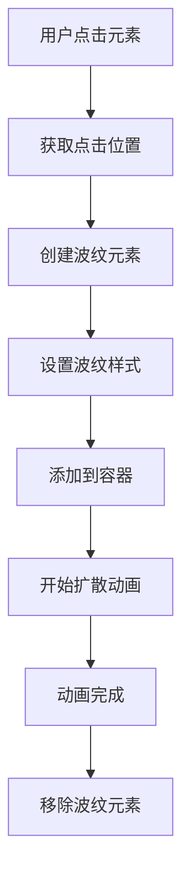

# 水波纹效果

## 简介

水波纹效果是一种模仿 Material Design Ripple 效果的交互动画，当用户点击按钮或其他元素时，会从点击位置产生圆形波纹向外扩散的动画效果。该效果具有以下特点：

- 点击位置为中心的圆形扩散动画
- 波纹逐渐扩散并渐隐消失
- 不同元素尺寸下自然适配
- 背景色不被覆盖，仅作为视觉反馈
- 响应迅速，不影响其他交互

## 效果演示

<demo react="react/effects/RippleEffect/example.tsx" 
:reactFiles="['react/effects/RippleEffect/example.tsx', 'react/effects/RippleEffect/index.tsx','react/effects/RippleEffect/index.scss']" />

## 核心实现

### 流程图



### 核心逻辑说明

1. **事件监听**：监听元素的点击事件
2. **位置计算**：获取点击相对于元素的位置坐标
3. **元素创建**：创建波纹元素并设置初始样式
4. **动画执行**：通过 CSS transition 实现扩散和透明度变化
5. **元素清理**：动画结束后移除波纹元素

## React 组件实现

### 主组件

```tsx
import React, { useState, useRef, useEffect } from 'react';
import './index.scss';

interface RippleEffectProps {
	width?: number;
	height?: number;
	color?: string;
	duration?: number;
	children?: React.ReactNode;
	className?: string;
	style?: React.CSSProperties;
	onClick?: (event: React.MouseEvent<HTMLDivElement>) => void;
}

interface Ripple {
	id: number;
	x: number;
	y: number;
	size: number;
}

const RippleEffect: React.FC<RippleEffectProps> = ({
	width = 500,
	height = 100,
	color = 'rgba(0, 0, 0, 0.1)',
	duration = 600,
	children,
	className = '',
	style = {},
	onClick
}) => {
	const [ripples, setRipples] = useState<Ripple[]>([]);
	const containerRef = useRef<HTMLDivElement>(null);
	const rippleId = useRef(0);

	const handleClick = (e: React.MouseEvent<HTMLDivElement>) => {
		if (containerRef.current) {
			const rect = containerRef.current.getBoundingClientRect();
			const x = e.clientX - rect.left;
			const y = e.clientY - rect.top;

			// 计算波纹大小，确保能覆盖整个容器
			const size = Math.max(rect.width, rect.height) * 2;

			const newRipple = {
				id: rippleId.current++,
				x,
				y,
				size
			};

			setRipples(prev => [...prev, newRipple]);

			// 动画结束后移除波纹
			setTimeout(() => {
				setRipples(prev => prev.filter(ripple => ripple.id !== newRipple.id));
			}, duration);
		}

		// 调用传入的点击处理函数
		if (onClick) {
			onClick(e);
		}
	};

	return (
		<div
			ref={containerRef}
			className={`ripple-effect ${className}`}
			style={{
				width,
				height,
				position: 'relative',
				overflow: 'hidden',
				cursor: 'pointer',
				...style
			}}
			onClick={handleClick}
		>
			{children}
			{ripples.map(ripple => (
				<span
					key={ripple.id}
					className="ripple"
					style={{
						left: ripple.x,
						top: ripple.y,
						width: ripple.size,
						height: ripple.size,
						backgroundColor: color
					}}
				/>
			))}
		</div>
	);
};

export default RippleEffect;
```

### 示例组件

```tsx
import React, { useState } from 'react';
import RippleEffect from './index';

const RippleEffectExample: React.FC = () => {
	const [buttonColor, setButtonColor] = useState('rgba(0, 0, 0, 0.1)');
	const [duration, setDuration] = useState(600);
	const [width, setWidth] = useState(500);
	const [height, setHeight] = useState(100);

	const handleButtonClick = () => {
		console.log('按钮被点击了！');
	};

	const handleCardClick = () => {
		console.log('卡片被点击了！');
	};

	return (
		<div className="ripple-demo-container">
			<h1 style={{ textAlign: 'center', marginBottom: '30px' }}>水波纹效果演示</h1>

			<div style={{ marginBottom: '30px', textAlign: 'center' }}>
				<h2 style={{ marginBottom: '15px' }}>默认水波纹效果</h2>
				<div style={{ display: 'inline-block' }}>
					<RippleEffect onClick={handleButtonClick}>
						<div
							style={{
								width: '100%',
								height: '100%',
								background: 'linear-gradient(135deg, #667eea 0%, #764ba2 100%)',
								borderRadius: '8px',
								display: 'flex',
								alignItems: 'center',
								justifyContent: 'center',
								color: 'white',
								fontSize: '18px',
								fontWeight: 'bold'
							}}
						>
							点击我试试水波纹效果
						</div>
					</RippleEffect>
				</div>
			</div>

			<div style={{ marginBottom: '30px' }}>
				<h2 style={{ marginBottom: '15px', textAlign: 'center' }}>自定义配置水波纹</h2>
				<div
					style={{
						display: 'flex',
						flexDirection: 'column',
						alignItems: 'center',
						gap: '20px',
						padding: '20px',
						backgroundColor: '#f5f5f5',
						borderRadius: '8px'
					}}
				>
					<div style={{ display: 'inline-block', width: '100%' }}>
						<RippleEffect
							width={width}
							height={height}
							color={buttonColor}
							duration={duration}
							onClick={handleCardClick}
						>
							<div
								style={{
									width: '100%',
									height: '100%',
									background: 'linear-gradient(135deg, #f093fb 0%, #f5576c 100%)',
									borderRadius: '8px',
									display: 'flex',
									alignItems: 'center',
									justifyContent: 'center',
									color: 'white',
									fontSize: '18px',
									fontWeight: 'bold'
								}}
							>
								自定义水波纹效果
							</div>
						</RippleEffect>
					</div>

					<div
						style={{
							display: 'grid',
							gridTemplateColumns: 'repeat(auto-fit, minmax(200px, 1fr))',
							gap: '15px',
							width: '100%',
							maxWidth: '800px'
						}}
					>
						<div>
							<label style={{ display: 'block', marginBottom: '5px' }}>波纹颜色</label>
							<input
								type="color"
								value={buttonColor}
								onChange={e => setButtonColor(e.target.value)}
								style={{ width: '100%', height: '40px' }}
							/>
						</div>

						<div>
							<label style={{ display: 'block', marginBottom: '5px' }}>
								动画时长: {duration}ms
							</label>
							<input
								type="range"
								min="200"
								max="2000"
								step="100"
								value={duration}
								onChange={e => setDuration(Number(e.target.value))}
								style={{ width: '100%' }}
							/>
						</div>

						<div>
							<label style={{ display: 'block', marginBottom: '5px' }}>宽度: {width}px</label>
							<input
								type="range"
								min="200"
								max="800"
								step="50"
								value={width}
								onChange={e => setWidth(Number(e.target.value))}
								style={{ width: '100%' }}
							/>
						</div>

						<div>
							<label style={{ display: 'block', marginBottom: '5px' }}>高度: {height}px</label>
							<input
								type="range"
								min="50"
								max="300"
								step="10"
								value={height}
								onChange={e => setHeight(Number(e.target.value))}
								style={{ width: '100%' }}
							/>
						</div>
					</div>
				</div>
			</div>

			<div
				style={{
					marginTop: '30px',
					padding: '20px',
					backgroundColor: '#f0f0f0',
					borderRadius: '8px',
					maxWidth: '800px',
					margin: '30px auto 0'
				}}
			>
				<h2 style={{ marginBottom: '15px' }}>水波纹效果特点</h2>
				<ul style={{ paddingLeft: '20px' }}>
					<li style={{ margin: '10px 0' }}>模仿 Material Design Ripple 效果</li>
					<li style={{ margin: '10px 0' }}>支持自定义波纹颜色、大小和动画时长</li>
					<li style={{ margin: '10px 0' }}>响应式设计，适配不同尺寸元素</li>
					<li style={{ margin: '10px 0' }}>使用 CSS transition 实现流畅动画</li>
					<li style={{ margin: '10px 0' }}>使用 TypeScript 编写，具有完整的类型定义</li>
					<li style={{ margin: '10px 0' }}>性能优化，动画结束后自动清理元素</li>
				</ul>

				<h3 style={{ marginTop: '20px', marginBottom: '10px' }}>使用说明</h3>
				<p>
					水波纹效果组件通过在点击位置创建波纹元素并应用 CSS 动画来实现。
					用户可以通过调整参数来自定义波纹的外观和动画效果。
				</p>
				<p style={{ marginTop: '10px' }}>
					<strong>Props 说明：</strong>
					<br />
					• width: 容器宽度，默认 500px
					<br />
					• height: 容器高度，默认 100px
					<br />
					• color: 波纹颜色，默认 rgba(0, 0, 0, 0.1)
					<br />
					• duration: 动画时长，默认 600ms
					<br />
					• children: 子元素内容
					<br />
					• className: 自定义 CSS 类名
					<br />
					• style: 自定义内联样式
					<br />• onClick: 点击事件处理函数
				</p>
			</div>
		</div>
	);
};

export default RippleEffectExample;
```

## 参数说明

### 基础参数

| 参数     | 类型            | 默认值             | 说明         |
| -------- | --------------- | ------------------ | ------------ |
| width    | number          | 500                | 容器宽度(px) |
| height   | number          | 100                | 容器高度(px) |
| color    | string          | rgba(0, 0, 0, 0.1) | 波纹颜色     |
| duration | number          | 600                | 动画时长(ms) |
| children | React.ReactNode | -                  | 子元素内容   |

### 事件参数

| 参数    | 类型                              | 默认值 | 说明             |
| ------- | --------------------------------- | ------ | ---------------- |
| onClick | (event: React.MouseEvent) => void | -      | 点击事件处理函数 |

### 样式参数

| 参数      | 类型                | 默认值 | 说明            |
| --------- | ------------------- | ------ | --------------- |
| className | string              | ''     | 自定义 CSS 类名 |
| style     | React.CSSProperties | {}     | 自定义内联样式  |

## 使用说明

### 基本使用

```tsx
import RippleEffect from './effects/RippleEffect';

function App() {
	return (
		<RippleEffect>
			<div
				style={{
					width: '100%',
					height: '100%',
					background: 'linear-gradient(135deg, #667eea 0%, #764ba2 100%)',
					borderRadius: '8px',
					display: 'flex',
					alignItems: 'center',
					justifyContent: 'center',
					color: 'white',
					fontSize: '18px',
					fontWeight: 'bold'
				}}
			>
				点击我试试水波纹效果
			</div>
		</RippleEffect>
	);
}
```

### 自定义配置

```tsx
import RippleEffect from './effects/RippleEffect';

function App() {
	return (
		<RippleEffect width={300} height={80} color="rgba(255, 255, 255, 0.3)" duration={800}>
			<div
				style={{
					width: '100%',
					height: '100%',
					background: 'linear-gradient(135deg, #f093fb 0%, #f5576c 100%)',
					borderRadius: '8px',
					display: 'flex',
					alignItems: 'center',
					justifyContent: 'center',
					color: 'white',
					fontSize: '16px',
					fontWeight: 'bold'
				}}
			>
				自定义水波纹效果
			</div>
		</RippleEffect>
	);
}
```

## 实现原理

### 1. 波纹生成

水波纹效果通过以下步骤实现：

1. 监听容器的点击事件
2. 计算点击位置相对于容器的坐标
3. 创建波纹元素并设置初始位置和大小
4. 通过 CSS transition 实现扩散动画
5. 动画结束后移除波纹元素

### 2. 动画实现

使用 CSS transition 实现平滑的扩散和透明度变化：

```css
.ripple {
	position: absolute;
	border-radius: 50%;
	transform: translate(-50%, -50%) scale(0);
	animation: ripple-animation 600ms linear;
	pointer-events: none;
}

@keyframes ripple-animation {
	to {
		transform: translate(-50%, -50%) scale(1);
		opacity: 0;
	}
}
```

### 3. 性能优化

- 使用 `transform` 和 `opacity` 实现动画，避免重排重绘
- 动画结束后及时移除波纹元素，避免内存泄漏
- 使用 React 的状态管理优化渲染性能

## 优化建议

### 1. 性能优化

- 使用 CSS 硬件加速 (`transform: translateZ(0)`)
- 合理控制波纹元素数量
- 及时清理动画结束的波纹元素

### 2. 用户体验优化

- 提供丰富的参数配置选项
- 支持多种颜色和动画时长选择
- 响应式设计适配不同屏幕尺寸

### 3. 功能扩展

- 添加波纹叠加效果
- 支持长按触发波纹
- 添加波纹方向控制

## 结语

水波纹效果通过简单的 React 组件和 CSS 动画实现了 Material Design 的经典交互效果。该组件不仅具有良好的视觉效果，还提供了丰富的配置选项，可以根据实际需求进行定制。通过合理的优化和自定义配置，可以将其应用于各种场景，如按钮交互、卡片点击反馈等。
