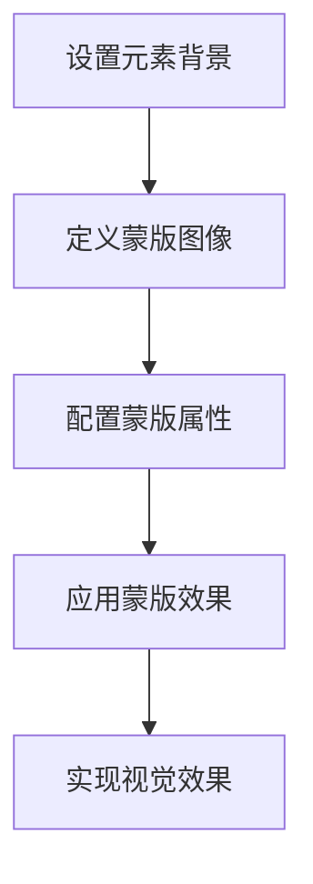

# Mask 蒙版效果

## 简介

Mask 蒙版效果是一种利用 CSS 的 mask-image 属性来控制元素可见区域的视觉技术。通过蒙版，我们可以实现各种创意效果，如渐隐文字、图像遮罩、手电筒追光效果等。该效果具有以下特点：

- 可以使用图片、渐变或 SVG 作为蒙版
- 支持 alpha 通道和亮度两种蒙版模式
- 可应用于任意 HTML 元素
- 实现复杂的视觉过渡效果
- 纯 CSS 实现，性能优异

## 效果演示

<demo react="react/effects/MaskEffect/example.tsx" 
:reactFiles="['react/effects/MaskEffect/example.tsx', 'react/effects/MaskEffect/index.tsx','react/effects/MaskEffect/index.scss']" />

## 核心实现

### 流程图



### 核心逻辑说明

1. **背景设置**：为元素设置背景图像或颜色
2. **蒙版定义**：使用`mask-image`属性定义蒙版图像
3. **属性配置**：设置蒙版的尺寸、位置、重复等属性
4. **模式选择**：通过`mask-mode`选择 alpha 或 luminance 模式
5. **效果呈现**：蒙版透明区域隐藏内容，不透明区域显示内容

## React 组件实现

### 主组件

```tsx
import * as React from 'react';
import './index.scss';

interface MaskEffectProps {
	width?: number;
	height?: number;
	backgroundImage?: string;
	maskImage?: string;
	maskMode?: 'alpha' | 'luminance' | 'match-source';
	maskSize?: string;
	maskPosition?: string;
	maskRepeat?: string;
	children?: React.ReactNode;
	className?: string;
	style?: React.CSSProperties;
}

const MaskEffect: React.FC<MaskEffectProps> = ({
	width = 500,
	height = 300,
	backgroundImage,
	maskImage,
	maskMode = 'alpha',
	maskSize = '100%',
	maskPosition = 'center',
	maskRepeat = 'no-repeat',
	children,
	className = '',
	style = {}
}) => {
	return (
		<div
			className={`mask-effect ${className}`}
			style={{
				width,
				height,
				backgroundImage: backgroundImage
					? `url(${backgroundImage})`
					: 'linear-gradient(135deg, #667eea 0%, #764ba2 100%)',
				backgroundSize: 'cover',
				backgroundPosition: 'center',
				backgroundRepeat: 'no-repeat',
				maskImage: maskImage
					? `url(${maskImage})`
					: 'linear-gradient(to bottom, rgba(0, 0, 0, 0) 0%, rgba(0, 0, 0, 1) 100%)',
				maskMode,
				maskSize,
				maskPosition,
				maskRepeat,
				...style
			}}
		>
			{children}
		</div>
	);
};

export default MaskEffect;
```

### 示例组件

```tsx
import * as React from 'react';
import MaskEffect from './index';

const MaskEffectExample: React.FC = () => {
	const [maskType, setMaskType] = React.useState('gradient');
	const [maskMode, setMaskMode] = React.useState<'alpha' | 'luminance' | 'match-source'>('alpha');
	const [width, setWidth] = React.useState(500);
	const [height, setHeight] = React.useState(300);

	// 获取示例蒙版图像URL
	const getMaskImage = () => {
		switch (maskType) {
			case 'circle':
				return 'radial-gradient(circle, black 50%, transparent 50%)';
			case 'ellipse':
				return 'radial-gradient(ellipse, black 60%, transparent 60%)';
			case 'gradient':
				return 'linear-gradient(to bottom, rgba(0, 0, 0, 0) 0%, rgba(0, 0, 0, 1) 100%)';
			case 'diamond':
				return 'linear-gradient(45deg, transparent 40%, black 40%, black 60%, transparent 60%), linear-gradient(-45deg, transparent 40%, black 40%, black 60%, transparent 60%)';
			default:
				return 'linear-gradient(to bottom, rgba(0, 0, 0, 0) 0%, rgba(0, 0, 0, 1) 100%)';
		}
	};

	return (
		<div className="mask-demo-container">
			<h1 style={{ textAlign: 'center', marginBottom: '30px' }}>Mask蒙版效果演示</h1>

			<div style={{ marginBottom: '30px', textAlign: 'center' }}>
				<h2 style={{ marginBottom: '15px' }}>默认Mask蒙版效果</h2>
				<div style={{ display: 'inline-block' }}>
					<MaskEffect
						width={500}
						height={300}
						backgroundImage="https://picsum.photos/500/300?random=1"
						maskImage="radial-gradient(circle, black 50%, transparent 50%)"
					/>
				</div>
			</div>

			<div style={{ marginBottom: '30px' }}>
				<h2 style={{ marginBottom: '15px', textAlign: 'center' }}>自定义配置Mask蒙版</h2>
				<div
					style={{
						display: 'flex',
						flexDirection: 'column',
						alignItems: 'center',
						gap: '20px',
						padding: '20px',
						backgroundColor: '#f5f5f5',
						borderRadius: '8px'
					}}
				>
					<div style={{ display: 'inline-block', width: '100%' }}>
						<MaskEffect
							width={width}
							height={height}
							backgroundImage="https://picsum.photos/500/300?random=2"
							maskImage={getMaskImage()}
							maskMode={maskMode}
						/>
					</div>

					<div
						style={{
							display: 'grid',
							gridTemplateColumns: 'repeat(auto-fit, minmax(200px, 1fr))',
							gap: '15px',
							width: '100%',
							maxWidth: '800px'
						}}
					>
						<div>
							<label style={{ display: 'block', marginBottom: '5px' }}>蒙版类型</label>
							<select
								value={maskType}
								onChange={e => setMaskType(e.target.value)}
								style={{ width: '100%', padding: '8px' }}
							>
								<option value="gradient">渐变蒙版</option>
								<option value="circle">圆形蒙版</option>
								<option value="ellipse">椭圆蒙版</option>
								<option value="diamond">菱形蒙版</option>
							</select>
						</div>

						<div>
							<label style={{ display: 'block', marginBottom: '5px' }}>蒙版模式</label>
							<select
								value={maskMode}
								onChange={e => setMaskMode(e.target.value as any)}
								style={{ width: '100%', padding: '8px' }}
							>
								<option value="alpha">Alpha模式</option>
								<option value="luminance">亮度模式</option>
								<option value="match-source">匹配源模式</option>
							</select>
						</div>

						<div>
							<label style={{ display: 'block', marginBottom: '5px' }}>宽度: {width}px</label>
							<input
								type="range"
								min="200"
								max="800"
								step="50"
								value={width}
								onChange={e => setWidth(Number(e.target.value))}
								style={{ width: '100%' }}
							/>
						</div>

						<div>
							<label style={{ display: 'block', marginBottom: '5px' }}>高度: {height}px</label>
							<input
								type="range"
								min="100"
								max="500"
								step="50"
								value={height}
								onChange={e => setHeight(Number(e.target.value))}
								style={{ width: '100%' }}
							/>
						</div>
					</div>
				</div>
			</div>

			<div
				style={{
					marginTop: '30px',
					padding: '20px',
					backgroundColor: '#f0f0f0',
					borderRadius: '8px',
					maxWidth: '800px',
					margin: '30px auto 0'
				}}
			>
				<h2 style={{ marginBottom: '15px' }}>Mask蒙版效果特点</h2>
				<ul style={{ paddingLeft: '20px' }}>
					<li style={{ margin: '10px 0' }}>支持多种蒙版类型：图片、渐变、SVG</li>
					<li style={{ margin: '10px 0' }}>支持alpha和luminance两种蒙版模式</li>
					<li style={{ margin: '10px 0' }}>可自定义蒙版尺寸、位置和重复方式</li>
					<li style={{ margin: '10px 0' }}>使用CSS实现，性能优异</li>
					<li style={{ margin: '10px 0' }}>使用TypeScript编写，具有完整的类型定义</li>
					<li style={{ margin: '10px 0' }}>适用于任意HTML元素</li>
				</ul>

				<h3 style={{ marginTop: '20px', marginBottom: '10px' }}>使用说明</h3>
				<p>
					Mask蒙版效果组件通过CSS的mask-image属性实现元素可见区域的控制。
					用户可以通过调整参数来自定义蒙版的类型、模式和外观。
				</p>
				<p style={{ marginTop: '10px' }}>
					<strong>Props说明：</strong>
					<br />
					• width: 容器宽度，默认500px
					<br />
					• height: 容器高度，默认300px
					<br />
					• backgroundImage: 背景图像URL
					<br />
					• maskImage: 蒙版图像，可以是URL或CSS渐变
					<br />
					• maskMode: 蒙版模式，可选alpha、luminance、match-source
					<br />
					• maskSize: 蒙版尺寸，默认100%
					<br />
					• maskPosition: 蒙版位置，默认center
					<br />
					• maskRepeat: 蒙版重复方式，默认no-repeat
					<br />
					• children: 子元素内容
					<br />
					• className: 自定义CSS类名
					<br />• style: 自定义内联样式
				</p>
			</div>
		</div>
	);
};

export default MaskEffectExample;
```

## 参数说明

### 基础参数

| 参数            | 类型                                     | 默认值                                                                 | 说明         |
| --------------- | ---------------------------------------- | ---------------------------------------------------------------------- | ------------ |
| width           | number                                   | 500                                                                    | 容器宽度(px) |
| height          | number                                   | 300                                                                    | 容器高度(px) |
| backgroundImage | string                                   | linear-gradient(135deg, #667eea 0%, #764ba2 100%)                      | 背景图像     |
| maskImage       | string                                   | linear-gradient(to bottom, rgba(0, 0, 0, 0) 0%, rgba(0, 0, 0, 1) 100%) | 蒙版图像     |
| maskMode        | 'alpha' \| 'luminance' \| 'match-source' | 'alpha'                                                                | 蒙版模式     |
| maskSize        | string                                   | '100%'                                                                 | 蒙版尺寸     |
| maskPosition    | string                                   | 'center'                                                               | 蒙版位置     |
| maskRepeat      | string                                   | 'no-repeat'                                                            | 蒙版重复方式 |
| children        | React.ReactNode                          | -                                                                      | 子元素内容   |

### 样式参数

| 参数      | 类型                | 默认值 | 说明            |
| --------- | ------------------- | ------ | --------------- |
| className | string              | ''     | 自定义 CSS 类名 |
| style     | React.CSSProperties | {}     | 自定义内联样式  |

## 使用说明

### 基本使用

```tsx
import MaskEffect from './effects/MaskEffect';

function App() {
	return (
		<MaskEffect
			backgroundImage="https://example.com/image.jpg"
			maskImage="radial-gradient(circle, black 50%, transparent 50%)"
		/>
	);
}
```

### 渐变蒙版

```tsx
import MaskEffect from './effects/MaskEffect';

function App() {
	return (
		<MaskEffect
			width={400}
			height={300}
			backgroundImage="https://example.com/image.jpg"
			maskImage="linear-gradient(to bottom, rgba(0, 0, 0, 0) 0%, rgba(0, 0, 0, 1) 100%)"
			maskMode="alpha"
		/>
	);
}
```

### 圆形蒙版

```tsx
import MaskEffect from './effects/MaskEffect';

function App() {
	return (
		<MaskEffect
			width={300}
			height={300}
			backgroundImage="https://example.com/image.jpg"
			maskImage="radial-gradient(circle, black 50%, transparent 50%)"
			maskSize="cover"
		/>
	);
}
```

## 实现原理

### 1. 蒙版基础

Mask 蒙版效果通过以下 CSS 属性实现：

- mask-image：定义蒙版图像
- mask-mode：设置蒙版模式
- mask-size：设置蒙版尺寸
- mask-position：设置蒙版位置
- mask-repeat：设置蒙版重复方式

### 2. 蒙版模式

- **Alpha 模式**：蒙版图像的透明度决定元素可见性
- **亮度模式**：蒙版图像的亮度决定元素可见性
- **匹配源模式**：根据蒙版源自动选择模式

### 3. 蒙版类型

1. **图片蒙版**：使用图片文件作为蒙版
2. **渐变蒙版**：使用 CSS 渐变作为蒙版
3. **SVG 蒙版**：使用 SVG 元素作为蒙版

## 应用场景

### 1. 图像遮罩

```css
.image-mask {
	mask-image: url('./mask.png');
	mask-size: 100%;
	mask-repeat: no-repeat;
	mask-position: center;
}
```

<demo react="react/effects/MaskEffect/scenarios/ImageMask.tsx" 
:reactFiles="['react/effects/MaskEffect/scenarios/ImageMask.tsx', 'react/effects/MaskEffect/index.tsx','react/effects/MaskEffect/index.scss']" />

### 2. 文字渐隐效果

```css
.text-fade {
	mask-image: linear-gradient(to bottom, rgba(0, 0, 0, 1) 80%, rgba(0, 0, 0, 0) 100%);
}
```

<demo react="react/effects/MaskEffect/scenarios/TextFade.tsx" 
:reactFiles="['react/effects/MaskEffect/scenarios/TextFade.tsx', 'react/effects/MaskEffect/index.tsx','react/effects/MaskEffect/index.scss']" />

### 3. 手电筒效果

```css
.flashlight {
	mask-image: radial-gradient(circle at var(--x) var(--y), white, black 100px);
	mask-mode: luminance;
}
```

<demo react="react/effects/MaskEffect/scenarios/Flashlight.tsx" 
:reactFiles="['react/effects/MaskEffect/scenarios/Flashlight.tsx', 'react/effects/MaskEffect/index.tsx','react/effects/MaskEffect/index.scss']" />

## 优化建议

### 1. 性能优化

- 优先使用 CSS 渐变而非图片蒙版
- 合理设置蒙版尺寸避免过度渲染
- 使用硬件加速提升动画性能

### 2. 兼容性处理

- 检测浏览器对 mask-image 的支持
- 提供降级方案确保基本显示效果

### 3. 用户体验优化

- 提供多种蒙版类型选择
- 支持实时预览效果
- 添加交互提示说明

## 结语

Mask 蒙版效果通过 CSS 的`mask-image`属性实现了强大的视觉控制能力。该技术不仅能够实现传统的遮罩效果，还能创造出丰富的交互动画。通过合理的配置和优化，可以为网页增添独特的视觉魅力。
