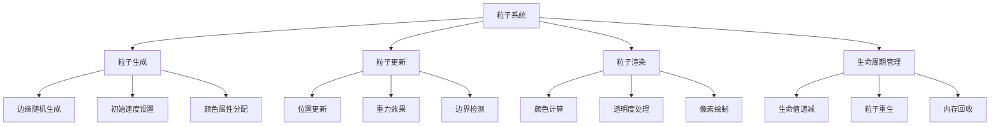
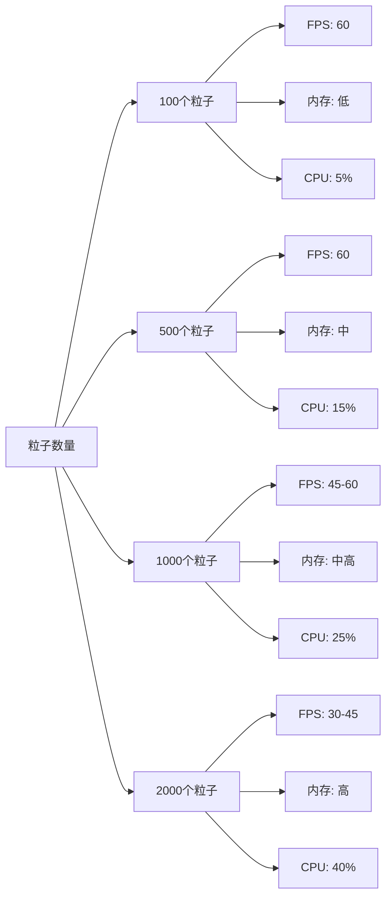

# 像素粒子动画效果

## 简介

像素粒子动画效果是一种基于Canvas绘制的动态视觉效果，通过创建大量的像素点粒子，实现粒子的动态移动、颜色渐变和生命周期管理。每个粒子都有独立的运动轨迹和颜色变化，形成丰富的视觉层次和动态美感。

## 效果特点

### 视觉特性

- **动态粒子**: 大量像素点从边缘生成，向中心区域移动
- **颜色渐变**: 根据粒子位置和生命周期实现HSL颜色空间渐变
- **透明度变化**: 粒子随生命周期衰减，产生淡入淡出效果
- **像素化风格**: 使用方形像素点绘制，呈现复古像素艺术风格

### 技术特性

- **高性能渲染**: 使用Canvas 2D API进行硬件加速渲染
- **粒子系统**: 完整的粒子生命周期管理和对象池优化
- **响应式设计**: 支持不同屏幕尺寸和设备适配
- **交互控制**: 提供播放/暂停和重置功能

## 工作原理


## 效果演示


<demo react="react/PixelParticleAnimation/index.tsx" 
:reactFiles="['react/PixelParticleAnimation/index.tsx','react/PixelParticleAnimation/index.scss']" 
/>

## 核心实现原理

### 基础实现方案

**核心思路**：

- 使用Canvas 2D API创建绘制上下文
- 建立粒子对象模型，包含位置、速度、生命周期等属性
- 通过requestAnimationFrame实现60fps流畅动画
- 采用HSL颜色空间实现平滑的颜色渐变效果

**优点**：

- 性能优异，可同时处理上千个粒子
- 视觉效果丰富，支持多种颜色和运动模式
- 代码结构清晰，易于扩展和定制
- 兼容性好，支持所有现代浏览器

**适用场景**：

- 网站背景动画效果
- 游戏粒子特效系统
- 数据可视化动态展示
- 艺术创作和视觉设计

### 粒子对象模型

```typescript
interface Particle {
  x: number;        // X坐标位置
  y: number;        // Y坐标位置
  vx: number;       // X轴速度
  vy: number;       // Y轴速度
  life: number;     // 当前生命值
  maxLife: number;  // 最大生命值
  size: number;     // 粒子大小
  hue: number;      // 色相值
}
```

### 粒子生成算法

```typescript
const createParticle = (): Particle => {
  const edge = Math.floor(Math.random() * 4);
  let x, y, vx, vy;

  switch (edge) {
    case 0: // 顶部边缘
      x = Math.random() * width;
      y = 0;
      vx = (Math.random() - 0.5) * 2;
      vy = Math.random() * 2 + 0.5;
      break;
    case 1: // 右侧边缘
      x = width;
      y = Math.random() * height;
      vx = -(Math.random() * 2 + 0.5);
      vy = (Math.random() - 0.5) * 2;
      break;
    case 2: // 底部边缘
      x = Math.random() * width;
      y = height;
      vx = (Math.random() - 0.5) * 2;
      vy = -(Math.random() * 2 + 0.5);
      break;
    default: // 左侧边缘
      x = 0;
      y = Math.random() * height;
      vx = Math.random() * 2 + 0.5;
      vy = (Math.random() - 0.5) * 2;
      break;
  }

  return {
    x, y, vx, vy,
    life: 0,
    maxLife: Math.random() * 200 + 100,
    size: Math.random() * 3 + 1,
    hue: Math.random() * 360
  };
};
```## 
实现方案对比

| 方案                 | 优点               | 缺点         | 适用场景     |
| -------------------- | ------------------ | ------------ | ------------ |
| **Canvas 2D**        | 性能好，兼容性强   | API相对简单  | 2D粒子效果   |
| **WebGL**            | 性能极佳，功能强大 | 学习成本高   | 3D复杂效果   |
| **CSS动画**          | 简单易懂，轻量级   | 性能有限     | 少量粒子效果 |
| **SVG动画**          | 矢量图形，可缩放   | 大量元素卡顿 | 精确图形动画 |

## 高级功能

### 功能 1：颜色渐变算法

```typescript
const calculateParticleColor = (particle: Particle, centerX: number, centerY: number) => {
  const alpha = Math.max(0, 1 - particle.life / particle.maxLife);
  
  // 计算距离中心的距离
  const distanceFromCenter = Math.sqrt(
    Math.pow(particle.x - centerX, 2) + Math.pow(particle.y - centerY, 2)
  );
  const maxDistance = Math.sqrt(centerX * centerX + centerY * centerY);
  const distanceRatio = distanceFromCenter / maxDistance;
  
  // HSL颜色空间渐变
  const hue = (particle.hue + distanceRatio * 120) % 360;
  const saturation = 70 + distanceRatio * 30;
  const lightness = 50 + (1 - distanceRatio) * 30;
  
  return `hsla(${hue}, ${saturation}%, ${lightness}%, ${alpha})`;
};
```

### 功能 2：物理引擎集成

```typescript
const updateParticlePhysics = (particle: Particle) => {
  // 更新位置
  particle.x += particle.vx;
  particle.y += particle.vy;
  
  // 重力效果
  particle.vy += 0.02;
  
  // 空气阻力
  particle.vx *= 0.999;
  particle.vy *= 0.999;
  
  // 生命周期更新
  particle.life++;
};
```

### 功能 3：性能优化策略

```typescript
// 对象池模式避免频繁创建销毁
class ParticlePool {
  private pool: Particle[] = [];
  private active: Particle[] = [];

  getParticle(): Particle {
    if (this.pool.length > 0) {
      const particle = this.pool.pop()!;
      this.active.push(particle);
      return particle;
    }
    return this.createNewParticle();
  }

  releaseParticle(particle: Particle) {
    const index = this.active.indexOf(particle);
    if (index > -1) {
      this.active.splice(index, 1);
      this.resetParticle(particle);
      this.pool.push(particle);
    }
  }

  private resetParticle(particle: Particle) {
    particle.life = 0;
    particle.x = 0;
    particle.y = 0;
  }
}
```## 响应式
设计

### 设备适配

```typescript
const useResponsiveCanvas = () => {
  const [dimensions, setDimensions] = useState({ width: 800, height: 600 });

  useEffect(() => {
    const updateDimensions = () => {
      const container = document.querySelector('.pixel-particle-animation');
      if (container) {
        const rect = container.getBoundingClientRect();
        setDimensions({
          width: Math.min(rect.width, window.innerWidth - 40),
          height: Math.min(rect.height, window.innerHeight - 40)
        });
      }
    };

    updateDimensions();
    window.addEventListener('resize', updateDimensions);
    return () => window.removeEventListener('resize', updateDimensions);
  }, []);

  return dimensions;
};
```

### 性能自适应

```typescript
const usePerformanceAdaptation = () => {
  const [particleCount, setParticleCount] = useState(1000);
  const fpsRef = useRef(60);
  const frameTimeRef = useRef(performance.now());

  const adaptPerformance = () => {
    const now = performance.now();
    const deltaTime = now - frameTimeRef.current;
    frameTimeRef.current = now;
    
    const currentFps = 1000 / deltaTime;
    fpsRef.current = fpsRef.current * 0.9 + currentFps * 0.1;

    // 根据帧率调整粒子数量
    if (fpsRef.current < 30 && particleCount > 200) {
      setParticleCount(prev => Math.max(200, prev - 50));
    } else if (fpsRef.current > 50 && particleCount < 1000) {
      setParticleCount(prev => Math.min(1000, prev + 50));
    }
  };

  return { particleCount, adaptPerformance };
};
```

## 性能优化

### 1. 渲染优化

```typescript
// 使用离屏Canvas提升性能
const useOffscreenCanvas = (width: number, height: number) => {
  const offscreenCanvas = useRef<HTMLCanvasElement>();
  const offscreenCtx = useRef<CanvasRenderingContext2D>();

  useEffect(() => {
    offscreenCanvas.current = document.createElement('canvas');
    offscreenCanvas.current.width = width;
    offscreenCanvas.current.height = height;
    offscreenCtx.current = offscreenCanvas.current.getContext('2d')!;
  }, [width, height]);

  const renderToOffscreen = (particles: Particle[]) => {
    const ctx = offscreenCtx.current!;
    ctx.clearRect(0, 0, width, height);
    
    // 批量渲染粒子
    particles.forEach(particle => {
      ctx.fillStyle = calculateParticleColor(particle, width/2, height/2);
      ctx.fillRect(particle.x, particle.y, particle.size, particle.size);
    });
  };

  return { offscreenCanvas: offscreenCanvas.current, renderToOffscreen };
};
```

### 2. 内存管理

```typescript
// 粒子回收机制
const useParticleRecycling = () => {
  const recyclePool = useRef<Particle[]>([]);
  
  const recycleParticle = (particle: Particle) => {
    // 重置粒子属性
    particle.life = 0;
    particle.x = 0;
    particle.y = 0;
    particle.vx = 0;
    particle.vy = 0;
    
    recyclePool.current.push(particle);
  };

  const getRecycledParticle = (): Particle | null => {
    return recyclePool.current.pop() || null;
  };

  return { recycleParticle, getRecycledParticle };
};
```

### 3. 计算优化

```typescript
// 使用查找表优化三角函数计算
const createTrigLookupTable = () => {
  const sinTable: number[] = [];
  const cosTable: number[] = [];
  
  for (let i = 0; i < 360; i++) {
    const rad = (i * Math.PI) / 180;
    sinTable[i] = Math.sin(rad);
    cosTable[i] = Math.cos(rad);
  }
  
  return {
    sin: (angle: number) => sinTable[Math.floor(angle) % 360],
    cos: (angle: number) => cosTable[Math.floor(angle) % 360]
  };
};
```## 故
障排除

### 1. 动画卡顿问题

**问题**: 粒子动画出现明显的卡顿或掉帧
**解决方案**:

- 减少粒子数量，从1000降低到500或更少
- 使用`requestAnimationFrame`替代`setInterval`
- 启用Canvas硬件加速：`ctx.imageSmoothingEnabled = false`
- 优化粒子更新算法，减少不必要的计算

### 2. 内存泄漏问题

**问题**: 长时间运行后浏览器内存占用持续增加
**解决方案**:

- 正确清理动画帧：`cancelAnimationFrame(animationId)`
- 实现粒子对象池，避免频繁创建销毁对象
- 及时清理事件监听器和定时器
- 使用Chrome DevTools监控内存使用情况

### 3. 颜色显示异常

**问题**: 粒子颜色不正确或渐变效果异常
**解决方案**:

- 检查HSL颜色值范围：H(0-360), S(0-100%), L(0-100%)
- 确保透明度值在0-1之间
- 验证颜色计算公式的数学逻辑
- 使用浏览器开发工具检查Canvas绘制状态

## 技术要点

### 1. Canvas最佳实践

- 使用`ctx.save()`和`ctx.restore()`管理绘制状态
- 批量设置相同属性的图形以减少状态切换
- 合理使用`clearRect()`清除画布内容
- 避免在动画循环中进行DOM操作

### 2. 粒子系统设计

- 采用面向对象的粒子类设计
- 实现粒子生命周期管理机制
- 使用向量数学处理粒子运动
- 考虑粒子间的碰撞检测和交互

### 3. 性能监控

```typescript
const usePerformanceMonitor = () => {
  const [fps, setFps] = useState(60);
  const [particleCount, setParticleCount] = useState(0);
  const frameCount = useRef(0);
  const lastTime = useRef(performance.now());

  const updateStats = (currentParticleCount: number) => {
    frameCount.current++;
    const now = performance.now();
    
    if (now - lastTime.current >= 1000) {
      setFps(frameCount.current);
      setParticleCount(currentParticleCount);
      frameCount.current = 0;
      lastTime.current = now;
    }
  };

  return { fps, particleCount, updateStats };
};
```

## 应用场景

### 1. 网站背景动画

```typescript
// 全屏背景粒子效果
const BackgroundParticles = () => {
  const [dimensions, setDimensions] = useState({
    width: window.innerWidth,
    height: window.innerHeight
  });

  useEffect(() => {
    const handleResize = () => {
      setDimensions({
        width: window.innerWidth,
        height: window.innerHeight
      });
    };

    window.addEventListener('resize', handleResize);
    return () => window.removeEventListener('resize', handleResize);
  }, []);

  return (
    <div className="background-particles">
      <PixelParticleAnimation
        width={dimensions.width}
        height={dimensions.height}
        particleCount={800}
        className="fullscreen"
      />
    </div>
  );
};
```

### 2. 交互式艺术装置

```typescript
// 鼠标交互粒子效果
const InteractiveParticles = () => {
  const [mousePos, setMousePos] = useState({ x: 0, y: 0 });

  const handleMouseMove = (e: React.MouseEvent) => {
    const rect = e.currentTarget.getBoundingClientRect();
    setMousePos({
      x: e.clientX - rect.left,
      y: e.clientY - rect.top
    });
  };

  return (
    <div onMouseMove={handleMouseMove}>
      <PixelParticleAnimation
        width={800}
        height={600}
        particleCount={1200}
        mousePosition={mousePos}
      />
    </div>
  );
};
```

### 3. 数据可视化

```typescript
// 数据驱动的粒子动画
const DataVisualization = ({ data }: { data: number[] }) => {
  const particleCount = Math.min(data.length * 10, 2000);
  
  return (
    <PixelParticleAnimation
      width={600}
      height={400}
      particleCount={particleCount}
      dataSource={data}
    />
  );
};
```#
# 最佳实践

### 设计原则

1. **性能优先**: 始终考虑动画的性能影响，合理控制粒子数量
2. **视觉和谐**: 颜色搭配要协调，避免过于刺眼的色彩组合
3. **用户体验**: 提供控制选项，让用户可以调整或关闭动画
4. **响应式设计**: 确保在不同设备上都有良好的显示效果

### 实施建议

1. **渐进增强**: 从简单的粒子效果开始，逐步添加复杂功能
2. **性能测试**: 在不同设备上测试动画性能，确保流畅运行
3. **可访问性**: 考虑动画敏感用户，提供关闭选项
4. **代码维护**: 保持代码结构清晰，便于后续维护和扩展

### 开发规范

1. **命名规范**: 使用有意义的变量和函数名
2. **注释完整**: 为复杂的算法和逻辑添加详细注释
3. **类型安全**: 使用TypeScript确保类型安全
4. **错误处理**: 添加适当的错误处理和边界检查

## 相关资源

### 推荐工具

- **Canvas API**: HTML5 Canvas 2D绘图API
- **requestAnimationFrame**: 浏览器动画API
- **Performance API**: 性能监控和分析工具
- **Chrome DevTools**: 调试和性能分析

### 参考文档

- [Canvas API - MDN](https://developer.mozilla.org/en-US/docs/Web/API/Canvas_API)
- [requestAnimationFrame - MDN](https://developer.mozilla.org/en-US/docs/Web/API/window/requestAnimationFrame)
- [粒子系统设计模式](https://gameprogrammingpatterns.com/object-pool.html)
- [Web动画性能优化](https://web.dev/animations/)

## 性能分析

不同粒子数量的性能对比：



## 扩展功能

### 1. 粒子轨迹效果

```typescript
const useParticleTrails = () => {
  const trailCanvas = useRef<HTMLCanvasElement>();
  
  const drawTrail = (particle: Particle, ctx: CanvasRenderingContext2D) => {
    ctx.globalAlpha = 0.1;
    ctx.fillStyle = calculateParticleColor(particle, 400, 300);
    ctx.fillRect(particle.x - 1, particle.y - 1, particle.size + 2, particle.size + 2);
    ctx.globalAlpha = 1;
  };

  return { drawTrail };
};
```

### 2. 音频响应

```typescript
const useAudioReactive = () => {
  const [audioData, setAudioData] = useState<Uint8Array>();
  const analyser = useRef<AnalyserNode>();

  const initAudio = async () => {
    const stream = await navigator.mediaDevices.getUserMedia({ audio: true });
    const audioContext = new AudioContext();
    const source = audioContext.createMediaStreamSource(stream);
    
    analyser.current = audioContext.createAnalyser();
    analyser.current.fftSize = 256;
    source.connect(analyser.current);
  };

  const getAudioData = () => {
    if (analyser.current) {
      const dataArray = new Uint8Array(analyser.current.frequencyBinCount);
      analyser.current.getByteFrequencyData(dataArray);
      setAudioData(dataArray);
    }
  };

  return { audioData, initAudio, getAudioData };
};
```

### 3. 物理碰撞

```typescript
const useParticleCollision = () => {
  const checkCollision = (p1: Particle, p2: Particle): boolean => {
    const dx = p1.x - p2.x;
    const dy = p1.y - p2.y;
    const distance = Math.sqrt(dx * dx + dy * dy);
    return distance < (p1.size + p2.size) / 2;
  };

  const resolveCollision = (p1: Particle, p2: Particle) => {
    const dx = p1.x - p2.x;
    const dy = p1.y - p2.y;
    const distance = Math.sqrt(dx * dx + dy * dy);
    
    if (distance > 0) {
      const nx = dx / distance;
      const ny = dy / distance;
      
      // 交换速度分量
      const tempVx = p1.vx;
      const tempVy = p1.vy;
      
      p1.vx = p2.vx;
      p1.vy = p2.vy;
      p2.vx = tempVx;
      p2.vy = tempVy;
    }
  };

  return { checkCollision, resolveCollision };
};
```

---

_这个像素粒子动画效果提供了完整的粒子系统实现，包含动态生成、物理运动、颜色渐变和生命周期管理等功能，可以作为各种视觉效果和交互动画的基础。_ ✨