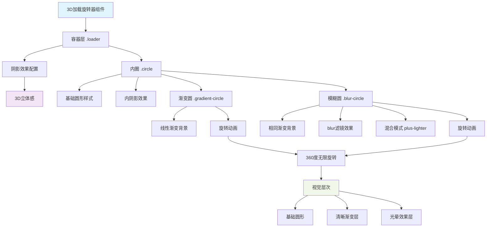
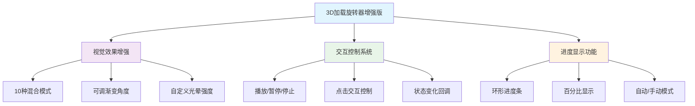

# 3D 加载旋转器

## 简介

3D 加载旋转器是一个使用纯 CSS 实现的立体加载动画效果。通过巧妙地运用 CSS 阴影、渐变和动画，创造出令人印象深刻的 3D 视觉效果，无需使用任何 JavaScript 代码。该组件具有高度可定制性，支持调整尺寸、颜色和动画速度等参数。

## 效果演示

<demo react="react/effects/3DLoaderSpinner/example.tsx"
:reactFiles="['react/effects/3DLoaderSpinner/example.tsx', 'react/effects/3DLoaderSpinner/index.tsx','react/effects/3DLoaderSpinner/index.scss']" />

## 流程图说明



核心逻辑说明：

1. 初始化组件并设置容器基本样式
2. 创建具有 3D 效果的外层容器，应用内外阴影营造立体感
3. 创建内部旋转圆环，设置渐变背景
4. 添加模糊层以增强视觉效果
5. 为元素设置旋转动画
6. 动画循环播放，实现连续的旋转效果

## 参数说明

### 基础参数

| 参数名            | 类型   | 默认值  | 说明              | 取值范围   |
| ----------------- | ------ | ------- | ----------------- | ---------- |
| size              | number | 300     | 加载器尺寸 (px)   | 100-500    |
| backgroundColor   | string | #c9d5e0 | 容器背景色        | 任意颜色值 |
| primaryColor      | string | #2196f3 | 渐变主色调        | 任意颜色值 |
| secondaryColor    | string | #e91e63 | 渐变副色调        | 任意颜色值 |
| animationDuration | number | 2       | 动画持续时间 (秒) | 0.5-5.0    |
| gradientAngle     | number | 45      | 渐变角度 (度)     | 0-360      |
| blurIntensity     | number | 20      | 光晕强度 (px)     | 5-50       |
| className         | string | ''      | 自定义 CSS 类名   | -          |

### 增强功能参数

| 参数名                 | 类型           | 默认值         | 说明             | 取值范围                     |
| ---------------------- | -------------- | -------------- | ---------------- | ---------------------------- |
| blendMode              | BlendMode      | 'plus-lighter' | 混合模式         | 见混合模式表格               |
| showProgress           | boolean        | false          | 是否显示进度环   | true/false                   |
| progress               | number         | 0              | 当前进度值 (%)   | 0-100                        |
| animationState         | AnimationState | 'playing'      | 动画播放状态     | 'playing'/'paused'/'stopped' |
| enableClickControl     | boolean        | false          | 启用点击控制     | true/false                   |
| onAnimationStateChange | function       | -              | 动画状态变化回调 | (state) => void              |
| onProgressChange       | function       | -              | 进度值变化回调   | (progress) => void           |

### 混合模式选项

| 模式值       | 中文名称 | 效果描述                   | 推荐场景           |
| ------------ | -------- | -------------------------- | ------------------ |
| plus-lighter | 发光叠加 | 增亮混合，创造强烈发光效果 | 默认推荐，高亮显示 |
| screen       | 滤色     | 明亮混合，柔和光效         | 温和光晕效果       |
| overlay      | 叠加     | 增强对比度和饱和度         | 增强立体层次感     |
| color-dodge  | 颜色减淡 | 极强发光效果               | 特殊高亮场景       |
| hard-light   | 强光     | 硬质光照，强对比           | 工业风格界面       |
| soft-light   | 柔光     | 柔和光照效果               | 优雅温和风格       |
| difference   | 差值     | 颜色反转，创意效果         | 艺术创意展示       |
| exclusion    | 排除     | 柔和差值效果               | 特殊视觉效果       |
| multiply     | 正片叠底 | 加深混合，暗调效果         | 深色主题界面       |
| normal       | 正常     | 标准显示，无混合           | 基础显示场景       |

### 动画状态说明

- **playing**: 动画正常播放状态
- **paused**: 动画暂停，保持当前位置
- **stopped**: 动画停止，回到初始位置

## 核心实现

### TSX 组件代码

```tsx
import React from 'react';
import './index.scss';

interface D3LoaderSpinnerProps {
	size?: number;
	backgroundColor?: string;
	primaryColor?: string;
	secondaryColor?: string;
	animationDuration?: number;
	className?: string;
}

const D3LoaderSpinner: React.FC<D3LoaderSpinnerProps> = ({
	size = 300,
	backgroundColor = '#c9d5e0',
	primaryColor = '#2196f3',
	secondaryColor = '#e91e63',
	animationDuration = 2,
	className = ''
}) => {
	return (
		<div className={`d3-loader-spinner-wrapper ${className}`}>
			<div
				className="loader"
				style={{
					width: size,
					height: size,
					background: backgroundColor
				}}
			>
				<div className="circle">
					<div
						className="gradient-circle"
						style={{
							background: `linear-gradient(${primaryColor}, ${secondaryColor})`,
							animationDuration: `${animationDuration}s`
						}}
					/>
					<div
						className="blur-circle"
						style={{
							background: `linear-gradient(${primaryColor}, ${secondaryColor})`,
							animationDuration: `${animationDuration}s`
						}}
					/>
				</div>
			</div>
		</div>
	);
};

export default D3LoaderSpinner;
```

### SCSS 样式代码

```scss
.d3-loader-spinner-wrapper {
	display: flex;
	justify-content: center;
	align-items: center;

	.loader {
		border-radius: 50%;
		box-shadow: 30px 30px 30px -10px rgba(0, 0, 0, 0.15), /* 外阴影 */ inset 15px 15px 10px rgba(255, 255, 255, 0.75),
			/* 内高光 */ -15px -15px 35px rgba(255, 255, 255, 0.55), /* 反光 */ inset -1px -1px 10px rgba(0, 0, 0, 0.2); /* 内阴影 */
		position: relative;
		display: flex;
		justify-content: center;
		align-items: center;
	}

	.circle {
		position: absolute;
		inset: 35px;
		background: #acbaca;
		border-radius: 50%;
		box-shadow: 5px 5px 15px #152b4a66, inset 5px 5px 5px rgba(255, 255, 255, 0.55),
			-6px -6px 10px rgba(255, 255, 255, 1);
		display: flex;
		justify-content: center;
		align-items: center;

		.gradient-circle {
			position: absolute;
			inset: 4px;
			border-radius: 50%;
			animation: animate 2s linear infinite;
		}

		.blur-circle {
			position: absolute;
			inset: 4px;
			border-radius: 50%;
			animation: animate 2s linear infinite;
			filter: blur(20px);
			z-index: 1000;
			mix-blend-mode: plus-lighter;
		}

		&::after {
			content: '';
			position: absolute;
			inset: 35px;
			background: #acbaca;
			border-radius: 50%;
		}
	}

	@keyframes animate {
		0% {
			transform: rotate(0deg);
		}
		100% {
			transform: rotate(360deg);
		}
	}
}
```

## 实现原理

### 1. 3D 视觉效果

通过多层次的阴影效果营造 3D 立体感：

- **外层阴影**：`30px 30px 30px -10px rgba(0,0,0,0.15)` 创建容器的投影效果
- **内层高光**：`inset 15px 15px 10px rgba(255,255,255,0.75)` 添加内部高光
- **内层阴影**：`inset -1px -1px 10px rgba(0,0,0,0.2)` 增强立体感

### 2. 渐变动画

使用 CSS 渐变创建色彩丰富的旋转效果：

```css
background: linear-gradient(#2196f3, #e91e63);
```

### 3. 模糊与混合效果

通过以下 CSS 属性增强视觉效果：

- `filter: blur(20px)` 创建光晕效果
- `mix-blend-mode: plus-lighter` 实现颜色混合

### 4. 动画实现

使用 CSS 关键帧动画实现旋转效果：

```css
@keyframes animate {
	0% {
		transform: rotate(0deg);
	}
	100% {
		transform: rotate(360deg);
	}
}
```

## 使用说明

### 基本使用

```tsx
import D3LoaderSpinner from './effects/3DLoaderSpinner';

function App() {
	return (
		<div style={{ height: '300px' }}>
			<D3LoaderSpinner />
		</div>
	);
}
```

### 自定义配置

```tsx
import D3LoaderSpinner from './effects/3DLoaderSpinner';

function App() {
	return (
		<div style={{ height: '400px' }}>
			<D3LoaderSpinner
				size={400}
				backgroundColor="#bdcbdb"
				primaryColor="#ff9800"
				secondaryColor="#9c27b0"
				animationDuration={3}
			/>
		</div>
	);
}
```

### 增强功能使用示例

#### 1. 混合模式配置

```tsx
import D3LoaderSpinner from './effects/3DLoaderSpinner';

function BlendModeExample() {
	return (
		<div style={{ height: '350px' }}>
			<D3LoaderSpinner
				size={300}
				blendMode="color-dodge"
				primaryColor="#00bcd4"
				secondaryColor="#ff5722"
				blurIntensity={30}
			/>
		</div>
	);
}
```

#### 2. 动画控制功能

```tsx
import React, { useState } from 'react';
import D3LoaderSpinner, { AnimationState } from './effects/3DLoaderSpinner';

function AnimationControlExample() {
	const [animationState, setAnimationState] = useState<AnimationState>('playing');

	const handleStateChange = (state: AnimationState) => {
		setAnimationState(state);
		console.log('动画状态变更:', state);
	};

	return (
		<div>
			<div style={{ height: '320px' }}>
				<D3LoaderSpinner
					size={280}
					animationState={animationState}
					enableClickControl={true}
					onAnimationStateChange={handleStateChange}
				/>
			</div>

			<div style={{ textAlign: 'center', marginTop: '20px' }}>
				<button onClick={() => setAnimationState('playing')}>播放</button>
				<button onClick={() => setAnimationState('paused')}>暂停</button>
				<button onClick={() => setAnimationState('stopped')}>停止</button>
			</div>
		</div>
	);
}
```

#### 3. 进度显示功能

```tsx
import React, { useState, useEffect } from 'react';
import D3LoaderSpinner from './effects/3DLoaderSpinner';

function ProgressExample() {
	const [progress, setProgress] = useState(0);

	useEffect(() => {
		const interval = setInterval(() => {
			setProgress(prev => (prev >= 100 ? 0 : prev + 2));
		}, 100);

		return () => clearInterval(interval);
	}, []);

	const handleProgressChange = (newProgress: number) => {
		console.log('进度更新:', newProgress);
	};

	return (
		<div style={{ height: '350px' }}>
			<D3LoaderSpinner
				size={300}
				showProgress={true}
				progress={progress}
				onProgressChange={handleProgressChange}
				primaryColor="#4caf50"
				secondaryColor="#8bc34a"
			/>
		</div>
	);
}
```

#### 4. 综合功能展示

```tsx
import React, { useState } from 'react';
import D3LoaderSpinner, { BlendMode, AnimationState } from './effects/3DLoaderSpinner';

function ComprehensiveExample() {
	const [config, setConfig] = useState({
		size: 280,
		blendMode: 'plus-lighter' as BlendMode,
		showProgress: true,
		progress: 65,
		animationState: 'playing' as AnimationState,
		enableClickControl: true,
		gradientAngle: 135,
		blurIntensity: 25
	});

	return (
		<div style={{ height: '350px' }}>
			<D3LoaderSpinner
				{...config}
				primaryColor="#e91e63"
				secondaryColor="#9c27b0"
				onAnimationStateChange={state => {
					setConfig(prev => ({ ...prev, animationState: state }));
				}}
				onProgressChange={progress => {
					setConfig(prev => ({ ...prev, progress }));
				}}
			/>
		</div>
	);
}
```

## 技术特点

### 1. 新增功能概览



### 2. 核心技术实现

#### 混合模式系统

- 使用 CSS `mix-blend-mode` 属性实现 10 种不同的视觉效果
- 动态切换混合模式，实时预览效果
- 每种模式都有专门的应用场景和视觉特点

#### 动画控制机制

- 通过 `animation-play-state` 控制播放/暂停
- 使用 React Hooks 管理动画状态
- 支持外部控制和内部点击交互

#### 进度显示技术

- SVG 环形进度条，平滑动画过渡
- 支持自动递增和手动控制两种模式
- 进度与主动画同步，保持视觉一致性

### 3. 性能优化策略

#### CSS 层面优化

```css
/* 启用硬件加速 */
.gradient-circle,
.blur-circle {
	transform: translateZ(0);
	backface-visibility: hidden;
	will-change: transform, filter;
}

/* 避免重绘重排 */
.progress-circle {
	transition: stroke-dashoffset 0.3s ease;
}
```

#### JavaScript 层面优化

- 使用 `useCallback` 优化事件处理函数
- 及时清理定时器，防止内存泄漏
- 条件渲染减少不必要的 DOM 更新

## 优化建议

### 1. 性能优化

- **硬件加速**: 使用 `transform: translateZ(0)` 启用 GPU 加速
- **动画优化**: 合理设置动画时长，避免过度消耗 CPU 资源
- **条件渲染**: 在不需要时通过条件渲染隐藏组件
- **内存管理**: 及时清理定时器和事件监听器

### 2. 响应式设计

```css
@media (max-width: 768px) {
	.d3-loader-spinner-wrapper .loader {
		max-width: min(250px, 90vw);
		max-height: min(250px, 90vw);
	}

	.progress-text .progress-number {
		font-size: max(1rem, calc(var(--spinner-size, 250px) * 0.08));
	}
}
```

### 3. 最佳实践

#### 混合模式选择建议

- **发光效果**: 使用 `plus-lighter` 或 `color-dodge`
- **柔和光晕**: 使用 `screen` 或 `soft-light`
- **创意效果**: 使用 `difference` 或 `exclusion`
- **深色主题**: 使用 `multiply` 或 `overlay`

#### 动画控制使用场景

- **文件上传**: 结合进度显示，提供暂停/继续功能
- **数据处理**: 长时间任务时允许用户暂停
- **用户体验**: 给用户控制感，降低等待焦虑

#### 进度显示应用

- **加载状态**: 显示具体加载进度
- **任务处理**: 实时反馈处理进度
- **用户引导**: 配合教程步骤显示

## 扩展建议

### 1. 功能扩展方向

- 添加音效支持，增强交互反馈
- 支持自定义动画轨迹和速度曲线
- 增加主题预设，快速切换视觉风格
- 支持多语言文本显示

### 2. 集成建议

```tsx
// 与状态管理集成
import { useSelector, useDispatch } from 'react-redux';

function LoaderWithRedux() {
	const { isLoading, progress } = useSelector(state => state.loading);
	const dispatch = useDispatch();

	return isLoading ? (
		<D3LoaderSpinner
			showProgress={true}
			progress={progress}
			onProgressChange={p => dispatch(updateProgress(p))}
		/>
	) : null;
}
```

## 结语

3D 加载旋转器增强版通过引入混合模式、动画控制和进度显示等高级功能，将简单的加载器升级为功能完备的用户交互组件。

### 核心价值

- **视觉冲击**: 多种混合模式创造丰富视觉效果
- **用户控制**: 动画控制增强用户体验
- **信息反馈**: 进度显示提供明确状态反馈
- **开发友好**: 丰富的配置选项和回调机制

### 适用场景

- 高端 Web 应用的加载界面
- 文件上传/下载进度显示
- 数据处理状态反馈
- 用户等待体验优化
- 创意交互界面设计

通过合理的配置和优化，该组件可以为现代 Web 应用提供专业级的加载体验，既满足功能需求又提升视觉品质。
