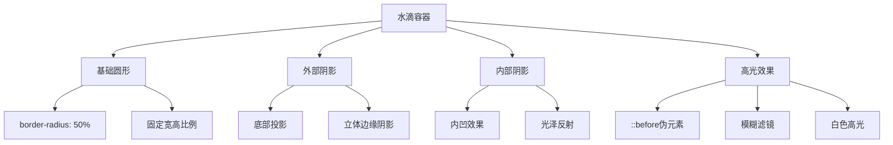

# 纯CSS水滴效果

## 简介

这是一个使用纯CSS实现的逼真3D水滴效果。通过巧妙运用`box-shadow`、`border-radius`和`filter`属性，创造出具有立体感和光泽感的水滴视觉效果。该效果无需JavaScript，完全依靠CSS实现，具有良好的性能和兼容性。

## 效果特点

### 视觉特性

- **立体感强**: 通过内外阴影营造3D立体效果
- **光泽质感**: 模拟真实水滴的光泽和透明感
- **简洁优雅**: 纯CSS实现，代码简洁易懂
- **高度可定制**: 支持自定义尺寸、颜色和光泽效果

### 技术特性

- **零依赖**: 无需JavaScript或第三方库
- **高性能**: 纯CSS实现，渲染性能优异
- **响应式**: 支持不同屏幕尺寸自适应
- **兼容性好**: 支持现代浏览器的CSS3特性

## 工作原理



## 效果演示

<demo react="react/WaterDrop/index.tsx" 
:reactFiles="['react/WaterDrop/index.tsx','react/WaterDrop/index.scss']" 
/>

## 核心实现原理

### 基础实现方案

**核心思路**：

- 使用`border-radius: 50%`创建基础圆形
- 通过多层`box-shadow`营造立体感和投影效果
- 利用`::before`伪元素添加高光反射
- 使用`filter: blur()`创建柔和的光泽效果

**优点**：

- 代码简洁，易于理解和维护
- 性能优异，无需JavaScript计算
- 视觉效果逼真，立体感强
- 高度可定制，支持多种参数调整

**适用场景**：

- 装饰性UI元素
- 加载动画背景
- 品牌Logo设计
- 艺术性页面装饰

### 核心CSS实现

```css
.water-drop {
  position: relative;
  width: 200px;
  height: 200px;
  border-radius: 50%;
  box-shadow: 
    inset 15px 15px 20px rgba(0,0,0,0.05),
    10px 15px 20px rgba(0,0,0,0.1),
    inset -15px -15px 20px rgba(255,255,255,1);
}

.water-drop::before {
  content: '';
  position: absolute;
  inset: 15px;
  box-shadow: inset 10px 10px 10px #fff;
  border-radius: 50%;
  filter: blur(5px);
}
```

## 参数配置选项

| 参数名称 | 类型 | 默认值 | 说明 | 可选值 |
|---------|------|--------|------|--------|
| **size** | number | 200 | 水滴尺寸(px) | 50-500 |
| **shadowIntensity** | number | 0.1 | 阴影强度 | 0.05-0.3 |
| **highlightSize** | number | 15 | 高光区域大小(px) | 5-50 |
| **blurRadius** | number | 5 | 模糊半径(px) | 2-15 |
| **backgroundColor** | string | '#eff0f4' | 背景颜色 | 任意颜色值 |
| **shadowColor** | string | 'rgba(0,0,0,0.1)' | 阴影颜色 | 任意rgba值 |

## 实现方案对比

| 方案 | 优点 | 缺点 | 适用场景 |
|------|------|------|----------|
| **纯CSS** | 性能好，兼容性强 | 效果相对固定 | 静态装饰效果 |
| **CSS + 动画** | 可添加动态效果 | 复杂度稍高 | 交互式水滴 |
| **Canvas绘制** | 效果更逼真 | 性能开销大 | 复杂3D效果 |
| **SVG实现** | 矢量可缩放 | 代码复杂 | 图标设计 |

## 高级功能

### 功能1：动态尺寸调整

```typescript
interface WaterDropConfig {
  size: number;
  shadowIntensity: number;
  highlightSize: number;
  blurRadius: number;
}

const useWaterDropConfig = (initialConfig: WaterDropConfig) => {
  const [config, setConfig] = useState(initialConfig);
  
  const updateConfig = (newConfig: Partial<WaterDropConfig>) => {
    setConfig(prev => ({ ...prev, ...newConfig }));
  };
  
  return { config, updateConfig };
};
```

### 功能2：颜色主题切换

```typescript
interface ColorTheme {
  background: string;
  shadowColor: string;
  highlightColor: string;
}

const themes: Record<string, ColorTheme> = {
  classic: {
    background: 'linear-gradient(135deg,#fff,#eff0f4)',
    shadowColor: 'rgba(0,0,0,0.1)',
    highlightColor: '#ffffff'
  },
  ocean: {
    background: 'linear-gradient(135deg,#e3f2fd,#bbdefb)',
    shadowColor: 'rgba(33,150,243,0.2)',
    highlightColor: '#ffffff'
  },
  sunset: {
    background: 'linear-gradient(135deg,#fff3e0,#ffcc02)',
    shadowColor: 'rgba(255,152,0,0.2)',
    highlightColor: '#ffffff'
  }
};
```

### 功能3：响应式适配

```typescript
const useResponsiveSize = () => {
  const [size, setSize] = useState(200);
  
  useEffect(() => {
    const updateSize = () => {
      const width = window.innerWidth;
      if (width < 768) {
        setSize(120);
      } else if (width < 1024) {
        setSize(160);
      } else {
        setSize(200);
      }
    };
    
    updateSize();
    window.addEventListener('resize', updateSize);
    return () => window.removeEventListener('resize', updateSize);
  }, []);
  
  return size;
};
```

## 性能优化

### 1. CSS优化

```css
/* 启用硬件加速 */
.water-drop {
  transform: translateZ(0);
  will-change: transform;
}

/* 减少重绘 */
.water-drop::before {
  transform: translateZ(0);
}
```

### 2. 内存管理

```typescript
// 防抖优化配置更新
const useDebounceConfig = (config: WaterDropConfig, delay: number = 300) => {
  const [debouncedConfig, setDebouncedConfig] = useState(config);
  
  useEffect(() => {
    const timer = setTimeout(() => {
      setDebouncedConfig(config);
    }, delay);
    
    return () => clearTimeout(timer);
  }, [config, delay]);
  
  return debouncedConfig;
};
```

## 故障排除

### 1. 阴影效果不明显

**问题**: 水滴的立体效果不够明显
**解决方案**:
- 增加阴影的偏移距离和模糊半径
- 调整阴影颜色的透明度
- 检查背景色与阴影色的对比度

### 2. 高光效果缺失

**问题**: 水滴缺少光泽感
**解决方案**:
- 确保`::before`伪元素正确设置
- 调整`filter: blur()`的数值
- 检查高光区域的`inset`值设置

### 3. 在移动端显示异常

**问题**: 在移动设备上效果显示不正常
**解决方案**:
- 添加`-webkit-`前缀支持
- 使用`transform3d`启用硬件加速
- 适当减少阴影层数以提升性能

## 应用场景

### 1. 装饰性元素

```typescript
// 页面装饰水滴
const DecorativeWaterDrop = () => (
  <div className="page-decoration">
    <WaterDrop size={80} theme="ocean" />
  </div>
);
```

### 2. 加载动画

```typescript
// 结合动画的加载效果
const LoadingWaterDrop = () => (
  <div className="loading-container">
    <WaterDrop 
      size={120} 
      className="loading-drop"
      style={{
        animation: 'pulse 2s ease-in-out infinite'
      }}
    />
  </div>
);
```

### 3. 品牌元素

```typescript
// 品牌Logo中的水滴元素
const BrandWaterDrop = () => (
  <div className="brand-logo">
    <WaterDrop 
      size={60} 
      theme="classic"
      shadowIntensity={0.15}
    />
    <span className="brand-text">AquaBrand</span>
  </div>
);
```

## 最佳实践

### 设计原则

1. **简洁性**: 保持代码简洁，避免过度复杂的阴影效果
2. **一致性**: 在同一项目中保持水滴效果的风格统一
3. **性能**: 合理使用阴影层数，避免性能问题
4. **可访问性**: 确保装饰效果不影响内容的可读性

### 实施建议

1. **渐进增强**: 从基础效果开始，逐步添加细节
2. **主题化**: 建立主题系统，便于统一管理
3. **响应式**: 考虑不同设备的显示效果
4. **测试验证**: 在多种浏览器和设备上测试效果

---

_这个纯CSS水滴效果为页面提供了优雅的视觉装饰，通过简洁的代码实现了逼真的3D立体感，是现代Web设计中的实用技巧。_

## 参数配置选项

| 参数名称 | 类型 | 默认值 | 说明 | 可选值 |
|---------|------|--------|------|--------|
| **size** | number | 200 | 水滴尺寸(px) | 50-500 |
| **shadowIntensity** | number | 0.1 | 阴影强度 | 0.05-0.3 |
| **highlightSize** | number | 15 | 高光区域大小(px) | 5-50 |
| **blurRadius** | number | 5 | 模糊半径(px) | 2-15 |
| **backgroundColor** | string | '#eff0f4' | 背景颜色 | 任意颜色值 |
| **shadowColor** | string | 'rgba(0,0,0,0.1)' | 阴影颜色 | 任意rgba值 |

## 实现方案对比

| 方案 | 优点 | 缺点 | 适用场景 |
|------|------|------|----------|
| **纯CSS** | 性能好，兼容性强 | 效果相对固定 | 静态装饰效果 |
| **CSS + 动画** | 可添加动态效果 | 复杂度稍高 | 交互式水滴 |
| **Canvas绘制** | 效果更逼真 | 性能开销大 | 复杂3D效果 |
| **SVG实现** | 矢量可缩放 | 代码复杂 | 图标设计 |

## 高级功能

### 功能1：动态尺寸调整

```typescript
interface WaterDropConfig {
  size: number;
  shadowIntensity: number;
  highlightSize: number;
  blurRadius: number;
}

const useWaterDropConfig = (initialConfig: WaterDropConfig) => {
  const [config, setConfig] = useState(initialConfig);
  
  const updateConfig = (newConfig: Partial<WaterDropConfig>) => {
    setConfig(prev => ({ ...prev, ...newConfig }));
  };
  
  return { config, updateConfig };
};
```

### 功能2：颜色主题切换

```typescript
interface ColorTheme {
  background: string;
  shadowColor: string;
  highlightColor: string;
}

const themes: Record<string, ColorTheme> = {
  classic: {
    background: 'linear-gradient(135deg,#fff,#eff0f4)',
    shadowColor: 'rgba(0,0,0,0.1)',
    highlightColor: '#ffffff'
  },
  ocean: {
    background: 'linear-gradient(135deg,#e3f2fd,#bbdefb)',
    shadowColor: 'rgba(33,150,243,0.2)',
    highlightColor: '#ffffff'
  },
  sunset: {
    background: 'linear-gradient(135deg,#fff3e0,#ffcc02)',
    shadowColor: 'rgba(255,152,0,0.2)',
    highlightColor: '#ffffff'
  }
};
```

### 功能3：响应式适配

```typescript
const useResponsiveSize = () => {
  const [size, setSize] = useState(200);
  
  useEffect(() => {
    const updateSize = () => {
      const width = window.innerWidth;
      if (width < 768) {
        setSize(120);
      } else if (width < 1024) {
        setSize(160);
      } else {
        setSize(200);
      }
    };
    
    updateSize();
    window.addEventListener('resize', updateSize);
    return () => window.removeEventListener('resize', updateSize);
  }, []);
  
  return size;
};