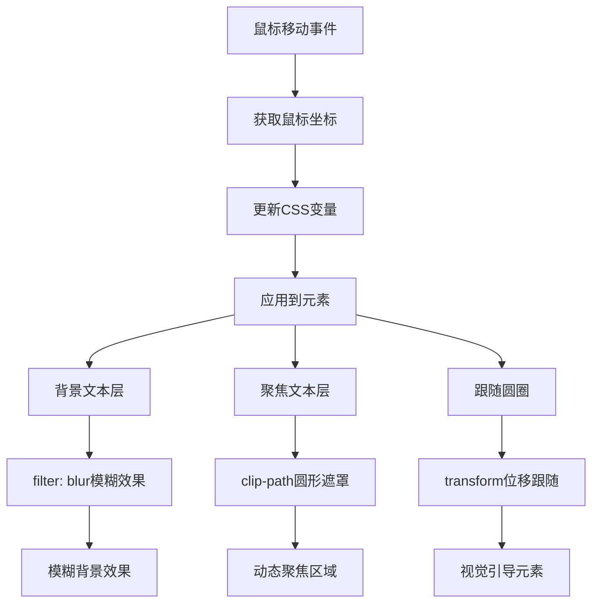

# 焦点文本效果

## 简介

这是一个使用CSS `clip-path`属性和JavaScript鼠标事件实现的动态焦点文本效果。通过鼠标移动控制圆形遮罩的位置，创造出文本在焦点区域清晰显示、其他区域模糊的视觉效果，同时配合跟随鼠标的圆形边框，营造出强烈的聚焦感和交互体验。

## 效果特点

### 视觉特性

- **动态聚焦**: 鼠标位置决定文本清晰显示区域
- **模糊背景**: 非焦点区域文本呈现模糊效果
- **圆形遮罩**: 使用clip-path创建圆形聚光灯效果
- **跟随光标**: 圆形边框实时跟随鼠标移动

### 技术特性

- **CSS clip-path**: 利用现代CSS特性实现遮罩效果
- **JavaScript交互**: 实时监听鼠标移动事件
- **CSS变量**: 动态更新CSS自定义属性
- **性能优化**: 使用transform属性确保流畅动画

## 工作原理



## 效果演示

<demo react="react/FocusTextEffect/index.tsx" 
:reactFiles="['react/FocusTextEffect/index.tsx','react/FocusTextEffect/index.scss']" 
/>

## 核心实现原理

### 基础实现方案

**核心思路**：

- 创建两个相同的文本层，一个模糊作为背景，一个清晰作为前景
- 使用`clip-path: circle()`在前景层创建圆形遮罩
- 通过JavaScript监听鼠标移动，动态更新CSS变量
- 圆形遮罩和跟随圆圈都基于鼠标坐标实时更新位置

**优点**：

- 视觉效果震撼，交互体验优秀
- 代码结构清晰，易于理解和扩展
- 性能良好，使用CSS硬件加速
- 兼容性好，支持现代浏览器

**适用场景**：

- 品牌展示页面
- 创意作品集网站
- 产品介绍页面
- 艺术性交互展示

### 核心JavaScript实现

```javascript
// 监听鼠标移动事件
let pos = document.documentElement;
pos.addEventListener("mousemove", e => {
    pos.style.setProperty('--x', e.clientX + 'px');
    pos.style.setProperty('--y', e.clientY + 'px');
});
```

### 核心CSS实现

```css
/* 背景模糊层 */
.box:nth-child(1) {
    filter: blur(10px);
}

/* 聚焦清晰层 */
.box:nth-child(2) {
    clip-path: circle(100px at var(--x) var(--y));
}

/* 跟随圆圈 */
.circle {
    transform: translate(var(--x), var(--y));
}
```

## 参数配置选项

| 参数名称 | 类型 | 默认值 | 说明 | 可选值 |
|---------|------|--------|------|--------|
| **focusRadius** | number | 100 | 聚焦圆形半径(px) | 50-300 |
| **blurIntensity** | number | 10 | 背景模糊强度(px) | 5-30 |
| **text** | string | 'Focus' | 显示文本内容 | 任意文本 |
| **fontSize** | number | 8 | 字体大小(em) | 4-12 |
| **textColor** | string | '#ffffff' | 文字颜色 | 任意颜色值 |
| **backgroundColor** | string | '#222222' | 背景颜色 | 任意颜色值 |
| **circleVisible** | boolean | true | 是否显示跟随圆圈 | true/false |
| **circleColor** | string | '#ffffff' | 圆圈边框颜色 | 任意颜色值 |
| **textOffset** | number | 25 | 文字偏移系数 | 10-50 |

## 实现方案对比

| 方案 | 优点 | 缺点 | 适用场景 |
|------|------|------|----------|
| **CSS clip-path** | 性能好，效果流畅 | 兼容性要求较高 | 现代浏览器项目 |
| **Canvas遮罩** | 兼容性好，功能强大 | 性能开销大 | 复杂图形处理 |
| **SVG遮罩** | 矢量可缩放 | 代码复杂度高 | 图形设计需求 |
| **多层div** | 兼容性最好 | 效果有限 | 兼容性要求高的项目 |

## 高级功能

### 功能1：动态配置系统

```typescript
interface FocusTextConfig {
  focusRadius: number;
  blurIntensity: number;
  text: string;
  fontSize: number;
  textColor: string;
  backgroundColor: string;
  circleVisible: boolean;
  circleColor: string;
  textOffset: number;
}

const useFocusTextConfig = (initialConfig: FocusTextConfig) => {
  const [config, setConfig] = useState(initialConfig);
  
  const updateConfig = (newConfig: Partial<FocusTextConfig>) => {
    setConfig(prev => ({ ...prev, ...newConfig }));
  };
  
  return { config, updateConfig };
};
```

### 功能2：鼠标跟随优化

```typescript
const useMouseTracker = (throttleMs: number = 16) => {
  const [mousePos, setMousePos] = useState({ x: 0, y: 0 });
  
  useEffect(() => {
    let animationId: number;
    
    const handleMouseMove = (e: MouseEvent) => {
      cancelAnimationFrame(animationId);
      animationId = requestAnimationFrame(() => {
        setMousePos({ x: e.clientX, y: e.clientY });
      });
    };
    
    document.addEventListener('mousemove', handleMouseMove);
    return () => {
      document.removeEventListener('mousemove', handleMouseMove);
      cancelAnimationFrame(animationId);
    };
  }, []);
  
  return mousePos;
};
```

### 功能3：多文本层效果

```typescript
interface TextLayer {
  id: string;
  text: string;
  color: string;
  size: number;
  offset: { x: number; y: number };
}

const useMultiLayerText = (layers: TextLayer[]) => {
  const [activeLayers, setActiveLayers] = useState(layers);
  
  const updateLayer = (id: string, updates: Partial<TextLayer>) => {
    setActiveLayers(prev => 
      prev.map(layer => 
        layer.id === id ? { ...layer, ...updates } : layer
      )
    );
  };
  
  return { activeLayers, updateLayer };
};
```

## 性能优化

### 1. 事件节流优化

```typescript
// 使用requestAnimationFrame优化鼠标跟随
const useOptimizedMouseTracker = () => {
  const [mousePos, setMousePos] = useState({ x: 0, y: 0 });
  const rafRef = useRef<number>();
  
  useEffect(() => {
    const handleMouseMove = (e: MouseEvent) => {
      if (rafRef.current) {
        cancelAnimationFrame(rafRef.current);
      }
      
      rafRef.current = requestAnimationFrame(() => {
        setMousePos({ x: e.clientX, y: e.clientY });
      });
    };
    
    document.addEventListener('mousemove', handleMouseMove);
    return () => {
      document.removeEventListener('mousemove', handleMouseMove);
      if (rafRef.current) {
        cancelAnimationFrame(rafRef.current);
      }
    };
  }, []);
  
  return mousePos;
};
```

### 2. CSS硬件加速

```css
/* 启用硬件加速 */
.focus-text-layer {
  transform: translateZ(0);
  will-change: clip-path, transform;
}

.focus-circle {
  transform: translateZ(0);
  will-change: transform;
}
```

## 故障排除

### 1. clip-path不生效

**问题**: 圆形遮罩效果不显示
**解决方案**:
- 检查浏览器是否支持clip-path属性
- 确认CSS变量是否正确设置
- 验证圆形半径值是否合理

### 2. 鼠标跟随卡顿

**问题**: 鼠标移动时效果不流畅
**解决方案**:
- 使用requestAnimationFrame优化动画
- 减少DOM操作频率
- 启用CSS硬件加速

### 3. 文字显示异常

**问题**: 文字位置或大小显示不正确
**解决方案**:
- 检查字体大小和容器尺寸
- 确认文字偏移计算公式
- 验证CSS变量的单位设置

## 应用场景

### 1. 品牌展示

```typescript
// 品牌Logo焦点效果
const BrandFocusText = () => (
  <FocusTextEffect 
    config={{
      text: "BRAND",
      fontSize: 10,
      focusRadius: 150,
      textColor: "#ff6b6b"
    }}
  />
);
```

### 2. 产品介绍

```typescript
// 产品特性聚焦展示
const ProductFeature = () => (
  <FocusTextEffect 
    config={{
      text: "INNOVATION",
      backgroundColor: "#1a1a1a",
      focusRadius: 120,
      blurIntensity: 15
    }}
  />
);
```

### 3. 创意作品集

```typescript
// 作品集标题效果
const PortfolioTitle = () => (
  <FocusTextEffect 
    config={{
      text: "CREATIVE",
      fontSize: 12,
      textColor: "#00ff88",
      circleColor: "#00ff88"
    }}
  />
);
```

## 最佳实践

### 设计原则

1. **性能优先**: 使用requestAnimationFrame优化动画
2. **用户体验**: 确保效果不影响内容可读性
3. **响应式**: 考虑不同设备的显示效果
4. **可访问性**: 提供禁用动画的选项

### 实施建议

1. **渐进增强**: 为不支持的浏览器提供降级方案
2. **性能监控**: 监控动画性能，避免卡顿
3. **内容适配**: 根据文本长度调整聚焦区域
4. **交互反馈**: 提供适当的视觉反馈

---

_这个焦点文本效果通过创新的CSS技术和JavaScript交互，为用户提供了独特的视觉聚焦体验，是现代Web设计中的亮点技术。_