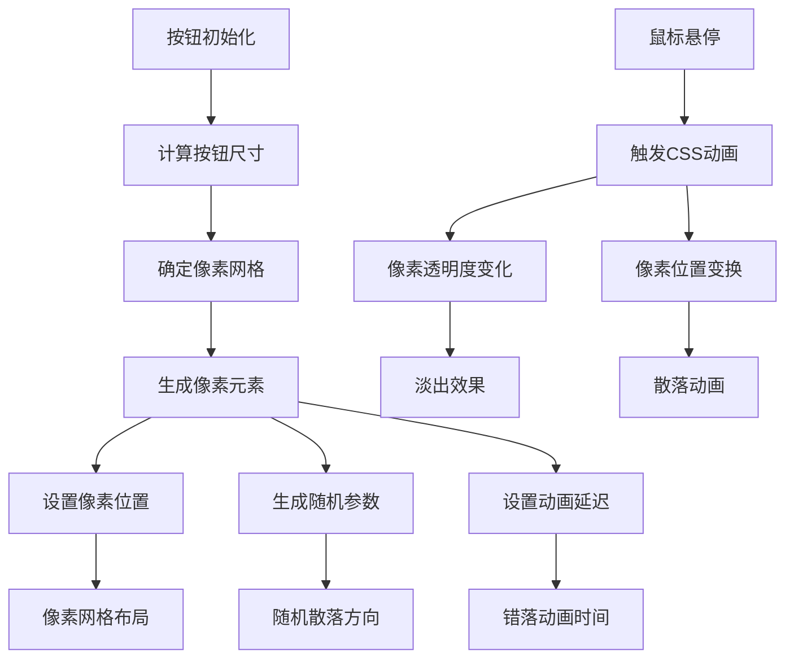

# 像素按钮效果

## 简介

这是一个使用JavaScript动态生成像素粒子和CSS过渡动画实现的创意按钮效果。当鼠标悬停在按钮上时，按钮表面的像素粒子会随机散落，创造出独特的解构视觉效果。该效果结合了程序化生成和CSS动画，为用户界面增添了科技感和互动性。

## 效果特点

### 视觉特性

- **像素化设计**: 按钮表面由小像素块组成
- **动态散落**: 悬停时像素随机方向散落
- **颜色可定制**: 支持自定义像素颜色主题
- **流畅过渡**: CSS过渡确保动画流畅自然

### 技术特性

- **程序化生成**: JavaScript动态创建像素元素
- **随机动画**: 每个像素的散落方向和延迟随机
- **CSS变量**: 使用CSS自定义属性控制动画参数
- **性能优化**: 合理的像素数量确保流畅体验

## 工作原理



## 效果演示

<demo react="react/PixelButtonEffect/index.tsx" 
:reactFiles="['react/PixelButtonEffect/index.tsx','react/PixelButtonEffect/index.scss']" 
/>

## 核心实现原理

### 基础实现方案

**核心思路**：

- 使用JavaScript计算按钮尺寸，确定像素网格的行列数
- 动态创建像素元素，设置其在网格中的位置
- 为每个像素生成随机的散落方向和动画延迟
- 通过CSS过渡和transform实现悬停时的散落效果

**优点**：

- 视觉效果独特，科技感强
- 可定制性高，支持多种参数调整
- 性能良好，使用CSS硬件加速
- 代码结构清晰，易于理解和扩展

**适用场景**：

- 科技类网站按钮
- 游戏界面元素
- 创意作品集网站
- 现代化产品展示

### 核心JavaScript实现

```javascript
// 像素按钮初始化
let buttons = document.querySelectorAll('.pixel-btn');
buttons.forEach(button => {
    let pixelContainer = button.querySelector('.pixel-container');
    let pixSize = 10;
    let btnWidth = button.offsetWidth;
    let btnHeight = button.offsetHeight;

    let cols = Math.floor(btnWidth / pixSize);
    let rows = Math.floor(btnHeight / pixSize);

    // 生成像素网格
    for(let row = 0; row < rows; row++){
        for(let col = 0; col < cols; col++){
            let pixel = document.createElement('div');
            pixel.classList.add('pixel');
            pixel.style.left = `${col * pixSize}px`;
            pixel.style.top = `${row * pixSize}px`;

            // 随机散落方向
            let tx = (Math.random() - 0.5) * 100;
            let ty = (Math.random() - 0.5) * 100;
            let delay = Math.random() * 0.5;

            pixel.style.transitionDelay = `${delay}s`;
            pixel.style.setProperty('--tx', `${tx}px`);
            pixel.style.setProperty('--ty', `${ty}px`);
            
            pixelContainer.appendChild(pixel);
        }
    }
});
```

### 核心CSS实现

```css
/* 像素元素样式 */
.pixel {
    position: absolute;
    width: 10px;
    height: 10px;
    background: var(--clr);
    transition: transform 0.5s ease, opacity 0.5s ease;
}

/* 悬停散落效果 */
.pixel-btn:hover .pixel {
    opacity: 0;
    transform: translate(var(--tx), var(--ty));
}
```

## 参数配置选项

| 参数名称 | 类型 | 默认值 | 说明 | 可选值 |
|---------|------|--------|------|--------|
| **pixelSize** | number | 10 | 像素块大小(px) | 5-20 |
| **buttonWidth** | number | 180 | 按钮宽度(px) | 120-300 |
| **buttonHeight** | number | 60 | 按钮高度(px) | 40-100 |
| **pixelColor** | string | '#ff5722' | 像素颜色 | 任意颜色值 |
| **scatterRange** | number | 100 | 散落范围(px) | 50-200 |
| **animationDuration** | number | 0.5 | 动画持续时间(s) | 0.3-1.0 |
| **maxDelay** | number | 0.5 | 最大延迟时间(s) | 0.2-1.0 |
| **buttonText** | string | 'Hover Me' | 按钮文字 | 任意文本 |
| **backgroundColor** | string | '#333333' | 按钮背景色 | 任意颜色值 |

## 实现方案对比

| 方案 | 优点 | 缺点 | 适用场景 |
|------|------|------|----------|
| **JavaScript + CSS** | 灵活可控，效果丰富 | 需要计算生成 | 交互性强的项目 |
| **纯CSS动画** | 性能好，代码简单 | 效果相对固定 | 简单装饰效果 |
| **Canvas绘制** | 效果更复杂 | 性能开销大 | 复杂粒子系统 |
| **WebGL着色器** | 性能最佳 | 开发复杂度高 | 高性能要求项目 |

## 高级功能

### 功能1：动态配置系统

```typescript
interface PixelButtonConfig {
  pixelSize: number;
  buttonWidth: number;
  buttonHeight: number;
  pixelColor: string;
  scatterRange: number;
  animationDuration: number;
  maxDelay: number;
  buttonText: string;
  backgroundColor: string;
}

const usePixelButtonConfig = (initialConfig: PixelButtonConfig) => {
  const [config, setConfig] = useState(initialConfig);
  
  const updateConfig = (newConfig: Partial<PixelButtonConfig>) => {
    setConfig(prev => ({ ...prev, ...newConfig }));
  };
  
  return { config, updateConfig };
};
```

### 功能2：像素生成优化

```typescript
const generatePixelGrid = (
  container: HTMLElement,
  width: number,
  height: number,
  pixelSize: number,
  color: string,
  scatterRange: number,
  maxDelay: number
) => {
  // 清空现有像素
  container.innerHTML = '';
  
  const cols = Math.floor(width / pixelSize);
  const rows = Math.floor(height / pixelSize);
  
  const fragment = document.createDocumentFragment();
  
  for(let row = 0; row < rows; row++){
    for(let col = 0; col < cols; col++){
      const pixel = document.createElement('div');
      pixel.className = 'pixel';
      
      // 设置位置
      pixel.style.left = `${col * pixelSize}px`;
      pixel.style.top = `${row * pixelSize}px`;
      pixel.style.width = `${pixelSize}px`;
      pixel.style.height = `${pixelSize}px`;
      
      // 设置颜色
      pixel.style.backgroundColor = color;
      
      // 随机散落参数
      const tx = (Math.random() - 0.5) * scatterRange;
      const ty = (Math.random() - 0.5) * scatterRange;
      const delay = Math.random() * maxDelay;
      
      pixel.style.setProperty('--tx', `${tx}px`);
      pixel.style.setProperty('--ty', `${ty}px`);
      pixel.style.transitionDelay = `${delay}s`;
      
      fragment.appendChild(pixel);
    }
  }
  
  container.appendChild(fragment);
};
```

### 功能3：多主题支持

```typescript
interface PixelTheme {
  name: string;
  pixelColor: string;
  backgroundColor: string;
  textColor: string;
}

const pixelThemes: PixelTheme[] = [
  {
    name: 'Fire',
    pixelColor: '#ff5722',
    backgroundColor: '#333333',
    textColor: '#ffffff'
  },
  {
    name: 'Ocean',
    pixelColor: '#03a9f4',
    backgroundColor: '#1a237e',
    textColor: '#ffffff'
  },
  {
    name: 'Forest',
    pixelColor: '#4caf50',
    backgroundColor: '#2e7d32',
    textColor: '#ffffff'
  },
  {
    name: 'Sunset',
    pixelColor: '#ff9800',
    backgroundColor: '#e65100',
    textColor: '#ffffff'
  }
];
```

## 性能优化

### 1. 像素数量控制

```typescript
// 根据设备性能调整像素密度
const getOptimalPixelSize = (width: number, height: number): number => {
  const area = width * height;
  const pixelCount = area / 100; // 目标像素数量
  
  if (pixelCount > 500) {
    return 15; // 减少像素数量
  } else if (pixelCount > 300) {
    return 12;
  } else {
    return 10; // 默认大小
  }
};
```

### 2. 动画性能优化

```css
/* 启用硬件加速 */
.pixel {
  transform: translateZ(0);
  will-change: transform, opacity;
}

/* 减少重绘 */
.pixel-container {
  transform: translateZ(0);
}
```

### 3. 内存管理

```typescript
// 组件卸载时清理像素
const cleanupPixels = (container: HTMLElement) => {
  const pixels = container.querySelectorAll('.pixel');
  pixels.forEach(pixel => {
    pixel.remove();
  });
};
```

## 故障排除

### 1. 像素生成失败

**问题**: 像素元素没有正确生成
**解决方案**:
- 检查按钮尺寸是否正确获取
- 确认像素容器元素存在
- 验证像素大小设置是否合理

### 2. 动画效果不流畅

**问题**: 悬停时动画卡顿或不连贯
**解决方案**:
- 减少像素数量或增大像素尺寸
- 启用CSS硬件加速
- 优化动画持续时间和延迟设置

### 3. 颜色显示异常

**问题**: 像素颜色不正确或不显示
**解决方案**:
- 检查CSS变量是否正确设置
- 确认颜色值格式正确
- 验证CSS样式是否被正确应用

## 应用场景

### 1. 科技类网站

```typescript
// 科技风格按钮
const TechButton = () => (
  <PixelButtonEffect 
    config={{
      pixelColor: "#00ff88",
      backgroundColor: "#1a1a1a",
      buttonText: "LAUNCH",
      scatterRange: 150
    }}
  />
);
```

### 2. 游戏界面

```typescript
// 游戏风格按钮
const GameButton = () => (
  <PixelButtonEffect 
    config={{
      pixelSize: 8,
      pixelColor: "#ff4444",
      buttonText: "START GAME",
      animationDuration: 0.8
    }}
  />
);
```

### 3. 创意作品集

```typescript
// 艺术风格按钮
const ArtButton = () => (
  <PixelButtonEffect 
    config={{
      pixelColor: "#ff6b6b",
      scatterRange: 200,
      maxDelay: 0.8,
      buttonText: "VIEW WORK"
    }}
  />
);
```

## 最佳实践

### 设计原则

1. **性能优先**: 控制像素数量，确保流畅体验
2. **视觉平衡**: 合理设置散落范围和动画时间
3. **主题一致**: 像素颜色与整体设计风格协调
4. **交互反馈**: 提供清晰的悬停状态反馈

### 实施建议

1. **渐进增强**: 为不支持的设备提供降级方案
2. **响应式设计**: 根据屏幕尺寸调整按钮大小
3. **可访问性**: 保持文字可读性和对比度
4. **性能监控**: 监控动画性能，避免卡顿

---

_这个像素按钮效果通过程序化生成和CSS动画的结合，为用户界面带来了独特的科技感和互动性，是现代Web设计中的创新应用。_