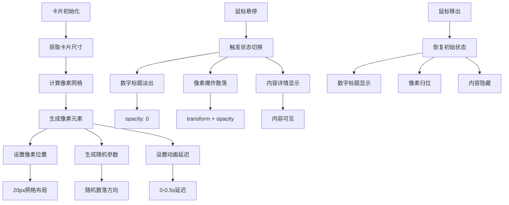

# 爆炸像素卡效果

## 简介

这是一个使用 JavaScript 动态生成像素块和 CSS 过渡动画实现的创意卡片效果。当鼠标悬停在卡片上时，卡片表面的像素块会向随机方向爆炸散落，同时显示隐藏的内容信息。该效果结合了程序化生成、动画过渡和交互设计，为卡片组件增添了强烈的视觉冲击力。

## 效果特点

### 视觉特性

- **像素化爆炸**: 卡片表面由彩色像素块覆盖，悬停时爆炸散落
- **内容切换**: 数字标题淡出，详细内容淡入显示
- **随机动画**: 每个像素的散落方向和延迟时间随机
- **主题色彩**: 支持自定义主题颜色，像素和按钮使用统一色调

### 技术特性

- **程序化生成**: JavaScript 动态创建像素网格
- **CSS 变量控制**: 使用 CSS 自定义属性管理主题色彩
- **过渡动画**: CSS transition 确保动画流畅自然
- **响应式设计**: 根据卡片尺寸自动计算像素网格

## 工作原理



## 效果演示

<demo react="react/ExplodingPixelCard/index.tsx" 
:reactFiles="['react/ExplodingPixelCard/index.tsx','react/ExplodingPixelCard/index.scss']" 
/>

## 核心实现原理

### 基础实现方案

**核心思路**：

- 使用 JavaScript 计算卡片尺寸，生成 20px×20px 的像素网格
- 为每个像素设置随机的散落方向和动画延迟时间
- 通过 CSS 过渡和 transform 实现悬停时的爆炸效果
- 结合 opacity 变化实现内容的显示隐藏切换

**优点**：

- 视觉效果震撼，具有强烈的科技感
- 交互体验流畅，状态切换自然
- 可定制性强，支持多种主题色彩
- 代码结构清晰，易于理解和扩展

**适用场景**：

- 产品展示卡片
- 作品集网站
- 科技类产品介绍
- 创意设计展示

### 核心 JavaScript 实现

```javascript
// 像素卡片初始化
let cards = document.querySelectorAll('.cards');
cards.forEach(card => {
	let pixelContainer = card.querySelector('.pixel-container');
	let pixSize = 20;
	let cardWidth = card.offsetWidth;
	let cardHeight = card.offsetHeight;

	let cols = Math.floor(cardWidth / pixSize);
	let rows = Math.floor(cardHeight / pixSize);

	// 生成像素网格
	for (let row = 0; row < rows; row++) {
		for (let col = 0; col < cols; col++) {
			let pixel = document.createElement('div');
			pixel.classList.add('pixel');
			pixel.style.left = `${col * pixSize}px`;
			pixel.style.top = `${row * pixSize}px`;

			// 随机爆炸方向
			let tx = (Math.random() - 0.5) * 100;
			let ty = (Math.random() - 0.5) * 100;
			let delay = Math.random() * 0.5;

			pixel.style.transitionDelay = `${delay}s`;
			pixel.style.setProperty('--tx', `${tx}px`);
			pixel.style.setProperty('--ty', `${ty}px`);

			pixelContainer.appendChild(pixel);
		}
	}
});
```

### 核心 CSS 实现

```css
/* 卡片基础样式 */
.cards {
	position: relative;
	width: 300px;
	height: 400px;
	background: #333;
	color: #fff;
	cursor: pointer;
}

/* 像素元素样式 */
.pixel {
	position: absolute;
	width: 20px;
	height: 20px;
	background: var(--clr);
	border: 1px solid rgba(0, 0, 0, 0.25);
	transition: 0.5s;
}

/* 悬停爆炸效果 */
.cards:hover .pixel {
	opacity: 0;
	transform: translate(var(--tx), var(--ty));
}

/* 标题切换效果 */
.cards h2 {
	transition: 0.5s;
	transition-delay: 0.5s;
}

.cards:hover h2 {
	opacity: 0;
	transition-delay: 0s;
}
```

## 参数配置选项

| 参数名称              | 类型   | 默认值    | 说明            | 可选值     |
| --------------------- | ------ | --------- | --------------- | ---------- |
| **pixelSize**         | number | 20        | 像素块大小(px)  | 10-40      |
| **cardWidth**         | number | 300       | 卡片宽度(px)    | 200-500    |
| **cardHeight**        | number | 400       | 卡片高度(px)    | 250-600    |
| **scatterRange**      | number | 100       | 散落范围(px)    | 50-200     |
| **animationDuration** | number | 0.5       | 动画持续时间(s) | 0.3-1.0    |
| **maxDelay**          | number | 0.5       | 最大延迟时间(s) | 0.2-1.0    |
| **themeColor**        | string | '#ff5722' | 主题颜色        | 任意颜色值 |
| **backgroundColor**   | string | '#333333' | 卡片背景色      | 任意颜色值 |
| **textColor**         | string | '#ffffff' | 文字颜色        | 任意颜色值 |
| **borderOpacity**     | number | 0.25      | 像素边框透明度  | 0-1        |
| **titleSize**         | string | '6em'     | 标题字体大小    | CSS 尺寸值 |
| **contentPadding**    | number | 20        | 内容内边距(px)  | 10-40      |

## 实现方案对比

| 方案                 | 优点               | 缺点         | 适用场景       |
| -------------------- | ------------------ | ------------ | -------------- |
| **JavaScript + CSS** | 效果丰富，可控性强 | 需要计算生成 | 交互性强的卡片 |
| **纯 CSS 动画**      | 性能好，代码简单   | 效果相对固定 | 简单装饰效果   |
| **Canvas 绘制**      | 效果更复杂         | 性能开销大   | 复杂粒子系统   |
| **SVG 动画**         | 矢量图形，可缩放   | 复杂度中等   | 图形动画效果   |

## 高级功能

### 功能 1：动态配置系统

```typescript
interface ExplodingCardConfig {
	pixelSize: number;
	cardWidth: number;
	cardHeight: number;
	scatterRange: number;
	animationDuration: number;
	maxDelay: number;
	themeColor: string;
	backgroundColor: string;
	textColor: string;
	borderOpacity: number;
}

const useExplodingCardConfig = (initialConfig: ExplodingCardConfig) => {
	const [config, setConfig] = useState(initialConfig);

	const updateConfig = (newConfig: Partial<ExplodingCardConfig>) => {
		setConfig(prev => ({ ...prev, ...newConfig }));
	};

	return { config, updateConfig };
};
```

### 功能 2：像素生成优化

```typescript
const generatePixelGrid = (
	container: HTMLElement,
	width: number,
	height: number,
	pixelSize: number,
	color: string,
	scatterRange: number,
	maxDelay: number
) => {
	// 清空现有像素
	container.innerHTML = '';

	const cols = Math.floor(width / pixelSize);
	const rows = Math.floor(height / pixelSize);

	const fragment = document.createDocumentFragment();

	for (let row = 0; row < rows; row++) {
		for (let col = 0; col < cols; col++) {
			const pixel = document.createElement('div');
			pixel.className = 'pixel';

			// 设置位置
			pixel.style.left = `${col * pixelSize}px`;
			pixel.style.top = `${row * pixelSize}px`;

			// 随机爆炸参数
			const tx = (Math.random() - 0.5) * scatterRange;
			const ty = (Math.random() - 0.5) * scatterRange;
			const delay = Math.random() * maxDelay;

			pixel.style.setProperty('--tx', `${tx}px`);
			pixel.style.setProperty('--ty', `${ty}px`);
			pixel.style.transitionDelay = `${delay}s`;

			fragment.appendChild(pixel);
		}
	}

	container.appendChild(fragment);
};
```

### 功能 3：多卡片管理

```typescript
interface CardData {
	id: string;
	title: string;
	subtitle: string;
	content: string;
	themeColor: string;
	link?: string;
}

const useCardManager = (cards: CardData[]) => {
	const [activeCard, setActiveCard] = useState<string | null>(null);

	const handleCardHover = (cardId: string) => {
		setActiveCard(cardId);
	};

	const handleCardLeave = () => {
		setActiveCard(null);
	};

	return { activeCard, handleCardHover, handleCardLeave };
};
```
