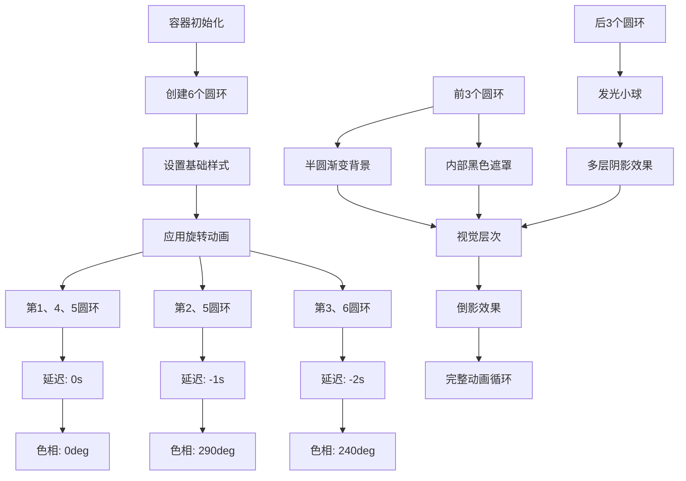

# CSS 旋转光环加载动画

## 简介

这是一个使用纯CSS实现的多层旋转光环加载动画效果。通过6个同心圆的不同旋转速度和颜色变化，创造出层次丰富的视觉效果。每个圆环都有独立的动画延迟和色相旋转，配合发光的小球和底部倒影，形成了一个极具科技感的加载指示器。

## 效果特点

### 视觉特性

- **多层旋转**: 6个同心圆以不同的时间延迟旋转
- **色彩变化**: 通过hue-rotate滤镜实现颜色渐变
- **发光效果**: 小球具有多层box-shadow发光效果
- **倒影特效**: 使用-webkit-box-reflect创建底部倒影
- **渐变背景**: 半圆形渐变背景增强视觉层次

### 技术特性

- **纯CSS实现**: 无需JavaScript，性能优异
- **CSS滤镜**: 使用hue-rotate实现颜色变化
- **伪元素**: 利用::before创建半圆渐变背景
- **动画延迟**: 通过animation-delay创建错位旋转效果

## 工作原理



## 效果演示

<demo react="react/RotatingRingLoader/index.tsx" 
:reactFiles="['react/RotatingRingLoader/index.tsx','react/RotatingRingLoader/index.scss']" 
/>

## 核心实现原理

### 基础实现方案

**核心思路**：

- 创建6个同心圆，前3个使用半圆渐变背景，后3个使用发光小球
- 通过animation-delay设置不同的旋转时间偏移
- 使用hue-rotate滤镜为不同圆环设置不同颜色
- 利用-webkit-box-reflect创建底部倒影效果

**优点**：

- 纯CSS实现，性能优异
- 视觉效果丰富，层次感强
- 代码简洁，易于理解和修改
- 兼容性好，支持现代浏览器

**适用场景**：

- 页面加载指示器
- 数据处理等待动画
- 科技感界面装饰
- 品牌展示动画

### 核心CSS实现

```css
/* 容器基础样式 */
.loader {
    position: relative;
    display: flex;
    justify-content: center;
    align-items: center;
    width: 100%;
    height: 200px;
    -webkit-box-reflect: below 0px linear-gradient(transparent, transparent, #0005);
}

/* 圆环基础样式 */
.loader .circle {
    position: absolute;
    width: 200px;
    height: 200px;
    border-radius: 50%;
    animation: animate 3s linear infinite;
}

/* 旋转动画 */
@keyframes animate {
    0% { transform: rotate(0deg); }
    100% { transform: rotate(360deg); }
}

/* 不同圆环的延迟和颜色 */
.loader .circle:nth-child(2),
.loader .circle:nth-child(4) {
    animation-delay: -1s;
    filter: hue-rotate(290deg);
}

.loader .circle:nth-child(3),
.loader .circle:nth-child(6) {
    animation-delay: -2s;
    filter: hue-rotate(240deg);
}
```

### 核心HTML结构

```html
<div class="loader">
    <div class="circle"><span></span></div>
    <div class="circle"><span></span></div>
    <div class="circle"><span></span></div>
    <div class="circle"><i></i></div>
    <div class="circle"><i></i></div>
    <div class="circle"><i></i></div>
</div>
```

## 参数配置选项

| 参数名称 | 类型 | 默认值 | 说明 | 可选值 |
|---------|------|--------|------|--------|
| **circleSize** | number | 200 | 圆环尺寸(px) | 100-400 |
| **animationDuration** | number | 3 | 动画持续时间(s) | 1-10 |
| **ballSize** | number | 20 | 发光球尺寸(px) | 10-40 |
| **glowIntensity** | number | 100 | 发光强度(px) | 50-200 |
| **primaryColor** | string | '#00ff99' | 主要颜色 | 任意颜色值 |
| **hueRotate1** | number | 290 | 第2、5圆环色相偏移(deg) | 0-360 |
| **hueRotate2** | number | 240 | 第3、6圆环色相偏移(deg) | 0-360 |
| **reflectionOpacity** | number | 0.3 | 倒影透明度 | 0-1 |
| **backgroundColor** | string | '#000000' | 背景颜色 | 任意颜色值 |
| **innerMaskSize** | number | 20 | 内部遮罩尺寸(px) | 10-50 |
| **gradientOpacity** | number | 0.33 | 渐变透明度 | 0-1 |
| **shadowLayers** | number | 10 | 阴影层数 | 5-15 |

## 实现方案对比

| 方案 | 优点 | 缺点 | 适用场景 |
|------|------|------|----------|
| **纯CSS动画** | 性能好，代码简洁 | 效果相对固定 | 简单加载动画 |
| **CSS + JavaScript** | 可控性强，交互丰富 | 复杂度增加 | 复杂交互动画 |
| **Canvas绘制** | 效果灵活多样 | 性能开销大 | 复杂图形动画 |
| **SVG动画** | 矢量图形，可缩放 | 复杂度中等 | 图标动画效果 |

## 高级功能

### 功能1：动态配置系统

```typescript
interface RotatingRingConfig {
  circleSize: number;
  animationDuration: number;
  ballSize: number;
  glowIntensity: number;
  primaryColor: string;
  hueRotate1: number;
  hueRotate2: number;
  reflectionOpacity: number;
  backgroundColor: string;
  innerMaskSize: number;
  gradientOpacity: number;
  shadowLayers: number;
}

const useRotatingRingConfig = (initialConfig: RotatingRingConfig) => {
  const [config, setConfig] = useState(initialConfig);
  
  const updateConfig = (newConfig: Partial<RotatingRingConfig>) => {
    setConfig(prev => ({ ...prev, ...newConfig }));
  };
  
  return { config, updateConfig };
};
```

### 功能2：圆环生成器

```typescript
const generateCircles = (count: number = 6) => {
  return Array.from({ length: count }, (_, index) => ({
    id: index,
    type: index < 3 ? 'gradient' : 'ball',
    animationDelay: getAnimationDelay(index),
    hueRotate: getHueRotate(index),
    zIndex: index < 3 ? 1 : 100
  }));
};

const getAnimationDelay = (index: number): number => {
  if (index === 1 || index === 3) return -1;
  if (index === 2 || index === 5) return -2;
  return 0;
};

const getHueRotate = (index: number): number => {
  if (index === 1 || index === 3) return 290;
  if (index === 2 || index === 5) return 240;
  return 0;
};
```

### 功能3：发光效果生成器

```typescript
const generateGlowShadows = (
  color: string, 
  intensity: number, 
  layers: number
): string => {
  const shadows = [];
  for (let i = 1; i <= layers; i++) {
    const blur = i * (intensity / layers);
    shadows.push(`0 0 ${blur}px ${color}`);
  }
  return shadows.join(', ');
};
```

### 功能4：主题预设系统

```typescript
interface ThemePreset {
  name: string;
  primaryColor: string;
  backgroundColor: string;
  hueRotate1: number;
  hueRotate2: number;
}

const themePresets: ThemePreset[] = [
  { 
    name: 'Neon Green', 
    primaryColor: '#00ff99', 
    backgroundColor: '#000000',
    hueRotate1: 290,
    hueRotate2: 240
  },
  { 
    name: 'Electric Blue', 
    primaryColor: '#00aaff', 
    backgroundColor: '#0a0a0a',
    hueRotate1: 180,
    hueRotate2: 120
  },
  { 
    name: 'Cyber Purple', 
    primaryColor: '#aa00ff', 
    backgroundColor: '#0f0a0f',
    hueRotate1: 60,
    hueRotate2: 30
  },
  { 
    name: 'Fire Orange', 
    primaryColor: '#ff6600', 
    backgroundColor: '#1a0a00',
    hueRotate1: 45,
    hueRotate2: 90
  }
];