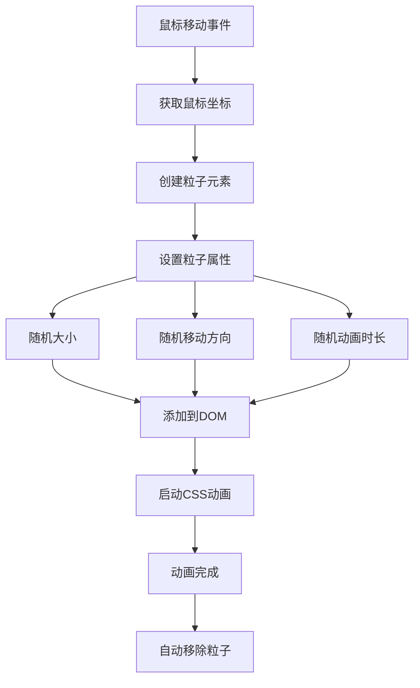

# 粒子背景效果

## 简介

粒子背景效果是一种基于鼠标移动的动态视觉效果，当用户移动鼠标时，会在鼠标轨迹上生成发光的粒子，这些粒子具有随机的大小、移动方向和生命周期，创造出梦幻般的视觉体验。

## 效果特点

### 视觉特性

- **动态生成**: 粒子跟随鼠标移动实时生成
- **随机属性**: 每个粒子具有随机的大小、方向和持续时间
- **发光效果**: 粒子具有蓝色发光边框和阴影效果
- **自然消散**: 粒子在动画结束后自动移除

### 技术特性

- **高性能**: 使用CSS动画和自动清理机制
- **响应式**: 适配不同屏幕尺寸
- **可配置**: 支持自定义粒子属性和动画参数
- **轻量级**: 纯JavaScript实现，无依赖

## 工作原理



## 效果演示

<demo react="react/ParticleBackground/index.tsx" 
:reactFiles="['react/ParticleBackground/index.tsx','react/ParticleBackground/index.scss']" 
/>

## 核心实现原理

### 基础实现方案

**核心思路**：

- 监听 `mousemove` 事件获取鼠标坐标
- 动态创建粒子DOM元素并设置初始位置
- 使用CSS自定义属性控制粒子移动方向
- 通过 `setTimeout` 在动画结束后清理粒子

**优点**：

- 实现简单，代码量少
- 性能良好，使用CSS动画
- 视觉效果出色，用户体验佳
- 兼容性好，支持现代浏览器

**适用场景**：

- 网站背景装饰效果
- 交互式展示页面
- 游戏界面特效
- 创意设计项目

### 粒子创建核心代码

```javascript
function createParticle(x, y) {
    let particle = document.createElement('div');
    particle.classList.add('particle');
    
    // 设置粒子位置
    particle.style.left = `${x}px`;
    particle.style.top = `${y}px`;
    
    // 随机移动方向
    let moveX = (Math.random() - 0.5) * 400;
    let moveY = (Math.random() - 0.5) * 400;
    
    particle.style.setProperty('--move-x', `${moveX}px`);
    particle.style.setProperty('--move-y', `${moveY}px`);
    
    // 随机大小和动画时长
    let size = Math.random() * 6 + 2;
    particle.style.width = `${size}px`;
    particle.style.height = `${size}px`;
    
    let duration = Math.random() * 3 + 2;
    particle.style.animationDuration = `${duration}s`;
    
    // 添加到页面并设置自动清理
    document.body.appendChild(particle);
    setTimeout(() => {
        particle.remove();
    }, duration * 1000);
}
```

### 事件监听实现

```javascript
document.addEventListener('mousemove', e => {
    createParticle(e.clientX, e.clientY);
});
```

## 参数配置选项

| 参数名称 | 类型 | 默认值 | 说明 |
|---------|------|--------|------|
| `particleSize` | `number` | `2-8` | 粒子大小范围（像素） |
| `moveRange` | `number` | `400` | 粒子移动范围（像素） |
| `duration` | `number` | `2-5` | 动画持续时间范围（秒） |
| `particleColor` | `string` | `#fff` | 粒子颜色 |
| `glowColor` | `string` | `#1235f4` | 发光颜色 |
| `frequency` | `number` | `1` | 粒子生成频率（每次鼠标移动生成的粒子数） |

## 高级功能

### 功能 1：粒子轨迹优化

```typescript
const useParticleTrail = (frequency: number = 1) => {
    const lastPosition = useRef({ x: 0, y: 0 });
    
    const createParticleTrail = (x: number, y: number) => {
        const distance = Math.sqrt(
            Math.pow(x - lastPosition.current.x, 2) + 
            Math.pow(y - lastPosition.current.y, 2)
        );
        
        // 根据移动距离调整粒子数量
        const particleCount = Math.min(Math.floor(distance / 20), frequency);
        
        for (let i = 0; i < particleCount; i++) {
            createParticle(x, y);
        }
        
        lastPosition.current = { x, y };
    };
    
    return createParticleTrail;
};
```

### 功能 2：性能优化

```typescript
const useParticlePool = (poolSize: number = 50) => {
    const pool = useRef<HTMLDivElement[]>([]);
    const activeParticles = useRef<Set<HTMLDivElement>>(new Set());
    
    const getParticle = (): HTMLDivElement => {
        if (pool.current.length > 0) {
            return pool.current.pop()!;
        }
        
        const particle = document.createElement('div');
        particle.className = 'particle';
        return particle;
    };
    
    const releaseParticle = (particle: HTMLDivElement) => {
        activeParticles.current.delete(particle);
        particle.remove();
        
        if (pool.current.length < poolSize) {
            // 重置粒子状态
            particle.style.opacity = '1';
            particle.style.transform = 'translate(0, 0) scale(1)';
            pool.current.push(particle);
        }
    };
    
    return { getParticle, releaseParticle };
};
```

### 功能 3：主题定制

```typescript
interface ParticleTheme {
    backgroundColor: string;
    particleColor: string;
    glowColor: string;
    shadowColor: string;
}

const themes: Record<string, ParticleTheme> = {
    blue: {
        backgroundColor: '#00040d',
        particleColor: '#fff',
        glowColor: '#1235f4',
        shadowColor: '#121212'
    },
    purple: {
        backgroundColor: '#0d0015',
        particleColor: '#fff',
        glowColor: '#8b5cf6',
        shadowColor: '#1a1a1a'
    },
    green: {
        backgroundColor: '#001a0d',
        particleColor: '#fff',
        glowColor: '#10b981',
        shadowColor: '#0f1419'
    }
};
```

## 性能优化

### 1. 粒子数量控制

```typescript
const useParticleLimit = (maxParticles: number = 100) => {
    const particleCount = useRef(0);
    
    const canCreateParticle = (): boolean => {
        return particleCount.current < maxParticles;
    };
    
    const incrementCount = () => {
        particleCount.current++;
    };
    
    const decrementCount = () => {
        particleCount.current = Math.max(0, particleCount.current - 1);
    };
    
    return { canCreateParticle, incrementCount, decrementCount };
};
```

### 2. 事件节流

```typescript
const useThrottledMouseMove = (delay: number = 16) => {
    const lastCall = useRef(0);
    
    return useCallback((callback: (e: MouseEvent) => void) => {
        return (e: MouseEvent) => {
            const now = Date.now();
            if (now - lastCall.current >= delay) {
                lastCall.current = now;
                callback(e);
            }
        };
    }, [delay]);
};
```

## 故障排除

### 1. 粒子不显示

**问题**: 粒子元素创建但不可见
**解决方案**:

- 检查CSS样式是否正确加载
- 确认容器元素的 `position` 属性
- 验证粒子的 `z-index` 层级
- 检查背景色是否遮挡粒子

### 2. 性能问题

**问题**: 大量粒子导致页面卡顿
**解决方案**:

- 限制同时存在的粒子数量
- 使用事件节流减少粒子生成频率
- 实现粒子对象池复用机制
- 优化CSS动画性能

### 3. 内存泄漏

**问题**: 长时间使用后内存占用增加
**解决方案**:

- 确保粒子动画结束后正确移除DOM元素
- 清理事件监听器和定时器
- 使用 `WeakMap` 存储粒子相关数据
- 定期检查和清理无效粒子

## 应用场景

### 1. 网站背景装饰

```typescript
// 全屏背景粒子效果
const FullScreenParticles = () => {
    return (
        <div className="full-screen-container">
            <ParticleBackground 
                frequency={2}
                particleSize={[3, 8]}
                theme="blue"
            />
            <div className="content">
                {/* 页面内容 */}
            </div>
        </div>
    );
};
```

### 2. 交互式展示

```typescript
// 产品展示页面
const ProductShowcase = () => {
    return (
        <div className="showcase-container">
            <ParticleBackground 
                frequency={1}
                followMouse={true}
                theme="purple"
            />
            <div className="product-content">
                {/* 产品信息 */}
            </div>
        </div>
    );
};
```

## 最佳实践

### 设计原则

1. **性能优先**: 控制粒子数量，避免过度消耗资源
2. **用户体验**: 确保粒子效果不影响页面交互
3. **视觉平衡**: 粒子效果应与整体设计风格协调
4. **响应式设计**: 在不同设备上保持良好的视觉效果

### 实施建议

1. **渐进增强**: 在支持的浏览器上启用效果
2. **可控制性**: 提供开关选项让用户控制效果
3. **性能监控**: 监控帧率和内存使用情况
4. **降级方案**: 在低性能设备上提供简化版本