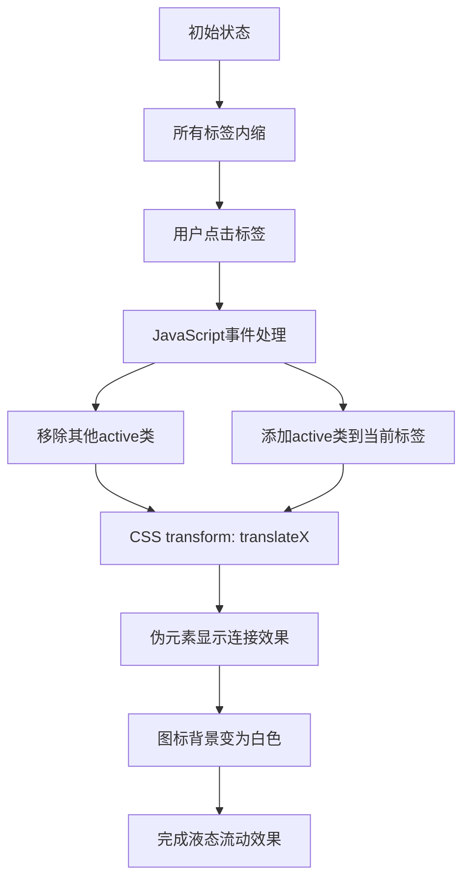

# 液态标签导航菜单

## 简介

液态标签导航菜单是一种现代化的侧边栏导航设计，通过CSS的transform变换和伪元素技巧，创造出标签在激活时向外"流出"的液态效果。结合JavaScript的交互控制，实现了流畅的导航切换体验。

## 效果特点

### 视觉特性

- **液态流动效果**: 激活的标签向外突出，形成液态流动的视觉效果
- **圆角设计**: 使用border-radius创造柔和的圆角外观
- **阴影层次**: 通过box-shadow营造立体感和深度
- **颜色过渡**: 激活状态下的颜色变化增强视觉反馈

### 技术特性

- **纯CSS动画**: 使用CSS transition实现平滑过渡
- **伪元素技巧**: 利用::before和::after创造液态连接效果
- **JavaScript交互**: 简洁的事件处理实现标签切换
- **响应式设计**: 适配不同屏幕尺寸

## 工作原理



## 效果演示

<demo react="react/LiquidTabNavigation/index.tsx" 
:reactFiles="['react/LiquidTabNavigation/index.tsx','react/LiquidTabNavigation/index.scss']" 
/>

## 核心实现原理

### 基础实现方案

**核心思路**：

- 使用CSS自定义属性`--clr`统一管理主题色
- 通过`transform: translateX()`实现标签的外移效果
- 利用伪元素`::before`和`::after`创造液态连接的视觉效果
- JavaScript控制`active`类的添加和移除

**优点**：

- 视觉效果独特，用户体验佳
- 代码结构清晰，易于理解和维护
- 性能优异，使用CSS硬件加速
- 扩展性好，易于添加新的导航项

**适用场景**：

- 移动端应用导航
- 桌面端侧边栏菜单
- 仪表板导航系统
- 创意网站导航设计

### 液态效果核心代码

```css
.navigation ul li.active {
  transform: translateX(35px);
}

.navigation ul li::before {
  content: '';
  position: absolute;
  right: 18px;
  top: -13.5px;
  width: 20px;
  height: 20px;
  background: transparent;
  box-shadow: -5px 5px var(--clr);
  border-bottom-left-radius: 20px;
}

.navigation ul li::after {
  content: '';
  position: absolute;
  right: 18.5px;
  bottom: -19px;
  width: 20px;
  height: 20px;
  background: transparent;
  box-shadow: -5px -5px var(--clr);
  border-top-left-radius: 20px;
}
```

### JavaScript交互控制

```javascript
const list = document.querySelectorAll('.navigation li');

function activeLink() {
  list.forEach((item) => item.classList.remove('active'));
  this.classList.add('active');
}

list.forEach((item) => 
  item.addEventListener('click', activeLink)
);
```

## 参数配置选项

| 参数名称 | 类型 | 默认值 | 说明 |
|---------|------|--------|------|
| `primaryColor` | `string` | `#00a2ea` | 主题色彩 |
| `backgroundColor` | `string` | `#223f4d` | 背景颜色 |
| `navWidth` | `number` | `80` | 导航栏宽度（像素） |
| `itemHeight` | `number` | `60` | 导航项高度（像素） |
| `itemGap` | `number` | `10` | 导航项间距（像素） |
| `borderRadius` | `number` | `80` | 导航栏圆角（像素） |
| `translateDistance` | `number` | `35` | 激活时外移距离（像素） |
| `transitionDuration` | `number` | `0.5` | 动画过渡时间（秒） |
| `iconSize` | `string` | `1.75em` | 图标大小 |
| `shadowBlur` | `number` | `10` | 阴影模糊度（像素） |

## 高级功能

### 功能 1：动态导航项管理

```typescript
interface NavigationItem {
  id: string;
  icon: string;
  label: string;
  href: string;
  active?: boolean;
}

const useNavigationItems = (initialItems: NavigationItem[]) => {
  const [items, setItems] = useState(initialItems);
  
  const setActiveItem = (id: string) => {
    setItems(prev => prev.map(item => ({
      ...item,
      active: item.id === id
    })));
  };
  
  const addItem = (item: NavigationItem) => {
    setItems(prev => [...prev, item]);
  };
  
  const removeItem = (id: string) => {
    setItems(prev => prev.filter(item => item.id !== id));
  };
  
  return { items, setActiveItem, addItem, removeItem };
};
```

### 功能 2：主题配置系统

```typescript
interface NavigationTheme {
  primaryColor: string;
  backgroundColor: string;
  textColor: string;
  shadowColor: string;
  activeTextColor: string;
}

const themes: Record<string, NavigationTheme> = {
  blue: {
    primaryColor: '#00a2ea',
    backgroundColor: '#223f4d',
    textColor: '#ffffff',
    shadowColor: 'rgba(0,0,0,0.25)',
    activeTextColor: '#00a2ea'
  },
  purple: {
    primaryColor: '#8b5cf6',
    backgroundColor: '#1e1b4b',
    textColor: '#ffffff',
    shadowColor: 'rgba(0,0,0,0.25)',
    activeTextColor: '#8b5cf6'
  },
  green: {
    primaryColor: '#10b981',
    backgroundColor: '#064e3b',
    textColor: '#ffffff',
    shadowColor: 'rgba(0,0,0,0.25)',
    activeTextColor: '#10b981'
  }
};
```

### 功能 3：动画增强

```typescript
const useEnhancedAnimation = () => {
  const [isAnimating, setIsAnimating] = useState(false);
  
  const triggerAnimation = useCallback((callback?: () => void) => {
    setIsAnimating(true);
    
    requestAnimationFrame(() => {
      callback?.();
      setTimeout(() => setIsAnimating(false), 500);
    });
  }, []);
  
  return { isAnimating, triggerAnimation };
};
```

## 实现方案对比

| 方案 | 优点 | 缺点 | 适用场景 |
|------|------|------|----------|
| **纯CSS** | 性能最佳，代码简洁 | 交互有限 | 静态导航 |
| **CSS + 原生JS** | 轻量级，兼容性好 | 功能相对简单 | 简单交互 |
| **React组件** | 组件化，状态管理 | 体积较大 | 复杂应用 |
| **Vue组件** | 响应式，易开发 | 框架依赖 | Vue项目 |

## 性能优化

### 1. CSS优化

```css
.navigation ul li {
  will-change: transform;
  transform: translateZ(0);
}

.navigation ul li a .icon::before {
  will-change: opacity;
}
```

### 2. JavaScript优化

```typescript
const useThrottledClick = (callback: Function, delay: number = 100) => {
  const lastCall = useRef(0);
  
  return useCallback((...args: any[]) => {
    const now = Date.now();
    if (now - lastCall.current >= delay) {
      lastCall.current = now;
      callback(...args);
    }
  }, [callback, delay]);
};
```

### 3. 内存管理

```typescript
const useLiquidNavigation = () => {
  const navigationRef = useRef<HTMLDivElement>(null);
  
  useEffect(() => {
    const handleResize = () => {
      // 响应式调整
    };
    
    window.addEventListener('resize', handleResize);
    return () => window.removeEventListener('resize', handleResize);
  }, []);
  
  return navigationRef;
};
```

## 故障排除

### 1. 液态效果不显示

**问题**: 伪元素的液态连接效果不可见
**解决方案**:

- 检查伪元素的position和z-index设置
- 确认box-shadow颜色与主题色一致
- 验证border-radius值的正确性
- 检查父元素的overflow设置

### 2. 动画卡顿

**问题**: 标签切换时动画不流畅
**解决方案**:

- 使用transform代替margin或position变化
- 启用CSS硬件加速
- 减少同时进行的动画数量
- 优化transition-timing-function

### 3. 点击事件失效

**问题**: 导航项点击无响应
**解决方案**:

- 检查事件监听器的绑定
- 确认DOM元素选择器正确
- 验证事件冒泡和阻止默认行为
- 检查CSS的pointer-events设置

## 应用场景

### 1. 移动端应用导航

```typescript
const MobileNavigation = () => {
  const navigationItems = [
    { id: 'home', icon: 'home-outline', label: '首页' },
    { id: 'profile', icon: 'person-outline', label: '个人' },
    { id: 'messages', icon: 'chatbubble-outline', label: '消息' },
    { id: 'camera', icon: 'camera-outline', label: '相机' },
    { id: 'settings', icon: 'settings-outline', label: '设置' }
  ];
  
  return (
    <LiquidTabNavigation 
      items={navigationItems}
      theme="blue"
      position="left"
      onItemClick={(id) => console.log('Navigate to:', id)}
    />
  );
};
```

### 2. 仪表板侧边栏

```typescript
const DashboardSidebar = () => {
  return (
    <LiquidTabNavigation 
      items={dashboardItems}
      theme="purple"
      size="large"
      showLabels={true}
    />
  );
};
```

## 最佳实践

### 设计原则

1. **视觉一致性**: 保持导航样式与整体设计风格协调
2. **交互反馈**: 提供清晰的激活状态指示
3. **性能优先**: 使用CSS硬件加速优化动画性能
4. **可访问性**: 支持键盘导航和屏幕阅读器

### 实施建议

1. **渐进增强**: 为不支持CSS3的浏览器提供降级方案
2. **响应式设计**: 在不同设备上调整导航尺寸和布局
3. **用户测试**: 验证导航的易用性和直观性
4. **性能监控**: 监控动画性能，确保流畅体验