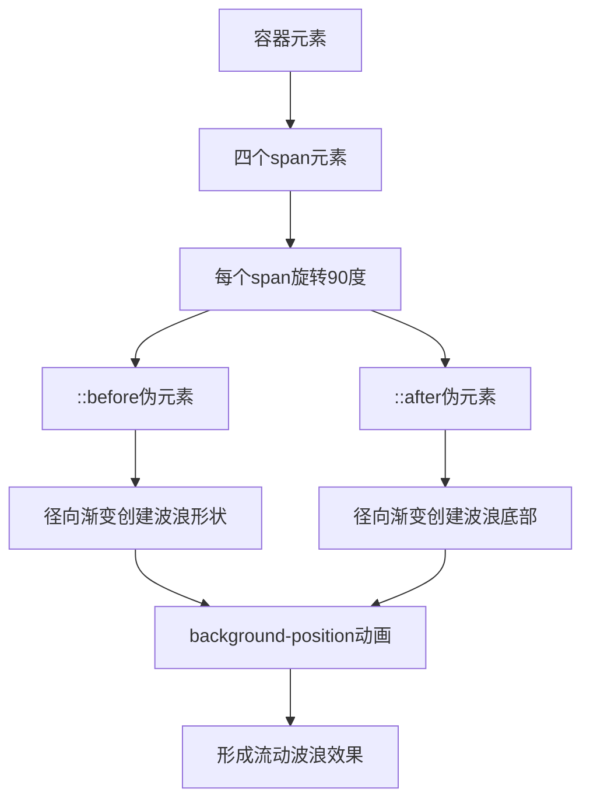

# 动画波浪边缘

## 简介

动画波浪边缘是一种基于CSS径向渐变和关键帧动画的视觉效果，通过巧妙运用`radial-gradient`创造出波浪形状，结合`background-position`动画实现流动效果，为容器元素添加动态的装饰边框。

## 效果特点

### 视觉特性

- **波浪形状**: 使用径向渐变创造自然的波浪边缘
- **流动动画**: 背景位置的连续变化形成流动效果
- **多边框设计**: 四个边框同时展示波浪动画
- **颜色可配置**: 支持自定义主题色和波浪颜色

### 技术特性

- **纯CSS实现**: 无需JavaScript，性能优异
- **径向渐变技术**: 利用radial-gradient创造波浪形状
- **CSS变量**: 使用自定义属性管理颜色和参数
- **旋转布局**: 通过rotate实现四边框效果

## 工作原理



## 效果演示

<demo react="react/AnimatedWaveBorder/index.tsx" 
:reactFiles="['react/AnimatedWaveBorder/index.tsx','react/AnimatedWaveBorder/index.scss']" 
/>

## 核心实现原理

### 基础实现方案

**核心思路**：

- 使用四个`span`元素分别代表四个边框
- 通过`rotate`属性将span元素旋转90度的倍数
- 利用`::before`和`::after`伪元素创建波浪形状
- 使用`radial-gradient`径向渐变绘制波浪图案
- 通过`background-position`动画实现流动效果

**优点**：

- 纯CSS实现，性能优异
- 视觉效果独特，装饰性强
- 代码结构清晰，易于理解
- 可配置性强，支持多种自定义

**适用场景**：

- 卡片装饰边框
- 按钮悬停效果
- 容器装饰元素
- 创意设计项目

### 波浪形状核心代码

```css
.box span::before {
  content: '';
  position: absolute;
  bottom: 0;
  width: 100%;
  height: 15px;
  background-image: radial-gradient(
    circle at 10px 15px,
    #333 12px,
    transparent 13px
  );
  background-repeat: repeat;
  background-size: 40px 20px;
  animation: animate 0.5s linear infinite;
}

.box span::after {
  content: '';
  position: absolute;
  bottom: 0;
  width: 100%;
  height: 10px;
  background-image: radial-gradient(
    circle at 10px -5px,
    transparent 12px,
    #333 13px
  );
  background-repeat: repeat;
  background-size: 20px 20px;
  animation: animate 0.5s linear infinite;
}
```

### 流动动画实现

```css
@keyframes animate {
  0% {
    background-position: 0 0;
  }
  100% {
    background-position: 40px 0;
  }
}
```

## 参数配置选项

| 参数名称 | 类型 | 默认值 | 说明 |
|---------|------|--------|------|
| `primaryColor` | `string` | `#2196f3` | 容器主题色 |
| `waveColor` | `string` | `#333` | 波浪颜色 |
| `containerSize` | `number` | `360` | 容器尺寸（像素） |
| `waveHeight` | `number` | `15` | 波浪高度（像素） |
| `waveWidth` | `number` | `40` | 波浪宽度（像素） |
| `animationSpeed` | `number` | `0.5` | 动画速度（秒） |
| `borderRadius` | `number` | `10` | 内部圆角（像素） |
| `innerPadding` | `number` | `30` | 内部间距（像素） |
| `waveOpacity` | `number` | `0.8` | 波浪透明度 |
| `animationDirection` | `string` | `normal` | 动画方向 |

## 高级功能

### 功能 1：多容器管理

```typescript
interface WaveContainer {
  id: string;
  color: string;
  size: number;
  position: { x: number; y: number };
  active: boolean;
}

const useWaveContainers = (initialContainers: WaveContainer[]) => {
  const [containers, setContainers] = useState(initialContainers);
  
  const updateContainer = (id: string, updates: Partial<WaveContainer>) => {
    setContainers(prev => prev.map(container => 
      container.id === id ? { ...container, ...updates } : container
    ));
  };
  
  const addContainer = (container: WaveContainer) => {
    setContainers(prev => [...prev, container]);
  };
  
  const removeContainer = (id: string) => {
    setContainers(prev => prev.filter(container => container.id !== id));
  };
  
  return { containers, updateContainer, addContainer, removeContainer };
};
```

### 功能 2：动画控制系统

```typescript
interface AnimationConfig {
  speed: number;
  direction: 'normal' | 'reverse' | 'alternate';
  playState: 'running' | 'paused';
  iterationCount: number | 'infinite';
}

const useAnimationControl = () => {
  const [config, setConfig] = useState<AnimationConfig>({
    speed: 0.5,
    direction: 'normal',
    playState: 'running',
    iterationCount: 'infinite'
  });
  
  const updateAnimation = (updates: Partial<AnimationConfig>) => {
    setConfig(prev => ({ ...prev, ...updates }));
  };
  
  const togglePlayState = () => {
    setConfig(prev => ({
      ...prev,
      playState: prev.playState === 'running' ? 'paused' : 'running'
    }));
  };
  
  return { config, updateAnimation, togglePlayState };
};
```

### 功能 3：主题预设系统

```typescript
interface WaveTheme {
  name: string;
  primaryColor: string;
  waveColor: string;
  backgroundColor: string;
  innerColor: string;
}

const waveThemes: Record<string, WaveTheme> = {
  ocean: {
    name: '海洋',
    primaryColor: '#2196f3',
    waveColor: '#1976d2',
    backgroundColor: '#e3f2fd',
    innerColor: 'rgba(33, 150, 243, 0.1)'
  },
  sunset: {
    name: '日落',
    primaryColor: '#ff5722',
    waveColor: '#d84315',
    backgroundColor: '#fbe9e7',
    innerColor: 'rgba(255, 87, 34, 0.1)'
  },
  forest: {
    name: '森林',
    primaryColor: '#4caf50',
    waveColor: '#2e7d32',
    backgroundColor: '#e8f5e8',
    innerColor: 'rgba(76, 175, 80, 0.1)'
  },
  night: {
    name: '夜空',
    primaryColor: '#9c27b0',
    waveColor: '#6a1b9a',
    backgroundColor: '#f3e5f5',
    innerColor: 'rgba(156, 39, 176, 0.1)'
  }
};
```

## 实现方案对比

| 方案 | 优点 | 缺点 | 适用场景 |
|------|------|------|----------|
| **径向渐变** | 形状自然，性能好 | 复杂度高 | 波浪效果 |
| **SVG路径** | 精确控制，可缩放 | 代码复杂 | 复杂图形 |
| **Canvas绘制** | 灵活性强 | 性能开销大 | 动态图形 |
| **CSS Clip-path** | 简洁高效 | 兼容性限制 | 几何图形 |

## 性能优化

### 1. GPU加速

```css
.wave-container {
  transform: translateZ(0);
  will-change: background-position;
}

.wave-border {
  backface-visibility: hidden;
  perspective: 1000px;
}
```

### 2. 动画优化

```typescript
const useOptimizedAnimation = () => {
  const [isVisible, setIsVisible] = useState(true);
  const observerRef = useRef<IntersectionObserver>();
  
  useEffect(() => {
    observerRef.current = new IntersectionObserver(
      ([entry]) => {
        setIsVisible(entry.isIntersecting);
      },
      { threshold: 0.1 }
    );
    
    return () => observerRef.current?.disconnect();
  }, []);
  
  return { isVisible, observerRef };
};
```

### 3. 内存管理

```typescript
const useWaveAnimation = (enabled: boolean) => {
  const animationRef = useRef<number>();
  
  useEffect(() => {
    if (!enabled) {
      if (animationRef.current) {
        cancelAnimationFrame(animationRef.current);
      }
      return;
    }
    
    const animate = () => {
      // 动画逻辑
      animationRef.current = requestAnimationFrame(animate);
    };
    
    animate();
    
    return () => {
      if (animationRef.current) {
        cancelAnimationFrame(animationRef.current);
      }
    };
  }, [enabled]);
};
```

## 故障排除

### 1. 波浪形状不正确

**问题**: 径向渐变创建的波浪形状异常
**解决方案**:

- 检查径向渐变的圆心位置参数
- 确认渐变半径设置正确
- 验证background-size与波浪宽度匹配
- 调整透明度和颜色值

### 2. 动画不流畅

**问题**: 波浪流动动画出现卡顿
**解决方案**:

- 使用transform代替background-position
- 启用GPU硬件加速
- 减少同时运行的动画数量
- 优化动画时间函数

### 3. 边框对齐问题

**问题**: 四个边框的波浪不对齐
**解决方案**:

- 检查旋转角度计算
- 确认伪元素定位正确
- 验证background-size一致性
- 调整动画延迟时间

## 应用场景

### 1. 装饰性边框

```typescript
const DecorativeCard = ({ children }: { children: React.ReactNode }) => {
  return (
    <div className="decorative-container">
      <AnimatedWaveBorder 
        primaryColor="#2196f3"
        size={300}
        theme="ocean"
      >
        {children}
      </AnimatedWaveBorder>
    </div>
  );
};
```

### 2. 交互式按钮

```typescript
const WaveButton = ({ onClick, children }: ButtonProps) => {
  const [isHovered, setIsHovered] = useState(false);
  
  return (
    <button
      onMouseEnter={() => setIsHovered(true)}
      onMouseLeave={() => setIsHovered(false)}
      onClick={onClick}
    >
      <AnimatedWaveBorder 
        active={isHovered}
        animationSpeed={isHovered ? 0.3 : 0.8}
      >
        {children}
      </AnimatedWaveBorder>
    </button>
  );
};
```

## 最佳实践

### 设计原则

1. **视觉平衡**: 波浪效果不应过于抢眼，影响内容阅读
2. **性能考虑**: 控制同时运行的动画数量
3. **主题一致**: 波浪颜色应与整体设计风格协调
4. **响应式设计**: 在不同设备上调整波浪尺寸

### 实施建议

1. **渐进增强**: 为不支持CSS3的浏览器提供静态边框
2. **用户偏好**: 提供动画开关选项
3. **性能监控**: 监控动画对页面性能的影响
4. **可访问性**: 确保动画不影响用户体验