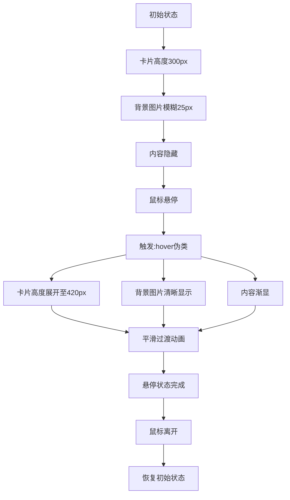

# 卡片设计带悬停效果

## 简介

卡片设计带悬停效果是一种现代化的 UI 设计效果，通过 CSS 实现卡片在悬停时的高度展开、背景图片模糊消除和内容显示的动画效果。该效果利用 CSS 的 transform、filter 和 transition 属性，创造出流畅的视觉体验。

## 效果特点

### 视觉特性

- **外部圆角设计**: 卡片底部采用外部圆角效果，营造立体感
- **背景图片模糊**: 初始状态背景图片模糊，悬停时清晰显示
- **高度展开动画**: 悬停时卡片高度自动展开，显示更多内容
- **内容渐显效果**: 文字内容在悬停时逐渐显现

### 技术特性

- **纯 CSS 实现**: 无需 JavaScript，性能优异
- **响应式动画**: 平滑的过渡效果
- **可配置参数**: 支持自定义卡片尺寸、动画时长等
- **图片适配**: 支持不同尺寸的背景图片

## 工作原理



## 效果演示

<demo react="react/CardHoverEffect/CardHoverEffectDemo.tsx" 
:reactFiles="['react/CardHoverEffect/CardHoverEffectDemo.tsx','react/CardHoverEffect/index.tsx','react/CardHoverEffect/index.scss']" 
/>

## 核心实现原理

### 基础实现方案

**核心思路**：

- 使用 CSS 自定义属性`--img`控制背景图片
- 通过`filter: blur()`实现背景图片模糊效果
- 利用`:hover`伪类触发悬停状态
- 使用`height`变化实现卡片展开动画
- 通过`opacity`控制内容显示隐藏

**优点**：

- 纯 CSS 实现，性能优异
- 视觉效果现代化，符合当前设计趋势
- 代码简洁，易于维护和扩展
- 兼容性好，支持现代浏览器

**适用场景**：

- 产品展示卡片
- 文章预览卡片
- 作品集展示
- 服务介绍卡片

### 卡片容器核心代码

```css
.container .card {
	position: relative;
	width: 300px;
	height: 300px;
	background: #fff;
	border-radius: 40px;
	box-shadow: 0 20px 25px rgba(0, 0, 0, 0.25);
	transition: 0.5s;
	overflow: hidden;
}
```

### 背景图片模糊效果

```css
.container .card .imgBx {
	position: relative;
	width: 100%;
	height: 260px;
	background: var(--img);
	background-size: 100%;
	background-position: center;
	transition: 0.5s;
	filter: blur(25px);
}

.container .card:hover .imgBx {
	background-size: 110%;
	filter: blur(0px);
}
```

### 外部圆角设计

```css
.container .card .imgBx::before {
	content: '';
	position: absolute;
	bottom: -40px;
	width: 100%;
	height: 80px;
	border-radius: 40px;
	background: #fff;
}

.container .card .imgBx::after {
	content: '';
	position: absolute;
	right: 0;
	bottom: 40px;
	width: 80px;
	height: 80px;
	background: transparent;
	border-radius: 50%;
	box-shadow: 75px 70px 0 40px #fff;
}
```

### 内容显示动画

```css
.container .card .content {
	position: relative;
	top: -40px;
	z-index: 10;
	padding: 0 30px;
	transition: 0.5s;
}

.container .card .content p {
	position: relative;
	opacity: 0;
	transition: 0.5s;
	color: #333;
}

.container .card:hover .content p {
	opacity: 1;
}
```

## 参数配置选项

| 参数名称             | 类型     | 默认值             | 说明                       |
| -------------------- | -------- | ------------------ | -------------------------- |
| `cardWidth`          | `number` | `300`              | 卡片宽度（像素）           |
| `cardHeight`         | `number` | `300`              | 卡片初始高度（像素）       |
| `expandedHeight`     | `number` | `420`              | 悬停时卡片展开高度（像素） |
| `blurAmount`         | `number` | `25`               | 背景图片模糊程度（像素）   |
| `borderRadius`       | `number` | `40`               | 卡片圆角半径（像素）       |
| `transitionDuration` | `number` | `0.5`              | 动画过渡时间（秒）         |
| `contentPadding`     | `number` | `30`               | 内容区域内边距（像素）     |
| `imageHeight`        | `number` | `260`              | 背景图片高度（像素）       |
| `shadowColor`        | `string` | `rgba(0,0,0,0.25)` | 卡片阴影颜色               |
| `backgroundColor`    | `string` | `#fff`             | 卡片背景颜色               |

## 高级功能

### 功能 1：动态卡片数据

```typescript
interface CardData {
	id: string;
	title: string;
	subtitle: string;
	description: string;
	imageUrl: string;
	link?: string;
}

const useCardData = (cards: CardData[]) => {
	const [cardList, setCardList] = useState(cards);

	const updateCard = (id: string, updates: Partial<CardData>) => {
		setCardList(prev => prev.map(card => (card.id === id ? { ...card, ...updates } : card)));
	};

	const addCard = (card: CardData) => {
		setCardList(prev => [...prev, card]);
	};

	const removeCard = (id: string) => {
		setCardList(prev => prev.filter(card => card.id !== id));
	};

	return { cardList, updateCard, addCard, removeCard };
};
```

### 功能 2：主题配置

```typescript
interface CardTheme {
	backgroundColor: string;
	textColor: string;
	shadowColor: string;
	borderRadius: number;
	transitionDuration: number;
}

const themes: Record<string, CardTheme> = {
	light: {
		backgroundColor: '#fff',
		textColor: '#333',
		shadowColor: 'rgba(0,0,0,0.25)',
		borderRadius: 40,
		transitionDuration: 0.5
	},
	dark: {
		backgroundColor: '#2a2a2a',
		textColor: '#fff',
		shadowColor: 'rgba(0,0,0,0.4)',
		borderRadius: 30,
		transitionDuration: 0.3
	},
	colorful: {
		backgroundColor: '#ff6b6b',
		textColor: '#fff',
		shadowColor: 'rgba(0,0,0,0.3)',
		borderRadius: 50,
		transitionDuration: 0.7
	}
};
```

### 功能 3：交互增强

```typescript
const useCardInteraction = () => {
	const [hoveredCard, setHoveredCard] = useState<string | null>(null);
	const [activeCard, setActiveCard] = useState<string | null>(null);
	const [isAnimating, setIsAnimating] = useState(false);

	const handleCardHover = (cardId: string) => {
		setHoveredCard(cardId);
		setIsAnimating(true);
	};

	const handleCardLeave = () => {
		setHoveredCard(null);
		setIsAnimating(false);
	};

	const handleCardClick = (cardId: string) => {
		setActiveCard(cardId);
		// 可以添加点击事件处理
	};

	return {
		hoveredCard,
		activeCard,
		isAnimating,
		handleCardHover,
		handleCardLeave,
		handleCardClick
	};
};
```

## 实现方案对比

| 方案          | 优点             | 缺点       | 适用场景   |
| ------------- | ---------------- | ---------- | ---------- |
| **纯 CSS**    | 性能好，代码简洁 | 交互有限   | 静态展示   |
| **CSS + JS**  | 交互丰富，可配置 | 复杂度增加 | 动态内容   |
| **CSS-in-JS** | 组件化，易维护   | 运行时开销 | React 项目 |
| **CSS 框架**  | 开箱即用         | 定制性差   | 快速原型   |

## 性能优化

### 1. GPU 加速

```css
.container .card {
	transform: translateZ(0);
	will-change: height, filter;
}
```

### 2. 图片懒加载

```typescript
const useLazyLoad = (imageUrl: string) => {
	const [loadedImage, setLoadedImage] = useState<string | null>(null);
	const [loading, setLoading] = useState(true);

	useEffect(() => {
		const img = new Image();
		img.onload = () => {
			setLoadedImage(imageUrl);
			setLoading(false);
		};
		img.src = imageUrl;
	}, [imageUrl]);

	return { loadedImage, loading };
};
```

### 3. 动画优化

```typescript
const useOptimizedAnimation = () => {
	const [isAnimating, setIsAnimating] = useState(false);

	const startAnimation = useCallback(() => {
		setIsAnimating(true);
		requestAnimationFrame(() => {
			setTimeout(() => setIsAnimating(false), 500);
		});
	}, []);

	return { isAnimating, startAnimation };
};
```

## 故障排除

### 1. 背景图片不显示

**问题**: 背景图片无法正常显示
**解决方案**:

- 检查图片路径是否正确
- 确保 CSS 自定义属性语法正确
- 验证图片文件格式和大小
- 添加图片加载失败的降级方案

### 2. 动画卡顿

**问题**: 过渡动画不流畅
**解决方案**:

- 使用 transform 代替 height 变化
- 启用 GPU 加速
- 减少同时动画的元素数量
- 优化 CSS 选择器性能

### 3. 外部圆角效果异常

**问题**: 外部圆角效果显示不正确
**解决方案**:

- 检查伪元素的定位和尺寸
- 确保父容器的 overflow 设置
- 验证 z-index 层级关系
- 调整 border-radius 值

## 应用场景

### 1. 产品展示

```typescript
const ProductShowcase = () => {
	const products = [
		{
			id: '1',
			title: 'New Design',
			subtitle: '2 Hours ago',
			description:
				'Lorem ipsum dolor sit amet consectetur adipisicing elit. Facere consequuntur magni assumenda distinctio nobis inventore iure?',
			imageUrl: '/images/product1.jpg'
		},
		{
			id: '2',
			title: 'CSS Only',
			subtitle: '5 Hours ago',
			description:
				'Lorem ipsum dolor sit amet consectetur adipisicing elit. Facere consequuntur magni assumenda distinctio nobis inventore iure?',
			imageUrl: '/images/product2.jpg'
		}
	];

	return (
		<div className="product-showcase">
			<h2>最新设计</h2>
			<CardHoverEffect
				cards={products}
				theme="light"
				onCardClick={id => console.log('Product clicked:', id)}
			/>
		</div>
	);
};
```

### 2. 文章预览

```typescript
const ArticlePreview = () => {
	return (
		<div className="article-section">
			<h2>热门文章</h2>
			<CardHoverEffect
				cards={articleData}
				cardWidth={350}
				cardHeight={280}
				theme="light"
				showReadMore={true}
			/>
		</div>
	);
};
```
