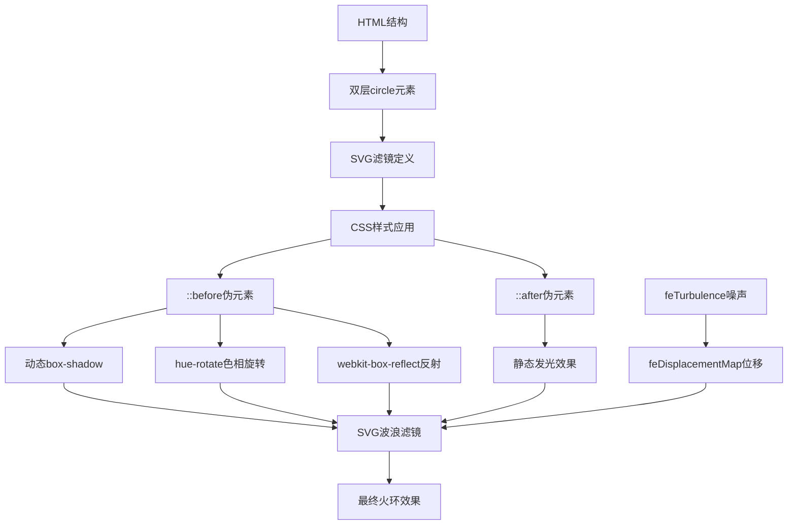

# CSS 火环效果

## 简介

CSS 火环效果是一种结合 CSS 动画和 SVG 滤镜技术的视觉特效，通过多层圆环叠加、动态阴影变化和 SVG 波浪扭曲滤镜，创造出逼真的火焰环形动画效果。该效果利用 CSS 的 box-shadow、filter 和 animation 属性，配合 SVG 的 feTurbulence 和 feDisplacementMap 滤镜，实现了动态的发光和扭曲效果。

## 效果特点

### 视觉特性

- **双层圆环设计**: 内外两层圆环叠加，营造层次感
- **动态发光效果**: 通过 box-shadow 实现内外发光动画
- **色彩变化**: 使用 hue-rotate 实现色相旋转动画
- **波浪扭曲**: SVG 滤镜创造火焰般的扭曲效果
- **反射效果**: webkit-box-reflect 实现地面反射

### 技术特性

- **纯 CSS+SVG 实现**: 无需 JavaScript，性能优异
- **动态滤镜**: SVG 滤镜实现复杂的视觉效果
- **可配置参数**: 支持自定义颜色、大小、动画速度等
- **现代浏览器支持**: 利用 CSS3 和 SVG 新特性

## 工作原理



## 效果演示

<demo react="react/FireRingEffect/FireRingEffectDemo.tsx" 
:reactFiles="['react/FireRingEffect/FireRingEffectDemo.tsx','react/FireRingEffect/index.tsx','react/FireRingEffect/index.scss']" 
/>

## 核心实现原理

### 基础实现方案

**核心思路**：

- 使用双层 div 元素创建圆环结构
- 通过::before 和::after 伪元素实现内外发光效果
- 利用 CSS 动画控制 box-shadow 的动态变化
- 使用 SVG 滤镜实现波浪扭曲效果
- 通过 webkit-box-reflect 添加反射效果

**优点**：

- 纯 CSS+SVG 实现，性能优异
- 视觉效果逼真，具有强烈的视觉冲击力
- 代码结构清晰，易于理解和修改
- 兼容现代浏览器

**适用场景**：

- 游戏界面特效
- 科幻主题网站
- 加载动画效果
- 装饰性视觉元素

### 圆环结构核心代码

```css
.circle {
	position: relative;
	width: 500px;
	height: 500px;
	filter: url(#wavy) blur(1px);
}

.circle::before {
	content: '';
	position: absolute;
	top: 100px;
	left: 100px;
	right: 100px;
	bottom: 100px;
	border: 20px solid #fff;
	border-radius: 50%;
	box-shadow: 0 0 50px #0f0, inset 0 0 50px #0f0;
	animation: animate 5s linear infinite;
}
```

### SVG 波浪滤镜

```html
<svg>
	<filter id="wavy">
		<feTurbulence x="0" y="0" baseFrequency="0.009" numOctaves="5" seed="2">
			<animate
				attributeName="baseFrequency"
				dur="60s"
				values="0.02;0.005;0.02"
				repeatCount="indefinite"
			/>
		</feTurbulence>
		<feDisplacementMap in="SourceGraphic" scale="30" />
	</filter>
</svg>
```

### 动画关键帧

```css
@keyframes animate {
	0% {
		box-shadow: 0 0 50px #0f0, inset 0 0 50px #0f0;
		filter: hue-rotate(0deg);
	}
	20% {
		box-shadow: 0 0 40px #0f0, inset 0 0 60px #0f0;
	}
	40% {
		box-shadow: 0 0 40px #0f0, inset 0 0 80px #0f0;
	}
	60% {
		box-shadow: 0 0 80px #0f0, i 0 80px #0f0;
	}
	80% {
		box-shadow: 0 0 100px #0f0, inset 0 0 100px #0f0;
	}
	100% {
		box-shadow: 0 0 50px #0f0, inset 0 0 50px #0f0;
		filter: hue-rotate(360deg);
	}
}
```

## 参数配置选项

| 参数名称              | 类型      | 默认值  | 说明                 |
| --------------------- | --------- | ------- | -------------------- |
| `ringSize`            | `number`  | `500`   | 火环外径大小（像素） |
| `ringWidth`           | `number`  | `20`    | 圆环边框宽度（像素） |
| `glowColor`           | `string`  | `#0f0`  | 发光颜色             |
| `animationDuration`   | `number`  | `5`     | 动画周期时长（秒）   |
| `turbulenceFrequency` | `number`  | `0.009` | 波浪扭曲频率         |
| `turbulenceOctaves`   | `number`  | `5`     | 噪声层数             |
| `displacementScale`   | `number`  | `30`    | 位移强度             |
| `blurAmount`          | `number`  | `1`     | 模糊程度（像素）     |
| `reflectionOpacity`   | `number`  | `0.2`   | 反射透明度           |
| `enableReflection`    | `boolean` | `true`  | 是否启用反射效果     |

## 高级功能

### 功能 1：动态颜色控制

```typescript
interface ColorConfig {
	primary: string;
	secondary?: string;
	enableHueRotation: boolean;
	hueRotationSpeed: number;
}

const useColorAnimation = (config: ColorConfig) => {
	const [currentHue, setCurrentHue] = useState(0);

	useEffect(() => {
		if (!config.enableHueRotation) return;

		const interval = setInterval(() => {
			setCurrentHue(prev => (prev + 1) % 360);
		}, (config.hueRotationSpeed * 1000) / 360);

		return () => clearInterval(interval);
	}, [config]);

	return { currentHue };
};
```

### 功能 2：动态尺寸调整

```typescript
interface SizeConfig {
	minSize: number;
	maxSize: number;
	pulseDuration: number;
	enablePulse: boolean;
}

const useSizeAnimation = (config: SizeConfig) => {
	const [currentSize, setCurrentSize] = useState(config.minSize);

	useEffect(() => {
		if (!config.enablePulse) return;

		const animate = () => {
			const time = Date.now() / 1000;
			const progress = (Math.sin((time * 2 * Math.PI) / config.pulseDuration) + 1) / 2;
			const size = config.minSize + (config.maxSize - config.minSize) * progress;
			setCurrentSize(size);
		};

		const interval = setInterval(animate, 16);
		return () => clearInterval(interval);
	}, [config]);

	return { currentSize };
};
```

### 功能 3：多重火环效果

```typescript
interface MultiRingConfig {
	ringCount: number;
	ringSpacing: number;
	staggerDelay: number;
	colors: string[];
}

const useMultiRing = (config: MultiRingConfig) => {
	const rings = useMemo(() => {
		return Array.from({ length: config.ringCount }, (_, index) => ({
			id: index,
			size: 300 + index * config.ringSpacing,
			color: config.colors[index % config.colors.length],
			delay: index * config.staggerDelay
		}));
	}, [config]);

	return { rings };
};
```

## 实现方案对比

| 方案            | 优点               | 缺点               | 适用场景       |
| --------------- | ------------------ | ------------------ | -------------- |
| **CSS+SVG**     | 性能好，效果逼真   | 浏览器兼容性要求高 | 现代浏览器项目 |
| **Canvas 绘制** | 兼容性好，可控性强 | 性能开销大         | 复杂动画需求   |
| **WebGL**       | 性能最佳，效果最好 | 开发复杂度高       | 高性能要求     |
| **CSS 动画**    | 简单易用           | 效果有限           | 简单装饰效果   |

## 性能优化

### 1. GPU 加速

```css
.circle {
	transform: translateZ(0);
	will-change: filter, box-shadow;
}
```

### 2. 动画优化

```typescript
const useOptimizedAnimation = () => {
	const [isVisible, setIsVisible] = useState(true);

	useEffect(() => {
		const handleVisibilityChange = () => {
			setIsVisible(!document.hidden);
		};

		document.addEventListener('visibilitychange', handleVisibilityChange);
		return () => document.removeEventListener('visibilitychange', handleVisibilityChange);
	}, []);

	return { isVisible };
};
```

### 3. 内存管理

```typescript
const useFireRingEffect = (config: FireRingConfig) => {
	const svgRef = useRef<SVGElement>(null);
	const animationRef = useRef<number>(0);

	useEffect(() => {
		const cleanup = () => {
			if (animationRef.current) {
				cancelAnimationFrame(animationRef.current);
			}
		};

		return cleanup;
	}, []);

	return { svgRef };
};
```

## 故障排除

### 1. SVG 滤镜不生效

**问题**: 波浪扭曲效果不显示
**解决方案**:

- 检查 SVG 滤镜 ID 是否正确引用
- 确保 SVG 元素在 DOM 中存在
- 验证浏览器对 SVG 滤镜的支持
- 添加浏览器前缀

### 2. 动画卡顿

**问题**: 火环动画不流畅
**解决方案**:

- 启用 GPU 加速
- 减少同时运行的动画数量
- 优化 CSS 选择器
- 使用 transform 代替其他属性变化

### 3. 反射效果异常

**问题**: webkit-box-reflect 不显示
**解决方案**:

- 检查浏览器兼容性
- 使用 CSS 伪元素替代方案
- 调整反射渐变参数
- 提供降级方案

## 应用场景

### 1. 游戏界面

```typescript
const GamePortal = () => {
	return (
		<div className="game-portal">
			<h1>传送门</h1>
			<FireRingEffect
				ringSize={400}
				glowColor="#ff6600"
				animationDuration={3}
				enableReflection={true}
			/>
			<button>进入游戏</button>
		</div>
	);
};
```

### 2. 加载动画

```typescript
const LoadingScreen = ({ isLoading }: { isLoading: boolean }) => {
	if (!isLoading) return null;

	return (
		<div className="loading-overlay">
			<FireRingEffect ringSize={200} glowColor="#00ff00" animationDuration={2} />
			<p>加载中...</p>
		</div>
	);
};
```

## 最佳实践

### 设计原则

1. **性能优先**: 合理使用 GPU 加速和动画优化
2. **视觉平衡**: 控制发光强度，避免过于刺眼
3. **响应式设计**: 适配不同屏幕尺寸
4. **可访问性**: 提供动画禁用选项

### 实施建议

1. **渐进增强**: 为不支持 SVG 滤镜的浏览器提供降级方案
2. **性能监控**: 监控动画性能，避免掉帧
3. **用户体验**: 考虑用户的视觉舒适度
4. **代码维护**: 保持代码结构清晰，便于后续维护

## 相关资源

### 推荐工具

- **SVG Filter Effects**: 用于创建复杂的视觉滤镜
- **CSS Animations**: 实现流畅的动画效果
- **Chrome DevTools**: 调试和优化动画性能
- **Can I Use**: 检查浏览器兼容性
