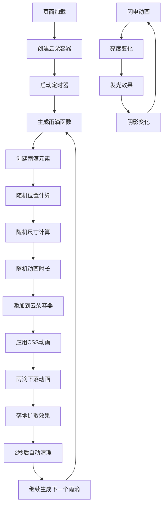

# 雨和闪电动画效果

## 简介

雨和闪电动画效果是一种结合 CSS 动画和 JavaScript 动态生成技术的天气模拟特效。通过 CSS 创建云朵形状和闪电发光效果，使用 JavaScript 动态生成雨滴元素，实现逼真的雨天场景动画。该效果利用 CSS 的伪元素、关键帧动画和 JavaScript 的 DOM 操作，创造出自然流畅的天气动画效果。

## 效果特点

### 视觉特性

- **立体云朵设计**: 使用伪元素创建立体云朵形状
- **动态雨滴生成**: JavaScript 实时创建随机雨滴
- **闪电发光效果**: CSS 动画模拟闪电瞬间发光
- **雨滴落地效果**: 雨滴落地时的扩散动画
- **随机性**: 雨滴位置、大小、持续时间随机

### 技术特性

- **CSS+JavaScript 结合**: 静态样式与动态逻辑结合
- **性能优化**: 自动清理过期雨滴元素
- **可配置参数**: 支持自定义雨滴密度、速度等
- **响应式设计**: 适配不同屏幕尺寸

## 工作原理



## 效果演示

<demo react="react/RainLightningEffect/RainLightningEffectDemo.tsx" 
:reactFiles="['react/RainLightningEffect/RainLightningEffectDemo.tsx','react/RainLightningEffect/index.tsx','react/RainLightningEffect/index.scss']" 
/>

## 核心实现原理

### 基础实现方案

**核心思路**：

- 使用 CSS 伪元素创建立体云朵形状
- JavaScript 定时器动态生成雨滴元素
- CSS 关键帧动画控制雨滴下落和闪电效果
- 随机算法控制雨滴的位置、大小和速度
- 自动清理机制防止内存泄漏

**优点**：

- 视觉效果逼真，具有强烈的沉浸感
- 代码结构清晰，易于理解和扩展
- 性能优化良好，自动清理过期元素
- 参数可配置，适应不同需求

**适用场景**：

- 天气应用背景效果
- 游戏场景动画
- 网站装饰性动画
- 情绪化界面设计

### 云朵结构核心代码

```css
.cloud {
	position: relative;
	width: 320px;
	height: 100px;
	border-radius: 100px;
	filter: drop-shadow(8px 8px 0 #0005);
	animation: animateCloud 2s steps(1) infinite;
}

.cloud::before {
	content: '';
	position: absolute;
	top: -50px;
	left: 40px;
	width: 110px;
	height: 110px;
	border-radius: 50%;
	background: #484f59;
	box-shadow: 90px -10px 0 30px #484f59;
}
```

### 雨滴生成逻辑

```javascript
function rain() {
	let cloud = document.querySelector('.cloud');
	let e = document.createElement('div');
	let left = Math.floor(Math.random() * 310);
	let width = Math.random() * 5;
	let height = Math.random() * 50;
	let duration = Math.random() * 0.5;

	e.classList.add('drop');
	cloud.appendChild(e);
	e.style.left = left + 'px';
	e.style.width = 0.5 + width + 'px';
	e.style.height = 0.5 + height + 'px';
	e.style.animationDuration = 1 + duration + 's';

	setTimeout(() => {
		cloud.removeChild(e);
	}, 2000);
}
```

### 闪电动画效果

```css
@keyframes animateCloud {
	0% {
		filter: drop-shadow(8px 8px 0 #0001) drop-shadow(0 0 0 #fff) brightness(1);
	}
	95% {
		filter: drop-shadow(8px 8px 0 #0001) drop-shadow(0 0 50px #fff5) brightness(10);
	}
}
```

## 参数配置选项

| 参数名称            | 类型     | 默认值    | 说明                 |
| ------------------- | -------- | --------- | -------------------- |
| `rainInterval`      | `number` | `20`      | 雨滴生成间隔（毫秒） |
| `cloudWidth`        | `number` | `320`     | 云朵宽度（像素）     |
| `cloudHeight`       | `number` | `100`     | 云朵高度（像素）     |
| `dropLifetime`      | `number` | `2000`    | 雨滴存在时间（毫秒） |
| `lightningInterval` | `number` | `2000`    | 闪电动画间隔（毫秒） |
| `dropColor`         | `string` | `#05a2eb` | 雨滴颜色             |
| `cloudColor`        | `string` | `#484f59` | 云朵颜色             |
| `backgroundColor`   | `string` | `#1b1b1b` | 背景颜色             |
| `maxDropWidth`      | `number` | `5`       | 雨滴最大宽度（像素） |
| `maxDropHeight`     | `number` | `50`      | 雨滴最大高度（像素） |

## 高级功能

### 功能 1：动态雨量控制

```typescript
interface RainConfig {
	intensity: 'light' | 'medium' | 'heavy';
	interval: number;
	dropCount: number;
}

const useRainControl = (config: RainConfig) => {
	const [currentIntensity, setCurrentIntensity] = useState(config.intensity);

	const intensitySettings = {
		light: { interval: 50, dropCount: 1 },
		medium: { interval: 20, dropCount: 1 },
		heavy: { interval: 10, dropCount: 2 }
	};

	const changeIntensity = (intensity: RainConfig['intensity']) => {
		setCurrentIntensity(intensity);
	};

	return { currentIntensity, changeIntensity, intensitySettings };
};
```

### 功能 2：闪电频率控制

```typescript
interface LightningConfig {
	frequency: number;
	duration: number;
	brightness: number;
	enabled: boolean;
}

const useLightningControl = (config: LightningConfig) => {
	const [isFlashing, setIsFlashing] = useState(false);

	useEffect(() => {
		if (!config.enabled) return;

		const interval = setInterval(() => {
			setIsFlashing(true);
			setTimeout(() => setIsFlashing(false), config.duration);
		}, config.frequency);

		return () => clearInterval(interval);
	}, [config]);

	return { isFlashing };
};
```

### 功能 3：天气场景切换

```typescript
interface WeatherScene {
	type: 'sunny' | 'rainy' | 'stormy' | 'drizzle';
	rainIntensity: number;
	lightningEnabled: boolean;
	cloudOpacity: number;
}

const useWeatherScene = () => {
	const [currentScene, setCurrentScene] = useState<WeatherScene>({
		type: 'rainy',
		rainIntensity: 20,
		lightningEnabled: true,
		cloudOpacity: 1
	});

	const changeScene = (sceneType: WeatherScene['type']) => {
		const scenes: Record<WeatherScene['type'], WeatherScene> = {
			sunny: { type: 'sunny', rainIntensity: 0, lightningEnabled: false, cloudOpacity: 0.3 },
			drizzle: { type: 'drizzle', rainIntensity: 50, lightningEnabled: false, cloudOpacity: 0.7 },
			rainy: { type: 'rainy', rainIntensity: 20, lightningEnabled: true, cloudOpacity: 1 },
			stormy: { type: 'stormy', rainIntensity: 10, lightningEnabled: true, cloudOpacity: 1 }
		};

		setCurrentScene(scenes[sceneType]);
	};

	return { currentScene, changeScene };
};
```

## 实现方案对比

| 方案            | 优点               | 缺点               | 适用场景        |
| --------------- | ------------------ | ------------------ | --------------- |
| **CSS+JS**      | 效果逼真，性能好   | 代码复杂度中等     | 大多数 Web 应用 |
| **纯 CSS**      | 代码简单           | 效果有限，无随机性 | 简单装饰效果    |
| **Canvas 绘制** | 可控性强，效果丰富 | 性能开销大         | 复杂动画需求    |
| **WebGL**       | 性能最佳           | 开发复杂度高       | 高性能要求      |

## 性能优化

### 1. 内存管理

```typescript
const useRainDropManager = () => {
	const dropsRef = useRef<HTMLElement[]>([]);

	const addDrop = (drop: HTMLElement) => {
		dropsRef.current.push(drop);
	};

	const cleanupDrops = () => {
		dropsRef.current.forEach(drop => {
			if (drop.parentNode) {
				drop.parentNode.removeChild(drop);
			}
		});
		dropsRef.current = [];
	};

	useEffect(() => {
		return cleanupDrops;
	}, []);

	return { addDrop, cleanupDrops };
};
```

### 2. 动画优化

```typescript
const useOptimizedAnimation = () => {
	const [isVisible, setIsVisible] = useState(true);

	useEffect(() => {
		const handleVisibilityChange = () => {
			setIsVisible(!document.hidden);
		};

		document.addEventListener('visibilitychange', handleVisibilityChange);
		return () => document.removeEventListener('visibilitychange', handleVisibilityChange);
	}, []);

	return { isVisible };
};
```

### 3. 节流控制

```typescript
const useThrottledRain = (interval: number) => {
	const lastRainTime = useRef(0);

	const shouldCreateRain = () => {
		const now = Date.now();
		if (now - lastRainTime.current >= interval) {
			lastRainTime.current = now;
			return true;
		}
		return false;
	};

	return { shouldCreateRain };
};
```

## 故障排除

### 1. 雨滴不显示

**问题**: 雨滴元素创建但不可见
**解决方案**:

- 检查 CSS 动画是否正确应用
- 确保雨滴颜色与背景有足够对比度
- 验证雨滴尺寸设置是否合理
- 检查 z-index 层级关系

### 2. 内存泄漏

**问题**: 长时间运行后页面卡顿
**解决方案**:

- 确保雨滴元素及时清理
- 检查定时器是否正确清除
- 监控 DOM 元素数量
- 使用性能分析工具检测

### 3. 动画不流畅

**问题**: 雨滴动画卡顿
**解决方案**:

- 启用 GPU 加速
- 减少同时存在的雨滴数量
- 优化 CSS 选择器性能
- 使用 transform 代替其他属性变化

## 应用场景

### 1. 天气应用

```typescript
const WeatherApp = () => {
	const [weather, setWeather] = useState('rainy');

	return (
		<div className="weather-app">
			<h1>今日天气</h1>
			<RainLightningEffect
				rainInterval={weather === 'rainy' ? 20 : 100}
				lightningEnabled={weather === 'stormy'}
			/>
			<div className="weather-info">
				<p>当前: {weather === 'rainy' ? '雨天' : '晴天'}</p>
			</div>
		</div>
	);
};
```

### 2. 游戏背景

```typescript
const GameScene = () => {
	return (
		<div className="game-scene">
			<RainLightningEffect rainInterval={15} lightningEnabled={true} backgroundColor="#0a0a0a" />
			<div className="game-ui">{/* 游戏界面元素 */}</div>
		</div>
	);
};
```
