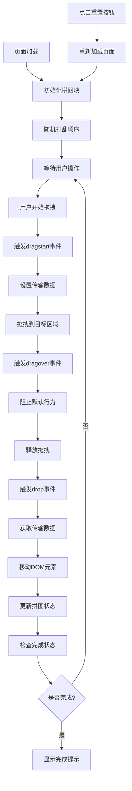

# 图片拼图游戏

## 简介

图片拼图游戏是一种基于 HTML5 拖拽 API 和 JavaScript 的交互式游戏。通过将完整图片分割成 9 个小块，用户需要通过拖拽操作将打乱的图片块重新排列成完整图片。该游戏利用 HTML5 的原生拖拽功能、CSS Grid 布局和 JavaScript 的 DOM 操作，实现了流畅的拖拽交互和游戏逻辑。

## 效果特点

### 游戏特性

- **拖拽交互**: 基于 HTML5 原生拖拽 API 实现
- **随机打乱**: 游戏开始时自动随机排列图片块
- **网格布局**: 使用 CSS Grid 创建 3x3 拼图网格
- **视觉反馈**: 拖拽过程中的视觉提示效果
- **重置功能**: 一键重新开始游戏

### 技术特性

- **原生 HTML5**: 无需第三方库，纯原生实现
- **响应式设计**: 适配不同屏幕尺寸
- **性能优化**: 高效的 DOM 操作和事件处理
- **可扩展性**: 支持自定义图片和网格尺寸

## 工作原理



## 效果演示

<demo react="react/ImagePuzzleGame/ImagePuzzleGameDemo.tsx" 
:reactFiles="['react/ImagePuzzleGame/ImagePuzzleGameDemo.tsx','react/ImagePuzzleGame/index.tsx','react/ImagePuzzleGame/index.scss']" 
/>

## 核心实现原理

### 基础实现方案

**核心思路**：

- 使用 HTML5 拖拽 API 实现图片块的拖拽功能
- CSS 自定义属性控制每个图片块的背景图片
- JavaScript 随机算法打乱图片块的初始顺序
- 事件处理机制管理拖拽的整个生命周期
- DOM 操作实现图片块在容器间的移动

**优点**：

- 原生 HTML5 实现，无需额外依赖
- 拖拽交互流畅自然
- 代码结构清晰，易于理解和扩展
- 性能优异，响应速度快

**适用场景**：

- 教育游戏应用
- 儿童益智游戏
- 网站互动娱乐
- 认知训练工具

### 拖拽事件核心代码

```javascript
function drag(event) {
	// 设置需要传递的数据（元素ID）
	event.dataTransfer.setData('text', event.target.id);
}

function allowDrop(event) {
	// 阻止默认行为，允许放置
	event.preventDefault();
}

function drop(event) {
	event.preventDefault();
	// 获取传递的元素ID
	let data = event.dataTransfer.getData('text');
	// 移动DOM元素到目标位置
	event.target.appendChild(document.getElementById(data));
}
```

### 随机打乱算法

```javascript
function shufflePuzzle() {
	let parent = document.getElementById('drag');
	let fragment = document.createDocumentFragment();

	while (parent.children.length) {
		// 随机选择一个子元素
		let randomIndex = Math.floor(Math.random() * parent.children.length);
		fragment.appendChild(parent.children[randomIndex]);
	}

	parent.appendChild(fragment);
}
```

### 图片块结构

```html
<div
	class="images"
	draggable="true"
	ondragstart="drag(event)"
	id="block1"
	style="--img:url(grid_1.jpg);"
></div>
```

## 参数配置选项

| 参数名称             | 类型       | 默认值    | 说明                        |
| -------------------- | ---------- | --------- | --------------------------- |
| `gridSize`           | `number`   | `3`       | 拼图网格尺寸（3x3, 4x4 等） |
| `pieceSize`          | `number`   | `100`     | 拼图块大小（像素）          |
| `boardPieceSize`     | `number`   | `140`     | 拼图板格子大小（像素）      |
| `gap`                | `number`   | `10`      | 拼图块间距（像素）          |
| `imageUrl`           | `string`   | `''`      | 自定义拼图图片 URL          |
| `autoShuffle`        | `boolean`  | `true`    | 是否自动打乱                |
| `showPreview`        | `boolean`  | `false`   | 是否显示完整图片预览        |
| `enableHints`        | `boolean`  | `false`   | 是否启用提示功能            |
| `backgroundColor`    | `string`   | `#2f363e` | 背景颜色                    |
| `completionCallback` | `function` | `null`    | 完成回调函数                |

## 高级功能

### 功能 1：完成状态检测

```typescript
interface PuzzleState {
	pieces: PuzzlePiece[];
	isCompleted: boolean;
	moves: number;
	startTime: number;
}

const usePuzzleState = () => {
	const [state, setState] = useState<PuzzleState>({
		pieces: [],
		isCompleted: false,
		moves: 0,
		startTime: Date.now()
	});

	const checkCompletion = () => {
		const isCompleted = state.pieces.every(
			(piece, index) => piece.currentPosition === piece.correctPosition
		);

		if (isCompleted && !state.isCompleted) {
			setState(prev => ({ ...prev, isCompleted: true }));
			onPuzzleComplete();
		}
	};

	return { state, checkCompletion };
};
```

### 功能 2：计时和计分系统

```typescript
interface GameStats {
	moves: number;
	timeElapsed: number;
	score: number;
	bestTime: number;
}

const useGameStats = () => {
	const [stats, setStats] = useState<GameStats>({
		moves: 0,
		timeElapsed: 0,
		score: 0,
		bestTime: localStorage.getItem('bestTime') ? parseInt(localStorage.getItem('bestTime')!) : 0
	});

	const incrementMoves = () => {
		setStats(prev => ({ ...prev, moves: prev.moves + 1 }));
	};

	const calculateScore = (moves: number, time: number) => {
		return Math.max(1000 - moves * 10 - time, 0);
	};

	return { stats, incrementMoves, calculateScore };
};
```

### 功能 3：难度级别系统

```typescript
interface DifficultyLevel {
	name: string;
	gridSize: number;
	timeLimit?: number;
	hintsAllowed: number;
}

const useDifficultySystem = () => {
	const difficulties: DifficultyLevel[] = [
		{ name: '简单', gridSize: 3, hintsAllowed: 5 },
		{ name: '中等', gridSize: 4, hintsAllowed: 3 },
		{ name: '困难', gridSize: 5, hintsAllowed: 1 },
		{ name: '专家', gridSize: 6, timeLimit: 300, hintsAllowed: 0 }
	];

	const [currentDifficulty, setCurrentDifficulty] = useState(difficulties[0]);

	return { difficulties, currentDifficulty, setCurrentDifficulty };
};
```

## 实现方案对比

| 方案           | 优点             | 缺点           | 适用场景   |
| -------------- | ---------------- | -------------- | ---------- |
| **HTML5 拖拽** | 原生支持，性能好 | 移动端兼容性差 | 桌面端应用 |
| **触摸事件**   | 移动端友好       | 代码复杂度高   | 移动端应用 |
| **鼠标事件**   | 兼容性好         | 功能有限       | 简单交互   |
| **第三方库**   | 功能丰富         | 增加依赖       | 复杂需求   |

## 性能优化

### 1. 事件委托

```typescript
const useDragEventDelegation = () => {
	useEffect(() => {
		const handleDragStart = (e: DragEvent) => {
			if (e.target instanceof HTMLElement && e.target.classList.contains('puzzle-piece')) {
				e.dataTransfer?.setData('text/plain', e.target.id);
			}
		};

		document.addEventListener('dragstart', handleDragStart);
		return () => document.removeEventListener('dragstart', handleDragStart);
	}, []);
};
```

### 2. 虚拟化渲染

```typescript
const useVirtualizedPuzzle = (gridSize: number) => {
	const [visiblePieces, setVisiblePieces] = useState<PuzzlePiece[]>([]);

	const updateVisiblePieces = useCallback(() => {
		// 只渲染可见区域的拼图块
		const visible = pieces.filter(piece => isInViewport(piece));
		setVisiblePieces(visible);
	}, [pieces]);

	return { visiblePieces, updateVisiblePieces };
};
```

### 3. 图片预加载

```typescript
const useImagePreloader = (imageUrls: string[]) => {
	const [loadedImages, setLoadedImages] = useState<Set<string>>(new Set());

	useEffect(() => {
		const preloadImages = async () => {
			const promises = imageUrls.map(url => {
				return new Promise<string>((resolve, reject) => {
					const img = new Image();
					img.onload = () => resolve(url);
					img.onerror = reject;
					img.src = url;
				});
			});

			try {
				const loaded = await Promise.all(promises);
				setLoadedImages(new Set(loaded));
			} catch (error) {
				console.error('图片预加载失败:', error);
			}
		};

		preloadImages();
	}, [imageUrls]);

	return { loadedImages };
};
```

## 故障排除

### 1. 拖拽不生效

**问题**: 图片块无法拖拽
**解决方案**:

- 确保元素设置了`draggable="true"`
- 检查`dragstart`事件是否正确绑定
- 验证`dataTransfer.setData()`调用
- 检查浏览器兼容性

### 2. 放置区域无响应

**问题**: 无法将图片块放置到目标区域
**解决方案**:

- 确保目标元素绑定了`dragover`和`drop`事件
- 在`dragover`事件中调用`preventDefault()`
- 检查`drop`事件处理逻辑
- 验证元素的 CSS 样式设置

### 3. 图片显示异常

**问题**: 拼图块图片不显示或显示错误
**解决方案**:

- 检查图片路径是否正确
- 确保 CSS 自定义属性语法正确
- 验证图片文件是否存在
- 检查跨域问题

## 应用场景

### 1. 教育游戏

```typescript
const EducationalPuzzle = () => {
	const [currentLesson, setCurrentLesson] = useState(0);
	const lessons = [
		{ image: '/images/animals.jpg', title: '认识动物' },
		{ image: '/images/colors.jpg', title: '学习颜色' },
		{ image: '/images/numbers.jpg', title: '数字练习' }
	];

	return (
		<div className="educational-puzzle">
			<h2>{lessons[currentLesson].title}</h2>
			<ImagePuzzleGame
				imageUrl={lessons[currentLesson].image}
				gridSize={3}
				onComplete={() => setCurrentLesson(prev => prev + 1)}
			/>
		</div>
	);
};
```

### 2. 娱乐游戏

```typescript
const EntertainmentPuzzle = () => {
	const [difficulty, setDifficulty] = useState('easy');
	const [score, setScore] = useState(0);

	return (
		<div className="entertainment-puzzle">
			<div className="game-header">
				<h1>拼图挑战</h1>
				<div className="score">得分: {score}</div>
			</div>
			<ImagePuzzleGame
				gridSize={difficulty === 'easy' ? 3 : difficulty === 'medium' ? 4 : 5}
				onComplete={stats => setScore(prev => prev + stats.score)}
			/>
		</div>
	);
};
```
