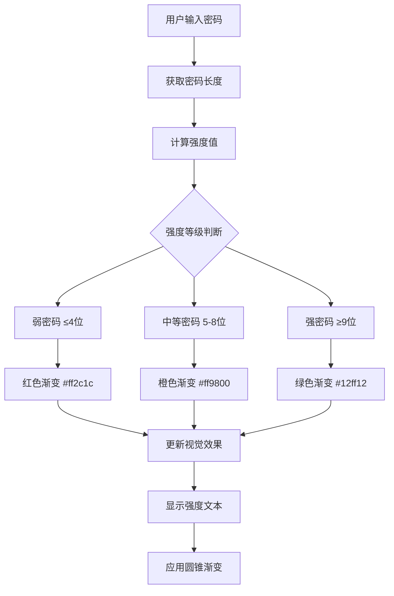

# 密码强度检查器

## 简介

密码强度检查器是一个实时检测密码强度的可视化组件，通过动态的颜色变化和视觉反馈，帮助用户创建更安全的密码。组件采用圆锥渐变效果，根据密码长度实时更新强度等级和视觉样式。

## 效果特点

### 视觉特性

- **实时反馈**: 输入密码时即时显示强度等级
- **渐变效果**: 使用圆锥渐变创建动态视觉效果
- **模糊层叠**: 多层模糊效果增强视觉深度
- **颜色编码**: 红色(弱)、橙色(中)、绿色(强)三级强度

### 技术特性

- **轻量级实现**: 纯 CSS 和 JavaScript 实现，无外部依赖
- **响应式设计**: 适配不同屏幕尺寸
- **可配置参数**: 支持自定义强度阈值和颜色
- **性能优化**: 使用事件监听器实现高效更新

## 工作原理



## 效果演示

<demo react="react/PasswordStrengthChecker/index.tsx" 
:reactFiles="['react/PasswordStrengthChecker/index.tsx','react/PasswordStrengthChecker/index.scss']" 
/>

## 核心实现原理

### 基础实现方案

**核心思路**：

- 监听密码输入事件，实时计算密码长度
- 根据长度映射到强度等级和对应颜色
- 使用圆锥渐变创建动态视觉效果
- 通过多层模糊效果增强视觉层次

**优点**：

- 实现简单，代码量少
- 视觉效果突出，用户体验好
- 性能优秀，响应速度快
- 易于集成和定制

**适用场景**：

- 用户注册和登录表单
- 密码修改页面
- 安全设置界面
- 表单验证组件

### 强度计算逻辑

```typescript
// 密码强度计算
const calculateStrength = (password: string) => {
	const length = Math.min(password.length, 12); // 最大长度限制为12
	const degree = length * 30; // 每个字符对应30度

	// 强度等级判断
	let level: 'weak' | 'medium' | 'strong';
	let color: string;
	let text: string;

	if (length <= 4) {
		level = 'weak';
		color = '#ff2c1c';
		text = 'Weak';
	} else if (length <= 8) {
		level = 'medium';
		color = '#ff9800';
		text = 'Medium';
	} else {
		level = 'strong';
		color = '#12ff12';
		text = 'Strong';
	}

	return { level, color, text, degree };
};
```

## 参数配置选项

| 参数名             | 类型     | 默认值                | 说明             |
| ------------------ | -------- | --------------------- | ---------------- |
| `placeholder`      | string   | "Enter your password" | 输入框占位符文本 |
| `weakThreshold`    | number   | 4                     | 弱密码阈值       |
| `mediumThreshold`  | number   | 8                     | 中等密码阈值     |
| `weakColor`        | string   | "#ff2c1c"             | 弱密码颜色       |
| `mediumColor`      | string   | "#ff9800"             | 中等密码颜色     |
| `strongColor`      | string   | "#12ff12"             | 强密码颜色       |
| `maxLength`        | number   | 12                    | 最大密码长度     |
| `showText`         | boolean  | true                  | 是否显示强度文本 |
| `onStrengthChange` | function | -                     | 强度变化回调函数 |

### 配置示例

```typescript
<PasswordStrengthChecker
	placeholder="请输入您的密码"
	weakThreshold={6}
	mediumThreshold={10}
	weakColor="#e74c3c"
	mediumColor="#f39c12"
	strongColor="#27ae60"
	maxLength={16}
	showText={true}
	onStrengthChange={strength => console.log('密码强度:', strength)}
/>
```

## 实现方案对比

| 方案           | 优点     | 缺点       | 适用场景   |
| -------------- | -------- | ---------- | ---------- |
| **长度检测**   | 简单快速 | 安全性较低 | 基础验证   |
| **复杂度检测** | 安全性高 | 实现复杂   | 高安全要求 |
| **正则匹配**   | 规则灵活 | 性能一般   | 自定义规则 |
| **第三方库**   | 功能完善 | 增加依赖   | 快速开发   |

## 高级功能

### 功能 1：复杂度检测

```typescript
const calculateComplexity = (password: string) => {
	let score = 0;

	// 长度评分
	score += Math.min(password.length * 4, 25);

	// 字符类型评分
	if (/[a-z]/.test(password)) score += 5;
	if (/[A-Z]/.test(password)) score += 5;
	if (/[0-9]/.test(password)) score += 5;
	if (/[^A-Za-z0-9]/.test(password)) score += 10;

	// 重复字符扣分
	const repeated = password.match(/(.)\1+/g);
	if (repeated) score -= repeated.length * 2;

	return Math.max(0, Math.min(100, score));
};
```

### 功能 2：实时建议

```typescript
const getPasswordSuggestions = (password: string) => {
	const suggestions = [];

	if (password.length < 8) {
		suggestions.push('密码长度至少8位');
	}
	if (!/[a-z]/.test(password)) {
		suggestions.push('添加小写字母');
	}
	if (!/[A-Z]/.test(password)) {
		suggestions.push('添加大写字母');
	}
	if (!/[0-9]/.test(password)) {
		suggestions.push('添加数字');
	}
	if (!/[^A-Za-z0-9]/.test(password)) {
		suggestions.push('添加特殊字符');
	}

	return suggestions;
};
```

## 性能优化

### 1. 防抖处理

```typescript
const useDebounce = (value: string, delay: number) => {
	const [debouncedValue, setDebouncedValue] = useState(value);

	useEffect(() => {
		const handler = setTimeout(() => {
			setDebouncedValue(value);
		}, delay);

		return () => clearTimeout(handler);
	}, [value, delay]);

	return debouncedValue;
};
```

### 2. 内存优化

```typescript
// 使用 useCallback 缓存函数
const handlePasswordChange = useCallback(
	(password: string) => {
		const strength = calculateStrength(password);
		onStrengthChange?.(strength);
	},
	[onStrengthChange]
);
```

## 应用场景

### 1. 用户注册表单

```typescript
const RegisterForm = () => {
	const [password, setPassword] = useState('');
	const [isValid, setIsValid] = useState(false);

	return (
		<form>
			<PasswordStrengthChecker
				value={password}
				onChange={setPassword}
				onStrengthChange={strength => {
					setIsValid(strength.level !== 'weak');
				}}
			/>
			<button disabled={!isValid}>注册</button>
		</form>
	);
};
```

### 2. 密码修改页面

```typescript
const ChangePasswordPage = () => {
	const [newPassword, setNewPassword] = useState('');

	return (
		<div>
			<h2>修改密码</h2>
			<PasswordStrengthChecker
				placeholder="请输入新密码"
				value={newPassword}
				onChange={setNewPassword}
				showSuggestions={true}
			/>
		</div>
	);
};
```
