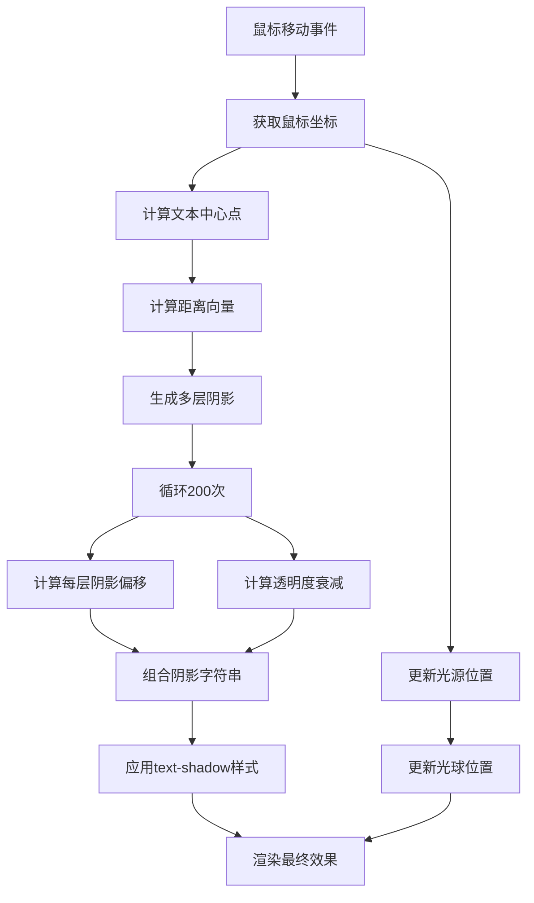

# 光影文本阴影动画

## 简介

光影文本阴影动画是一个跟随鼠标移动的动态文本效果，通过计算鼠标位置与文本的相对距离，实时生成多层渐变阴影，模拟真实的光照投影效果。当鼠标在页面上移动时，文本会产生相应的阴影变化，创造出逼真的3D光影效果。

## 效果特点

### 视觉特性

- **动态阴影**: 根据鼠标位置实时计算阴影方向和强度
- **多层渐变**: 通过200层阴影叠加创造平滑的渐变效果
- **光源跟随**: 白色光球跟随鼠标移动，模拟光源位置
- **3D立体感**: 阴影的方向和透明度变化营造立体效果

### 技术特性

- **实时计算**: 鼠标移动时即时计算阴影参数
- **性能优化**: 使用CSS text-shadow属性实现高效渲染
- **响应式交互**: 支持全屏幕范围的鼠标跟踪
- **纯前端实现**: 无需外部依赖，纯CSS+JavaScript

## 工作原理



## 效果演示

<demo react="react/LightShadowText/index.tsx" 
:reactFiles="['react/LightShadowText/index.tsx','react/LightShadowText/index.scss']" 
/>

## 核心实现原理

### 基础实现方案

**核心思路**：

- 监听鼠标移动事件，获取实时坐标
- 计算鼠标与文本中心的距离向量
- 根据距离向量生成反方向的多层阴影
- 使用透明度衰减模拟光照强度变化

**优点**：

- 视觉效果逼真，立体感强
- 交互响应流畅，跟随性好
- 实现简单，代码量少
- 兼容性好，支持所有现代浏览器

**适用场景**：

- 网站标题和Logo展示
- 创意文本效果
- 交互式展示页面
- 艺术设计项目

### 阴影计算算法

```typescript
// 阴影生成核心算法
const generateShadow = (mouseX: number, mouseY: number, textElement: HTMLElement) => {
  const textRect = textElement.getBoundingClientRect();
  const textCenterX = textRect.left + textRect.width / 2;
  const textCenterY = textRect.top + textRect.height / 2;
  
  // 计算距离向量
  const distanceX = mouseX - textCenterX;
  const distanceY = mouseY - textCenterY;
  
  let shadowString = '';
  
  // 生成200层阴影
  for (let i = 0; i < 200; i++) {
    const shadowX = -distanceX * (i / 200);
    const shadowY = -distanceY * (i / 200);
    const opacity = 1 - (i / 100);
    
    if (i > 0) shadowString += ', ';
    shadowString += `${shadowX}px ${shadowY}px 0 rgba(33,33,33,${opacity})`;
  }
  
  return shadowString;
};
```

## 参数配置选项

| 参数名 | 类型 | 默认值 | 说明 |
|--------|------|--------|------|
| `text` | string | "Shadow" | 显示的文本内容 |
| `fontSize` | number | 10 | 文字大小（em单位） |
| `textColor` | string | "#fff" | 文字颜色 |
| `shadowLayers` | number | 200 | 阴影层数 |
| `shadowColor` | string | "rgba(33,33,33,1)" | 阴影颜色 |
| `lightSize` | number | 50 | 光源大小（px） |
| `lightColor` | string | "#fff" | 光源颜色 |
| `showLight` | boolean | true | 是否显示光源 |
| `sensitivity` | number | 1 | 阴影敏感度 |

### 配置示例

```typescript
<LightShadowText
  text="CREATIVE"
  fontSize={8}
  textColor="#00ff88"
  shadowLayers={150}
  shadowColor="rgba(0,255,136,1)"
  lightColor="#00ff88"
  sensitivity={1.5}
  showLight={true}
/>
```

## 实现方案对比

| 方案 | 优点 | 缺点 | 适用场景 |
|------|------|------|----------|
| **CSS text-shadow** | 性能好，效果平滑 | 阴影层数有限制 | 标准文本效果 |
| **Canvas绘制** | 自由度高，效果丰富 | 性能开销大 | 复杂图形效果 |
| **SVG滤镜** | 矢量化，可缩放 | 兼容性一般 | 图标和简单图形 |
| **WebGL着色器** | 性能极佳，效果强大 | 开发复杂度高 | 3D场景和游戏 |

## 高级功能

### 功能 1：多光源效果

```typescript
const useMultiLight = (lightCount: number = 3) => {
  const [lights, setLights] = useState<Array<{x: number, y: number, color: string}>>([]);
  
  const addLight = (x: number, y: number, color: string) => {
    setLights(prev => [...prev, { x, y, color }]);
  };
  
  const generateMultiShadow = (textElement: HTMLElement) => {
    let combinedShadow = '';
    
    lights.forEach((light, index) => {
      const shadow = generateShadow(light.x, light.y, textElement);
      if (index > 0) combinedShadow += ', ';
      combinedShadow += shadow;
    });
    
    return combinedShadow;
  };
  
  return { lights, addLight, generateMultiShadow };
};
```

### 功能 2：动画缓动效果

```typescript
const useSmoothAnimation = (duration: number = 100) => {
  const [targetShadow, setTargetShadow] = useState('');
  const [currentShadow, setCurrentShadow] = useState('');
  
  useEffect(() => {
    const animate = () => {
      // 使用缓动函数平滑过渡
      const progress = Math.min(1, (Date.now() - startTime) / duration);
      const easedProgress = easeOutCubic(progress);
      
      setCurrentShadow(interpolateShadow(currentShadow, targeow, easedProgress));
      
      if (progress < 1) {
        requestAnimationFrame(animate);
      }
    };
    
    animate();
  }, [targetShadow]);
  
  return { currentShadow, setTargetShadow };
};
```

### 功能 3：颜色渐变阴影

```typescript
const generateGradientShadow = (
  mouseX: number, 
  mouseY: number, 
  textElement: HTMLElement,
  colors: string[]
) => {
  let shadowString = '';
  const colorCount = colors.length;
  
  for (let i = 0; i < 200; i++) {
    const colorIndex = Math.floor((i / 200) * colorCount);
    const color = colors[colorIndex] || colors[colorCount - 1];
    
    const shadowX = -distanceX * (i / 200);
    const shadowY = -distanceY * (i / 200);
    const opacity = 1 - (i / 100);
    
    if (i > 0) shadowString += ', ';
    shadowString += `${shadowX}px ${shadowY}px 0 ${color.replace('1)', `${opacity})`)}`;
  }
  
  return shadowString;
};
```

## 性能优化

### 1. 节流处理

```typescript
const useThrottledMouseMove = (callback: Function, delay: number = 16) => {
  const lastCall = useRef(0);
  
  return useCallback((event: MouseEvent) => {
    const now = Date.now();
    if (now - lastCall.current >= delay) {
      lastCall.current = now;
      callback(event);
    }
  }, [callback, delay]);
};
```

### 2. 阴影缓存

```typescript
const useShadowCache = () => {
  const cache = useRef(new Map<string, string>());
  
  const getCachedShadow = (key: string, generator: () => string) => {
    if (cache.current.has(key)) {
      return cache.current.get(key)!;
    }
    
    const shadow = generator();
    cache.current.set(key, shadow);
    
    // 限制缓存大小
    if (cache.current.size > 1000) {
      const firstKey = cache.current.keys().next().value;
      cache.current.delete(firstKey);
    }
    
    return shadow;
  };
  
  return { getCachedShadow };
};
```

## 应用场景

### 1. 网站标题效果

```typescript
const HeroTitle = () => {
  return (
    <section className="hero">
      <LightShadowText
        text="WELCOME"
        fontSize={12}
        textColor="#fff"
        shadowColor="rgba(0,123,255,1)"
        lightColor="#007bff"
      />
      <p>体验光影文字的魅力</p>
    </section>
  );
};
```

### 2. 品牌Logo展示

```typescript
const BrandLogo = ({ brandName }: { brandName: string }) => {
  return (
    <div className="brand-showcase">
      <LightShadowText
        text={brandName}
        fontSize={8}
        textColor="#ff6b6b"
        shadowLayers={150}
        sensitivity={1.2}
      />
    </div>
  );
};
```

### 3. 交互式艺术展示

```typescript
const ArtGallery = () => {
  const artworks = ['DREAM', 'VISION', 'FUTURE'];
  
  return (
    <div className="art-gallery">
      {artworks.map((artwork, index) => (
        <LightShadowText
          key={artwork}
          text={artwork}
          fontSize={6}
          textColor={`hsl(${index * 120}, 70%, 60%)`}
          shadowColor={`hsla(${index * 120}, 70%, 30%, 1)`}
        />
      ))}
    </div>
  );
};