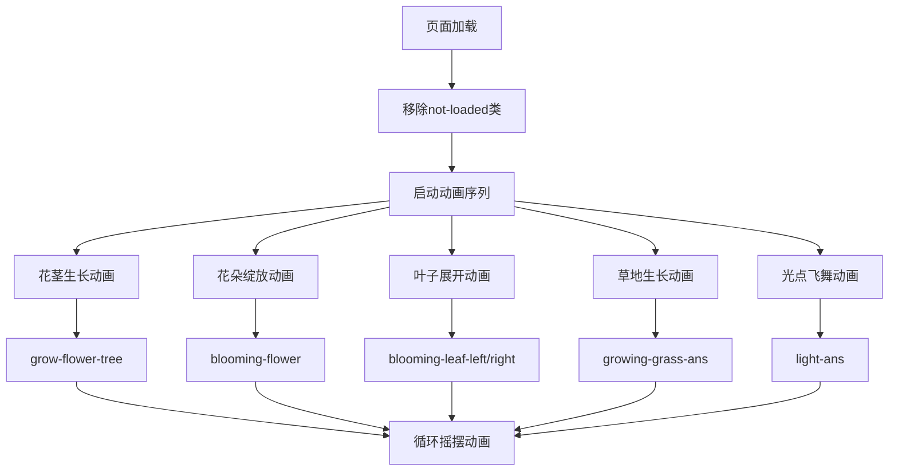

# 精美的花朵儿动画

## 简介

精美的花朵儿动画是一个纯CSS实现的自然生长动画效果，通过精心设计的时序控制和3D变换，展现了花朵从萌芽到绽放的完整生命周期。动画包含花朵绽放、茎叶生长、草叶摇摆、光点飞舞等多种自然元素，创造出生动逼真的花园场景。

## 效果特点

### 视觉特性

- **分层动画**: 花朵、茎叶、草地分层展示，营造景深效果
- **时序控制**: 精确的动画时序，模拟自然生长过程
- **3D变换**: 使用CSS 3D变换创造立体视觉效果
- **光影效果**: 发光粒子和阴影效果增强视觉层次

### 技术特性

- **纯CSS实现**: 无需JavaScript，仅使用CSS动画
- **响应式设计**: 使用vmin单位适配不同屏幕尺寸
- **性能优化**: 合理使用transform和opacity属性
- **模块化结构**: 每个动画元素独立可控

## 工作原理



## 效果演示

<demo react="react/BeautifulFlower/index.tsx" 
:reactFiles="['react/BeautifulFlower/index.tsx','react/BeautifulFlower/index.scss']" 
/>

## 核心实现原理

### 基础实现方案

**核心思路**：

- 使用CSS自定义属性控制动画延迟和持续时间
- 通过transform的scale、rotate、translate实现生长效果
- 利用animation-delay精确控制动画时序
- 使用3D变换创造立体空间感

**优点**：

- 性能优异，GPU加速渲染
- 代码简洁，易于维护和扩展
- 视觉效果丰富，层次分明
- 兼容性好，支持所有现代浏览器

**适用场景**：

- 网站装饰动画
- 加载页面效果
- 自然主题设计
- 艺术展示项目

### 动画时序控制

```typescript
// 动画延迟配置
const animationConfig = {
  flowerGrowth: {
    stem: '0.3s',
    leafs: '1.1s',
    petals: '1.4s'
  },
  grassGrowth: {
    base: '2s',
    leaves: ['2.6s', '2.4s', '2.2s', '2s', '1.8s', '1.6s', '1.4s', '1.2s']
  },
  lightParticles: {
    delays: ['1s', '0.5s', '0.3s', '0.9s', '1.5s', '3s', '2s', '3.5s']
  }
};
```

## 参数配置选项

| 参数名 | 类型 | 默认值 | 说明 |
|--------|------|--------|------|
| `flowerCount` | number | 3 | 花朵数量 |
| `animationSpeed` | number | 1 | 动画速度倍率 |
| `flowerColors` | string[] | ['#a7ffee', '#54b8aa'] | 花朵颜色渐变 |
| `stemColor` | string | '#39c6d6' | 茎干颜色 |
| `grassColor` | string | '#159faa' | 草地颜色 |
| `lightColors` | string[] | ['#ffff00', '#23f0ff'] | 光点颜色 |
| `enableLights` | boolean | true | 是否显示光点效果 |
| `enableSwaying` | boolean | true | 是否启用摇摆动画 |
| `backgroundDark` | boolean | true | 是否使用深色背景 |

### 配置示例

```typescript
<BeautifulFlower
  flowerCount={5}
  animationSpeed={1.5}
  flowerColors={['#ff6b9d', '#c44569']}
  stemColor="#27ae60"
  grassColor="#2ecc71"
  lightColors={['#f39c12', '#e74c3c']}
  enableLights={true}
  enableSwaying={true}
/>
```

## 实现方案对比

| 方案 | 优点 | 缺点 | 适用场景 |
|------|------|------|----------|
| **纯CSS动画** | 性能好，代码简洁 | 交互性有限 | 装饰性动画 |
| **CSS + JavaScript** | 可控性强，交互丰富 | 复杂度增加 | 交互式动画 |
| **Canvas绘制** | 自由度高，效果丰富 | 性能开销大 | 复杂图形动画 |
| **SVG动画** | 矢量化，可缩放 | 兼容性一般 | 图标动画 |

## 高级功能

### 功能 1：动态花朵生成

```typescript
const useDynamicFlowers = (count: number) => {
  const [flowers, setFlowers] = useState<FlowerConfig[]>([]);
  
  const generateFlower = (index: number): FlowerConfig => ({
    id: `flower-${index}`,
    position: {
      x: Math.random() * 100,
      y: Math.random() * 20 + 80
    },
    rotation: Math.random() * 40 - 20,
    scale: Math.random() * 0.5 + 0.7,
    animationDelay: Math.random() * 2,
    color: getRandomColor()
  });
  
  useEffect(() => {
    const newFlowers = Array.from({ length: count }, (_, i) => generateFlower(i));
    setFlowers(newFlowers);
  }, [count]);
  
  return flowers;
};
```

### 功能 2：季节主题切换

```typescript
const useSeasonTheme = (season: 'spring' | 'summer' | 'autumn' | 'winter') => {
  const themes = {
    spring: {
      flowerColors: ['#ffb3d9', '#ff80cc'],
      grassColor: '#7ed321',
      backgroundColor: '#87ceeb'
    },
    summer: {
      flowerColors: ['#ffd93d', '#ff6b35'],
      grassColor: '#4caf50',
      backgroundColor: '#1e90ff'
    },
    autumn: {
      flowerColors: ['#ff8c42', '#ff3c38'],
      grassColor: '#8bc34a',
      backgroundColor: '#ff7f50'
    },
    winter: {
      flowerColors: ['#e1f5fe', '#b3e5fc'],
      grassColor: '#607d8b',
      backgroundColor: '#37474f'
    }
  };
  
  return themes[season];
};
```

### 功能 3：交互式控制

```typescript
const useFlowerInteraction = () => {
  const [isPlaying, setIsPlaying] = useState(true);
  const [speed, setSpeed] = useState(1);
  
  const pauseAnimation = () => {
    document.documentElement.style.setProperty('--animation-play-state', 'paused');
    setIsPlaying(false);
  };
  
  const resumeAnimation = () => {
    document.documentElement.style.setProperty('--animation-play-state', 'running');
    setIsPlaying(true);
  };
  
  const changeSpeed = (newSpeed: number) => {
    document.documentElement.style.setProperty('--animation-speed', `${newSpeed}`);
    setSpeed(newSpeed);
  };
  
  return { isPlaying, speed, pauseAnimation, resumeAnimation, changeSpeed };
};
```

## 性能优化

### 1. GPU加速优化

```css
.flower {
  /* 启用硬件加速 */
  transform: translateZ(0);
  will-change: transform;
  
  /* 使用transform替代position变化 */
  animation: flower-movement 4s linear infinite;
}

@keyframes flower-movement {
  0%, 100% {
    transform: translateZ(0) rotate(2deg);
  }
  50% {
    transform: translateZ(0) rotate(-2deg);
  }
}
```

### 2. 动画优化策略

```typescript
const useAnimationOptimization = () => {
  const [isVisible, setIsVisible] = useState(true);
  
  useEffect(() => {
    const observer = new IntersectionObserver(
      ([entry]) => {
        setIsVisible(entry.isIntersecting);
      },
      { threshold: 0.1 }
    );
    
    const element = document.querySelector('.flower-container');
    if (element) observer.observe(element);
    
    return () => observer.disconnect();
  }, []);
  
  // 当不可见时暂停动画
  useEffect(() => {
    const elements = document.querySelectorAll('.flower, .grass, .light');
    elements.forEach(el => {
      (el as HTMLElement).style.animationPlayState = isVisible ? 'running' : 'paused';
    });
  }, [isVisible]);
  
  return isVisible;
};
```

### 3. 内存管理

```typescript
const useMemoryOptimization = () => {
  const animationRefs = useRef<Set<HTMLElement>>(new Set());
  
  const registerElement = (element: HTMLElement) => {
    animationRefs.current.add(element);
  };
  
  const cleanup = () => {
    animationRefs.current.forEach(element => {
      element.style.animation = 'none';
    });
    animationRefs.current.clear();
  };
  
  useEffect(() => {
    return cleanup;
  }, []);
  
  return { registerElement, cleanup };
};
```

## 应用场景

### 1. 网站装饰动画

```typescript
const WelcomePage = () => {
  return (
    <div className="welcome-page">
      <header>
        <h1>欢迎来到我们的花园</h1>
        <BeautifulFlower 
          flowerCount={3}
          enableLights={true}
          animationSpeed={0.8}
        />
      </header>
    </div>
  );
};
```

### 2. 加载页面效果

```typescript
const LoadingScreen = ({ isLoading }: { isLoading: boolean }) => {
  if (!isLoading) return null;
  
  return (
    <div className="loading-screen">
      <BeautifulFlower 
        flowerCount={1}
        animationSpeed={1.5}
        enableSwaying={false}
      />
      <p>正在加载中...</p>
    </div>
  );
};
```

### 3. 节日主题页面

```typescript
const SpringFestival = () => {
  const springTheme = useSeasonTheme('spring');
  
  return (
    <div className="spring-festival">
      <BeautifulFlower 
        {...springTheme}
        flowerCount={5}
        enableLights={true}
      />
      <div className="festival-content">
        <h2>春天来了</h2>
        <p>万物复苏，花开满园</p>
      </div>
    </div>
  );
};