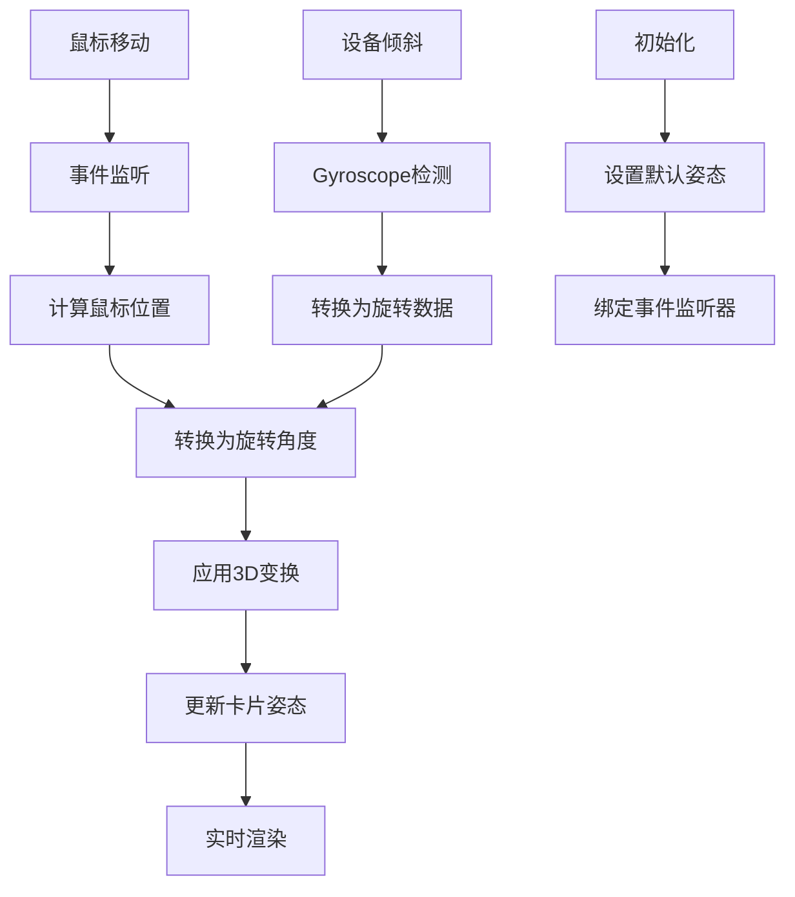
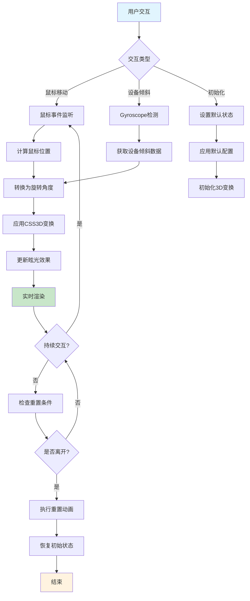
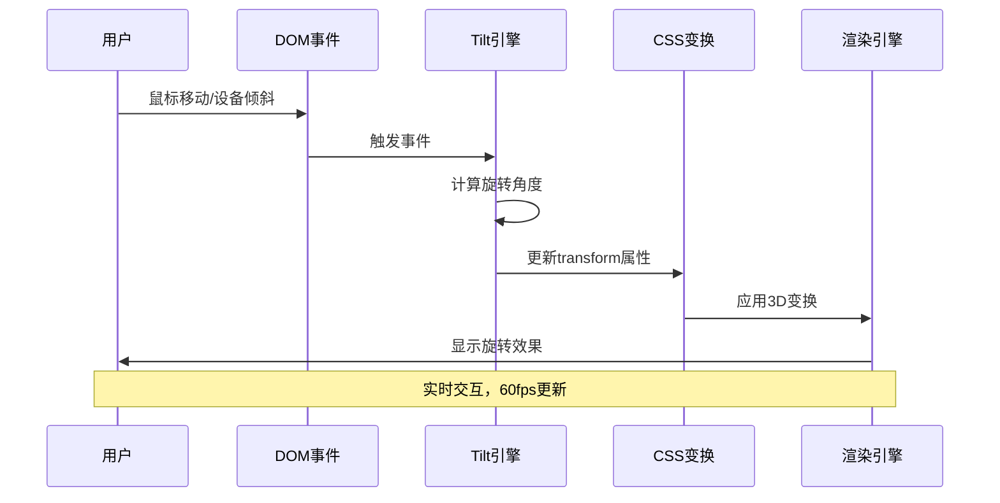

# 3D玻璃形态卡片悬停效果

## 简介

3D玻璃形态卡片悬停效果是一种现代化的UI交互效果，通过Vanilla Tilt.js库实现鼠标跟随的3D旋转效果，结合CSS玻璃态设计，创造出卡片在悬停时产生深度感和立体感的视觉体验。

## 效果特点

### 视觉特性

- **3D旋转效果**: 卡片跟随鼠标移动产生立体旋转
- **玻璃态质感**: 半透明背景和模糊效果
- **深度层次**: 通过阴影和变换营造空间感
- **动态交互**: 实时响应鼠标位置变化

### 技术特性

- **轻量级库**: 使用Vanilla Tilt.js，无依赖
- **高性能**: 利用CSS3D变换和requestAnimationFrame
- **可配置性强**: 支持多种参数自定义
- **响应式**: 支持桌面端和移动端

## 工作原理



## 效果演示

<demo react="react/ThreeDGlassCardHover/example.tsx" 
:reactFiles="['react/ThreeDGlassCardHover/index.tsx','react/ThreeDGlassCardHover/index.scss','react/ThreeDGlassCardHover/demo.tsx','react/ThreeDGlassCardHover/demo.scss','react/ThreeDGlassCardHover/example.tsx']" 
/>

## 核心实现原理

### 基础实现方案

**核心思路**：

- 使用Vanilla Tilt.js库处理3D变换计算
- 通过CSS实现玻璃态视觉效果
- 利用事件监听实现实时交互
- 支持鼠标和设备倾斜两种控制方式

**优点**：

- 实现简单，代码量少
- 性能优异，支持硬件加速
- 视觉效果丰富，交互自然
- 兼容性好，支持现代浏览器

**适用场景**：

- 产品展示卡片
- 图片画廊效果
- 导航菜单设计
- 数据可视化组件

### Vanilla Tilt核心配置

```typescript
const tiltOptions = {
  max: 25,           // 最大旋转角度
  speed: 400,        // 旋转速度
  glare: true,       // 启用眩光效果
  'max-glare': 1,    // 最大眩光强度
  perspective: 1000, // 透视距离
  scale: 1.1,        // 悬停时缩放比例
  reverse: false,    // 反向旋转
  axis: null,        // 限制旋转轴(x/y)
  reset: true,       // 离开时重置
};
```

### 玻璃态CSS实现

```css
.glass-card {
  background: rgba(255, 255, 255, 0.1);
  backdrop-filter: blur(10px);
  border: 1px solid rgba(255, 255, 255, 0.2);
  border-radius: 8px;
  box-shadow: 0 8px 32px rgba(0, 0, 0, 0.1);
}
```

## 参数配置选项

### 基础配置参数

| 参数名称 | 类型 | 默认值 | 说明 |
|---------|------|--------|------|
| `max` | `number` | `25` | 最大旋转角度（度），控制卡片旋转幅度 |
| `speed` | `number` | `400` | 旋转动画速度（毫秒），数值越小越快 |
| `glare` | `boolean` | `true` | 是否启用眩光效果，增加真实感 |
| `maxGlare` | `number` | `1` | 最大眩光强度（0-1），控制眩光透明度 |
| `perspective` | `number` | `1000` | 3D透视距离（像素），影响3D效果深度 |
| `scale` | `number` | `1.1` | 悬停时缩放比例，1.0为不缩放 |
| `reverse` | `boolean` | `false` | 是否反向旋转，true时旋转方向相反 |
| `axis` | `string` | `null` | 限制旋转轴（'x'/'y'），null为自由旋转 |
| `reset` | `boolean` | `true` | 离开时是否重置到初始状态 |

### 卡片样式参数

| 参数名称 | 类型 | 默认值 | 说明 |
|---------|------|--------|------|
| `cardWidth` | `number` | `300` | 卡片宽度（像素） |
| `cardHeight` | `number` | `260` | 卡片高度（像素） |
| `blurAmount` | `number` | `10` | 背景模糊程度（像素），控制玻璃效果 |
| `glassOpacity` | `number` | `0.1` | 玻璃透明度（0-1），数值越大越不透明 |
| `borderOpacity` | `number` | `0.2` | 边框透明度（0-1），控制边框明显程度 |
| `shadowIntensity` | `number` | `0.1` | 阴影强度（0-1），控制阴影深浅 |

### 高级配置参数

| 参数名称 | 类型 | 默认值 | 说明 |
|---------|------|--------|------|
| `gyroscope` | `boolean` | `true` | 是否启用设备倾斜控制 |
| `fullPageListening` | `boolean` | `false` | 是否监听整个页面的鼠标事件 |
| `transition` | `boolean` | `true` | 是否启用过渡动画 |
| `easing` | `string` | `'cubic-bezier(.03,.98,.52,.99)'` | 动画缓动函数 |

## 核心逻辑流程图



### 事件处理流程



## 高级功能

### 功能 1：动态参数配置

```typescript
interface TiltConfig {
  max: number;
  speed: number;
  glare: boolean;
  maxGlare: number;
  perspective: number;
  scale: number;
  reverse: boolean;
  axis: 'x' | 'y' | null;
  reset: boolean;
}

const useTiltConfig = (initialConfig: TiltConfig) => {
  const [config, setConfig] = useState(initialConfig);
  
  const updateConfig = (newConfig: Partial<TiltConfig>) => {
    setConfig(prev => ({ ...prev, ...newConfig }));
  };
  
  return { config, updateConfig };
};
```

### 功能 2：多卡片管理

```typescript
interface CardData {
  id: string;
  title: string;
  description: string;
  imageUrl: string;
  tiltConfig?: Partial<TiltConfig>;
}

const useCardManager = (cards: CardData[]) => {
  const [cardList, setCardList] = useState(cards);
  
  const addCard = (card: CardData) => {
    setCardList(prev => [...prev, card]);
  };
  
  const removeCard = (id: string) => {
    setCardList(prev => prev.filter(card => card.id !== id));
  };
  
  const updateCard = (id: string, updates: Partial<CardData>) => {
    setCardList(prev => prev.map(card => 
      card.id === id ? { ...card, ...updates } : card
    ));
  };
  
  return { cardList, addCard, removeCard, updateCard };
};
```

### 功能 3：主题切换

```typescript
interface GlassTheme {
  backgroundColor: string;
  glassColor: string;
  borderColor: string;
  textColor: string;
  boxShadow: string;
}

const themes: Record<string, GlassTheme> = {
  light: {
    backgroundColor: 'rgba(255, 255, 255, 0.1)',
    glassColor: 'rgba(255, 255, 255, 0.15)',
    borderColor: 'rgba(255, 255, 255, 0.2)',
    textColor: '#fff',
    boxShadow: '0 8px 32px rgba(0, 0, 0, 0.1)'
  },
  dark: {
    backgroundColor: 'rgba(0, 0, 0, 0.1)',
    glassColor: 'rgba(0, 0, 0, 0.15)',
    borderColor: 'rgba(0, 0, 0, 0.2)',
    textColor: '#333',
    boxShadow: '0 8px 32px rgba(0, 0, 0, 0.2)'
  }
};
```

## 实现方案对比

| 方案 | 优点 | 缺点 | 适用场景 |
|------|------|------|----------|
| **Vanilla Tilt.js** | 轻量级，功能完整 | 需要额外库 | 快速开发 |
| **原生实现** | 无依赖，完全控制 | 代码量大 | 定制需求 |
| **Three.js** | 功能强大，3D效果 | 学习成本高 | 复杂3D场景 |
| **CSS3D** | 简单，性能好 | 功能有限 | 基础3D效果 |

## 性能优化

### 1. 硬件加速

```css
.glass-card {
  transform-style: preserve-3d;
  backface-visibility: hidden;
  will-change: transform;
}
```

### 2. 事件节流

```typescript
const useThrottledEvent = (callback: Function, delay: number) => {
  const lastCall = useRef(0);
  
  return useCallback((...args: any[]) => {
    const now = Date.now();
    if (now - lastCall.current >= delay) {
      lastCall.current = now;
      callback(...args);
    }
  }, [callback, delay]);
};
```

### 3. 内存管理

```typescript
const useTiltCleanup = (tiltInstance: any) => {
  useEffect(() => {
    return () => {
      if (tiltInstance && tiltInstance.destroy) {
        tiltInstance.destroy();
      }
    };
  }, [tiltInstance]);
};
```

## 故障排除

### 1. 3D效果不显示

**问题**: 卡片没有3D旋转效果
**解决方案**:

- 检查浏览器是否支持CSS3D变换
- 确认Vanilla Tilt.js正确加载
- 验证容器有正确的perspective设置
- 检查transform-style: preserve-3d

### 2. 眩光效果异常

**问题**: 眩光显示不正确或性能问题
**解决方案**:

- 调整max-glare值
- 确保glare元素正确创建
- 使用will-change优化渲染
- 考虑禁用眩光效果

### 3. 移动端兼容性

**问题**: 移动设备上效果异常
**解决方案**:

- 检查Gyroscope权限
- 调整max角度适应小屏幕
- 提供触摸友好的交互
- 考虑降级方案

## 应用场景

### 1. 产品展示

```typescript
const ProductShowcase = () => {
  const products = [
    { id: '1', title: '产品A', description: '描述文字', imageUrl: 'product-a.jpg' },
    { id: '2', title: '产品B', description: '描述文字', imageUrl: 'product-b.jpg' },
    { id: '3', title: '产品C', description: '描述文字', imageUrl: 'product-c.jpg' }
  ];
  
  return (
    <div className="product-showcase">
      {products.map(product => (
        <ThreeDGlassCard
          key={product.id}
          data={product}
          tiltConfig={{ max: 20, speed: 300 }}
          theme="light"
        />
      ))}
    </div>
  );
};
```

### 2. 图片画廊

```typescript
const ImageGallery = () => {
  return (
    <div className="gallery-container">
      <ThreeDGlassCard
        imageUrl="image1.jpg"
        title="风景图片"
        description="美丽的自然风光"
        tiltConfig={{ max: 30, glare: false }}
      />
      <ThreeDGlassCard
        imageUrl="image2.jpg"
        title="城市景观"
        description="现代都市风貌"
        tiltConfig={{ max: 25, scale: 1.2 }}
      />
    </div>
  );
};
```

## 最佳实践

### 设计原则

1. **适度使用**: 3D效果不宜过度，避免视觉疲劳
2. **性能优先**: 合理设置动画参数，保持流畅
3. **兼容性**: 考虑不支持3D的浏览器降级
4. **可访问性**: 确保键盘导航和屏幕阅读器支持

### 实施建议

1. **渐进增强**: 从基础效果开始，逐步添加高级功能
2. **测试覆盖**: 在不同设备和浏览器上测试
3. **用户控制**: 提供关闭动画的选项
4. **内容优先**: 确保3D效果不干扰主要内容