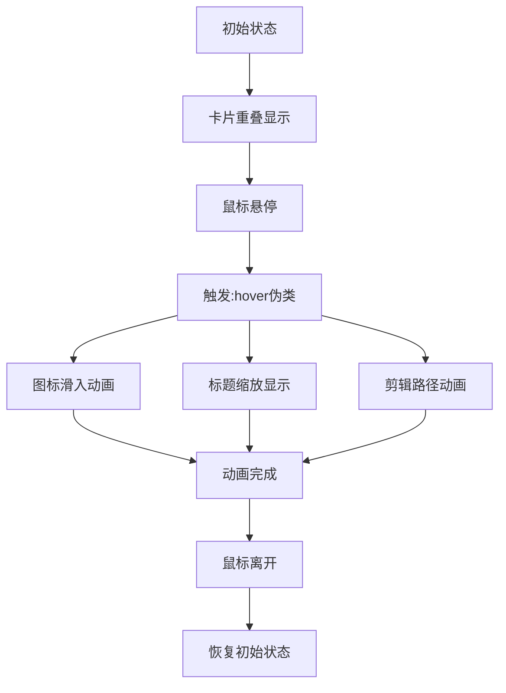

# 简单的 CSS 科幻卡片和悬停效果

## 简介

简单的 CSS 科幻卡片和悬停效果是一种具有未来科技感的 UI 组件，通过 CSS 的 clip-path 属性和 transform 变换，创造出独特的卡片展开动画。当用户将鼠标悬停在卡片上时，卡片会显示动态图标、标题动画以及通过剪辑路径实现的遮罩动画效果。

## 效果特点

### 视觉特性

- **科幻风格设计**: 使用鲜艳的颜色和阴影营造科技感
- **动态图标显示**: 悬停时图标从底部滑入
- **标题缩放动画**: 标题从隐藏状态平滑缩放显示
- **剪辑路径动画**: 通过 clip-path 实现独特的遮罩动画效果

### 技术特性

- **纯 CSS 实现**: 无需 JavaScript，性能优异
- **响应式设计**: 适配不同屏幕尺寸
- **可配置参数**: 支持自定义颜色、尺寸等
- **现代浏览器支持**: 利用 CSS3 新特性

## 工作原理



## 效果演示

<demo react="react/SciFiCardHover/index.tsx" 
:reactFiles="['react/SciFiCardHover/index.tsx','react/SciFiCardHover/index.scss']" 
/>

## 核心实现原理

### 基础实现方案

**核心思路**：

- 使用 CSS 自定义属性`--clr`控制每个卡片的主题颜色
- 通过`:hover`伪类触发悬停状态
- 利用`clip-path`实现遮罩动画效果
- 使用`transform`和`opacity`实现图标和标题动画

**优点**：

- 纯 CSS 实现，性能优异
- 视觉效果独特，具有科幻感
- 代码简洁，易于维护和扩展
- 兼容性好，支持现代浏览器

**适用场景**：

- 科技类网站产品展示
- 游戏界面 UI 元素
- 创意作品集展示
- 未来风格导航菜单

### 核心 CSS 代码

```css
.sci-fi-card {
	position: relative;
	display: flex;
	justify-content: center;
	align-items: center;
	background: var(--clr);
	box-shadow: 0 0 15px #0009, 0 25px 55px var(--clr);
}

.sci-fi-card h2 {
	position: relative;
	color: #020d1e;
	font-size: 4em;
	text-align: center;
	line-height: 1.2em;
	transform: scale(0);
	transition: 0.5s;
	transition-delay: 0s;
	filter: blur(10px);
}

.sci-fi-card:hover h2 {
	transform: scale(1);
	transition-delay: 0.5s;
	filter: blur(0);
}

.sci-fi-card .card-icon {
	position: absolute;
	font-size: 4em;
	transition: 0.5s;
	transition-delay: 0s;
	opacity: 0;
	transform: translateY(100px);
}

.sci-fi-card:hover .card-icon {
	transform: translateY(0);
	transition-delay: 1s;
	opacity: 1;
}
```

### 剪辑路径动画

```css
.clip {
	position: absolute;
	inset: 20px;
	box-shadow: 0 0 0 18px #020d1e;
}

.clip span {
	position: absolute;
	inset: 0;
	background: #020d1e;
	transition: 0.25s;
}

.clip span:nth-child(1) {
	clip-path: polygon(0 0, 50% 40%, 100% 0);
	transition-delay: 0s;
}

.clip span:nth-child(2) {
	clip-path: polygon(0 0, 40% 50%, 50% 100%, 0% 100%);
	transition-delay: 0.25s;
}

.clip span:nth-child(3) {
	clip-path: polygon(60% 50%, 100% 0, 100% 100%, 50% 100%);
	transition-delay: 0.5s;
}

.sci-fi-card:hover .clip span:nth-child(1) {
	clip-path: polygon(0 0, 50% 0%, 100% 0);
}

.sci-fi-card:hover .clip span:nth-child(2) {
	clip-path: polygon(0 0, 0% 100%, 50% 100%, 0% 100%);
}

.sci-fi-card:hover .clip span:nth-child(3) {
	clip-path: polygon(100% 100%, 100% 0, 100% 100%, 50% 100%);
}
```

## 参数配置选项

| 参数名称      | 类型                  | 默认值      | 说明             |
| ------------- | --------------------- | ----------- | ---------------- |
| `cards`       | `CardData[]`          | 见下方      | 卡片数据数组     |
| `cardWidth`   | `number`              | `240`       | 卡片宽度（像素） |
| `cardHeight`  | `number`              | `320`       | 卡片高度（像素） |
| `className`   | `string`              | `''`        | 自定义 CSS 类名  |
| `style`       | `React.CSSProperties` | `{}`        | 自定义样式对象   |
| `onCardClick` | `function`            | `undefined` | 卡片点击回调函数 |

### CardData 数据结构

```typescript
interface CardData {
	id: string; // 卡片唯一标识
	icon: string; // 图标内容（可以是emoji或图标字符）
	title: string; // 主标题
	subtitle: string; // 剉标题
	color: string; // 卡片主题颜色
}
```

默认卡片数据：

```typescript
const defaultCards: CardData[] = [
	{ id: '1', icon: '🎨', title: '01', subtitle: 'Design', color: '#f00' },
	{ id: '2', icon: '💻', title: '02', subtitle: 'Code', color: '#0f0' },
	{ id: '3', icon: '🚀', title: '03', subtitle: 'Launch', color: '#f0f' }
];
```

## 实现方案对比

| 方案            | 优点             | 缺点       | 适用场景 |
| --------------- | ---------------- | ---------- | -------- |
| **纯 CSS**      | 性能好，代码简洁 | 交互有限   | 静态展示 |
| **CSS + JS**    | 交互丰富，可配置 | 复杂度增加 | 动态内容 |
| **Canvas 绘制** | 性能好，效果丰富 | 开发复杂   | 复杂动画 |
| **第三方库**    | 开箱即用         | 增加体积   | 快速开发 |

## 性能优化

### 1. GPU 加速

```css
.sci-fi-card {
	transform: translateZ(0);
	will-change: transform, opacity;
}
```

### 2. 减少重排重绘

通过使用 transform 和 opacity 属性来实现动画效果，避免触发重排和重绘，提升动画性能。

### 3. 合理使用 clip-path

clip-path 属性虽然能实现复杂的遮罩效果，但在某些低端设备上可能会影响性能，建议在复杂场景下谨慎使用。

## 故障排除

### 1. 动画不流畅

**问题**: 过渡动画卡顿或不流畅
**解决方案**:

- 使用 transform 和 opacity 属性实现动画
- 启用 GPU 加速
- 减少同时动画的元素数量
- 优化 CSS 选择器

### 2. 图标不显示

**问题**: 悬停时图标未正确显示
**解决方案**:

- 检查 CSS 选择器优先级
- 确认 transition 属性设置正确
- 验证 HTML 结构是否正确

### 3. 剪辑路径动画异常

**问题**: clip-path 动画效果不符合预期
**解决方案**:

- 检查 polygon 坐标值是否正确
- 确认 transition-delay 设置合理
- 验证浏览器兼容性

## 应用场景

### 1. 产品特性展示

```typescript
const ProductFeatures = () => {
	const features = [
		{ id: '1', icon: '⚡', title: '01', subtitle: 'Fast', color: '#ff6b6b' },
		{ id: '2', icon: '🔒', title: '02', subtitle: 'Secure', color: '#4ecdc4' },
		{ id: '3', icon: '🌐', title: '03', subtitle: 'Global', color: '#45b7d1' }
	];

	return (
		<SciFiCardHover
			cards={features}
			cardWidth={220}
			cardHeight={300}
			onCardClick={id => console.log('Feature clicked:', id)}
		/>
	);
};
```

### 2. 服务介绍页面

```typescript
const ServiceCards = () => {
	return (
		<div className="services-section">
			<h2>我们的服务</h2>
			<SciFiCardHover
				cards={[
					{ id: '1', icon: '🎨', title: 'UI/UX', subtitle: 'Design', color: '#ff9ff3' },
					{ id: '2', icon: '💻', title: 'Web', subtitle: 'Development', color: '#54a0ff' },
					{ id: '3', icon: '📱', title: 'App', subtitle: 'Development', color: '#5f27cd' }
				]}
			/>
		</div>
	);
};
```
