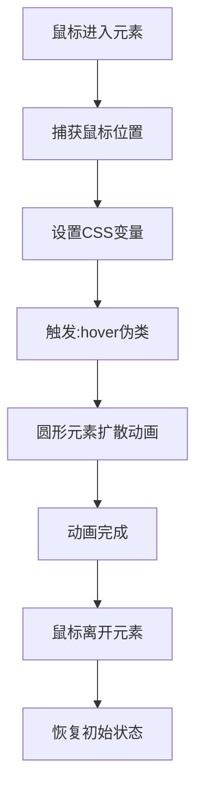

# 鼠标移入移出效果

## 简介

鼠标移入移出效果是一种交互式 UI 组件，通过监听鼠标在元素上的移动位置，实现跟随鼠标位置的动态圆形扩散动画效果。当用户将鼠标移入元素区域时，会从鼠标位置开始扩散出一个圆形动画，营造出独特的视觉反馈。

## 效果特点

### 视觉特性

- **位置跟随**: 动画从鼠标当前位置开始扩散
- **圆形扩散**: 圆形逐渐放大形成扩散效果
- **颜色自定义**: 支持自定义背景色和效果色
- **响应式设计**: 适配不同屏幕尺寸

### 技术特性

- **CSS + JavaScript 实现**: 结合 CSS 动画和 JavaScript 事件处理
- **高性能**: 使用 CSS 变量和 transform 优化性能
- **可配置参数**: 支持自定义尺寸、颜色、圆角等
- **现代浏览器支持**: 利用现代 CSS 特性

## 工作原理



## 效果演示

<demo react="react/MouseEnterEffect/index.tsx" 
:reactFiles="['react/MouseEnterEffect/index.tsx','react/MouseEnterEffect/index.scss']" 
/>

## 核心实现原理

### 基础实现方案

**核心思路**：

- 使用 JavaScript 监听鼠标移动事件，获取鼠标相对元素的位置
- 通过 CSS 变量将鼠标位置传递给伪元素
- 利用`:hover`伪类触发扩散动画
- 使用`transform`和`transition`实现平滑动画效果

**优点**：

- 交互效果自然，增强用户体验
- 代码结构清晰，易于维护和扩展
- 性能良好，避免频繁重排重绘
- 高度可定制，支持多种配置选项

**适用场景**：

- 产品展示卡片
- 按钮交互反馈
- 图片悬停效果
- 创意网页设计

### 核心 CSS 代码

```css
.effect-box {
	position: relative;
	width: var(--box-width, 300px);
	height: var(--box-height, 420px);
	background: var(--bg-color, #232323);
	border-radius: var(--border-radius, 20px);
	overflow: hidden;
}

.effect-box::before {
	content: '';
	position: absolute;
	top: var(--mouse-y, 0);
	left: var(--mouse-x, 0);
	transform: translate(-50%, -50%);
	width: 0;
	height: 0;
	border-radius: 50%;
	background: var(--effect-color, #9dbc28);
	transition: 0.5s, top 0s, left 0s;
}

.effect-box:hover::before {
	width: 1100px;
	height: 1100px;
}
```

### 核心 JavaScript 代码

```typescript
const handleMouseMove = (index: number, e: React.MouseEvent<HTMLDivElement>) => {
	if (containerRef.current) {
		const containerRect = containerRef.current.getBoundingClientRect();
		const x = e.clientX - containerRect.left;
		const y = e.clientY - containerRect.top;

		setBoxes(prev => {
			const newBoxes = [...prev];
			newBoxes[index] = { x, y };
			return newBoxes;
		});
	}
};
```

## 参数配置选项

| 参数名称          | 类型                  | 默认值      | 说明             |
| ----------------- | --------------------- | ----------- | ---------------- |
| `boxCount`        | `number`              | `2`         | 盒子数量         |
| `boxWidth`        | `number`              | `300`       | 盒子宽度（像素） |
| `boxHeight`       | `number`              | `420`       | 盒子高度（像素） |
| `backgroundColor` | `string`              | `'#232323'` | 背景颜色         |
| `effectColor`     | `string`              | `'#9dbc28'` | 效果颜色         |
| `borderRadius`    | `number`              | `20`        | 圆角大小（像素） |
| `className`       | `string`              | `''`        | 自定义 CSS 类名  |
| `style`           | `React.CSSProperties` | `{}`        | 自定义样式对象   |
| `onBoxEnter`      | `function`            | `undefined` | 盒子进入回调函数 |
| `onBoxLeave`      | `function`            | `undefined` | 盒子离开回调函数 |

## 实现方案对比

| 方案                 | 优点                 | 缺点             | 适用场景     |
| -------------------- | -------------------- | ---------------- | ------------ |
| **CSS + JavaScript** | 交互丰富，性能良好   | 需要少量 JS 代码 | 现代网页交互 |
| **纯 CSS**           | 代码简洁，无 JS 依赖 | 无法获取鼠标位置 | 简单悬停效果 |
| **Canvas 绘制**      | 效果丰富，性能优异   | 开发复杂度高     | 复杂图形动画 |
| **第三方库**         | 功能完善，开箱即用   | 增加项目体积     | 快速开发需求 |

## 性能优化

### 1. CSS 变量优化

通过 CSS 变量传递鼠标位置，避免直接操作 DOM 样式，提升性能：

```css
.effect-box::before {
	top: var(--mouse-y, 0);
	left: var(--mouse-x, 0);
}
```

### 2. GPU 加速

使用 transform 启用 GPU 加速，提升动画流畅度：

```css
.effect-box::before {
	transform: translate(-50%, -50%);
}
```

### 3. 事件节流

在实际应用中，可以对鼠标移动事件进行节流处理，避免频繁更新位置：

```typescript
const throttledMouseMove = useThrottle(handleMouseMove, 16); // 60fps
```

## 故障排除

### 1. 动画不触发

**问题**: 鼠标移入时动画未正确触发
**解决方案**:

- 检查 CSS 选择器优先级
- 确认:hover 伪类是否正确应用
- 验证 CSS 变量是否正确设置

### 2. 位置偏移

**问题**: 动画起始位置与鼠标位置不一致
**解决方案**:

- 检查鼠标位置计算逻辑
- 确认元素定位是否正确
- 验证 getBoundingClientRect()返回值

### 3. 性能问题

**问题**: 鼠标移动时页面卡顿
**解决方案**:

- 实现事件节流或防抖
- 减少同时处理的元素数量
- 优化 CSS 选择器和属性

## 应用场景

### 1. 产品展示卡片

```typescript
const ProductCards = () => {
	return (
		<MouseEnterEffect
			boxCount={3}
			boxWidth={250}
			boxHeight={350}
			backgroundColor="#1e1e1e"
			effectColor="#00ff9d"
			borderRadius={15}
			onBoxEnter={index => console.log(`卡片 ${index} 被激活`)}
			onBoxLeave={index => console.log(`卡片 ${index} 失去焦点`)}
		/>
	);
};
```

### 2. 按钮交互反馈

```typescript
const InteractiveButtons = () => {
	return (
		<MouseEnterEffect
			boxCount={4}
			boxWidth={150}
			boxHeight={60}
			backgroundColor="#333"
			effectColor="#ff6b6b"
			borderRadius={30}
		/>
	);
};
```

## 最佳实践

### 设计原则

1. **视觉层次**: 合理使用颜色对比度，确保效果明显但不刺眼
2. **动画时序**: 控制动画速度，避免过快或过慢影响体验
3. **交互反馈**: 提供清晰的进入和离开反馈
4. **性能平衡**: 在效果丰富度和性能之间找到平衡点

### 实施建议

1. **渐进增强**: 为不支持某些 CSS 特性的浏览器提供降级方案
2. **性能监控**: 监控动画性能，避免掉帧
3. **用户体验**: 考虑用户的操作习惯和期望
4. **可访问性**: 确保键盘导航和屏幕阅读器支持
