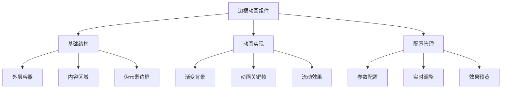

# 边框动画效果

边框动画效果是一种常见的前端视觉特效，通过 CSS 动画和渐变技术实现动态、炫酷的边框样式。本文将介绍如何创建具有流动效果的边框动画，并提供可配置的参数选项。

## 效果特点

### 视觉特性

- **流动动画**: 边框具有流畅的流动动画效果
- **渐变色彩**: 支持多种渐变色彩组合
- **可配置性**: 提供丰富的参数配置选项
- **响应式设计**: 适配不同尺寸的容器

### 技术特性

- **纯 CSS 实现**: 使用 CSS 动画和渐变技术
- **高性能**: 利用硬件加速优化动画性能
- **易集成**: 提供 React 组件封装
- **实时预览**: 支持参数实时调整和预览

## 工作原理



## 效果演示

<demo react="react/BorderAnimation/index.tsx" 
:reactFiles="['react/BorderAnimation/index.tsx','react/BorderAnimation/index.scss']" 
/>

## 核心实现原理

### 基础实现方案

**核心思路**：

- 使用伪元素创建边框效果
- 通过 CSS 渐变实现多彩边框
- 利用动画关键帧实现流动效果
- 通过配置参数控制动画属性

**优点**：

- 实现简单，性能良好
- 视觉效果炫酷，吸引用户注意力
- 配置灵活，易于定制
- 兼容性好，支持主流浏览器

**适用场景**：

- 卡片组件装饰
- 按钮特效增强
- 加载状态指示
- 页面元素高亮

### CSS 核心实现

```scss
@property --a {
	syntax: '<angle>';
	inherits: false;
	initial-value: 0deg;
}

.box {
	position: relative;
	width: 300px;
	height: 300px;
	background: repeating-conic-gradient(
		from var(--a),
		#ff2770 0%,
		#ff2770 5%,
		transparent 5%,
		transparent 40%,
		#ff2770 50%
	);
	animation: rotating 2s linear infinite;
	animation-play-state: paused;
	border-radius: 20px;
	filter: drop-shadow(0 15px 50px #000);
	display: flex;
	justify-content: center;
	align-items: center;

	&:nth-child(1) {
		filter: drop-shadow(0 15px 50px #000) hue-rotate(225deg);
	}

	&:nth-child(3) {
		filter: drop-shadow(0 15px 50px #000) hue-rotate(310deg);
	}

	&::before {
		content: '';
		position: absolute;
		width: 100%;
		height: 100%;
		background: repeating-conic-gradient(
			from var(--a),
			#45f3ff 0%,
			#45f3ff 5%,
			transparent 5%,
			transparent 40%,
			#45f3ff 50%
		);
		animation: rotating 2s linear infinite;
		animation-delay: -0.5s;
		animation-play-state: paused;
		border-radius: 20px;
	}

	&:hover,
	&:hover::before {
		animation-play-state: running;
	}

	&::after {
		content: '';
		position: absolute;
		inset: 6px;
		border: 8px solid #25252b;
		border-radius: 15px;
		background: #2d2d39;
	}

	h2 {
		position: absolute;
		inset: 40px;
		display: flex;
		justify-content: center;
		align-items: center;
		border-radius: 10px;
		background: rgba(0, 0, 0, 0.2);
		color: #fff;
		font-size: 2.5em;
		font-weight: 500;
		z-index: 10000;
		text-transform: uppercase;
		box-shadow: inset 0 10px 20px rgba(0, 0, 0, 0.5);
		border-bottom: 2px solid rgba(255, 255, 255, 0.15);
		margin: 0;
	}
}

@keyframes rotating {
	0% {
		--a: 0deg;
	}
	100% {
		--a: 360deg;
	}
}
```

### React 组件实现

```jsx
import React, { useState } from 'react';
import './index.scss';

interface BorderAnimationProps {
  width?: number;
  height?: number;
  borderRadius?: number;
  className?: string;
  style?: React.CSSProperties;
  children?: React.ReactNode;
}

const BorderAnimation: React.FC<BorderAnimationProps> = ({
  width = 300,
  height = 300,
  borderRadius = 20,
  className = '',
  style = {},
  children
}) => {
  const boxStyle = {
    width: `${width}px`,
    height: `${height}px`,
    borderRadius: `${borderRadius}px`
  } as React.CSSProperties;

  return (
    <div
      className={`box ${className}`}
      style={{ ...style, ...boxStyle }}
    >
      <div className="content">
        {children || <h2>Html</h2>}
      </div>
    </div>
  );
};

export default BorderAnimation;
```

## 参数配置说明

### 基础参数

| 参数名         | 类型                | 默认值          | 说明            |
| -------------- | ------------------- | --------------- | --------------- |
| `width`        | number              | 300             | 容器宽度(px)    |
| `height`       | number              | 300             | 容器高度(px)    |
| `borderRadius` | number              | 20              | 边框圆角(px)    |
| `className`    | string              | ''              | 自定义 CSS 类名 |
| `style`        | React.CSSProperties | {}              | 自定义样式      |
| `children`     | React.ReactNode     | `<h2>Html</h2>` | 内容区域        |

### 配置示例

```jsx
// 基础使用
<BorderAnimation />

// 自定义尺寸
<BorderAnimation
  width={400}
  height={400}
  borderRadius={30}
/>
```

## 高级功能

### 动态配置面板

```jsx
const BorderAnimationDemo: React.FC = () => {
	const [config, setConfig] = useState({
		width: 300,
		height: 200,
		borderRadius: 10,
		animationDuration: 3,
		gradientColors: ['#ff6b6b', '#4ecdc4', '#45b7d1', '#feca57', '#ff9ff3']
	});

	const updateConfig = (newConfig: Partial<typeof config>) => {
		setConfig(prev => ({ ...prev, ...newConfig }));
	};

	return (
		<div className="demo-container">
			<div className="config-panel">
				<h3>参数配置</h3>
				<div className="config-item">
					<label>宽度: {config.width}px</label>
					<input
						type="range"
						min="200"
						max="500"
						value={config.width}
						onChange={e => updateConfig({ width: Number(e.target.value) })}
					/>
				</div>

				<div className="config-item">
					<label>高度: {config.height}px</label>
					<input
						type="range"
						min="150"
						max="400"
						value={config.height}
						onChange={e => updateConfig({ height: Number(e.target.value) })}
					/>
				</div>

				<div className="config-item">
					<label>圆角: {config.borderRadius}px</label>
					<input
						type="range"
						min="0"
						max="30"
						value={config.borderRadius}
						onChange={e => updateConfig({ borderRadius: Number(e.target.value) })}
					/>
				</div>

				<div className="config-item">
					<label>动画时长: {config.animationDuration}s</label>
					<input
						type="range"
						min="1"
						max="10"
						step="0.5"
						value={config.animationDuration}
						onChange={e => updateConfig({ animationDuration: Number(e.target.value) })}
					/>
				</div>
			</div>

			<BorderAnimation {...config} />
		</div>
	);
};
```

### 多种预设主题

```jsx
const themes = {
rainbow: ['#ff6b6b', '#4ecdc4', '#45b7d1', '#feca57', '#ff9ff3'],
ocean: ['#667eea', '#764ba2'],
sunset: ['#f093fb', '#f5576c'],
forest: ['#11998e', '#38ef7d'],
fire: ['#ff416c', '#ff4b2b']
};

const ThemeSelector: React.FC = () => {
const [selectedTheme, setSelectedTheme] = useState('rainbow');

return (
<BorderAnimation
gradientColors={themes[selectedTheme as keyof typeof themes]} >
<div>
<h3>主题: {selectedTheme}</h3>
<select
value={selectedTheme}
onChange={(e) => setSelectedTheme(e.target.value)} >
{Object.keys(themes).map(theme => (
<option key={theme} value={theme}>
{theme}
</option>
))}
</select>
</div>
</BorderAnimation>
);
};

```

## 性能优化

### 1. 硬件加速

```scss
.border-animation {
	/* 启用硬件加速 */
	transform: translateZ(0);
	will-change: transform;

	&::before {
		/* 使用transform而不是改变background-position */
		animation: gradientFlow var(--animation-duration, 3s) ease infinite;
	}
}
```

### 2. 动画优化

```css
@keyframes gradientFlow {
	0% {
		background-position: 0% 50%;
		transform: scale(1);
	}
	50% {
		background-position: 100% 50%;
		transform: scale(1.01);
	}
	100% {
		background-position: 0% 50%;
		transform: scale(1);
	}
}
```

### 3. 组件优化

```jsx
// 使用React.memo优化组件渲染
const MemoizedBorderAnimation = React.memo(BorderAnimation, (prevProps, nextProps) => {
	return (
		prevProps.width === nextProps.width &&
		prevProps.height === nextProps.height &&
		prevProps.borderRadius === nextProps.borderRadius &&
		prevProps.animationDuration === nextProps.animationDuration &&
		prevProps.gradientColors?.join(',') === nextProps.gradientColors?.join(',')
	);
});
```

## 故障排除

### 1. 动画卡顿

**问题**: 动画在某些设备上出现卡顿
**解决方案**:

- 启用硬件加速: `transform: translateZ(0)`
- 减少动画复杂度和颜色数量
- 使用 CSS 动画替代 JavaScript 动画

### 2. 渐变显示异常

**问题**: 渐变在不同浏览器中显示不一致
**解决方案**:

- 添加浏览器前缀
- 使用标准的 CSS 渐变语法
- 测试主流浏览器兼容性

### 3. 响应式适配问题

**问题**: 在小屏幕设备上边框显示异常
**解决方案**:

- 使用媒体查询调整边框宽度
- 设置最小尺寸限制
- 优化渐变在小尺寸下的显示

## 应用场景

### 1. 卡片组件增强

```jsx
const EnhancedCard: React.FC = () => (
	<BorderAnimation
		width={350}
		height={250}
		gradientColors={['#667eea', '#764ba2']}
		borderRadius={15}
	>
		<div className="card-content">
			<h3>卡片标题</h3>
			<p>这是卡片内容，具有炫酷的边框动画效果</p>
		</div>
	</BorderAnimation>
);
```

### 2. 按钮特效

```jsx
const AnimatedButton: React.FC = () => (
	<BorderAnimation
		width={150}
		height={50}
		gradientColors={['#f093fb', '#f5576c']}
		borderRadius={25}
		animationDuration={2}
	>
		<button className="animated-btn">点击按钮</button>
	</BorderAnimation>
);
```

### 3. 加载状态指示

```jsx
const LoadingIndicator: React.FC<{ loading: boolean }> = ({ loading }) => (
	<BorderAnimation
		width={200}
		height={200}
		gradientColors={loading ? ['#3498db', '#2ecc71'] : ['#ccc', '#999']}
		animationDuration={loading ? 1.5 : 0}
	>
		<div className="loading-content">{loading ? '加载中...' : '加载完成'}</div>
	</BorderAnimation>
);
```

## 技术要点

### 1. CSS 渐变实现

- 使用 `linear-gradient` 创建多彩渐变
- 通过 `background-size` 扩大背景尺寸
- 利用 `background-position` 实现流动效果

### 2. 动画性能优化

- 使用 CSS 动画而非 JavaScript 动画
- 启用硬件加速 `transform: translateZ(0)`
- 避免在动画中频繁重绘
