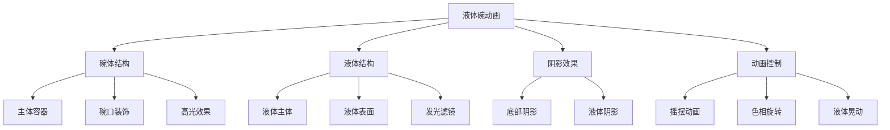

# 彩色发光液体碗动画效果

## 简介

这是一个基于纯CSS实现的彩色发光液体碗动画效果。通过巧妙的CSS动画组合，实现了碗体的摇摆运动、液体的晃动效果以及色相的循环变化，营造出逼真的液体物理效果和炫酷的视觉体验。

## 效果特点

### 视觉特性

- **摇摆动画**: 碗体左右摇摆，模拟真实的物理运动
- **液体晃动**: 液体随碗体摇摆产生相应的晃动效果
- **色相旋转**: 整体色彩在360度色相环中循环变化
- **发光效果**: 液体具有强烈的发光和阴影效果
- **立体感**: 通过阴影和高光营造3D立体效果

### 技术特性

- **纯CSS实现**: 无需JavaScript，性能优异
- **流畅动画**: 5秒循环动画，过渡自然流畅
- **响应式设计**: 支持不同屏幕尺寸适配
- **可定制性**: 支持颜色、尺寸、动画速度等参数调整

## 工作原理



## 效果演示

<demo react="react/ColorfulGlowingLiquidBowl/demo.tsx" 
:reactFiles="['react/ColorfulGlowingLiquidBowl/index.tsx','react/ColorfulGlowingLiquidBowl/index.scss','react/ColorfulGlowingLiquidBowl/demo.tsx']" 
/>

## 核心实现原理

### 基础实现方案

**核心思路**：

- 使用圆形容器模拟碗体结构
- 通过伪元素创建碗口和高光效果
- 液体使用半圆形状配合边框圆角
- 动画采用transform和filter属性实现

**优点**：

- 纯CSS实现，性能优异
- 动画流畅自然，视觉效果佳
- 代码简洁，易于理解和维护
- 兼容性好，支持现代浏览器

**适用场景**：

- 网站装饰动画
- 加载动画效果
- 品牌展示页面
- 创意交互界面

### 碗体结构实现

```typescript
// 碗体主要样式结构
const bowlStyles = {
  width: '300px',
  height: '300px',
  background: 'rgba(255,255,255,0.1)',
  borderRadius: '50%',
  border: '8px solid transparent',
  transformOrigin: 'bottom center'
};
```

### 液体动画实现

```typescript
// 液体晃动动画关键帧
const liquidAnimation = {
  '0%': { transform: 'rotate(0deg)' },
  '25%': { transform: 'rotate(-20deg)' },
  '50%': { transform: 'rotate(0deg)' },
  '75%': { transform: 'rotate(20deg)' },
  '100%': { transform: 'rotate(0deg)' }
};
```

## 参数配置选项

| 参数名称 | 类型 | 默认值 | 说明 |
|---------|------|--------|------|
| **size** | number | 300 | 碗体尺寸大小(px) |
| **liquidColor** | string | '#41c1fb' | 液体主色调 |
| **animationDuration** | number | 5 | 动画周期时长(秒) |
| **swingAngle** | number | 15 | 摇摆最大角度(度) |
| **liquidSwingAngle** | number | 20 | 液体晃动角度(度) |
| **glowIntensity** | number | 80 | 发光强度(px) |
| **backgroundColor** | string | '#121212' | 背景颜色 |
| **enableColorRotation** | boolean | true | 是否启用色相旋转 |

## 实现方案对比

| 方案 | 优点 | 缺点 | 适用场景 |
|------|------|------|----------|
| **纯CSS动画** | 性能好，兼容性佳 | 交互性有限 | 装饰性动画 |
| **Canvas绘制** | 效果丰富，可交互 | 开发复杂度高 | 复杂液体模拟 |
| **WebGL着色器** | 性能极佳，效果逼真 | 学习成本高 | 高端视觉效果 |
| **CSS + JS** | 平衡性能与功能 | 代码量增加 | 交互式应用 |

## 高级功能

### 功能 1：动态颜色控制

```typescript
const useColorControl = (initialColor: string) => {
  const [liquidColor, setLiquidColor] = useState(initialColor);
  const [hueRotation, setHueRotation] = useState(0);

  const updateColor = (color: string) => {
    setLiquidColor(color);
  };

  const rotateHue = (degrees: number) => {
    setHueRotation(degrees);
  };

  return { liquidColor, hueRotation, updateColor, rotateHue };
};
```

### 功能 2：动画速度控制

```typescript
const useAnimationControl = () => {
  const [duration, setDuration] = useState(5);
  const [isPlaying, setIsPlaying] = useState(true);

  const toggleAnimation = () => {
    setIsPlaying(!isPlaying);
  };

  const changeDuration = (newDuration: number) => {
    setDuration(Math.max(1, Math.min(10, newDuration)));
  };

  return { duration, isPlaying, toggleAnimation, changeDuration };
};
```

### 功能 3：尺寸自适应

```typescript
const useResponsiveSize = (baseSize: number) => {
  const [size, setSize] = useState(baseSize);

  useEffect(() => {
    const updateSize = () => {
      const width = window.innerWidth;
      if (width < 768) {
        setSize(baseSize * 0.7);
      } else if (width < 1024) {
        setSize(baseSize * 0.85);
      } else {
        setSize(baseSize);
      }
    };

    updateSize();
    window.addEventListener('resize', updateSize);
    return () => window.removeEventListener('resize', updateSize);
  }, [baseSize]);

  return size;
};
```

## 性能优化

### 1. CSS动画优化

```css
/* 启用硬件加速 */
.bowl {
  will-change: transform, filter;
  transform: translateZ(0);
}

/* 使用transform替代position变化 */
.liquid {
  transform: rotate(0deg);
  transition: transform 0.1s ease-out;
}
```

### 2. 减少重绘重排

```typescript
// 使用CSS变量动态更新样式
const updateStyles = (element: HTMLElement, properties: Record<string, string>) => {
  Object.entries(properties).forEach(([key, value]) => {
    element.style.setProperty(`--${key}`, value);
  });
};
```

### 3. 动画帧率控制

```typescript
const useFrameRate = (targetFPS: number = 60) => {
  const frameInterval = 1000 / targetFPS;
  let lastTime = 0;

  const animate = (currentTime: number) => {
    if (currentTime - lastTime >= frameInterval) {
      // 执行动画逻辑
      lastTime = currentTime;
    }
    requestAnimationFrame(animate);
  };

  return { animate };
};
```

## 故障排除

### 1. 动画不流畅

**问题**: 动画出现卡顿或不连续
**解决方案**:
- 检查CSS动画的timing-function设置
- 确保使用transform而非position属性
- 启用GPU硬件加速
- 减少同时运行的动画数量

### 2. 颜色效果异常

**问题**: 发光效果不明显或颜色显示异常
**解决方案**:
- 检查filter属性的浏览器兼容性
- 确认drop-shadow和hue-rotate的语法正确
- 验证背景色与液体色的对比度
- 调整发光强度参数

### 3. 响应式适配问题

**问题**: 在不同设备上显示效果不一致
**解决方案**:
- 使用相对单位(vw, vh, %)替代固定像素
- 添加媒体查询适配不同屏幕
- 测试不同设备的显示效果
- 考虑设备像素比的影响

## 应用场景

### 1. 品牌展示页面

```typescript
const BrandShowcase = () => (
  <div className="brand-showcase">
    <h1>创新科技</h1>
    <ColorfulGlowingLiquidBowl 
      liquidColor="#ff6b6b"
      size={400}
      animationDuration={6}
    />
    <p>流动的创意，无限的可能</p>
  </div>
);
```

### 2. 加载动画

```typescript
const LoadingAnimation = ({ isLoading }: { isLoading: boolean }) => (
  <div className={`loading-container ${isLoading ? 'visible' : 'hidden'}`}>
    <ColorfulGlowingLiquidBowl size={200} />
    <p>正在加载中...</p>
  </div>
);
```

### 3. 装饰性背景

```typescript
const DecorativeBackground = () => (
  <div className="hero-section">
    <div className="background-animation">
      <ColorfulGlowingLiquidBowl 
        size={600}
        liquidColor="#4a90e2"
        enableColorRotation={true}
      />
    </div>
    <div className="content">
      <h1>欢迎来到未来</h1>
    </div>
  </div>
);