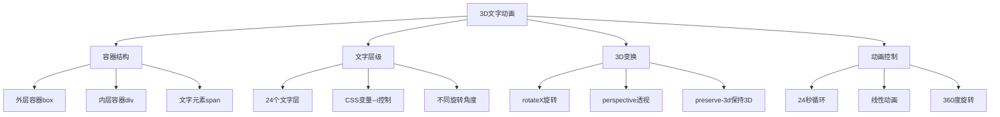

# 纯CSS 3D文字旋转动画效果

## 简介

这是一个基于纯CSS实现的3D文字旋转动画效果。通过CSS 3D变换和关键帧动画，创建了多层文字在3D空间中的旋转效果，形成立体的视觉冲击。每个文字层都有不同的旋转角度和颜色，营造出丰富的层次感和动态效果。

## 效果特点

### 视觉特性

- **3D立体效果**: 文字在3D空间中呈现立体旋转
- **多层叠加**: 24个文字层形成丰富的视觉层次
- **渐变色彩**: 不同层级使用不同的青色系渐变
- **连续旋转**: 360度无限循环旋转动画
- **透视效果**: 通过perspective创建真实的3D视觉

### 技术特性

- **纯CSS实现**: 无需JavaScript，性能优异
- **CSS变量控制**: 使用CSS自定义属性控制层级
- **硬件加速**: 利用transform3d触发GPU加速
- **响应式设计**: 支持不同屏幕尺寸适配

## 工作原理



## 效果演示

<demo react="react/PureCSS3DTextRotation/demo.tsx" 
:reactFiles="['react/PureCSS3DTextRotation/index.tsx','react/PureCSS3DTextRotation/index.scss','react/PureCSS3DTextRotation/demo.tsx']" 
/>

## 核心实现原理

### 基础实现方案

**核心思路**：

- 使用CSS 3D变换创建立体空间
- 通过多个span元素形成文字层级
- 利用CSS变量控制每层的旋转角度
- 关键帧动画实现连续旋转效果

**优点**：

- 纯CSS实现，性能优异
- 3D效果逼真，视觉冲击强
- 代码结构清晰，易于理解
- 兼容性好，支持现代浏览器

**适用场景**：

- 品牌展示页面
- 创意网站首页
- 产品宣传动画
- 艺术展示效果

### 3D变换核心代码

```typescript
// 3D容器设置
const containerStyles = {
  transformStyle: 'preserve-3d',
  perspective: '1000px'
};

// 文字层级旋转
const layerTransform = (index: number) => ({
  transform: `rotateX(${index * 15}deg)`
});
```

### 动画循环实现

```typescript
// 旋转动画关键帧
const rotationAnimation = {
  '0%': { 
    transform: 'perspective(1000px) rotateX(0deg)' 
  },
  '100%': { 
    transform: 'perspective(1000px) rotateX(360deg)' 
  }
};
```

## 参数配置选项

| 参数名称 | 类型 | 默认值 | 说明 |
|---------|------|--------|------|
| **text** | string | 'Html Css' | 显示的文字内容 |
| **layerCount** | number | 24 | 文字层数量 |
| **fontSize** | number | 8 | 字体大小(em) |
| **animationDuration** | number | 24 | 动画周期时长(秒) |
| **rotationStep** | number | 15 | 每层旋转角度间隔(度) |
| **perspective** | number | 1000 | 3D透视距离(px) |
| **primaryColor** | string | '#00ffff' | 主要文字颜色 |
| **secondaryColor** | string | '#7fffd4' | 次要文字颜色 |
| **backgroundColor** | string | '#000000' | 背景颜色 |
| **strokeWidth** | number | 2 | 文字描边宽度(px) |
| **enableShadow** | boolean | true | 是否启用文字阴影 |

## 实现方案对比

| 方案 | 优点 | 缺点 | 适用场景 |
|------|------|------|----------|
| **纯CSS 3D** | 性能好，兼容性佳 | 交互性有限 | 装饰性动画 |
| **Three.js** | 功能强大，效果丰富 | 文件体积大 | 复杂3D场景 |
| **Canvas 2D** | 灵活度高，可交互 | 性能相对较低 | 2D图形动画 |
| **WebGL** | 性能极佳，效果逼真 | 学习成本高 | 高端3D应用 |

## 高级功能

### 功能 1：动态文字内容

```typescript
const useDynamicText = (initialText: string) => {
  const [text, setText] = useState(initialText);
  const [isAnimating, setIsAnimating] = useState(true);

  const updateText = (newText: string) => {
    setText(newText);
  };

  const toggleAnimation = () => {
    setIsAnimating(!isAnimating);
  };

  return { text, isAnimating, updateText, toggleAnimation };
};
```

### 功能 2：颜色主题控制

```typescript
const useColorTheme = () => {
  const [theme, setTheme] = useState({
    primary: '#00ffff',
    secondary: '#7fffd4',
    background: '#000000'
  });

  const updateTheme = (newTheme: Partial<typeof theme>) => {
    setTheme(prev => ({ ...prev, ...newTheme }));
  };

  const presetThemes = {
    cyan: { primary: '#00ffff', secondary: '#7fffd4', background: '#000000' },
    purple: { primary: '#9d4edd', secondary: '#c77dff', background: '#10002b' },
    orange: { primary: '#ff6b35', secondary: '#f7931e', background: '#1a0000' }
  };

  return { theme, updateTheme, presetThemes };
};
```

### 功能 3：动画速度控制

```typescript
const useAnimationControl = () => {
  const [speed, setSpeed] = useState(1);
  const [isPaused, setIsPaused] = useState(false);

  const changeSpeed = (newSpeed: number) => {
    setSpeed(Math.max(0.1, Math.min(5, newSpeed)));
  };

  const togglePause = () => {
    setIsPaused(!isPaused);
  };

  const resetAnimation = () => {
    setSpeed(1);
    setIsPaused(false);
  };

  return { speed, isPaused, changeSpeed, togglePause, resetAnimation };
};
```

## 性能优化

### 1. GPU硬件加速

```css
/* 启用硬件加速 */
.text-3d-container {
  will-change: transform;
  transform: translateZ(0);
  backface-visibility: hidden;
}

/* 优化3D渲染 */
.text-layer {
  transform-style: preserve-3d;
  perspective: 1000px;
}
```

### 2. 动画性能优化

```typescript
// 使用requestAnimationFrame优化动画
const useOptimizedAnimation = () => {
  const animationRef = useRef<number>(0);
  const [isRunning, setIsRunning] = useState(true);

  const animate = useCallback(() => {
    if (isRunning) {
      // 动画逻辑
      animationRef.current = requestAnimationFrame(animate);
    }
  }, [isRunning]);

  useEffect(() => {
    if (isRunning) {
      animationRef.current = requestAnimationFrame(animate);
    }
    return () => cancelAnimationFrame(animationRef.current);
  }, [isRunning, animate]);

  return { setIsRunning };
};
```

### 3. 内存管理

```typescript
// 组件卸载时清理资源
useEffect(() => {
  return () => {
    // 清理动画
    cancelAnimationFrame(animationRef.current);
    // 清理事件监听器
    window.removeEventListener('resize', handleResize);
  };
}, []);
```

## 故障排除

### 1. 3D效果不显示

**问题**: 文字没有3D立体效果
**解决方案**:
- 检查浏览器是否支持CSS 3D变换
- 确认transform-style: preserve-3d设置正确
- 验证perspective属性是否生效
- 检查硬件加速是否启用

### 2. 动画卡顿

**问题**: 旋转动画不流畅或卡顿
**解决方案**:
- 启用GPU硬件加速
- 减少同时渲染的文字层数
- 优化CSS选择器性能
- 使用will-change属性提示浏览器

### 3. 文字显示异常

**问题**: 文字重叠或位置错误
**解决方案**:
- 检查CSS变量--i的值是否正确
- 确认rotateX角度计算无误
- 验证容器尺寸设置
- 调整字体大小和间距

## 应用场景

### 1. 品牌展示

```typescript
const BrandDisplay = () => (
  <div className="brand-showcase">
    <PureCSS3DTextRotation 
      text="BRAND NAME"
      fontSize={10}
      primaryColor="#ff6b35"
      animationDuration={20}
    />
    <p>创新科技，引领未来</p>
  </div>
);
```

### 2. 网站首页

```typescript
const HeroSection = () => (
  <section className="hero">
    <PureCSS3DTextRotation 
      text="WELCOME"
      layerCount={30}
      fontSize={12}
      backgroundColor="#1a1a2e"
    />
    <div className="hero-content">
      <h1>欢迎来到未来世界</h1>
    </div>
  </section>
);
```

### 3. 产品展示

```typescript
const ProductShowcase = () => (
  <div className="product-display">
    <PureCSS3DTextRotation 
      text="INNOVATION"
      primaryColor="#9d4edd"
      secondaryColor="#c77dff"
      animationDuration={15}
    />
    <div className="product-info">
      <h2>创新产品</h2>
      <p>突破传统，定义未来</p>
    </div>
  </div>
);