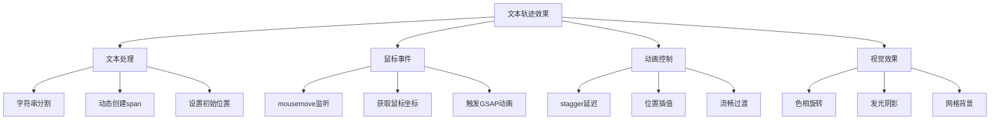

# 动画文本轨迹跟随效果

## 简介

这是一个基于GSAP动画库实现的文本轨迹跟随效果。文本中的每个字符都会独立跟随鼠标移动，通过stagger延迟动画创建流畅的轨迹效果，同时每个字符具有不同的色相旋转，形成彩虹般的视觉效果。

## 效果特点

### 视觉特性

- **鼠标跟随**: 文本字符实时跟随鼠标位置移动
- **延迟动画**: 每个字符有0.05秒的延迟，形成轨迹效果
- **色相变化**: 每个字符具有不同的色相旋转角度
- **发光效果**: 字符具有霓虹灯般的发光阴影
- **网格背景**: 科技感的网格背景增强视觉效果

### 技术特性

- **GSAP动画**: 使用专业动画库确保流畅性能
- **动态生成**: JavaScript动态创建文本字符元素
- **实时交互**: 鼠标移动事件实时触发动画
- **CSS滤镜**: 使用hue-rotate实现色彩变化

## 工作原理



## 效果演示

<demo react="react/AnimatedTextTrail/demo.tsx" 
:reactFiles="['react/AnimatedTextTrail/index.tsx','react/AnimatedTextTrail/index.scss','react/AnimatedTextTrail/demo.tsx']" 
/>

## 核心实现原理

### 基础实现方案

**核心思路**：

- 将文本字符串分割为单个字符
- 为每个字符创建独立的DOM元素
- 使用GSAP的stagger功能实现延迟动画
- 监听鼠标移动事件触发位置更新

**优点**：

- 动画流畅自然，性能优异
- 交互响应迅速，用户体验佳
- 视觉效果丰富，具有科技感
- 代码结构清晰，易于扩展

**适用场景**：

- 创意网站首页
- 交互式展示页面
- 品牌宣传动画
- 游戏界面效果

### 文本处理核心代码

```typescript
// 文本字符分割和元素创建
const createTextElements = (text: string, container: HTMLElement) => {
  for (let i = 0; i < text.length; i++) {
    const span = document.createElement('span');
    span.classList.add('text-char');
    span.style.setProperty('--i', (i + 1).toString());
    span.style.left = `${i * 0.6}em`;
    span.textContent = text[i];
    span.style.filter = `hue-rotate(${i * 10}deg)`;
    container.appendChild(span);
  }
};
```

### GSAP动画实现

```typescript
// 鼠标跟随动画
const handleMouseMove = (e: MouseEvent) => {
  gsap.to('.text-char', {
    x: e.clientX,
    y: e.clientY,
    stagger: 0.05,
    duration: 0.3,
    ease: 'power2.out'
  });
};
```

## 参数配置选项

| 参数名称 | 类型 | 默认值 | 说明 |
|---------|------|--------|------|
| **text** | string | 'animate text trail effect' | 显示的文本内容 |
| **fontSize** | number | 2 | 字体大小(em) |
| **staggerDelay** | number | 0.05 | 字符延迟时间(秒) |
| **animationDuration** | number | 0.3 | 动画持续时间(秒) |
| **charSpacing** | number | 0.6 | 字符间距(em) |
| **hueStep** | number | 10 | 色相旋转步长(度) |
| **textColor** | string | '#00ff9a' | 文本颜色 |
| **glowIntensity** | number | 15 | 发光强度(px) |
| **backgroundColor** | string | '#222222' | 背景颜色 |
| **gridSize** | string | '4vh' | 网格大小 |
| **gridColor** | string | '#333333' | 网格颜色 |
| **enableGlow** | boolean | true | 是否启用发光效果 |

## 实现方案对比

| 方案 | 优点 | 缺点 | 适用场景 |
|------|------|------|----------|
| **GSAP动画** | 性能优异，功能强大 | 需要引入库文件 | 专业动画项目 |
| **CSS动画** | 无需外部依赖 | 复杂交互有限 | 简单动画效果 |
| **Canvas绘制** | 自由度高，效果丰富 | 开发复杂度高 | 复杂图形动画 |
| **Web Animations API** | 原生支持，性能好 | 兼容性相对较差 | 现代浏览器项目 |

## 高级功能

### 功能 1：动态文本更新

```typescript
const useDynamicText = (initialText: string) => {
  const [text, setText] = useState(initialText);
  const [isAnimating, setIsAnimating] = useState(true);

  const updateText = (newText: string) => {
    setText(newText);
    // 重新创建文本元素
  };

  const toggleAnimation = () => {
    setIsAnimating(!isAnimating);
  };

  return { text, isAnimating, updateText, toggleAnimation };
};
```

### 功能 2：动画参数控制

```typescript
const useAnimationControl = () => {
  const [config, setConfig] = useState({
    stagger: 0.05,
    duration: 0.3,
    ease: 'power2.out'
  });

  const updateConfig = (key: string, value: any) => {
    setConfig(prev => ({ ...prev, [key]: value }));
  };

  return { config, updateConfig };
};
```

### 功能 3：颜色主题系统

```typescript
const useColorTheme = () => {
  const [theme, setTheme] = useState({
    textColor: '#00ff9a',
    backgroundColor: '#222222',
    gridColor: '#333333'
  });

  const presetThemes = {
    neon: { textColor: '#00ff9a', backgroundColor: '#222222', gridColor: '#333333' },
    cyber: { textColor: '#ff0080', backgroundColor: '#0a0a0a', gridColor: '#1a1a1a' },
    ocean: { textColor: '#00d4ff', backgroundColor: '#001122', gridColor: '#002244' }
  };

  const applyTheme = (themeName: keyof typeof presetThemes) => {
    setTheme(presetThemes[themeName]);
  };

  return { theme, setTheme, applyTheme, presetThemes };
};
```

## 性能优化

### 1. GSAP性能优化

```typescript
// 使用GSAP的性能优化技巧
const optimizeGSAP = () => {
  // 启用GPU加速
  gsap.set('.text-char', { force3D: true });
  
  // 使用快速选择器
  const chars = gsap.utils.toArray('.text-char');
  
  // 批量更新
  gsap.to(chars, {
    x: (i, target) => target.dataset.x,
    y: (i, target) => target.dataset.y,
    stagger: 0.05
  });
};
```

### 2. 事件节流优化

```typescript
const useThrottledMouseMove = (callback: (e: MouseEvent) => void, delay: number) => {
  const lastCall = useRef(0);
  
  return useCallback((e: MouseEvent) => {
    const now = Date.now();
    if (now - lastCall.current >= delay) {
      lastCall.current = now;
      callback(e);
    }
  }, [callback, delay]);
};
```

### 3. 内存管理

```typescript
// 组件卸载时清理GSAP动画
useEffect(() => {
  return () => {
    gsap.killTweensOf('.text-char');
    // 清理事件监听器
    document.removeEventListener('mousemove', handleMouseMove);
  };
}, []);
```

## 故障排除

### 1. 动画不流畅

**问题**: 鼠标跟随动画出现卡顿
**解决方案**:
- 检查GSAP库是否正确加载
- 使用事件节流减少触发频率
- 启用GPU硬件加速
- 减少同时动画的元素数量

### 2. 文本显示异常

**问题**: 字符重叠或位置错误
**解决方案**:
- 检查字符间距设置
- 确认容器尺寸足够
- 验证CSS transform属性
- 调整字体大小和行高

### 3. 颜色效果不显示

**问题**: 色相旋转效果不明显
**解决方案**:
- 检查CSS filter属性支持
- 调整hue-rotate角度步长
- 确认基础颜色设置正确
- 验证浏览器兼容性

## 应用场景

### 1. 创意网站首页

```typescript
const CreativeHero = () => (
  <section className="hero-section">
    <AnimatedTextTrail 
      text="CREATIVE DESIGN"
      fontSize={3}
      textColor="#ff6b35"
      staggerDelay={0.08}
    />
    <div className="hero-content">
      <h1>创意无限</h1>
    </div>
  </section>
);
```

### 2. 交互式展示

```typescript
const InteractiveDemo = () => (
  <div className="demo-container">
    <AnimatedTextTrail 
      text="INTERACTIVE EXPERIENCE"
      enableGlow={true}
      glowIntensity={25}
    />
    <p>移动鼠标体验效果</p>
  </div>
);
```

### 3. 品牌宣传

```typescript
const BrandShowcase = () => (
  <div className="brand-display">
    <AnimatedTextTrail 
      text="INNOVATION FUTURE"
      textColor="#9d4edd"
      backgroundColor="#10002b"
      animationDuration={0.5}
    />
    <div className="brand-info">
      <h2>未来科技</h2>
    </div>
  </div>
);