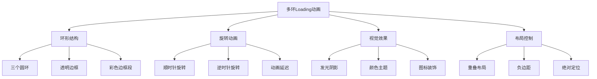

# 多环旋转Loading动画效果

## 简介

这是一个基于纯CSS实现的多环旋转Loading动画效果。通过三个不同颜色的圆环，采用不同的旋转方向、延迟时间和位置布局，配合发光阴影效果，创造出富有层次感和科技感的加载动画。

## 效果特点

### 视觉特性

- **多环结构**: 三个圆环重叠布局，形成复杂的视觉层次
- **双向旋转**: 第一个环顺时针，其他环逆时针旋转
- **发光效果**: 每个环都有强烈的发光阴影效果
- **颜色渐变**: 青色、绿色、粉色三种主题色
- **图标装饰**: 每个环都有FontAwesome图标装饰
- **延迟动画**: 不同的动画延迟创造错位效果

### 技术特性

- **纯CSS实现**: 无需JavaScript，性能优异
- **CSS动画**: 使用keyframes实现流畅旋转
- **滤镜效果**: drop-shadow创造发光效果
- **伪元素**: 使用::before添加图标装饰

## 工作原理



## 效果演示

<demo react="react/MultiRingLoading/demo.tsx" 
:reactFiles="['react/MultiRingLoading/index.tsx','react/MultiRingLoading/index.scss','react/MultiRingLoading/demo.tsx']" 
/>

## 核心实现原理

### 基础实现方案

**核心思路**：

- 使用border创建圆环，只显示部分边框
- 通过transform: rotate实现旋转动画
- 使用filter: drop-shadow创建发光效果
- 负边距实现圆环重叠布局

**优点**：

- 纯CSS实现，性能优异
- 视觉效果丰富，科技感强
- 代码简洁，易于理解
- 兼容性好，支持现代浏览器

**适用场景**：

- 网站加载页面
- 数据处理等待
- 文件上传进度
- 系统初始化界面

### 圆环结构实现

```typescript
// 圆环基础样式
const ringBaseStyles = {
  position: 'relative' as const,
  width: '150px',
  height: '150px',
  border: '4px solid transparent',
  borderRadius: '50%',
  margin: '-30px'
};

// 第一个环（青色，顺时针）
const ring1Styles = {
  ...ringBaseStyles,
  borderTop: '4px solid #24ecff',
  filter: 'drop-shadow(0 0 10px #24ecff) drop-shadow(0 0 30px #24ecff) drop-shadow(0 0 50px #24ecff)',
  animation: 'rotate-clockwise 4s linear infinite'
};
```

### 旋转动画实现

```typescript
// 顺时针旋转动画
const clockwiseAnimation = {
  '0%': { transform: 'rotate(0deg)' },
  '100%': { transform: 'rotate(360deg)' }
};

// 逆时针旋转动画
const counterClockwiseAnimation = {
  '0%': { transform: 'rotate(360deg)' },
  '100%': { transform: 'rotate(0deg)' }
};
```

## 参数配置选项

| 参数名称 | 类型 | 默认值 | 说明 |
|---------|------|--------|------|
| **ringSize** | number | 150 | 圆环尺寸大小(px) |
| **borderWidth** | number | 4 | 边框宽度(px) |
| **animationDuration** | number | 4 | 动画周期时长(秒) |
| **ringOverlap** | number | 30 | 圆环重叠距离(px) |
| **ring1Color** | string | '#24ecff' | 第一个环颜色 |
| **ring2Color** | string | '#93ff2d' | 第二个环颜色 |
| **ring3Color** | string | '#ff1d6c' | 第三个环颜色 |
| **glowIntensity** | number | 30 | 发光强度(px) |
| **backgroundColor** | string | '#111111' | 背景颜色 |
| **enableGlow** | boolean | true | 是否启用发光效果 |
| **enableIcons** | boolean | true | 是否显示图标 |
| **ring3Offset** | number | 66.66 | 第三个环垂直偏移(px) |

## 实现方案对比

| 方案 | 优点 | 缺点 | 适用场景 |
|------|------|------|----------|
| **纯CSS动画** | 性能好，兼容性佳 | 交互性有限 | 简单Loading效果 |
| **SVG动画** | 矢量图形，可缩放 | 代码复杂度高 | 复杂图形动画 |
| **Canvas绘制** | 自由度高，效果丰富 | 性能消耗较大 | 复杂动画效果 |
| **Lottie动画** | 效果精美，易制作 | 文件体积较大 | 高端动画需求 |

## 高级功能

### 功能 1：动态颜色控制

```typescript
const useColorControl = () => {
  const [colors, setColors] = useState({
    ring1: '#24ecff',
    ring2: '#93ff2d',
    ring3: '#ff1d6c'
  });

  const updateColor = (ring: string, color: string) => {
    setColors(prev => ({ ...prev, [ring]: color }));
  };

  const randomizeColors = () => {
    const getRandomColor = () => `#${Math.floor(Math.random()*16777215).toString(16)}`;
    setColors({
      ring1: getRandomColor(),
      ring2: getRandomColor(),
      ring3: getRandomColor()
    });
  };

  return { colors, updateColor, randomizeColors };
};
```

### 功能 2：动画速度控制

```typescript
const useAnimationControl = () => {
  const [speed, setSpeed] = useState(1);
  const [isPaused, setIsPaused] = useState(false);

  const changeSpeed = (newSpeed: number) => {
    setSpeed(Math.max(0.1, Math.min(5, newSpeed)));
  };

  const togglePause = () => {
    setIsPaused(!isPaused);
  };

  const getAnimationDuration = (baseDuration: number) => {
    return baseDuration / speed;
  };

  return { speed, isPaused, changeSpeed, togglePause, getAnimationDuration };
};
```

### 功能 3：尺寸自适应

```typescript
const useResponsiveSize = (baseSize: number) => {
  const [size, setSize] = useState(baseSize);

  useEffect(() => {
    const updateSize = () => {
      const width = window.innerWidth;
      if (width < 768) {
        setSize(baseSize * 0.6);
      } else if (width < 1024) {
        setSize(baseSize * 0.8);
      } else {
        setSize(baseSize);
      }
    };

    updateSize();
    window.addEventListener('resize', updateSize);
    return () => window.removeEventListener('resize', updateSize);
  }, [baseSize]);

  return { size, setSize };
};
```

## 性能优化

### 1. CSS动画优化

```css
/* 启用硬件加速 */
.ring {
  will-change: transform;
  transform: translateZ(0);
  backface-visibility: hidden;
}

/* 使用transform替代其他属性 */
.ring {
  transform: rotate(0deg);
  transition: transform 0.1s ease-out;
}
```

### 2. 减少重绘重排

```typescript
// 使用CSS变量动态更新样式
const updateRingStyles = (element: HTMLElement, properties: Record<string, string>) => {
  Object.entries(properties).forEach(([key, value]) => {
    element.style.setProperty(`--${key}`, value);
  });
};
```

### 3. 内存管理

```typescript
// 组件卸载时清理动画
useEffect(() => {
  return () => {
    // 清理CSS动画
    const rings = document.querySelectorAll('.ring');
    rings.forEach(ring => {
      (ring as HTMLElement).style.animation = 'none';
    });
  };
}, []);
```

## 故障排除

### 1. 动画不流畅

**问题**: 旋转动画出现卡顿或不连续
**解决方案**:
- 启用GPU硬件加速
- 检查CSS动画的timing-function设置
- 减少同时运行的动画数量
- 使用transform而非其他属性

### 2. 发光效果异常

**问题**: drop-shadow效果不明显或显示异常
**解决方案**:
- 检查filter属性的浏览器兼容性
- 调整发光强度和颜色对比度
- 确认背景色与发光色的搭配
- 验证drop-shadow语法正确性

### 3. 圆环重叠问题

**问题**: 圆环位置不正确或重叠效果异常
**解决方案**:
- 检查负边距设置
- 确认容器的flex布局
- 调整圆环的position属性
- 验证z-index层级关系

## 应用场景

### 1. 页面加载动画

```typescript
const PageLoader = ({ isLoading }: { isLoading: boolean }) => (
  <div className={`page-loader ${isLoading ? 'visible' : 'hidden'}`}>
    <MultiRingLoading 
      ringSize={200}
      animationDuration={3}
      enableGlow={true}
    />
    <p>正在加载中...</p>
  </div>
);
```

### 2. 数据处理等待

```typescript
const DataProcessor = ({ isProcessing }: { isProcessing: boolean }) => (
  <div className="data-processor">
    {isProcessing && (
      <div className="processing-overlay">
        <MultiRingLoading 
          ring1Color="#4a90e2"
          ring2Color="#7ed321"
          ring3Color="#f5a623"
        />
        <p>数据处理中...</p>
      </div>
    )}
  </div>
);
```

### 3. 文件上传进度

```typescript
const FileUploader = ({ uploadProgress }: { uploadProgress: number }) => (
  <div className="file-uploader">
    <MultiRingLoading 
      ringSize={120}
      animationDuration={2}
      backgroundColor="#f8f9fa"
    />
    <div className="progress-text">
      上传进度: {uploadProgress}%
    </div>
  </div>
);