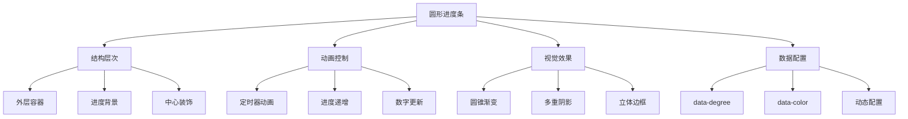

# 动画圆形进度条效果

## 简介

这是一个基于CSS圆锥渐变（conic-gradient）和JavaScript动画实现的圆形进度条效果。通过定时器逐步更新进度值，配合圆锥渐变创造出流畅的圆形填充动画，同时支持自定义颜色、进度值和动画速度。

## 效果特点

### 视觉特性

- **圆锥渐变**: 使用CSS conic-gradient实现圆形进度填充
- **立体效果**: 多重阴影和边框创造立体视觉效果
- **动画填充**: 进度值从0逐步增长到目标值
- **实时数字**: 百分比数字与进度条同步更新
- **多重层次**: 外圆、内圆、中心圆的层次结构
- **自定义颜色**: 每个进度条可设置独立颜色

### 技术特性

- **纯CSS样式**: 使用伪元素和渐变实现视觉效果
- **JavaScript动画**: 定时器控制进度增长动画
- **数据驱动**: 通过data属性配置进度和颜色
- **响应式设计**: 支持不同屏幕尺寸适配

## 工作原理



## 效果演示

<demo react="react/CircularProgressBar/demo.tsx" 
:reactFiles="['react/CircularProgressBar/index.tsx','react/CircularProgressBar/index.scss','react/CircularProgressBar/demo.tsx']" 
/>

## 核心实现原理

### 基础实现方案

**核心思路**：

- 使用CSS圆锥渐变创建圆形进度填充效果
- 通过JavaScript定时器实现进度动画
- 伪元素创建多层视觉结构
- data属性存储配置信息

**优点**：

- 视觉效果丰富，立体感强
- 动画流畅自然，用户体验佳
- 代码结构清晰，易于扩展
- 性能优异，兼容性好

**适用场景**：

- 数据仪表盘
- 技能展示页面
- 加载进度显示
- 统计数据可视化

### 圆锥渐变实现

```typescript
// 圆锥渐变进度条核心实现
const updateProgress = (element: HTMLElement, progress: number, color: string) => {
  element.style.background = `conic-gradient(${color} 0% ${progress}%, #222 0%)`;
};

// 动画控制逻辑
const animateProgress = (targetProgress: number, color: string, onUpdate: (progress: number) => void) => {
  let currentProgress = 0;
  const interval = setInterval(() => {
    currentProgress += 1;
    if (currentProgress > targetProgress) {
      clearInterval(interval);
      return;
    }
    onUpdate(currentProgress);
  }, 50);
};
```

### 多层结构实现

```typescript
// 进度条结构样式
const progressBarStyles = {
  container: {
    position: 'relative',
    width: '200px',
    height: '200px',
    borderRadius: '50%'
  },
  
  // 内层遮罩
  innerMask: {
    position: 'absolute',
    inset: '5px',
    borderRadius: '50%',
    background: '#222',
    opacity: 0.8
  },
  
  // 中心装饰
  centerDecoration: {
    position: 'absolute',
    width: '120px',
    height: '120px',
    background: '#333',
    border: '15px solid #4d4c51',
    borderRadius: '50%'
  }
};
```

## 参数配置选项

| 参数名称 | 类型 | 默认值 | 说明 |
|---------|------|--------|------|
| **progress** | number | 0 | 进度值(0-100) |
| **color** | string | '#ff2972' | 进度条颜色 |
| **size** | number | 200 | 圆形尺寸大小(px) |
| **animationSpeed** | number | 50 | 动画速度(ms) |
| **strokeWidth** | number | 5 | 进度条宽度(px) |
| **backgroundColor** | string | '#222' | 背景颜色 |
| **centerColor** | string | '#333' | 中心圆颜色 |
| **borderColor** | string | '#4d4c51' | 边框颜色 |
| **textColor** | string | '#ffffff' | 文字颜色 |
| **showPercentage** | boolean | true | 是否显示百分比 |
| **title** | string | '' | 进度条标题 |
| **enableAnimation** | boolean | true | 是否启用动画 |

## 实现方案对比

| 方案 | 优点 | 缺点 | 适用场景 |
|------|------|------|----------|
| **CSS圆锥渐变** | 性能好，效果自然 | 兼容性要求较高 | 现代浏览器项目 |
| **SVG路径动画** | 兼容性好，可控性强 | 代码复杂度高 | 复杂进度效果 |
| **Canvas绘制** | 自由度高，效果丰富 | 性能消耗较大 | 复杂图表应用 |
| **CSS边框动画** | 兼容性佳，简单易用 | 效果相对有限 | 简单进度显示 |

## 高级功能

### 功能 1：多进度条管理

```typescript
const useMultipleProgress = () => {
  const [progressList, setProgressList] = useState([
    { id: 1, value: 84, color: '#ff2972', title: 'HTML' },
    { id: 2, value: 58, color: '#dee800', title: 'CSS' },
    { id: 3, value: 95, color: '#04fc43', title: 'JavaScript' }
  ]);

  const updateProgress = (id: number, value: number) => {
    setProgressList(prev => 
      prev.map(item => 
        item.id === id ? { ...item, value } : item
      )
    );
  };

  const addProgress = (newProgress: any) => {
    setProgressList(prev => [...prev, { ...newProgress, id: Date.now() }]);
  };

  return { progressList, updateProgress, addProgress };
};
```

### 功能 2：动画控制系统

```typescript
const useAnimationControl = () => {
  const [isAnimating, setIsAnimating] = useState(false);
  const [animationSpeed, setAnimationSpeed] = useState(50);

  const startAnimation = (targetProgress: number, onUpdate: (progress: number) => void) => {
    setIsAnimating(true);
    let currentProgress = 0;
    
    const interval = setInterval(() => {
      currentProgress += 1;
      if (currentProgress > targetProgress) {
        clearInterval(interval);
        setIsAnimating(false);
        return;
      }
      onUpdate(currentProgress);
    }, animationSpeed);
  };

  const pauseAnimation = () => {
    setIsAnimating(false);
  };

  return { isAnimating, animationSpeed, setAnimationSpeed, startAnimation, pauseAnimation };
};
```

### 功能 3：主题配色系统

```typescript
const useThemeColors = () => {
  const [currentTheme, setCurrentTheme] = useState('default');

  const themes = {
    default: {
      colors: ['#ff2972', '#dee800', '#04fc43'],
      background: '#222',
      center: '#333',
      border: '#4d4c51'
    },
    ocean: {
      colors: ['#00d4ff', '#0099cc', '#006699'],
      background: '#001122',
      center: '#002244',
      border: '#003366'
    },
    sunset: {
      colors: ['#ff6b35', '#f7931e', '#ffcc02'],
      background: '#330000',
      center: '#441100',
      border: '#552200'
    }
  };

  const applyTheme = (themeName: string) => {
    setCurrentTheme(themeName);
    return themes[themeName] || themes.default;
  };

  return { currentTheme, themes, applyTheme };
};
```

## 性能优化

### 1. 动画性能优化

```typescript
// 使用requestAnimationFrame优化动画
const optimizedAnimation = (targetProgress: number, onUpdate: (progress: number) => void) => {
  let currentProgress = 0;
  let lastTime = 0;
  
  const animate = (currentTime: number) => {
    if (currentTime - lastTime >= 50) { // 控制帧率
      currentProgress += 1;
      if (currentProgress > targetProgress) {
        return;
      }
      onUpdate(currentProgress);
      lastTime = currentTime;
    }
    requestAnimationFrame(animate);
  };
  
  requestAnimationFrame(animate);
};
```

### 2. 内存管理

```typescript
// 组件卸载时清理定时器
useEffect(() => {
  const intervals: NodeJS.Timeout[] = [];
  
  return () => {
    intervals.forEach(interval => clearInterval(interval));
  };
}, []);
```

### 3. 渲染优化

```typescript
// 使用useMemo缓存样式计算
const progressStyle = useMemo(() => ({
  background: `conic-gradient(${color} 0% ${progress}%, #222 0%)`
}), [color, progress]);
```

## 故障排除

### 1. 圆锥渐变不显示

**问题**: 进度条没有显示圆锥渐变效果
**解决方案**:
- 检查浏览器对conic-gradient的支持
- 确认颜色值格式正确
- 验证百分比计算是否正确
- 添加浏览器前缀支持

### 2. 动画不流畅

**问题**: 进度动画出现卡顿或跳跃
**解决方案**:
- 调整定时器间隔时间
- 使用requestAnimationFrame替代setInterval
- 减少DOM操作频率
- 优化CSS渲染性能

### 3. 层级显示异常

**问题**: 文字或装饰元素被遮挡
**解决方案**:
- 检查z-index层级设置
- 确认position属性正确
- 验证伪元素的层级关系
- 调整元素的堆叠顺序

## 应用场景

### 1. 技能展示页面

```typescript
const SkillsDisplay = () => (
  <div className="skills-section">
    <h2>技能水平</h2>
    <div className="skills-grid">
      <CircularProgressBar progress={90} color="#ff2972" title="React" />
      <CircularProgressBar progress={85} color="#dee800" title="TypeScript" />
      <CircularProgressBar progress={78} color="#04fc43" title="Node.js" />
    </div>
  </div>
);
```

### 2. 数据仪表盘

```typescript
const Dashboard = ({ metrics }: { metrics: any[] }) => (
  <div className="dashboard">
    <h1>系统监控</h1>
    <div className="metrics-container">
      {metrics.map(metric => (
        <CircularProgressBar
          key={metric.id}
          progress={metric.value}
          color={metric.color}
          title={metric.name}
          size={150}
        />
      ))}
    </div>
  </div>
);
```

### 3. 加载进度显示

```typescript
const LoadingProgress = ({ progress }: { progress: number }) => (
  <div className="loading-container">
    <CircularProgressBar
      progress={progress}
      color="#00d4ff"
      title="加载中..."
      showPercentage={true}
      size={120}
    />
    <p>正在处理您的请求...</p>
  </div>
);