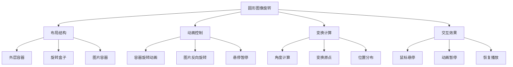

# 圆形图像旋转动画效果

## 简介

这是一个基于CSS变换（transform）和动画（animation）实现的圆形图像旋转效果。多张图片围绕中心点做圆周运动，每张图片保持正立状态，同时支持鼠标悬停暂停动画，创造出富有动感的视觉效果。

## 效果特点

### 视觉特性

- **圆周运动**: 图片围绕中心点做圆形轨道运动
- **图片正立**: 每张图片在旋转过程中保持正立状态
- **圆形边框**: 图片具有圆形裁剪和白色边框装饰
- **流畅动画**: 15秒完整旋转一周，动画流畅自然
- **悬停暂停**: 鼠标悬停时动画暂停，移开继续
- **响应式布局**: 支持不同屏幕尺寸适配

### 技术特性

- **纯CSS实现**: 无需JavaScript，性能优异
- **CSS变量**: 使用--i变量控制图片位置
- **双重变换**: 容器旋转+图片反向旋转保持正立
- **transform-origin**: 精确控制旋转中心点

## 工作原理



## 效果演示

<demo react="react/CircularImageRotation/demo.tsx" 
:reactFiles="['react/CircularImageRotation/index.tsx','react/CircularImageRotation/index.scss','react/CircularImageRotation/demo.tsx']" 
/>

## 核心实现原理

### 基础实现方案

**核心思路**：

- 使用CSS变量控制每张图片的初始角度
- 容器整体旋转，图片反向旋转保持正立
- transform-origin设置旋转中心点
- 悬停时暂停动画播放

**优点**：

- 纯CSS实现，性能优异
- 动画流畅，视觉效果佳
- 代码简洁，易于理解
- 兼容性好，支持现代浏览器

**适用场景**：

- 产品展示页面
- 团队成员介绍
- 图片画廊展示
- 品牌Logo轮播

### 角度计算实现

```typescript
// 图片位置角度计算
const calculateImagePosition = (index: number, totalImages: number) => {
  const angle = (360 / totalImages) * index;
  return {
    transform: `rotate(${angle}deg)`,
    transformOrigin: '190px' // 旋转半径
  };
};

// 图片保持正立的反向旋转
const calculateImageRotation = (index: number, totalImages: number) => {
  const angle = -(360 / totalImages) * index;
  return {
    transform: `rotate(${angle}deg)`
  };
};
```

### 动画控制实现

```typescript
// 容器旋转动画
const containerAnimation = {
  animation: 'rotate 15s linear infinite',
  '@keyframes rotate': {
    '0%': { transform: 'rotate(0deg)' },
    '100%': { transform: 'rotate(360deg)' }
  }
};

// 图片反向旋转动画
const imageAnimation = {
  animation: 'counterRotate 15s linear infinite',
  '@keyframes counterRotate': {
    '0%': { transform: 'rotate(0deg)' },
    '100%': { transform: 'rotate(-360deg)' }
  }
};
```

## 参数配置选项

| 参数名称 | 类型 | 默认值 | 说明 |
|---------|------|--------|------|
| **imageCount** | number | 8 | 图片数量 |
| **containerSize** | number | 300 | 容器尺寸大小(px) |
| **imageSize** | number | 80 | 单张图片尺寸(px) |
| **rotationRadius** | number | 190 | 旋转半径距离(px) |
| **animationDuration** | number | 15 | 动画周期时长(秒) |
| **borderWidth** | number | 2 | 图片边框宽度(px) |
| **borderColor** | string | '#ffffff' | 图片边框颜色 |
| **backgroundColor** | string | '#222222' | 背景颜色 |
| **enableHoverPause** | boolean | true | 是否启用悬停暂停 |
| **clockwise** | boolean | true | 是否顺时针旋转 |
| **imageUrls** | string[] | [] | 自定义图片URL数组 |
| **autoGenerate** | boolean | true | 是否自动生成随机图片 |

## 实现方案对比

| 方案 | 优点 | 缺点 | 适用场景 |
|------|------|------|----------|
| **CSS变换动画** | 性能好，流畅度高 | 交互性有限 | 简单旋转展示 |
| **JavaScript控制** | 交互性强，可控性高 | 性能消耗较大 | 复杂交互需求 |
| **SVG路径动画** | 矢量图形，可缩放 | 代码复杂度高 | 复杂路径动画 |
| **Canvas绘制** | 自由度高，效果丰富 | 开发成本较高 | 复杂图形动画 |

## 高级功能

### 功能 1：动态图片管理

```typescript
const useImageManager = () => {
  const [images, setImages] = useState<string[]>([]);
  const [imageCount, setImageCount] = useState(8);

  const generateRandomImages = (count: number) => {
    const newImages = Array.from({ length: count }, (_, index) => 
      `https://picsum.photos/200/200?random=${Date.now()}-${index}`
    );
    setImages(newImages);
  };

  const addImage = (url: string) => {
    setImages(prev => [...prev, url]);
    setImageCount(prev => prev + 1);
  };

  const removeImage = (index: number) => {
    setImages(prev => prev.filter((_, i) => i !== index));
    setImageCount(prev => prev - 1);
  };

  return { images, imageCount, generateRandomImages, addImage, removeImage };
};
```

### 功能 2：动画控制系统

```typescript
const useAnimationControl = () => {
  const [isPlaying, setIsPlaying] = useState(true);
  const [speed, setSpeed] = useState(1);
  const [direction, setDirection] = useState(1); // 1: 顺时针, -1: 逆时针

  const togglePlayPause = () => {
    setIsPlaying(!isPlaying);
  };

  const changeSpeed = (newSpeed: number) => {
    setSpeed(Math.max(0.1, Math.min(5, newSpeed)));
  };

  const reverseDirection = () => {
    setDirection(prev => prev * -1);
  };

  const getAnimationDuration = (baseDuration: number) => {
    return baseDuration / speed;
  };

  return { 
    isPlaying, 
    speed, 
    direction, 
    togglePlayPause, 
    changeSpeed, 
    reverseDirection, 
    getAnimationDuration 
  };
};
```

### 功能 3：布局自适应

```typescript
const useResponsiveLayout = () => {
  const [layout, setLayout] = useState({
    containerSize: 300,
    imageSize: 80,
    rotationRadius: 190
  });

  useEffect(() => {
    const updateLayout = () => {
      const width = window.innerWidth;
      if (width < 768) {
        setLayout({
          containerSize: 200,
          imageSize: 50,
          rotationRadius: 120
        });
      } else if (width < 1024) {
        setLayout({
          containerSize: 250,
          imageSize: 65,
          rotationRadius: 155
        });
      } else {
        setLayout({
          containerSize: 300,
          imageSize: 80,
          rotationRadius: 190
        });
      }
    };

    updateLayout();
    window.addEventListener('resize', updateLayout);
    return () => window.removeEventListener('resize', updateLayout);
  }, []);

  return layout;
};
```

## 性能优化

### 1. CSS动画优化

```css
/* 启用硬件加速 */
.rotation-container {
  will-change: transform;
  transform: translateZ(0);
  backface-visibility: hidden;
}

/* 优化图片渲染 */
.image-item {
  will-change: transform;
  transform: translateZ(0);
  image-rendering: optimizeQuality;
}
```

### 2. 图片加载优化

```typescript
// 图片预加载
const preloadImages = (urls: string[]) => {
  urls.forEach(url => {
    const img = new Image();
    img.src = url;
  });
};

// 懒加载实现
const useLazyLoading = () => {
  const [loadedImages, setLoadedImages] = useState<Set<number>>(new Set());
  
  const markImageLoaded = (index: number) => {
    setLoadedImages(prev => new Set([...prev, index]));
  };

  return { loadedImages, markImageLoaded };
};
```

### 3. 内存管理

```typescript
// 组件卸载时清理
useEffect(() => {
  return () => {
    // 清理动画
    const elements = document.querySelectorAll('.rotation-animation');
    elements.forEach(el => {
      (el as HTMLElement).style.animation = 'none';
    });
  };
}, []);
```

## 故障排除

### 1. 图片不显示

**问题**: 图片无法正常显示或加载失败
**解决方案**:
- 检查图片URL是否正确
- 确认图片服务器支持跨域访问
- 添加图片加载错误处理
- 使用占位图片作为备选

### 2. 动画不流畅

**问题**: 旋转动画出现卡顿或不连续
**解决方案**:
- 启用CSS硬件加速
- 检查transform属性的浏览器兼容性
- 减少同时运行的动画数量
- 优化图片大小和格式

### 3. 布局错位

**问题**: 图片位置不正确或重叠
**解决方案**:
- 检查transform-origin设置
- 确认角度计算公式正确
- 验证容器尺寸和旋转半径
- 调整图片尺寸比例

## 应用场景

### 1. 产品展示轮播

```typescript
const ProductShowcase = ({ products }: { products: any[] }) => (
  <div className="product-showcase">
    <h2>热门产品</h2>
    <CircularImageRotation
      images={products.map(p => p.image)}
      imageCount={products.length}
      animationDuration={20}
      enableHoverPause={true}
    />
  </div>
);
```

### 2. 团队成员介绍

```typescript
const TeamMembers = ({ members }: { members: any[] }) => (
  <div className="team-section">
    <h1>我们的团队</h1>
    <CircularImageRotation
      images={members.map(m => m.avatar)}
      imageCount={members.length}
      containerSize={400}
      imageSize={100}
    />
  </div>
);
```

### 3. 品牌合作伙伴

```typescript
const Partners = ({ partners }: { partners: any[] }) => (
  <div className="partners-section">
    <h2>合作伙伴</h2>
    <CircularImageRotation
      images={partners.map(p => p.logo)}
      imageCount={partners.length}
      animationDuration={25}
      clockwise={false}
    />
  </div>
);