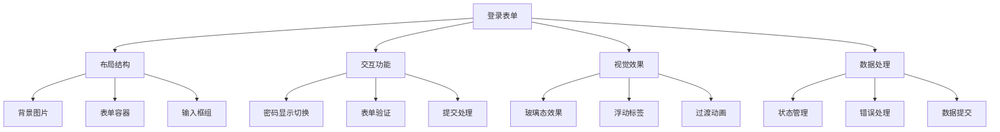

# 玻璃态登录表单效果

## 简介

这是一个基于CSS玻璃态效果（Glassmorphism）和React状态管理实现的现代化登录表单。通过毛玻璃背景、浮动标签、密码显示切换等功能，创造出富有层次感和科技感的用户界面。

## 效果特点

### 视觉特性

- **玻璃态背景**: 半透明毛玻璃效果，带有模糊背景
- **浮动标签**: 输入框获得焦点时标签向上浮动
- **图标装饰**: 锁形图标增强视觉识别
- **响应式设计**: 适配不同屏幕尺寸
- **平滑动画**: CSS过渡效果创造流畅交互

### 功能特性

- **密码显示切换**: 点击眼睛图标切换密码显示状态
- **表单验证**: 支持邮箱格式验证和密码强度检查
- **状态管理**: React Hook管理表单状态
- **错误提示**: 实时显示验证错误信息
- **键盘事件**: 支持回车键提交表单

## 工作原理



## 效果演示

<demo react="react/GlassMorphismLoginForm/demo.tsx" 
:reactFiles="['react/GlassMorphismLoginForm/index.tsx','react/GlassMorphismLoginForm/index.scss','react/GlassMorphismLoginForm/demo.tsx']" 
/>

## 核心实现原理

### 基础实现方案

**核心思路**：

- 使用CSS backdrop-filter实现玻璃态模糊效果
- React状态管理密码显示状态和表单数据
- CSS浮动标签实现现代化输入框交互
- 表单验证确保数据完整性

**优点**：

- 视觉效果现代，用户体验佳
- 代码结构清晰，易于维护
- 功能完整，交互友好
- 响应式设计，兼容性好

**适用场景**：

- 网站登录页面
- 后台管理系统
- 移动应用登录
- 产品演示页面

### 玻璃态效果实现

```typescript
// 玻璃态效果核心样式
const glassMorphismStyles = {
  background: 'hsla(0, 0%, 10%, 0.1)',
  border: '2px solid #ffffff',
  backdropFilter: 'blur(8px)',
  borderRadius: '1rem',
  boxShadow: '0 8px 32px rgba(0, 0, 0, 0.1)'
};

// 毛玻璃背景图片
const backgroundStyles = {
  position: 'absolute' as const,
  width: '100%',
  height: '100%',
  objectFit: 'cover',
  objectPosition: 'center',
  filter: 'brightness(0.8)' // 降低亮度增强对比
};
```

### 浮动标签实现

```typescript
// 浮动标签动画
const floatingLabelAnimation = {
  transition: 'top 0.3s, font-size 0.3s',
  position: 'absolute' as const,
  left: 0,
  top: '13px',
  fontWeight: '500'
};

// 获得焦点时的标签状态
const focusedLabelStyles = {
  top: '-12px',
  fontSize: '0.813rem',
  fontWeight: '500'
};
```

## 参数配置选项

| 参数名称 | 类型 | 默认值 | 说明 |
|---------|------|--------|------|
| **formWidth** | number | 432 | 表单宽度(px) |
| **formPadding** | number | 3 | 表单内边距(rem) |
| **borderColor** | string | '#ffffff' | 边框颜色 |
| **backgroundColor** | string | 'hsla(0, 0%, 10%, 0.1)' | 背景颜色 |
| **borderRadius** | number | 1 | 圆角大小(rem) |
| **backdropBlur** | number | 8 | 毛玻璃模糊强度(px) |
| **enablePasswordToggle** | boolean | true | 是否启用密码切换 |
| **enableRememberMe** | boolean | true | 是否显示记住我选项 |
| **enableForgotPassword** | boolean | true | 是否显示忘记密码 |
| **validateOnSubmit** | boolean | true | 提交时是否验证 |
| **autoFocus** | boolean | false | 是否自动聚焦 |
| **backgroundImage** | string | '' | 背景图片URL |

## 实现方案对比

| 方案 | 优点 | 缺点 | 适用场景 |
|------|------|------|----------|
| **CSS玻璃态** | 视觉效果佳，性能好 | 兼容性要求较高 | 现代化界面设计 |
| **纯表单验证** | 功能完整，用户体验好 | 代码复杂度高 | 重要登录场景 |
| **第三方组件** | 开发效率高，功能丰富 | 定制性有限 | 快速开发项目 |
| **原生HTML表单** | 兼容性好，简单易用 | 视觉效果有限 | 简单登录需求 |

## 高级功能

### 功能 1：表单验证系统

```typescript
const useFormValidation = () => {
  const [errors, setErrors] = useState<Record<string, string>>({});

  const validateEmail = (email: string) => {
    const emailRegex = /^[^\s@]+@[^\s@]+\.[^\s@]+$/;
    if (!email) return '邮箱不能为空';
    if (!emailRegex.test(email)) return '请输入有效的邮箱地址';
    return '';
  };

  const validatePassword = (password: string) => {
    if (!password) return '密码不能为空';
    if (password.length < 6) return '密码至少6位';
    if (!/(?=.*[a-z])(?=.*[A-Z])(?=.*\d)/.test(password)) {
      return '密码需包含大小写字母和数字';
    }
    return '';
  };

  const validateForm = (formData: any) => {
    const newErrors: Record<string, string> = {};
    
    const emailError = validateEmail(formData.email);
    if (emailError) newErrors.email = emailError;
    
    const passwordError = validatePassword(formData.password);
    if (passwordError) newErrors.password = passwordError;
    
    setErrors(newErrors);
    return Object.keys(newErrors).length === 0;
  };

  return { errors, validateForm, validateEmail, validatePassword };
};
```

### 功能 2：密码强度指示器

```typescript
const usePasswordStrength = () => {
  const [strength, setStrength] = useState(0);

  const calculateStrength = (password: string) => {
    let score = 0;
    
    if (password.length >= 8) score += 1;
    if (/[a-z]/.test(password)) score += 1;
    if (/[A-Z]/.test(password)) score += 1;
    if (/\d/.test(password)) score += 1;
    if (/[!@#$%^&*(),.?":{}|<>]/.test(password)) score += 1;
    
    setStrength(score);
    return score;
  };

  const getStrengthColor = () => {
    if (strength <= 2) return '#ff4757';
    if (strength <= 3) return '#ffa502';
    return '#2ed573';
  };

  const getStrengthText = () => {
    if (strength <= 2) return '弱';
    if (strength <= 3) return '中等';
    return '强';
  };

  return { strength, calculateStrength, getStrengthColor, getStrengthText };
};
```

### 功能 3：键盘事件处理

```typescript
const useKeyboardEvents = (onSubmit: () => void) => {
  const handleKeyDown = useCallback((event: KeyboardEvent) => {
    if (event.key === 'Enter') {
      event.preventDefault();
      onSubmit();
    }
  }, [onSubmit]);

  useEffect(() => {
    document.addEventListener('keydown', handleKeyDown);
    return () => document.removeEventListener('keydown', handleKeyDown);
  }, [handleKeyDown]);
};
```

## 性能优化

### 1. CSS动画优化

```css
/* 启用硬件加速 */
.login-form {
  will-change: transform;
  transform: translateZ(0);
  backface-visibility: hidden;
}

/* 优化过渡效果 */
.input-field {
  transition: all 0.3s ease-out;
  transform: translateZ(0);
}
```

### 2. 状态管理优化

```typescript
// 使用useMemo缓存计算结果
const formStyles = useMemo(() => ({
  width: `${formWidth}px`,
  padding: `${formPadding}rem`,
  background: backgroundColor,
  border: `2px solid ${borderColor}`,
  borderRadius: `${borderRadius}rem`,
  backdropFilter: `blur(${backdropBlur}px)`
}), [formWidth, formPadding, backgroundColor, borderColor, borderRadius, backdropBlur]);
```

### 3. 图片加载优化

```typescript
// 背景图片懒加载
const BackgroundImage = ({ src, alt }: { src: string; alt: string }) => (
  
);
```

## 故障排除

### 1. 玻璃态效果不显示

**问题**: backdrop-filter模糊效果不生效
**解决方案**:
- 检查浏览器对backdrop-filter的支持
- 添加-webkit-前缀兼容
- 确认容器有明确的尺寸
- 验证z-index层级关系

### 2. 浮动标签异常

**问题**: 标签浮动位置不正确或不流畅
**解决方案**:
- 检查CSS transition属性
- 确认position定位正确
- 验证top值计算
- 调整z-index层级

### 3. 表单验证失败

**问题**: 验证逻辑不工作或错误信息不显示
**解决方案**:
- 检查正则表达式正确性
- 确认状态更新时机
- 验证错误信息绑定
- 调试事件处理函数

## 应用场景

### 1. 网站登录页面

```typescript
const LoginPage = () => (
  <div className="login-page">
    <GlassMorphismLoginForm
      formWidth={450}
      backgroundColor="hsla(0, 0%, 10%, 0.15)"
      borderColor="#ffffff"
      enablePasswordToggle={true}
      onSubmit={handleLogin}
    />
  </div>
);
```

### 2. 后台管理系统

```typescript
const AdminLogin = () => (
  <div className="admin-login">
    <GlassMorphismLoginForm
      formWidth={500}
      backgroundColor="hsla(200, 10%, 15%, 0.2)"
      borderColor="#007bff"
      enableRememberMe={true}
      validateOnSubmit={true}
      backgroundImage="https://picsum.photos/1920/1080"
    />
  </div>
);
```

### 3. 移动应用登录

```typescript
const MobileLogin = () => (
  <div className="mobile-login">
    <GlassMorphismLoginForm
      formWidth={350}
      formPadding={2}
      backgroundColor="hsla(0, 0%, 10%, 0.1)"
      enableForgotPassword={false}
      autoFocus={true}
      onSubmit={handleMobileLogin}
    />
  </div>
);