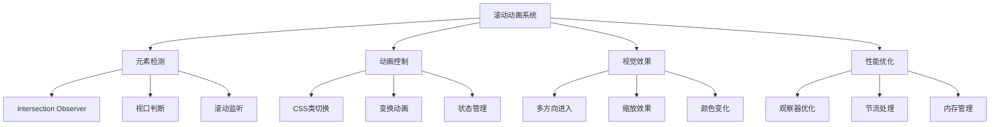

# 滚动时元素显示动画效果

## 简介

这是一个基于Intersection Observer API和CSS变换实现的滚动时元素显示动画效果。当用户滚动页面时，元素会从不同方向以动画形式进入视口，创造出富有层次感的视觉体验。

## 效果特点

### 视觉特性

- **多方向动画**: 元素从左、右、下三个方向进入视口
- **缩放效果**: 元素从0缩放到正常大小
- **随机颜色**: 每个元素具有随机生成的背景颜色
- **平滑过渡**: CSS transition创造流畅的动画效果
- **响应式布局**: 网格布局适配不同屏幕尺寸

### 功能特性

- **滚动检测**: 实时监听页面滚动位置
- **视口判断**: 精确判断元素是否进入视口
- **状态管理**: 动态添加/移除active类控制动画
- **性能优化**: 使用Intersection Observer提升性能
- **批量处理**: 支持大量元素的高效动画管理

## 工作原理



## 效果演示

<demo react="react/ScrollRevealAnimation/demo.tsx" 
:reactFiles="['react/ScrollRevealAnimation/index.tsx','react/ScrollRevealAnimation/index.scss','react/ScrollRevealAnimation/demo.tsx']" 
/>

## 核心实现原理

### 基础实现方案

**核心思路**：

- 使用Intersection Observer API监听元素进入视口
- CSS transform控制元素的初始位置和缩放
- 动态添加active类触发CSS过渡动画
- 随机颜色生成器创造视觉多样性

**优点**：

- 性能优异，使用原生API
- 动画流畅，视觉效果佳
- 代码简洁，易于维护
- 扩展性强，支持自定义配置

**适用场景**：

- 产品展示页面
- 内容营销网站
- 作品集展示
- 企业官网首页

### Intersection Observer实现

```typescript
// 创建观察器
const createObserver = (callback: IntersectionObserverCallback, options?: IntersectionObserverInit) => {
  return new IntersectionObserver(callback, {
    root: null,
    rootMargin: '0px',
    threshold: 0.1,
    ...options
  });
};

// 观察器回调函数
const handleIntersection = (entries: IntersectionObserverEntry[]) => {
  entries.forEach(entry => {
    if (entry.isIntersecting) {
      entry.target.classList.add('active');
    } else {
      entry.target.classList.remove('active');
    }
  });
};
```

### 动画方向控制

```typescript
// 动画方向枚举
enum AnimationDirection {
  LEFT = 'left',
  RIGHT = 'right',
  BOTTOM = 'bottom',
  TOP = 'top'
}

// 获取动画方向
const getAnimationDirection = (index: number, columns: number) => {
  const position = index % columns;
  if (position === 0) return AnimationDirection.LEFT;
  if (position === 1) return AnimationDirection.BOTTOM;
  if (position === 2) return AnimationDirection.RIGHT;
  return AnimationDirection.TOP;
};
```

## 参数配置选项

| 参数名称 | 类型 | 默认值 | 说明 |
|---------|------|--------|------|
| **elementCount** | number | 60 | 元素数量 |
| **columns** | number | 3 | 网格列数 |
| **elementSize** | number | 200 | 元素尺寸(px) |
| **gap** | number | 30 | 元素间距(px) |
| **animationDuration** | number | 0.5 | 动画持续时间(秒) |
| **threshold** | number | 0.1 | 触发阈值(0-1) |
| **rootMargin** | string | '0px' | 根边距 |
| **enableRandomColors** | boolean | true | 是否启用随机颜色 |
| **animationDelay** | number | 0 | 动画延迟(秒) |
| **borderRadius** | number | 10 | 圆角大小(px) |
| **backgroundColor** | string | '#111' | 背景颜色 |
| **resetOnExit** | boolean | true | 离开视口时重置 |

## 实现方案对比

| 方案 | 优点 | 缺点 | 适用场景 |
|------|------|------|----------|
| **Intersection Observer** | 性能好，原生支持 | 兼容性要求较高 | 现代浏览器项目 |
| **滚动事件监听** | 兼容性好，控制精确 | 性能消耗较大 | 简单滚动效果 |
| **第三方库(AOS)** | 功能丰富，易于使用 | 增加包体积 | 快速开发项目 |
| **CSS动画库** | 效果丰富，即插即用 | 定制性有限 | 标准化动画需求 |

## 高级功能

### 功能 1：动画序列管理

```typescript
const useAnimationSequence = () => {
  const [animationQueue, setAnimationQueue] = useState<number[]>([]);
  const [isPlaying, setIsPlaying] = useState(false);

  const addToQueue = (elementIndex: number) => {
    setAnimationQueue(prev => [...prev, elementIndex]);
  };

  const playSequence = async () => {
    setIsPlaying(true);
    
    for (const index of animationQueue) {
      await new Promise(resolve => setTimeout(resolve, 100));
      // 触发动画
      const element = document.querySelector(`[data-index="${index}"]`);
      element?.classList.add('active');
    }
    
    setIsPlaying(false);
  };

  const clearQueue = () => {
    setAnimationQueue([]);
  };

  return { animationQueue, isPlaying, addToQueue, playSequence, clearQueue };
};
```

### 功能 2：自定义动画效果

```typescript
const useCustomAnimations = () => {
  const [animationType, setAnimationType] = useState('slide');

  const animationTypes = {
    slide: {
      initial: { transform: 'translateY(50px)', opacity: 0 },
      active: { transform: 'translateY(0)', opacity: 1 }
    },
    fade: {
      initial: { opacity: 0 },
      active: { opacity: 1 }
    },
    scale: {
      initial: { transform: 'scale(0)', opacity: 0 },
      active: { transform: 'scale(1)', opacity: 1 }
    },
    rotate: {
      initial: { transform: 'rotate(180deg) scale(0)', opacity: 0 },
      active: { transform: 'rotate(0deg) scale(1)', opacity: 1 }
    }
  };

  const getAnimationStyle = (isActive: boolean) => {
    const animation = animationTypes[animationType];
    return isActive ? animation.active : animation.initial;
  };

  return { animationType, setAnimationType, animationTypes, getAnimationStyle };
};
```

### 功能 3：颜色主题系统

```typescript
const useColorTheme = () => {
  const [theme, setTheme] = useState('random');

  const colorThemes = {
    random: () => `#${Math.floor(Math.random() * 16777215).toString(16)}`,
    gradient: (index: number) => {
      const hue = (index * 137.508) % 360;
      return `hsl(${hue}, 70%, 60%)`;
    },
    monochrome: (index: number) => {
      const lightness = 30 + (index % 5) * 15;
      return `hsl(0, 0%, ${lightness}%)`;
    },
    warm: () => {
      const colors = ['#ff6b6b', '#ffa726', '#ffcc02', '#ff8a65'];
      return colors[Math.floor(Math.random() * colors.length)];
    },
    cool: () => {
      const colors = ['#42a5f5', '#26c6da', '#66bb6a', '#ab47bc'];
      return colors[Math.floor(Math.random() * colors.length)];
    }
  };

  const generateColor = (index: number) => {
    return colorThemes[theme](index);
  };

  return { theme, setTheme, colorThemes, generateColor };
};
```

## 性能优化

### 1. Intersection Observer优化

```typescript
// 使用单个观察器管理所有元素
const useOptimizedObserver = () => {
  const observerRef = useRef<IntersectionObserver | null>(null);

  const createObserver = useCallback(() => {
    if (observerRef.current) {
      observerRef.current.disconnect();
    }

    observerRef.current = new IntersectionObserver(
      (entries) => {
        entries.forEach(entry => {
          if (entry.isIntersecting) {
            entry.target.classList.add('active');
          } else {
            entry.target.classList.remove('active');
          }
        });
      },
      {
        threshold: 0.1,
        rootMargin: '50px'
      }
    );

    return observerRef.current;
  }, []);

  useEffect(() => {
    return () => {
      if (observerRef.current) {
        observerRef.current.disconnect();
      }
    };
  }, []);

  return createObserver;
};
```

### 2. 动画性能优化

```css
/* 启用硬件加速 */
.scroll-element {
  will-change: transform, opacity;
  transform: translateZ(0);
  backface-visibility: hidden;
}

/* 优化过渡效果 */
.scroll-element {
  transition: transform 0.5s cubic-bezier(0.25, 0.46, 0.45, 0.94),
              opacity 0.5s ease-out;
}
```

### 3. 内存管理

```typescript
// 虚拟滚动优化
const useVirtualScrolling = (itemCount: number, containerHeight: number, itemHeight: number) => {
  const [visibleRange, setVisibleRange] = useState({ start: 0, end: 10 });

  const updateVisibleRange = useCallback((scrollTop: number) => {
    const start = Math.floor(scrollTop / itemHeight);
    const end = Math.min(start + Math.ceil(containerHeight / itemHeight) + 1, itemCount);
    setVisibleRange({ start, end });
  }, [itemHeight, containerHeight, itemCount]);

  return { visibleRange, updateVisibleRange };
};
```

## 故障排除

### 1. 动画不触发

**问题**: 元素滚动到视口时动画不执行
**解决方案**:
- 检查Intersection Observer的浏览器支持
- 确认threshold值设置合理
- 验证CSS类名是否正确添加
- 检查元素的初始位置设置

### 2. 性能问题

**问题**: 大量元素导致页面卡顿
**解决方案**:
- 使用虚拟滚动减少DOM元素
- 优化CSS动画性能
- 调整观察器的threshold值
- 实现元素懒加载

### 3. 动画时机不准确

**问题**: 动画触发时机过早或过晚
**解决方案**:
- 调整rootMargin参数
- 修改threshold阈值
- 检查元素的实际位置
- 优化滚动事件处理

## 应用场景

### 1. 产品展示页面

```typescript
const ProductShowcase = ({ products }: { products: any[] }) => (
  <div className="product-showcase">
    <ScrollRevealAnimation
      elements={products.map(product => ({
        id: product.id,
        content: <ProductCard product={product} />,
        color: product.brandColor
      }))}
      columns={3}
      animationDuration={0.6}
    />
  </div>
);
```

### 2. 内容营销网站

```typescript
const ContentSections = ({ sections }: { sections: any[] }) => (
  <div className="content-sections">
    <ScrollRevealAnimation
      elements={sections.map(section => ({
        id: section.id,
        content: <ContentBlock section={section} />,
        animationType: section.animationType
      }))}
      threshold={0.2}
      resetOnExit={false}
    />
  </div>
);
```

### 3. 作品集展示

```typescript
const Portfolio = ({ works }: { works: any[] }) => (
  <div className="portfolio">
    <ScrollRevealAnimation
      elements={works.map(work => ({
        id: work.id,
        content: <WorkItem work={work} />,
        color: work.primaryColor
      }))}
      columns={2}
      gap={40}
      animationDelay={0.1}
    />
  </div>
);