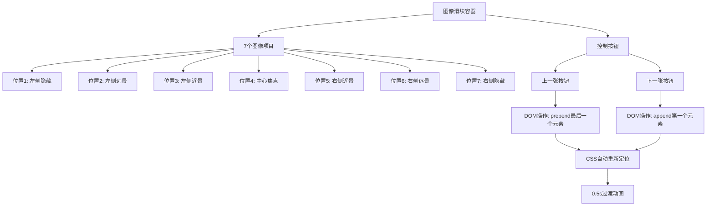

# 3D无限图像滑块

## 简介

3D无限图像滑块是一个基于CSS 3D变换技术实现的图像轮播组件，通过巧妙的DOM操作和CSS定位，创造出无限循环的3D视觉效果。该组件支持前后切换，具有平滑的过渡动画和立体的视觉层次感。

## 效果特点

### 视觉特性

- **3D立体效果**: 利用CSS 3D变换创建立体视觉层次
- **无限循环**: 通过DOM操作实现真正的无限滚动
- **平滑过渡**: 0.5秒的CSS过渡动画，切换流畅自然
- **层次分明**: 7个位置的不同缩放和旋转角度
- **反射效果**: 底部渐变反射增强立体感

### 技术特性

- **纯CSS 3D**: 无需复杂的3D库，仅使用CSS变换
- **DOM重排**: 通过appendChild和prepend实现循环
- **响应式设计**: 支持不同屏幕尺寸的适配
- **性能优化**: 使用transform属性避免重排重绘

## 工作原理



## 效果演示

<demo react="react/InfiniteSlider/index.tsx" 
:reactFiles="['react/InfiniteSlider/index.tsx','react/InfiniteSlider/index.scss']" 
/>

## 核心实现原理

### 基础实现方案

**核心思路**：

- 使用CSS 3D变换定义7个固定位置
- 通过DOM操作改变元素顺序实现循环
- 利用CSS过渡动画实现平滑切换
- 采用nth-child选择器精确控制每个位置

**优点**：

- 真正的无限循环，无需复制元素
- 性能优异，仅操作DOM结构
- 视觉效果出色，立体感强
- 代码简洁，易于理解和维护

**适用场景**：

- 产品展示轮播
- 图片画廊浏览
- 作品集展示
- 品牌Logo轮播

### 位置定义系统

| 位置 | nth-child | 变换效果 | z-index | 描述 |
|------|-----------|----------|---------|------|
| 1 | 1 | `translate3d(-250px, 0, 0) scale(0.8) rotateY(25deg)` | 1 | 左侧隐藏 |
| 2 | 2 | `translate3d(-250px, 0, 0) scale(0.8) rotateY(25deg)` | 2 | 左侧远景 |
| 3 | 3 | `translate3d(-150px, 0, 0) scale(0.9) rotateY(15deg)` | 3 | 左侧近景 |
| 4 | 4 | `translate3d(0px, 0, 0) scale(1) rotateY(0deg)` | 4 | 中心焦点 |
| 5 | 5 | `translate3d(150px, 0, 0) scale(0.9) rotateY(-15deg)` | 3 | 右侧近景 |
| 6 | 6 | `translate3d(250px, 0, 0) scale(0.8) rotateY(-25deg)` | 2 | 右侧远景 |
| 7 | 7 | `translate3d(250px, 0, 0) scale(0.8) rotateY(-25deg)` | -1 | 右侧隐藏 |

### 核心切换逻辑

```typescript
// 下一张：将第一个元素移到最后
const nextSlide = () => {
  const items = container.querySelectorAll('.item');
  container.appendChild(items[0]);
};

// 上一张：将最后一个元素移到最前
const prevSlide = () => {
  const items = container.querySelectorAll('.item');
  container.prepend(items[items.length - 1]);
};
```

## 实现方案对比

| 方案 | 优点 | 缺点 | 适用场景 |
|------|------|------|----------|
| **DOM重排方案** | 真正无限循环，性能好 | 需要固定数量元素 | 固定内容展示 |
| **Transform位移** | 动画流畅，易控制 | 需要计算复杂位置 | 动态内容加载 |
| **Swiper.js** | 功能完善，开箱即用 | 体积大，依赖重 | 复杂轮播需求 |
| **CSS动画** | 纯CSS实现，轻量 | 交互性有限 | 自动播放场景 |

## 高级功能

### 功能 1：自动播放

```typescript
const useAutoPlay = (interval: number = 3000, enabled: boolean = false) => {
  const [isPlaying, setIsPlaying] = useState(enabled);
  const intervalRef = useRef<NodeJS.Timeout>();

  const startAutoPlay = () => {
    if (intervalRef.current) clearInterval(intervalRef.current);
    intervalRef.current = setInterval(() => {
      nextSlide();
    }, interval);
    setIsPlaying(true);
  };

  const stopAutoPlay = () => {
    if (intervalRef.current) {
      clearInterval(intervalRef.current);
      intervalRef.current = undefined;
    }
    setIsPlaying(false);
  };

  return { isPlaying, startAutoPlay, stopAutoPlay };
};
```

### 功能 2：触摸手势支持

```typescript
const useTouchGesture = (onSwipeLeft: () => void, onSwipeRight: () => void) => {
  const [touchStart, setTouchStart] = useState<number>(0);
  const [touchEnd, setTouchEnd] = useState<number>(0);

  const handleTouchStart = (e: React.TouchEvent) => {
    setTouchStart(e.targetTouches[0].clientX);
  };

  const handleTouchMove = (e: React.TouchEvent) => {
    setTouchEnd(e.targetTouches[0].clientX);
  };

  const handleTouchEnd = () => {
    if (!touchStart || !touchEnd) return;
    
    const distance = touchStart - touchEnd;
    const isLeftSwipe = distance > 50;
    const isRightSwipe = distance < -50;

    if (isLeftSwipe) onSwipeLeft();
    if (isRightSwipe) onSwipeRight();
  };

  return { handleTouchStart, handleTouchMove, handleTouchEnd };
};
```

### 功能 3：键盘导航

```typescript
const useKeyboardNavigation = (onPrev: () => void, onNext: () => void) => {
  useEffect(() => {
    const handleKeyDown = (e: KeyboardEvent) => {
      switch (e.key) {
        case 'ArrowLeft':
          e.preventDefault();
          onPrev();
          break;
        case 'ArrowRight':
          e.preventDefault();
          onNext();
          break;
        case ' ':
          e.preventDefault();
          onNext();
          break;
      }
    };

    window.addEventListener('keydown', handleKeyDown);
    return () => window.removeEventListener('keydown', handleKeyDown);
  }, [onPrev, onNext]);
};
```

## 参数配置

### 基础配置

| 参数 | 类型 | 默认值 | 描述 |
|------|------|--------|------|
| `images` | `string[]` | `[]` | 图片URL数组 |
| `width` | `number` | `200` | 图片宽度(px) |
| `height` | `number` | `300` | 图片高度(px) |
| `autoPlay` | `boolean` | `false` | 是否自动播放 |
| `interval` | `number` | `3000` | 自动播放间隔(ms) |
| `showControls` | `boolean` | `true` | 是否显示控制按钮 |

### 动画配置

| 参数 | 类型 | 默认值 | 描述 |
|------|------|--------|------|
| `transitionDuration` | `number` | `0.5` | 过渡动画时长(s) |
| `perspective` | `number` | `500` | 3D透视距离(px) |
| `rotationAngle` | `number` | `25` | 最大旋转角度(deg) |
| `scaleRatio` | `number` | `0.8` | 最小缩放比例 |

### 样式配置

| 参数 | 类型 | 默认值 | 描述 |
|------|------|--------|------|
| `backgroundColor` | `string` | `'#222'` | 背景颜色 |
| `borderRadius` | `number` | `0` | 图片圆角(px) |
| `showReflection` | `boolean` | `true` | 是否显示反射效果 |
| `shadowIntensity` | `number` | `0.5` | 阴影强度(0-1) |

## 响应式设计

### 设备适配

```typescript
const useResponsiveSlider = () => {
  const [sliderConfig, setSliderConfig] = useState({
    width: 200,
    height: 300,
    gap: 250
  });

  useEffect(() => {
    const updateConfig = () => {
      const width = window.innerWidth;
      if (width < 768) {
        setSliderConfig({ width: 120, height: 180, gap: 150 });
      } else if (width < 1024) {
        setSliderConfig({ width: 160, height: 240, gap: 200 });
      } else {
        setSliderConfig({ width: 200, height: 300, gap: 250 });
      }
    };

    updateConfig();
    window.addEventListener('resize', updateConfig);
    return () => window.removeEventListener('resize', updateConfig);
  }, []);

  return sliderConfig;
};
```

## 性能优化

### 1. 图片懒加载

```typescript
const useLazyLoading = (images: string[]) => {
  const [loadedImages, setLoadedImages] = useState<Set<number>>(new Set([0, 1, 2]));

  const loadImage = (index: number) => {
    if (!loadedImages.has(index)) {
      setLoadedImages(prev => new Set([...prev, index]));
    }
  };

  return { loadedImages, loadImage };
};
```

### 2. 动画优化

```css
.infinite-slider .item {
  /* 启用硬件加速 */
  transform: translateZ(0);
  will-change: transform;
  backface-visibility: hidden;
  
  /* 优化过渡效果 */
  transition: transform 0.5s cubic-bezier(0.25, 0.46, 0.45, 0.94);
}
```

### 3. 内存管理

```typescript
const useImagePreloader = (images: string[]) => {
  useEffect(() => {
    const preloadedImages: HTMLImageElement[] = [];
    
    images.forEach((src, index) => {
      if (index < 5) { // 只预加载前5张
        const img = new Image();
        img.src = src;
        preloadedImages.push(img);
      }
    });

    return () => {
      preloadedImages.forEach(img => {
        img.src = '';
      });
    };
  }, [images]);
};
```

## 故障排除

### 1. 3D效果不显示

**问题**: 图片没有3D立体效果
**解决方案**:
- 确保容器设置了 `transform-style: preserve-3d`
- 检查 `perspective` 属性是否正确设置
- 验证浏览器是否支持CSS 3D变换

### 2. 切换动画卡顿

**问题**: 切换时出现卡顿或闪烁
**解决方案**:
- 使用 `will-change: transform` 启用硬件加速
- 避免在动画过程中修改其他CSS属性
- 确保图片已预加载完成

### 3. 移动端触摸问题

**问题**: 移动设备上触摸手势不响应
**解决方案**:
- 添加 `touch-action: pan-y` 允许垂直滚动
- 使用 `passive: false` 监听触摸事件
- 处理触摸事件的默认行为

## 应用场景

### 1. 产品展示

```typescript
const ProductSlider = () => {
  const products = [
    'https://picsum.photos/200/300?random=1',
    'https://picsum.photos/200/300?random=2',
    'https://picsum.photos/200/300?random=3'
  ];

  return (
    <InfiniteSlider
      images={products}
      autoPlay={true}
      interval={4000}
      showControls={true}
    />
  );
};
```

### 2. 团队成员展示

```typescript
const TeamSlider = () => {
  const teamMembers = [
    'https://picsum.photos/200/300?random=10',
    'https://picsum.photos/200/300?random=11',
    'https://picsum.photos/200/300?random=12'
  ];

  return (
    <InfiniteSlider
      images={teamMembers}
      width={180}
      height={240}
      borderRadius={10}
      backgroundColor="#f5f5f5"
    />
  );
};
```

### 3. 作品集展示

```typescript
const PortfolioSlider = () => {
  const portfolioItems = [
    'https://picsum.photos/300/400?random=20',
    'https://picsum.photos/300/400?random=21',
    'https://picsum.photos/300/400?random=22'
  ];

  return (
    <InfiniteSlider
      images={portfolioItems}
      width={300}
      height={400}
      showReflection={false}
      transitionDuration={0.8}
    />
  );
};