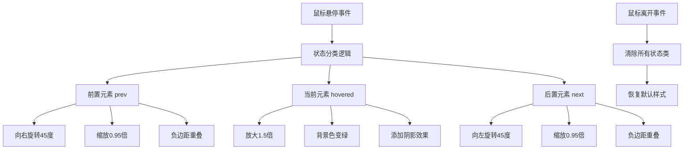

# 悬停过渡效果组件

## 简介

悬停过渡效果组件是一个基于JavaScript事件监听和CSS 3D变换技术实现的交互式组件。当鼠标悬停在某个元素上时，该元素会放大并高亮显示，同时其前后的元素会产生不同的3D旋转效果，创造出层次分明的视觉体验。

## 效果特点

### 视觉特性

- **3D立体效果**: 利用CSS 3D变换创建立体视觉层次
- **智能状态分类**: 自动识别前置、当前、后置元素状态
- **平滑过渡动画**: 0.5秒的CSS过渡动画，切换流畅自然
- **反射效果**: 底部渐变反射增强立体感
- **动态阴影**: 悬停时的阴影和滤镜效果

### 技术特性

- **事件驱动**: 基于mouseover和mouseleave事件
- **状态管理**: 动态添加和移除CSS类名
- **性能优化**: 使用transform属性避免重排重绘
- **响应式设计**: 支持不同屏幕尺寸的适配

## 工作原理



## 效果演示

<demo react="react/HoverTransition/index.tsx" 
:reactFiles="['react/HoverTransition/index.tsx','react/HoverTransition/index.scss']" 
/>

## 核心实现原理

### 基础实现方案

**核心思路**：

- 使用JavaScript监听鼠标事件
- 根据悬停元素的索引位置动态分类其他元素
- 通过CSS类名控制不同的3D变换效果
- 利用CSS过渡动画实现平滑切换

**优点**：

- 交互响应迅速，用户体验良好
- 视觉效果丰富，层次感强
- 代码结构清晰，易于理解和维护
- 性能优异，无复杂计算

**适用场景**：

- 产品展示列表
- 导航菜单效果
- 图片画廊浏览
- 卡片组件交互

### 状态分类系统

| 状态 | 条件 | 变换效果 | 描述 |
|------|------|----------|------|
| `prev` | `i < index` | `rotateY(45deg) scale(0.95)` | 前置元素向右旋转 |
| `hovered` | `i === index` | `rotateY(0deg) scale(1.5)` | 当前元素放大高亮 |
| `next` | `i > index` | `rotateY(-45deg) scale(0.95)` | 后置元素向左旋转 |

### 核心事件处理逻辑

```typescript
// 鼠标悬停处理
const handleMouseOver = (index: number) => {
  elements.forEach((element, i) => {
    // 清除之前的状态
    element.classList.remove('prev', 'next', 'hovered');
    
    // 根据位置关系添加新状态
    if (i < index) {
      element.classList.add('prev');
    } else if (i === index) {
      element.classList.add('hovered');
    } else {
      element.classList.add('next');
    }
  });
};

// 鼠标离开处理
const handleMouseLeave = () => {
  elements.forEach(element => {
    element.classList.remove('prev', 'next', 'hovered');
  });
};
```

## 实现方案对比

| 方案 | 优点 | 缺点 | 适用场景 |
|------|------|------|----------|
| **CSS :hover伪类** | 简单易用，无需JavaScript | 功能有限，无法实现复杂逻辑 | 简单悬停效果 |
| **JavaScript事件** | 功能强大，逻辑灵活 | 需要编写事件处理代码 | 复杂交互效果 |
| **CSS动画库** | 效果丰富，开箱即用 | 增加项目体积，定制性差 | 快速原型开发 |
| **React/Vue组件** | 组件化，易复用 | 需要框架支持 | 现代前端项目 |

## 高级功能

### 功能 1：自定义动画参数

```typescript
interface AnimationConfig {
  duration: number;
  roAngle: number;
  scaleRatio: number;
  hoverScale: number;
  easing: string;
}

const useAnimationConfig = (config: AnimationConfig) => {
  const [animationConfig, setAnimationConfig] = useState(config);

  const updateConfig = (newConfig: Partial<AnimationConfig>) => {
    setAnimationConfig(prev => ({ ...prev, ...newConfig }));
  };

  return { animationConfig, updateConfig };
};
```

### 功能 2：触摸设备支持

```typescript
const useTouchSupport = () => {
  const [isTouchDevice, setIsTouchDevice] = useState(false);

  useEffect(() => {
    setIsTouchDevice('ontouchstart' in window);
  }, []);

  const handleTouchStart = (index: number) => {
    if (isTouchDevice) {
      handleMouseOver(index);
    }
  };

  const handleTouchEnd = () => {
    if (isTouchDevice) {
      setTimeout(() => handleMouseLeave(), 2000); // 2秒后自动恢复
    }
  };

  return { isTouchDevice, handleTouchStart, handleTouchEnd };
};
```

### 功能 3：键盘导航支持

```typescript
const useKeyboardNavigation = (itemCount: number) => {
  const [focusedIndex, setFocusedIndex] = useState(-1);

  useEffect(() => {
    const handleKeyDown = (e: KeyboardEvent) => {
      switch (e.key) {
        case 'ArrowLeft':
          e.preventDefault();
          setFocusedIndex(prev => Math.max(0, prev - 1));
          break;
        case 'ArrowRight':
          e.preventDefault();
          setFocusedIndex(prev => Math.min(itemCount - 1, prev + 1));
          break;
        case 'Escape':
          setFocusedIndex(-1);
          break;
      }
    };

    window.addEventListener('keydown', handleKeyDown);
    return () => window.removeEventListener('keydown', handleKeyDown);
  }, [itemCount]);

  return { focusedIndex, setFocusedIndex };
};
```

## 参数配置

### 基础配置

| 参数 | 类型 | 默认值 | 描述 |
|------|------|--------|------|
| `items` | `Array<string \| number>` | `[1,2,3,4,5,6]` | 显示的内容数组 |
| `itemWidth` | `number` | `120` | 单个项目宽度(px) |
| `itemHeight` | `number` | `120` | 单个项目高度(px) |
| `backgroundColor` | `string` | `'#fff'` | 默认背景颜色 |
| `hoverColor` | `string` | `'#9cdb28'` | 悬停时背景颜色 |

### 动画配置

| 参数 | 类型 | 默认值 | 描述 |
|------|------|--------|------|
| `transitionDuration` | `number` | `0.5` | 过渡动画时长(s) |
| `rotationAngle` | `number` | `45` | 旋转角度(deg) |
| `scaleRatio` | `number` | `0.95` | 前后元素缩放比例 |
| `hoverScale` | `number` | `1.5` | 悬停元素放大比例 |
| `perspective` | `number` | `500` | 3D透视距离(px) |

### 样式配置

| 参数 | 类型 | 默认值 | 描述 |
|------|------|--------|------|
| `borderWidth` | `number` | `2` | 边框宽度(px) |
| `borderColor` | `string` | `'#0005'` | 边框颜色 |
| `showReflection` | `boolean` | `true` | 是否显示反射效果 |
| `shadowIntensity` | `number` | `0.25` | 阴影强度(0-1) |
| `fontSize` | `string` | `'4em'` | 字体大小 |

### 交互配置

| 参数 | 类型 | 默认值 | 描述 |
|------|------|--------|------|
| `enableKeyboard` | `boolean` | `false` | 是否启用键盘导航 |
| `enableTouch` | `boolean` | `true` | 是否支持触摸设备 |
| `autoResetDelay` | `number` | `2000` | 触摸设备自动恢复延迟(ms) |
| `onHover` | `function` | `undefined` | 悬停回调函数 |
| `onLeave` | `function` | `undefined` | 离开回调函数 |

## 响应式设计

### 设备适配

```typescript
const useResponsiveConfig = () => {
  const [config, setConfig] = useState({
    itemWidth: 120,
    itemHeight: 120,
    fontSize: '4em',
    hoverScale: 1.5
  });

  useEffect(() => {
    const updateConfig = () => {
      const width = window.innerWidth;
      if (width < 768) {
        setConfig({
          itemWidth: 80,
          itemHeight: 80,
          fontSize: '2.5em',
          hoverScale: 1.3
        });
      } else if (width < 1024) {
        setConfig({
          itemWidth: 100,
          itemHeight: 100,
          fontSize: '3em',
          hoverScale: 1.4
        });
      } else {
        setConfig({
          itemWidth: 120,
          itemHeight: 120,
          fontSize: '4em',
          hoverScale: 1.5
        });
      }
    };

    updateConfig();
    window.addEventListener('resize', updateConfig);
    return () => window.removeEventListener('resize', updateConfig);
  }, []);

  return config;
};
```

## 性能优化

### 1. 事件节流

```typescript
const useThrottledHover = (callback: Function, delay: number = 16) => {
  const lastCall = useRef(0);

  return useCallback((...args: any[]) => {
    const now = Date.now();
    if (now - lastCall.current >= delay) {
      lastCall.current = now;
      callback(...args);
    }
  }, [callback, delay]);
};
```

### 2. 硬件加速

```css
.hover-transition-item {
  /* 启用硬件加速 */
  transform: translateZ(0);
  will-change: transform;
  backface-visibility: hidden;
  
  /* 优化过渡效果 */
  transition: transform 0.5s cubic-bezier(0.25, 0.46, 0.45, 0.94);
}
```

### 3. 内存管理

```typescript
const useEventCleanup = (elements: HTMLElement[]) => {
  useEffect(() => {
    return () => {
      // 清理事件监听器
      elements.forEach(element => {
        element.removeEventListener('mouseover', handleMouseOver);
        element.removeEventListener('mouseleave', handleMouseLeave);
      });
    };
  }, [elements]);
};
```

## 故障排除

### 1. 3D效果不显示

**问题**: 元素没有3D旋转效果
**解决方案**:
- 确保容器设置了 `transform-style: preserve-3d`
- 检查 `perspective` 属性是否正确设置
- 验证浏览器是否支持CSS 3D变换

### 2. 动画卡顿

**问题**: 悬停切换时出现卡顿
**解决方案**:
- 使用 `will-change: transform` 启用硬件加速
- 避免在动画过程中修改其他CSS属性
- 使用事件节流减少频繁触发

### 3. 移动端体验问题

**问题**: 移动设备上交互体验不佳
**解决方案**:
- 添加触摸事件支持
- 设置合适的自动恢复延迟
- 调整移动端的缩放比例

## 应用场景

### 1. 产品展示

```typescript
const ProductShowcase = () => {
  const products = ['产品A', '产品B', '产品C', '产品D'];

  return (
    <HoverTransition
      items={products}
      hoverColor="#ff6b6b"
      onHover={(index) => console.log('查看产品:', products[index])}
    />
  );
};
```

### 2. 导航菜单

```typescript
const NavigationMenu = () => {
  const menuItems = ['首页', '产品', '服务', '关于', '联系'];

  return (
    <HoverTransition
      items={menuItems}
      itemWidth={100}
      itemHeight={60}
      hoverColor="#4a90e2"
      fontSize="1.5em"
    />
  );
};
```

### 3. 数字选择器

```typescript
const NumberPicker = () => {
  const numbers = [1, 2, 3, 4, 5, 6, 7, 8, 9];

  return (
    <HoverTransition
      items={numbers}
      itemWidth={80}
      itemHeight={80}
      hoverColor="#9cdb28"
      onHover={(index) => console.log('选择数字:', numbers[index])}
    />
  );
};