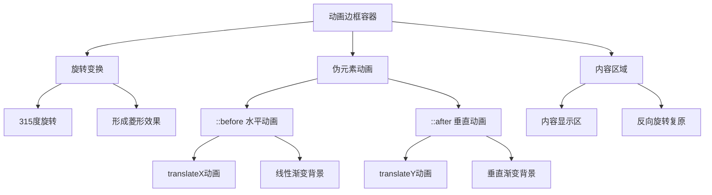

# 动画边框效果

## 简介

动画边框效果是一种基于CSS动画的视觉特效，通过伪元素和渐变背景创建流动的边框动画。该效果采用旋转和平移变换，配合时间延迟，形成连续的边框流光效果，适用于按钮、卡片等UI元素的视觉增强。

## 效果特点

### 视觉特性

- **流光效果**: 边框呈现连续流动的光效动画
- **双向流动**: 支持水平和垂直方向的动画流动
- **渐变过渡**: 使用线性渐变实现自然的光效过渡
- **循环动画**: 无限循环的动画效果，视觉连贯性强

### 技术特性

- **纯CSS实现**: 无需JavaScript，性能优异
- **硬件加速**: 使用transform属性，启用GPU加速
- **可配置参数**: 支持自定义颜色、速度、延迟等参数
- **响应式设计**: 适配不同屏幕尺寸和设备

## 工作原理



## 效果演示

<demo react="react/AnimatedBorder/example.tsx" 
:reactFiles="['react/AnimatedBorder/index.tsx','react/AnimatedBorder/index.scss']" 
/>

## 核心实现原理

### 基础实现方案

**核心思路**：

- 使用容器元素进行315度旋转，形成菱形布局
- 通过::before和::after伪元素创建水平和垂直动画线条
- 利用translateX和translateY实现流动效果
- 配合animation-delay创建连续的动画序列

**优点**：

- 纯CSS实现，性能优异，无需JavaScript
- 硬件加速支持，动画流畅度高
- 代码简洁，易于理解和维护
- 兼容性好，支持现代浏览器

**适用场景**：

- 按钮悬停效果增强
- 卡片边框装饰
- 加载状态指示器
- 品牌元素视觉强化

### 动画时序控制

```typescript
interface AnimationConfig {
  duration: number;        // 动画持续时间
  delay: number;          // 动画延迟
  color: string;          // 边框颜色
  width: number;          // 边框宽度
  gap: number;            // 元素间距
}

const defaultConfig: AnimationConfig = {
  duration: 4000,         // 4秒完整循环
  delay: 1000,           // 1秒延迟间隔
  color: '#0f0',         // 绿色边框
  width: 2,              // 2px边框宽度
  gap: 38                // 38px元素间距
};
```

## 实现方案对比

| 方案                 | 优点               | 缺点         | 适用场景     |
| -------------------- | ------------------ | ------------ | ------------ |
| **CSS伪元素动画**    | 性能好，代码简洁   | 样式相对固定 | 基础边框效果 |
| **SVG路径动画**      | 矢量图形，可缩放   | 复杂度较高   | 复杂路径动画 |
| **Canvas绘制**       | 功能强大，可交互   | 性能开销大   | 复杂图形动画 |
| **CSS变量控制**      | 动态可配置         | 兼容性要求   | 主题化需求   |

## 高级功能

### 功能 1：多色彩渐变

```typescript
interface GradientConfig {
  colors: string[];
  direction: 'horizontal' | 'vertical' | 'diagonal';
  stops: number[];
}

const createGradient = (config: GradientConfig): string => {
  const { colors, direction, stops } = config;
  const angle = direction === 'horizontal' ? '90deg' : 
                direction === 'vertical' ? '180deg' : '45deg';
  
  const colorStops = colors.map((color, index) => 
    `${color} ${stops[index] || (index * 100 / (colors.length - 1))}%`
  ).join(', ');
  
  return `linear-gradient(${angle}, ${colorStops})`;
};
```

### 功能 2：动画速度控制

```typescript
const useAnimationSpeed = (baseSpeed: number = 1) => {
  const [speed, setSpeed] = useState(baseSpeed);
  
  const updateSpeed = (newSpeed: number) => {
    setSpeed(Math.max(0.1, Math.min(5, newSpeed)));
  };
  
  const getAnimationDuration = (baseDuration: number) => {
    return baseDuration / speed;
  };
  
  return { speed, updateSpeed, getAnimationDuration };
};
```

### 功能 3：响应式适配

```typescript
const useResponsiveBorder = () => {
  const [dimensions, setDimensions] = useState({
    width: 100,
    height: 100,
    gap: 38
  });
  
  useEffect(() => {
    const updateDimensions = () => {
      const screenWidth = window.innerWidth;
      if (screenWidth < 768) {
        setDimensions({ width: 80, height: 80, gap: 20 });
      } else if (screenWidth < 1024) {
        setDimensions({ width: 90, height: 90, gap: 30 });
      } else {
        setDimensions({ width: 100, height: 100, gap: 38 });
      }
    };
    
    updateDimensions();
    window.addEventListener('resize', updateDimensions);
    return () => window.removeEventListener('resize', updateDimensions);
  }, []);
  
  return dimensions;
};
```

## 性能优化

### 1. 硬件加速

```css
.animated-border-item {
  will-change: transform;
  transform: translateZ(0);
  backface-visibility: hidden;
}
```

### 2. 动画优化

```css
@media (prefers-reduced-motion: reduce) {
  .animated-border-item::before,
  .animated-border-item::after {
    animation-duration: 0.01ms;
    animation-iteration-count: 1;
  }
}
```

### 3. 内存管理

```typescript
const useAnimationCleanup = () => {
  const animationRefs = useRef<number[]>([]);
  
  const addAnimation = (id: number) => {
    animationRefs.current.push(id);
  };
  
  const cleanup = () => {
    animationRefs.current.forEach(id => {
      cancelAnimationFrame(id);
    });
    animationRefs.current = [];
  };
  
  useEffect(() => {
    return cleanup;
  }, []);
  
  return { addAnimation, cleanup };
};
```

## 故障排除

### 1. 动画不显示

**问题**: 边框动画效果不可见
**解决方案**:

- 检查容器overflow属性设置
- 确认伪元素content属性已设置
- 验证动画关键帧定义正确
- 检查z-index层级关系

### 2. 动画卡顿

**问题**: 动画播放不流畅
**解决方案**:

- 启用硬件加速 (`transform: translateZ(0)`)
- 使用transform替代position变化
- 减少同时播放的动画数量
- 优化动画时长和缓动函数

### 3. 移动端适配问题

**问题**: 移动设备上效果异常
**解决方案**:

- 调整动画元素尺寸适配小屏幕
- 使用媒体查询优化动画参数
- 考虑触摸设备的性能限制
- 提供简化版动画选项

## 应用场景

### 1. 按钮增强效果

```typescript
const AnimatedButton = ({ children, onClick }: ButtonProps) => (
  <button className="animated-border-button" onClick={onClick}>
    <AnimatedBorder color="#4a90e2" />
    <span className="button-content">{children}</span>
  </button>
);
```

### 2. 卡片装饰边框

```typescript
const FeatureCard = ({ title, content }: CardProps) => (
  <div className="feature-card">
    <AnimatedBorder color="#ff6b6b" speed={0.8} />
    <div className="card-content">
      <h3>{title}</h3>
      <p>{content}</p>
    </div>
  </div>
);
```

### 3. 加载状态指示

```typescript
const LoadingIndicator = ({ isLoading }: LoadingProps) => (
  <div className={`loading-indicator ${isLoading ? 'active' : ''}`}>
    <AnimatedBorder color="#ffd93d" speed={2} />
    <span>加载中...</span>
  </div>
);