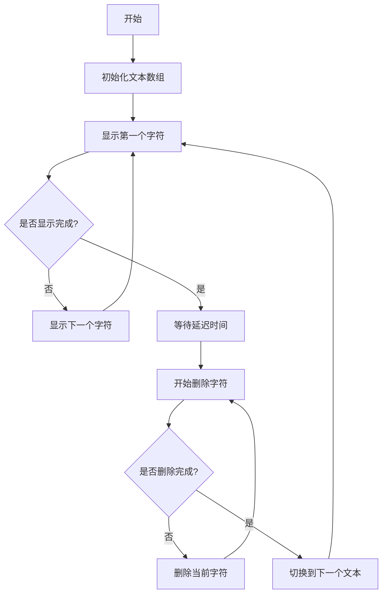

# 打字效果动画

## 简介

打字效果动画是一种模拟真实打字过程的文本动画效果，通过逐字符显示和删除文本来创造出打字机的视觉效果。该效果常用于网站首页、介绍页面或需要吸引用户注意力的文本展示场景。

## 效果特点

### 视觉特性

- **逐字显示**: 文本按字符逐个显示，模拟真实打字过程
- **光标闪烁**: 配有闪烁的光标效果，增强真实感
- **循环播放**: 支持多个文本内容的循环切换
- **删除动画**: 文本删除时也有逐字符消失的动画效果

### 技术特性

- **纯JavaScript实现**: 无需依赖第三方库
- **可配置参数**: 支持自定义打字速度、删除速度、停留时间
- **响应式设计**: 适配不同屏幕尺寸
- **性能优化**: 使用requestAnimationFrame优化动画性能

## 工作原理



## 效果演示

<demo react="react/TypingAnimation/example.tsx" 
:reactFiles="['react/TypingAnimation/index.tsx','react/TypingAnimation/index.scss']" 
/>

## 核心实现原理

### 基础实现方案

**核心思路**：

- 使用字符串数组存储要显示的文本内容
- 通过定时器控制字符的显示和删除速度
- 使用字符索引追踪当前显示位置
- 实现文本循环切换逻辑

**优点**：

- 实现简单，代码量少
- 性能良好，资源占用低
- 兼容性强，支持所有现代浏览器
- 易于定制和扩展

**适用场景**：

- 网站首页标题动画
- 产品介绍页面
- 个人简介展示
- 营销页面文案动画

### 核心算法实现

```typescript
interface TypingConfig {
  texts: string[];
  typingSpeed: number;
  deletingSpeed: number;
  delayBetweenTexts: number;
}

class TypingAnimation {
  private textIndex = 0;
  private charIndex = 0;
  private isDeleting = false;
  
  constructor(
    private element: HTMLElement,
    private config: TypingConfig
  ) {}
  
  private type(): void {
    const currentText = this.config.texts[this.textIndex];
    
    if (!this.isDeleting) {
      // 打字阶段
      this.element.textContent = currentText.substring(0, this.charIndex + 1);
      this.charIndex++;
      
      if (this.charIndex === currentText.length) {
        this.isDeleting = true;
        setTimeout(() => this.type(), this.config.delayBetweenTexts);
        return;
      }
    } else {
      // 删除阶段
      this.element.textContent = currentText.substring(0, this.charIndex - 1);
      this.charIndex--;
      
      if (this.charIndex === 0) {
        this.isDeleting = false;
        this.textIndex = (this.textIndex + 1) % this.config.texts.length;
      }
    }
    
    const speed = this.isDeleting ? 
      this.config.deletingSpeed : 
      this.config.typingSpeed;
    
    setTimeout(() => this.type(), speed);
  }
}
```

## 参数配置

| 参数名 | 类型 | 默认值 | 说明 |
|--------|------|--------|------|
| `texts` | string[] | `["Hello World!"]` | 要显示的文本数组 |
| `typingSpeed` | number | `150` | 打字速度(毫秒) |
| `deletingSpeed` | number | `75` | 删除速度(毫秒) |
| `delayBetweenTexts` | number | `2000` | 文本间停留时间(毫秒) |
| `showCursor` | boolean | `true` | 是否显示光标 |
| `cursorChar` | string | `"|"` | 光标字符 |
| `loop` | boolean | `true` | 是否循环播放 |

## 实现方案对比

| 方案 | 优点 | 缺点 | 适用场景 |
|------|------|------|----------|
| **原生JavaScript** | 轻量级，无依赖 | 功能相对简单 | 基础打字效果 |
| **CSS动画** | 性能好，GPU加速 | 灵活性有限 | 简单文本动画 |
| **Typed.js库** | 功能丰富，易用 | 增加项目体积 | 复杂打字效果 |
| **React组件** | 组件化，易复用 | 需要React环境 | 现代前端项目 |

## 高级功能

### 功能 1：多行文本支持

```typescript
const multiLineTyping = (texts: string[], element: HTMLElement) => {
  const lines = texts.map(text => text.split('\n'));
  // 实现多行打字逻辑
};
```

### 功能 2：打字音效

```typescript
const addTypingSound = () => {
  const audio = new Audio('/sounds/typing.mp3');
  audio.volume = 0.1;
  audio.play().catch(() => {}); // 静默处理播放失败
};
```

### 功能 3：自定义光标样式

```typescript
interface CursorConfig {
  char: string;
  blinkSpeed: number;
  color: string;
  size: string;
}
```

## 性能优化

### 1. 使用requestAnimationFrame

```typescript
const optimizedTyping = () => {
  let lastTime = 0;
  const animate = (currentTime: number) => {
    if (currentTime - lastTime >= typingSpeed) {
      // 执行打字逻辑
      lastTime = currentTime;
    }
    requestAnimationFrame(animate);
  };
  requestAnimationFrame(animate);
};
```

### 2. 内存管理

```typescript
class TypingManager {
  private timers: number[] = [];
  
  cleanup(): void {
    this.timers.forEach(timer => clearTimeout(timer));
    this.timers = [];
  }
}
```

## 故障排除

### 1. 文本显示异常

**问题**: 文本显示不完整或乱码
**解决方案**:
- 检查文本编码格式
- 确认字符串数组格式正确
- 验证DOM元素是否正确获取

### 2. 动画卡顿

**问题**: 打字效果不流畅
**解决方案**:
- 调整打字速度参数
- 使用requestAnimationFrame替代setTimeout
- 减少DOM操作频率

### 3. 内存泄漏

**问题**: 长时间运行后内存占用增加
**解决方案**:
- 正确清理定时器
- 移除事件监听器
- 避免创建不必要的闭包

## 应用场景

### 1. 网站首页

```typescript
// 首页标题动画
const heroTyping = new TypingAnimation(
  document.querySelector('.hero-title'),
  {
    texts: ['欢迎来到我们的网站', '探索无限可能', '开启数字化之旅'],
    typingSpeed: 100,
    deletingSpeed: 50,
    delayBetweenTexts: 3000
  }
);
```

### 2. 个人简介

```typescript
// 个人技能展示
const skillsTyping = new TypingAnimation(
  document.querySelector('.skills'),
  {
    texts: ['前端开发工程师', 'React专家', 'TypeScript爱好者'],
    typingSpeed: 120,
    deletingSpeed: 60,
    delayBetweenTexts: 2500
  }
);
```

### 3. 产品介绍

```typescript
// 产品特性介绍
const featureTyping = new TypingAnimation(
  document.querySelector('.feature-text'),
  {
    texts: [
      '高性能的前端框架',
      '简单易用的API设计',
      '完善的开发工具链'
    ],
    typingSpeed: 80,
    deletingSpeed: 40,
    delayBetweenTexts: 4000
  }
);