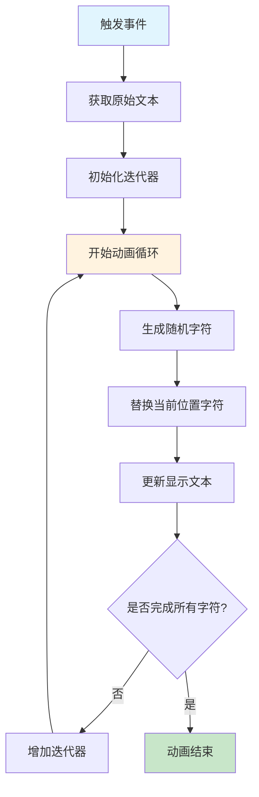

# JavaScript文本打乱效果实现

## 简介

文本打乱效果是一种炫酷的文字动画特效，通过随机字符逐步替换为目标文本，创造出类似黑客风格的视觉效果。该效果常用于导航菜单、按钮交互、标题展示等场景，能够显著提升用户体验和页面的科技感。

## 效果特点

### 视觉特性

- **动态打乱**: 文本字符逐个被随机字符替换
- **渐进恢复**: 从左到右逐步恢复为原始文本
- **科技感**: 营造黑客风格的视觉效果
- **流畅动画**: 平滑的字符变换过程

### 技术特性

- **纯JavaScript实现**: 无需额外依赖库
- **事件驱动**: 支持鼠标悬停、点击等触发方式
- **高度可配置**: 支持自定义随机字符集、动画速度等
- **性能优化**: 使用requestAnimationFrame优化动画性能

## 工作原理



## 效果演示

<demo react="react/TextScramble/TextScrambleDemo.tsx" 
:reactFiles="['react/TextScramble/TextScrambleDemo.tsx','react/TextScramble/index.tsx','react/TextScramble/index.scss']" 
/>

## 核心实现原理

### 基础实现方案

**核心思路**：

通过定时器循环，将文本字符逐个从随机字符恢复为原始字符，创造出打乱到恢复的动画效果。

**关键代码**：

```javascript
// 核心打乱逻辑
function scrambleText(element, originalText, randomChars) {
  let iterations = 0;
  
  const interval = setInterval(() => {
    element.textContent = originalText
      .split("")
      .map((char, index) => {
        // 已恢复的字符保持不变
        if (index < iterations) return char;
        // 未恢复的字符显示随机字符
        return randomChars.charAt(Math.floor(Math.random() * randomChars.length));
      })
      .join("");
    
    // 检查是否完成
    if (iterations >= originalText.length) {
      clearInterval(interval);
    }
    
    // 控制恢复速度
    iterations += 1/3;
  }, 50);
}
```

**优点**：
- 实现简单，易于理解
- 性能良好，适合大部分场景
- 兼容性好，支持所有现代浏览器

**适用场景**：
- 导航菜单悬停效果
- 按钮交互动画
- 标题文字特效
- 加载状态提示

### 高级实现方案

**增强特性**：

```typescript
interface ScrambleConfig {
  randomChars: string;
  speed: number;
  iterations: number;
  trigger: 'hover' | 'click' | 'auto';
  direction: 'left-to-right' | 'right-to-left' | 'random';
}

class TextScrambler {
  private config: ScrambleConfig;
  private isAnimating: boolean = false;
  
  constructor(config: Partial<ScrambleConfig> = {}) {
    this.config = {
      randomChars: '!@#$%^&*()_+-<>?',
      speed: 50,
      iterations: 3,
      trigger: 'hover',
      direction: 'left-to-right',
      ...config
    };
  }
  
  scramble(element: HTMLElement, text: string): Promise<void> {
    return new Promise((resolve) => {
      if (this.isAnimating) return resolve();
      
      this.isAnimating = true;
      let progress = 0;
      
      const animate = () => {
        const scrambled = this.generateScrambledText(text, progress);
        element.textContent = scrambled;
        
        progress += 1 / this.config.iterations;
        
        if (progress >= text.length) {
          element.textContent = text;
          this.isAnimating = false;
          resolve();
        } else {
          setTimeout(animate, this.config.speed);
        }
      };
      
      animate();
    });
  }
}
```

## 实现方案对比

| 方案特性 | 基础实现 | 高级实现 | Canvas实现 |
|---------|---------|---------|-----------|
| **实现难度** | 简单 | 中等 | 复杂 |
| **性能表现** | 良好 | 优秀 | 极佳 |
| **功能丰富度** | 基础 | 丰富 | 极丰富 |
| **定制灵活性** | 低 | 高 | 极高 |
| **兼容性** | 优秀 | 优秀 | 良好 |
| **维护成本** | 低 | 中等 | 高 |

## 高级功能

### 功能 1：多种触发方式

```typescript
const setupTriggers = (element: HTMLElement, scrambler: TextScrambler) => {
  const originalText = element.dataset.text || element.textContent;
  
  // 悬停触发
  element.addEventListener('mouseenter', () => {
    scrambler.scramble(element, originalText);
  });
  
  // 点击触发
  element.addEventListener('click', () => {
    scrambler.scramble(element, originalText);
  });
  
  // 自动循环触发
  setInterval(() => {
    scrambler.scramble(element, originalText);
  }, 3000);
};
```

### 功能 2：字符恢复方向控制

```typescript
const generateScrambledText = (text: string, progress: number, direction: string) => {
  return text.split('').map((char, index) => {
    let shouldRestore = false;
    
    switch (direction) {
      case 'left-to-right':
        shouldRestore = index < progress;
        break;
      case 'right-to-left':
        shouldRestore = index >= text.length - progress;
        break;
      case 'random':
        shouldRestore = Math.random() < progress / text.length;
        break;
    }
    
    return shouldRestore ? char : getRandomChar();
  }).join('');
};
```

### 功能 3：动画缓动效果

```typescript
const easeOutQuart = (t: number): number => {
  return 1 - Math.pow(1 - t, 4);
};

const animateWithEasing = (element: HTMLElement, text: string, duration: number) => {
  const startTime = Date.now();
  
  const animate = () => {
    const elapsed = Date.now() - startTime;
    const progress = Math.min(elapsed / duration, 1);
    const easedProgress = easeOutQuart(progress);
    
    const scrambled = generateScrambledText(text, easedProgress * text.length);
    element.textContent = scrambled;
    
    if (progress < 1) {
      requestAnimationFrame(animate);
    } else {
      element.textContent = text;
    }
  };
  
  animate();
};
```

## 参数配置选项

### 基础参数

| 参数名 | 类型 | 默认值 | 说明 |
|--------|------|--------|------|
| `randomChars` | string | '!@#$%^&*()_+-<>?' | 随机字符集 |
| `speed` | number | 50 | 动画速度（毫秒） |
| `iterations` | number | 3 | 迭代次数控制 |
| `trigger` | string | 'hover' | 触发方式 |

### 高级参数

| 参数名 | 类型 | 默认值 | 说明 |
|--------|------|--------|------|
| `direction` | string | 'left-to-right' | 恢复方向 |
| `easing` | string | 'linear' | 缓动函数 |
| `preserveSpaces` | boolean | true | 保留空格字符 |
| `caseSensitive` | boolean | false | 区分大小写 |

### 使用示例

```typescript
// 基础使用
<TextScramble 
  text="Hover To Scramble Me"
  randomChars="!@#$%^&*()"
  speed={30}
/>

// 高级配置
<TextScramble 
  text="Advanced Scramble Effect"
  randomChars="01010101"
  speed={25}
  direction="right-to-left"
  trigger="click"
  easing="ease-out"
/>
```

## 响应式设计

### 移动端适配

```typescript
const useResponsiveScramble = () => {
  const [isMobile, setIsMobile] = useState(false);
  
  useEffect(() => {
    const checkMobile = () => {
      setIsMobile(window.innerWidth < 768);
    };
    
    checkMobile();
    window.addEventListener('resize', checkMobile);
    return () => window.removeEventListener('resize', checkMobile);
  }, []);
  
  return {
    speed: isMobile ? 80 : 50, // 移动端稍慢
    randomChars: isMobile ? '●○◐◑' : '!@#$%^&*()', // 移动端使用简单字符
    trigger: isMobile ? 'click' : 'hover' // 移动端使用点击
  };
};
```

### 字体大小适配

```css
.text-scramble {
  font-size: clamp(1rem, 4vw, 3rem);
  letter-spacing: 0.05em;
  
  @media (max-width: 768px) {
    letter-spacing: 0.02em;
  }
}
```

## 性能优化

### 1. 防抖处理

```typescript
const useDebounce = (callback: Function, delay: number) => {
  const timeoutRef = useRef<NodeJS.Timeout>();
  
  return useCallback((...args: any[]) => {
    clearTimeout(timeoutRef.current);
    timeoutRef.current = setTimeout(() => callback(...args), delay);
  }, [callback, delay]);
};
```

### 2. 动画队列管理

```typescript
class AnimationQueue {
  private queue: Array<() => Promise<void>> = [];
  private isProcessing = false;
  
  add(animation: () => Promise<void>) {
    this.queue.push(animation);
    this.process();
  }
  
  private async process() {
    if (this.isProcessing || this.queue.length === 0) return;
    
    this.isProcessing = true;
    
    while (this.queue.length > 0) {
      const animation = this.queue.shift()!;
      await animation();
    }
    
    this.isProcessing = false;
  }
}
```

### 3. 内存优化

```typescript
const useTextScramble = (text: string, config: ScrambleConfig) => {
  const animationRef = useRef<number>();
  const isActiveRef = useRef(false);
  
  const scramble = useCallback(() => {
    if (isActiveRef.current) return;
    
    isActiveRef.current = true;
    // 动画逻辑
  }, [text, config]);
  
  useEffect(() => {
    return () => {
      if (animationRef.current) {
        cancelAnimationFrame(animationRef.current);
      }
      isActiveRef.current = false;
    };
  }, []);
  
  return scramble;
};
```

## 故障排除

### 1. 动画卡顿

**问题**: 文字变换不流畅或出现卡顿
**解决方案**:
- 使用`requestAnimationFrame`替代`setTimeout`
- 减少DOM操作频率
- 优化随机字符生成算法

### 2. 内存泄漏

**问题**: 长时间使用后内存占用增加
**解决方案**:
- 正确清理定时器和事件监听器
- 使用WeakMap存储元素引用
- 及时销毁不再使用的动画实例

### 3. 移动端性能问题

**问题**: 移动设备上动画性能差
**解决方案**:
- 降低动画帧率
- 简化随机字符集
- 使用CSS动画替代JavaScript动画

## 技术要点

### 1. 字符串处理技巧

- 使用`split('')`和`join('')`处理字符
- 利用`charAt()`和`Math.random()`生成随机字符
- 通过索引控制字符恢复进度

### 2. 动画时序控制

- 使用`setInterval`或`requestAnimationFrame`
- 通过迭代器控制动画进度
- 合理设置动画速度和持续时间

### 3. 事件处理优化

- 防抖处理避免频繁触发
- 使用事件委托减少监听器数量
- 正确清理事件监听器防止内存泄漏

## 应用场景

### 1. 导航菜单

```typescript
const NavigationMenu = () => (
  <nav className="navigation">
    {menuItems.map(item => (
      <TextScramble
        key={item.id}
        text={item.label}
        trigger="hover"
        randomChars="!@#$%^&*()"
      />
    ))}
  </nav>
);
```

### 2. 加载状态

```typescript
const LoadingText = ({ isLoading }: { isLoading: boolean }) => {
  useEffect(() => {
    if (isLoading) {
      // 循环播放打乱效果
    }
  }, [isLoading]);
  
  return (
    <TextScramble
      text="Loading..."
      trigger="auto"
      speed={100}
    />
  );
};
```

### 3. 标题动画

```typescript
const AnimatedTitle = ({ title }: { title: string }) => (
  <h1 className="animated-title">
    <TextScramble
      text={title}
      trigger="auto"
      direction="random"
      randomChars="01"
    />
  </h1>
);
```

## 总结

JavaScript文本打乱效果是一种简单而有效的文字动画技术，能够为网页增添科技感和交互性。通过合理的参数配置和性能优化，可以在各种场景下创造出令人印象深刻的视觉效果。该效果实现简单、兼容性好，是提升用户体验的优秀选择。