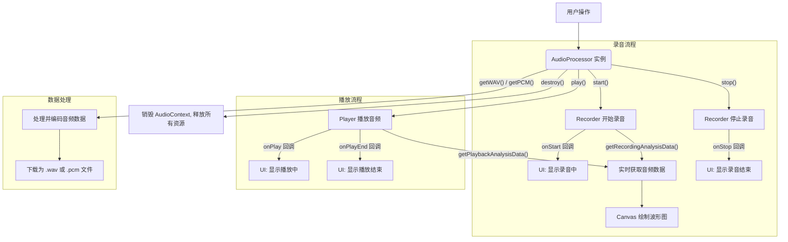

# AudioProcessor - 全功能音频处理库

## 简介

`AudioProcessor` 是一个基于 Web Audio API 的高级音频处理库，它将底层的 `Recorder`（录音机）和 `Player`（播放器）功能封装成一个统一、易用的类。无论你是想实现一个简单的录音功能，还是需要一个包含实时波形分析、格式转换和播放控制的复杂应用，`AudioProcessor` 都提供了完整的解决方案。

## 效果特点

### 视觉特性

- **实时波形**：通过内置的分析器，可以实时获取音频的频域和时域数据，轻松绘制出动态的音频波形图。
- **状态驱动**：清晰的状态管理（录音中、暂停中、播放中等），便于构建响应式的用户界面。
- **灵活控制**：提供丰富的回调函数，可以精确控制 UI 在各个阶段的展示。

### 技术特性

- **一体化方案**：集录音、暂停、恢复、停止、播放、下载于一体。
- **格式支持**：支持获取原始的 PCM 数据和标准的 WAV 格式数据。
- **跨浏览器**：封装了 `AudioContext` 的兼容性处理，确保在主流浏览器中表现一致。
- **资源管理**：提供 `destroy` 方法，可以彻底释放音频上下文和所有相关资源，避免内存泄漏。

## 工作原理

`AudioProcessor` 的核心是围绕 `AudioContext` 构建的。它继承自一个基础的 `Recorder` 类来处理麦克风输入，同时内部持有一个 `Player` 实例来处理音频播放。



## 效果演示

下面的示例展示了 `AudioProcessor` 的核心功能，包括录音、暂停、播放、波形显示和下载。

<demo react="react/AudioProcessorDemo/index.tsx"
:reactFiles="['react/AudioProcessorDemo/index.tsx','react/AudioProcessorDemo/index.scss']"
/>

## 核心实现原理

### 基础实现方案

**核心思路**：

1.  **初始化**：在构造函数中，创建一个 `AudioContext` 和一个 `Player` 实例。同时，从父类 `Recorder` 继承录音所需的所有节点（如 `analyserNode`, `scriptProcessorNode`）。
2.  **状态管理**：使用 `isRecording`, `isPlaying`, `isPaused` 等布尔标志来跟踪当前状态。所有核心方法（如 `start`, `play`）都会首先检查和更新这些状态。
3.  **录音**：调用 `start()` 时，连接麦克风媒体流到 `analyserNode`，并通过 `onaudioprocess` 事件捕获 PCM 数据块，存入缓冲区。
4.  **播放**：调用 `play()` 时，首先会**自动停止录音**。然后，它从缓冲区获取数据，编码成 WAV 格式，并交给内部的 `Player` 实例进行播放。
5.  **数据导出**：`getWAV()` 和 `getPCM()` 方法同样会先停止录音，然后对缓冲区中的数据进行编码，返回 `DataView` 或 `Blob` 对象。
6.  **资源销毁**：`destroy()` 方法负责断开所有音频节点连接，并关闭 `AudioContext`，确保不会有任何后台任务或内存持续占用。

**关键代码 - React 组件实现**

```typescript
// example/components/react/AudioProcessorDemo/index.tsx

import React, { useState, useEffect, useRef } from 'react';
import AudioProcessor from '../../../../lib/Audio';
import './style.css';

// ... (组件实现细节见上方已创建的文件)

const AudioProcessorDemo: React.FC = () => {
    const audioProcessorRef = useRef<AudioProcessor | null>(null);
    const canvasRef = useRef<HTMLCanvasElement>(null);
    const animationFrameRef = useRef<number>(0);

    const [isRecording, setIsRecording] = useState(false);
    // ... 其他状态

    useEffect(() => {
        // 实例化
        audioProcessorRef.current = new AudioProcessor({
            sampleBits: 16,
            sampleRate: 16000,
        });
        const processor = audioProcessorRef.current;

        // 绑定所有事件回调
        processor.onStart = () => {
            setIsRecording(true);
            drawWave(); // 开始绘制波形
        };
        // ... 其他回调

        // 定时器更新录音和播放时间
        const recordTimer = setInterval(() => {
            if (processor.isRecording) {
                setRecordTime(processor.getDuration());
            }
        }, 1000);
        // ...

        return () => {
            // 组件卸载时销毁实例
            processor.destroy();
        };
    }, []);

    // 绘制波形图的函数
    const drawWave = () => {
        // ... 使用 requestAnimationFrame 和 getRecordingAnalysisData
    };

    // 事件处理函数
    const handleStart = () => audioProcessorRef.current?.start();
    const handlePlay = () => audioProcessorRef.current?.play();
    // ...

    return (
        // JSX 结构
    );
};

export default AudioProcessorDemo;
```

## API 文档

### `new AudioProcessor(config?)`

构造函数。

- `config` (可选): `RecorderConfig` 对象。
  - `sampleBits`: 采样位数 (8 或 16)，默认 `16`。
  - `sampleRate`: 采样率 (Hz)，默认浏览器原生采样率。
  - `numChannels`: 声道数 (1 或 2)，默认 `1`。

### 核心方法

| 方法名         | 返回值          | 描述                                           |
| :------------- | :-------------- | :--------------------------------------------- |
| `start()`      | `Promise<void>` | 开始录音。如果已在录音，Promise 会 reject。    |
| `pause()`      | `void`          | 暂停录音。                                     |
| `resume()`     | `void`          | 恢复录音。                                     |
| `stop()`       | `void`          | 停止录音。                                     |
| `play()`       | `void`          | 播放录音。**注意：此操作会自动停止当前录音**。 |
| `pausePlay()`  | `void`          | 暂停播放。                                     |
| `resumePlay()` | `void`          | 恢复播放。                                     |
| `stopPlay()`   | `void`          | 停止播放。                                     |
| `destroy()`    | `Promise<void>` | 销毁实例，释放所有 Web Audio 资源。            |

### 数据获取方法

| 方法名                       | 返回值                                | 描述                                          |
| :--------------------------- | :------------------------------------ | :-------------------------------------------- |
| `getDuration()`              | `number`                              | 获取当前录音的时长（秒）。                    |
| `getPlayTime()`              | `number`                              | 获取当前播放的时长（秒）。                    |
| `getPCM()`                   | `DataView`                            | 获取 PCM 格式的音频数据。**会自动停止录音**。 |
| `getPCMBlob()`               | `Blob`                                | 获取 PCM 格式的 Blob 数据。                   |
| `getWAV()`                   | `DataView`                            | 获取 WAV 格式的音频数据。**会自动停止录音**。 |
| `getWAVBlob()`               | `Blob`                                | 获取 WAV 格式的 Blob 数据。                   |
| `getChannelData()`           | `{ left: DataView, right: DataView }` | 获取左右声道数据。                            |
| `getRecordingAnalysisData()` | `{ frequencyData, timeDomainData }`   | 获取录音时的实时分析数据。                    |
| `getPlaybackAnalysisData()`  | `{ frequencyData, timeDomainData }`   | 获取播放时的实时分析数据。                    |

### 下载方法

| 方法名               | 参数                    | 描述                      |
| :------------------- | :---------------------- | :------------------------ |
| `downloadPCM(name?)` | `name`: 文件名 (string) | 下载 PCM 格式的音频文件。 |
| `downloadWAV(name?)` | `name`: 文件名 (string) | 下载 WAV 格式的音频文件。 |

### 事件回调

你可以直接给实例的这些属性赋值一个函数来监听事件。

- `onStart: () => void`
- `onStop: () => void`
- `onPause: () => void`
- `onResume: () => void`
- `onPlay: () => void`
- `onPlayEnd: () => void`
- `onPausePlay: () => void`
- `onResumePlay: () => void`
- `onStopPlay: () => void`

## 故障排除

### 1. 无法录音或没有声音

**问题**: 点击录音后没有反应，或录制的文件为空。
**解决方案**:

- **检查权限**：确保浏览器已获得麦克风使用权限。`AudioProcessor` 的 `start()` 方法返回的 Promise 会在权限被拒绝时 reject。
- **检查设备**：确认麦克风已正确连接并被系统识别。
- **HTTPS 环境**：大多数现代浏览器要求在 `https` 或 `localhost` 环境下才能使用 Web Audio API。

### 2. 波形图不显示

**问题**: `canvas` 上没有绘制任何波形。
**解决方案**:

- **检查数据**：确认 `getRecordingAnalysisData()` 是否返回了有效的数据。
- **检查调用时机**：确保在 `onStart` 或 `onResume` 回调触发后才开始调用绘图函数。在录音/播放停止时，应停止绘图。
- **使用 `requestAnimationFrame`**：为了获得流畅的动画效果并优化性能，务必在 `requestAnimationFrame` 循环中进行绘制。

## 最佳实践

1.  **资源管理**：在组件卸载或不再需要 `AudioProcessor` 实例时，务必调用 `destroy()` 方法来释放资源。这在单页应用 (SPA) 中尤为重要。
2.  **明确副作用**：始终记住 `play()`、`getPCM()`、`getWAV()` 等方法会**停止当前录音**。根据你的业务逻辑来决定调用它们的时机。
3.  **异步操作**：`start()` 是一个异步方法，因为它需要等待用户授权。始终使用 `.then()` 或 `async/await` 来处理其成功或失败的情况。
4.  **UI 反馈**：充分利用 `onStart`, `onStop` 等回调函数，向用户提供清晰的 UI 反馈（如改变按钮文字、显示加载状态等）。
