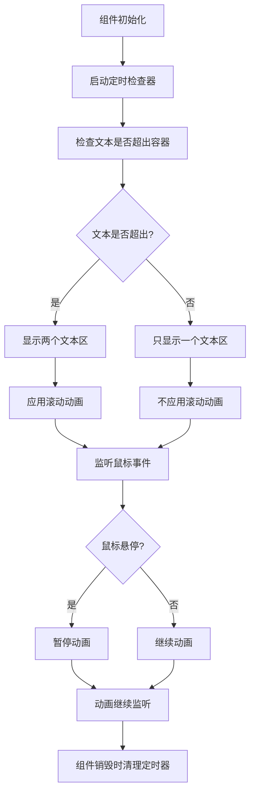

# 大屏文字滚动组件

## 简介

在大屏可视化项目中，文字展示看似简单，却藏着不少坑 —— 比如公告栏文本过长超出容器、数据说明文字被截断、普通滚动组件要么卡顿要么衔接生硬，甚至鼠标悬停时还在 "自顾自" 滚动，体验极差。

本组件基于实战代码封装，解决了大屏文字滚动的三大核心痛点：

1. **智能判断是否需要滚动**：文本没超出容器时不滚动
2. **无缝衔接滚动**：避免断层，滚动流畅自然
3. **鼠标悬停暂停**：提升交互友好性

## 核心代码

```tsx
import React, { useState, useEffect, useRef } from 'react';
import './scroll-text.scss';

interface ScrollTextProps {
	children: React.ReactNode;
	speed?: number; // 滚动速度，单位秒
	pauseOnHover?: boolean; // 鼠标悬停时是否暂停
	className?: string;
}

const ScrollText: React.FC<ScrollTextProps> = ({
	children,
	speed = 10,
	pauseOnHover = true,
	className = ''
}) => {
	const [needToScroll, setNeedToScroll] = useState(false);
	const outerRef = useRef<HTMLDivElement>(null);
	const innerRef = useRef<HTMLDivElement>(null);
	const checkTimerRef = useRef<NodeJS.Timeout | null>(null);

	// 检查文本是否超出容器
	const isOverflow = () => {
		if (!outerRef.current || !innerRef.current) return false;

		const outerWidth = outerRef.current.getBoundingClientRect().width;
		const innerWidth = innerRef.current.getBoundingClientRect().width;
		return innerWidth > outerWidth;
	};

	// 检查是否需要滚动
	const check = () => {
		const overflow = isOverflow();
		setNeedToScroll(overflow);
	};

	// 启动定时器检查
	const startCheck = () => {
		if (checkTimerRef.current) {
			clearInterval(checkTimerRef.current);
		}
		checkTimerRef.current = setInterval(check, 100);
		check(); // 立即执行一次
	};

	// 停止定时器
	const stopCheck = () => {
		if (checkTimerRef.current) {
			clearInterval(checkTimerRef.current);
			checkTimerRef.current = null;
		}
	};

	// 鼠标进入事件
	const handleMouseEnter = () => {
		if (pauseOnHover && needToScroll && outerRef.current) {
			const inner = outerRef.current.querySelector('.st-inner') as HTMLElement;
			if (inner) {
				inner.style.animationPlayState = 'paused';
			}
		}
	};

	// 鼠标离开事件
	const handleMouseLeave = () => {
		if (pauseOnHover && needToScroll && outerRef.current) {
			const inner = outerRef.current.querySelector('.st-inner') as HTMLElement;
			if (inner) {
				inner.style.animationPlayState = 'running';
			}
		}
	};

	useEffect(() => {
		startCheck();

		return () => {
			stopCheck();
		};
	}, [children, speed, pauseOnHover]);

	return (
		<div
			className={`scroll-text-container ${className}`}
			ref={outerRef}
			onMouseEnter={handleMouseEnter}
			onMouseLeave={handleMouseLeave}
		>
			<div
				className={`st-inner ${needToScroll ? 'st-scrolling' : ''}`}
				style={{
					animationDuration: `${speed}s`,
					animationPlayState: needToScroll ? 'running' : 'paused'
				}}
			>
				<span className="st-section" ref={innerRef}>
					{children}
				</span>
				{needToScroll && (
					<span className="st-section" style={{ userSelect: 'none' }}>
						{children}
					</span>
				)}
			</div>
		</div>
	);
};

export default ScrollText;
```

## 流程图说明



## 参数说明

| 参数名       | 类型            | 默认值 | 说明                               |
| ------------ | --------------- | ------ | ---------------------------------- |
| children     | React.ReactNode | -      | 需要滚动的文本内容                 |
| speed        | number          | 10     | 滚动速度，单位为秒，值越大滚动越慢 |
| pauseOnHover | boolean         | true   | 鼠标悬停时是否暂停滚动             |
| className    | string          | ''     | 自定义 CSS 类名                    |

## 使用示例

```tsx
import ScrollText from './index';

const App: React.FC = () => {
	return (
		<ScrollText speed={15} pauseOnHover={true}>
			这是一段很长的文本，用于演示大屏文字滚动组件的效果。
		</ScrollText>
	);
};

export default App;
```

## 核心优势

1. **智能省心**：不用手动配置"是否滚动"，组件自动判断，文本没超出就安静待着，超出才滚动
2. **体验流畅**：无缝衔接滚动 + 鼠标悬停暂停，大屏观看不晃眼、细看不费劲
3. **适配性强**：支持动态文本、大屏缩放，不用改代码就能应对不同场景
