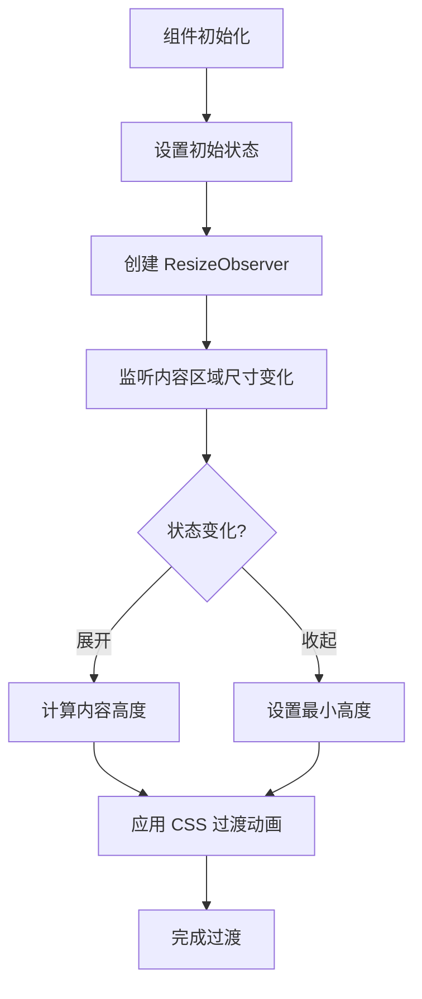
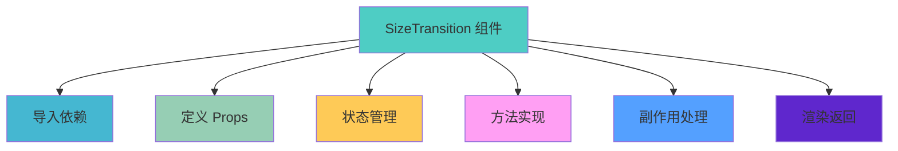

# SizeTransition 组件

## 简介

SizeTransition 是一个用于为不固定高度的 div 添加过渡动画效果的 React 组件。它使用 ResizeObserver API 来监听元素尺寸的变化，从而实现流畅的高度过渡动画。

## 实现原理



1. 使用 ResizeObserver API 监听内容区域的高度变化
2. 通过状态管理控制元素的显示和隐藏
3. 利用 CSS transition 属性实现平滑的过渡效果

## 使用方法

```jsx
import SizeTransition from './SizeTransition';

function App() {
	const [showContent, setShowContent] = useState(true);

	return (
		<div>
			<button onClick={() => setShowContent(!showContent)}>切换内容</button>

			<SizeTransition minHeight={0} initState={showContent}>
				<div>
					<h3>这是可变高度的内容区域</h3>
					<p>这段内容的高度是不固定的，会根据内容的多少自动调整。</p>
					{/* 更多内容 */}
				</div>
			</SizeTransition>
		</div>
	);
}
```

### 通过 ref 访问内部方法

```jsx
import React, { useRef } from 'react';
import SizeTransition from './SizeTransition';

function App() {
	const sizeTransitionRef = useRef(null);

	const handleExpand = () => {
		sizeTransitionRef.current?.expand();
	};

	const handleContract = () => {
		sizeTransitionRef.current?.contract();
	};

	const handleToggle = () => {
		sizeTransitionRef.current?.toggle();
	};

	return (
		<div>
			<button onClick={handleExpand}>展开</button>
			<button onClick={handleContract}>收起</button>
			<button onClick={handleToggle}>切换</button>

			<SizeTransition ref={sizeTransitionRef} minHeight={0}>
				<div>
					<h3>这是可变高度的内容区域</h3>
					<p>这段内容的高度是不固定的，会根据内容的多少自动调整。</p>
				</div>
			</SizeTransition>
		</div>
	);
}
```

## API 参考

### Props

| 属性名    | 类型      | 默认值 | 描述                                |
| --------- | --------- | ------ | ----------------------------------- |
| children  | ReactNode | -      | 要应用过渡效果的内容                |
| minHeight | number    | 0      | 收起时的最小高度                    |
| initState | boolean   | true   | 初始状态，true 为展开，false 为收起 |

### Ref Methods

通过 ref 可以访问组件的以下方法：

| 方法名     | 描述                    |
| ---------- | ----------------------- |
| expand()   | 展开内容                |
| contract() | 收起内容                |
| toggle()   | 切换内容的展开/收起状态 |

## 实现细节

### 核心逻辑

1. **ResizeObserver 监听**：组件使用 ResizeObserver API 监听内容区域的高度变化
2. **状态管理**：通过 React 的 useState 钩子管理组件状态
3. **动画实现**：利用 CSS transition 属性实现平滑的高度过渡效果
4. **方法暴露**：使用 useImperativeHandle 钩子暴露方法给父组件

### 代码结构



## 注意事项

1. 该组件依赖 ResizeObserver API，对于较老的浏览器可能需要添加 polyfill
2. 组件会自动监听内容区域的高度变化并更新过渡效果
3. 可以通过 ref 调用组件的 expand、contract、toggle 方法来控制展开/收起状态

### 浏览器兼容性

ResizeObserver API 在以下浏览器版本中得到支持：

- Chrome 64+
- Firefox 69+
- Safari 13.1+
- Edge 79+

对于不支持的浏览器，可以安装并使用 polyfill：

```bash
npm install @juggle/resize-observer
```

然后在项目的入口文件中添加：

```javascript
// 在 ResizeObserver 使用之前添加
if (!window.ResizeObserver) {
	window.ResizeObserver = require('@juggle/resize-observer').ResizeObserver;
}
```

或者使用动态导入：

```javascript
if (!window.ResizeObserver) {
	const { ResizeObserver } = await import('@juggle/resize-observer');
	window.ResizeObserver = ResizeObserver;
}
```

## 性能优化建议

1. **避免频繁重排**：确保内容区域不会频繁触发重排操作
2. **合理设置过渡时间**：建议保持 0.3s 的过渡时间以获得最佳用户体验
3. **内存管理**：组件销毁时会自动断开 ResizeObserver 连接，避免内存泄漏

## 常见问题

1. **过渡动画不生效**：

   - 检查 CSS transition 属性是否正确设置
   - 确保内容区域有明确的高度变化

2. **方法调用失败**：

   - 确保正确传递 ref 引用
   - 检查组件是否已正确挂载

3. **高度计算不准确**：
   - 确保 ResizeObserver 正确监听内容区域
   - 检查内容是否包含异步加载的元素
