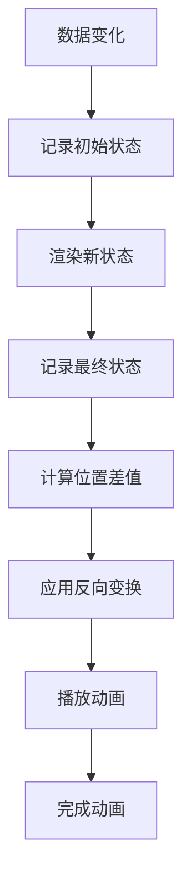
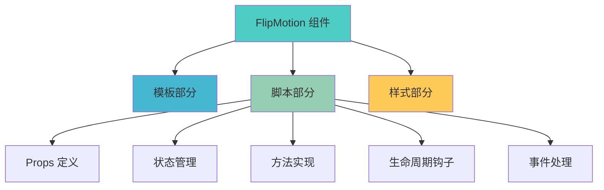

# FlipMotion 组件 (Vue 版本)

## 简介

FlipMotion 是一个基于 FLIP (First Last Invert Play) 动画技术封装的 Vue 组件，用于实现流畅的界面动画效果。通过记录元素在状态变化前后的位置和尺寸，计算出差值并应用反向变换，最终播放自然的过渡动画。

## 功能特性

- 🌟 FLIP 动画技术实现
- 📏 支持位置、尺寸、颜色等多种属性动画
- 可自定义动画参数（时长、缓动函数等）
- 支持自定义选择器和嵌套动画
- 响应式设计，适配不同屏幕尺寸

## 工作原理



### 核心概念

1. **First（初始状态）**：在数据变化前记录元素的位置和尺寸
2. **Last（最终状态）**：在数据变化后记录元素的新位置和尺寸
3. **Invert（反转）**：计算位置差值，并应用反向变换使元素回到初始位置
4. **Play（播放）**：移除反向变换，让元素自然过渡到最终位置

## 使用方法

### 基本使用

```vue
<template>
	<Flip :mutation="list">
		<div v-for="item in list" :key="item.id">
			{{ item.name }}
		</div>
	</Flip>
</template>

<script setup>
import Flip from './FlipMotion/index.vue';
import { ref } from 'vue';

const list = ref([
	{ id: 1, name: '项目 A' },
	{ id: 2, name: '项目 B' },
	{ id: 3, name: '项目 C' }
]);
</script>
```

### 高级使用

```vue
<template>
	<Flip
		:mutation="list"
		:animate-option="animateOption"
		:styles="['position-x', 'position-y', 'backgroundColor']"
		selector=".animated-item"
		@finish="onAnimationFinish"
	>
		<div
			v-for="item in list"
			:key="item.id"
			:class="['animated-item', { selected: item.selected }]"
			:style="{ backgroundColor: item.color }"
		>
			{{ item.name }}
		</div>
	</Flip>
</template>

<script setup>
import Flip from './FlipMotion/index.vue';
import { ref, reactive } from 'vue';

const list = ref([
	{ id: 1, name: '项目 A', color: '#4a90e2', selected: false },
	{ id: 2, name: '项目 B', color: '#7b68ee', selected: false },
	{ id: 3, name: '项目 C', color: '#50c878', selected: false }
]);

const animateOption = reactive({
	duration: 500,
	easing: 'ease-in-out'
});

const onAnimationFinish = element => {
	console.log('动画完成:', element);
};
</script>
```

## 高级用法

### 嵌套动画

FlipMotion 组件支持嵌套使用，可以实现更复杂的动画效果：

```vue
<template>
	<Flip
		:mutation="list"
		:animate-option="{ duration: 800 }"
		:styles="['position-x', 'position-y']"
		selector=".item"
	>
		<div class="container">
			<div v-for="item in list" :key="item.id" class="item">
				<Flip :mutation="item" :styles="['backgroundColor']" :animate-option="{ duration: 500 }">
					<div :style="{ backgroundColor: item.color }">
						{{ item.name }}
					</div>
				</Flip>
			</div>
		</div>
	</Flip>
</template>
```

### 自定义选择器

通过 `selector` 属性可以精确控制需要动画的元素：

```vue
<template>
	<Flip :mutation="list" selector=".animated-item" :animate-option="{ duration: 500 }">
		<div class="wrapper">
			<div class="animated-item" v-for="item in list" :key="item.id">
				{{ item.text }}
			</div>
		</div>
	</Flip>
</template>
```

### 列表过滤动画

在列表过滤场景中，FlipMotion 可以自动处理元素的进入和离开动画：

```vue
<template>
	<Flip
		:mutation="filteredList"
		:animate-option="{ duration: 500 }"
		:styles="['position-x', 'position-y', 'opacity']"
	>
		<div class="list-container">
			<div v-for="item in filteredList" :key="item.id" :style="{ opacity: 1 }">
				{{ item.name }}
			</div>
		</div>
	</Flip>
</template>
```

## 应用场景

### 1. 网格布局动画

在网格布局中实现元素位置交换动画，如相册重排、图标排序等。

### 2. 嵌套组件动画

实现复合动画效果，如卡片位置移动同时背景色变化。

### 3. 动态列表管理

处理列表项的添加、删除、过滤等操作的流畅动画。

### 4. 表单动态字段

表单字段的动态添加和删除动画效果。

## 样式属性详解

FlipMotion 支持多种样式属性的动画：

| 样式属性          | 说明         | 应用场景         |
| ----------------- | ------------ | ---------------- |
| `position-x`      | X 轴位置动画 | 元素左右移动     |
| `position-y`      | Y 轴位置动画 | 元素上下移动     |
| `width`           | 宽度变化动画 | 元素宽度调整     |
| `height`          | 高度变化动画 | 元素高度调整     |
| `backgroundColor` | 背景色变化   | 背景色渐变过渡   |
| `color`           | 文字颜色变化 | 文字颜色渐变过渡 |
| `opacity`         | 透明度变化   | 元素淡入淡出     |
| `borderRadius`    | 圆角变化     | 元素圆角调整     |

## API 参考

### Props

| 属性名          | 类型                                     | 必填 | 默认值                                       | 说明                                 |
| --------------- | ---------------------------------------- | ---- | -------------------------------------------- | ------------------------------------ |
| `mutation`      | [Array, Object, Number, String, Boolean] | 是   | -                                            | 触发动画的响应式数据                 |
| `selector`      | String                                   | 否   | null                                         | 自定义选择器，用于选择需要动画的元素 |
| `styles`        | Array                                    | 否   | ['position-x','position-y','width','height'] | 指定参与动画的样式属性               |
| `animateOption` | Object                                   | 否   | {}                                           | 动画配置选项                         |

### 动画配置选项 (animateOption)

| 选项         | 类型            | 默认值   | 说明             |
| ------------ | --------------- | -------- | ---------------- |
| `duration`   | Number          | 200      | 动画持续时间(ms) |
| `easing`     | String          | "linear" | 缓动函数         |
| `delay`      | Number          | 0        | 动画延迟时间(ms) |
| `iterations` | Number/Infinity | 1        | 动画重复次数     |
| `direction`  | String          | "normal" | 动画播放方向     |
| `fill`       | String          | "none"   | 动画填充模式     |

### 事件

| 事件名   | 参数    | 说明           |
| -------- | ------- | -------------- |
| `finish` | element | 动画完成时触发 |

### 方法

通过 ref 可以调用组件的以下方法：

| 方法名            | 说明             |
| ----------------- | ---------------- |
| `recordFirst()`   | 手动记录初始状态 |
| `playAnimation()` | 手动播放动画     |

## 实现细节

### 核心逻辑

1. **状态监听**：通过 watch 监听 mutation 数据变化
2. **位置记录**：使用 getBoundingClientRect 获取元素位置信息
3. **动画计算**：计算位置差值并应用反向变换
4. **动画播放**：使用 Web Animations API 播放动画

### 代码结构



## 自定义参数配置

FlipMotion 组件支持通过 animateOption 参数配置动画效果：

- **duration**：控制动画持续时间，可实时调整
- **easing**：设置缓动函数，支持多种预设值
- **delay**：设置动画延迟时间
- **iterations**：设置动画重复次数

## 性能优化建议

1. **合理使用 selector**：避免选择器过于复杂导致性能问题
2. **限制 styles 数组**：只包含需要动画的样式属性
3. **避免频繁触发**：合理控制数据变化频率
4. **使用 will-change**：对复杂动画元素添加 will-change 提示

## 常见问题

1. **动画不生效**：

   - 检查 mutation 数据是否正确变化
   - 确保元素具有唯一标识（key 或 id）

2. **性能问题**：

   - 减少同时动画的元素数量
   - 优化选择器性能

3. **样式异常**：
   - 检查 styles 数组配置是否正确
   - 确保元素具有正确的 CSS 属性

## 浏览器兼容性

FlipMotion 使用了现代 Web API，对于不支持的浏览器可能需要 polyfill：

- Web Animations API
- ResizeObserver API

## 相关资源

- **GitHub**: https://github.com/qianyuanjia/vue-flip-motion
- **NPM**: https://www.npmjs.com/package/vue-flip-motion
- **FLIP 技术介绍**: https://aerotwist.com/blog/flip-your-animations/
