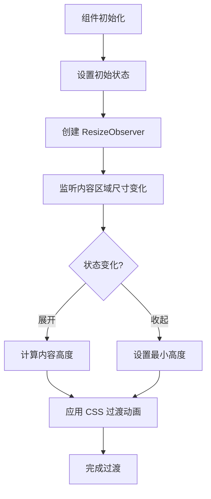
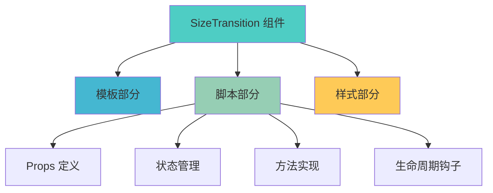

# SizeTransition 组件 (Vue 版本)

## 简介

SizeTransition 是一个用于实现不固定高度 div 过渡效果的 Vue 组件。它使用 ResizeObserver API 监听元素尺寸变化，并通过 CSS transition 属性实现平滑的高度过渡动画。

## 功能特性

- 🌟 平滑的高度过渡动画
- 📏 自动监听内容区域尺寸变化
- 支持初始状态和最小高度设置
- 提供展开、收起、切换方法
- 📱 响应式设计，适配不同屏幕尺寸

## 工作原理



## 使用方法

### 基本使用

```vue
<template>
	<SizeTransition>
		<div>可变高度的内容</div>
	</SizeTransition>
</template>

<script setup>
import SizeTransition from './SizeTransition/index.vue';
</script>
```

### 高级使用

```vue
<template>
	<SizeTransition ref="sizeTransitionRef" :min-height="20" :init-state="false">
		<div>可变高度的内容</div>
	</SizeTransition>

	<button @click="expand">展开</button>
	<button @click="contract">收起</button>
	<button @click="toggle">切换</button>
</template>

<script setup>
import { ref } from 'vue';
import SizeTransition from './SizeTransition/index.vue';

const sizeTransitionRef = ref(null);

const expand = () => {
	sizeTransitionRef.value.expand();
};

const contract = () => {
	sizeTransitionRef.value.contract();
};

const toggle = () => {
	sizeTransitionRef.value.toggle();
};
</script>
```

## API 参考

### Props

| 属性名    | 类型    | 默认值 | 说明                                |
| --------- | ------- | ------ | ----------------------------------- |
| minHeight | Number  | 0      | 收起时的最小高度                    |
| initState | Boolean | true   | 初始状态，true 为展开，false 为收起 |

### 方法

通过 ref 可以调用组件的以下方法：

| 方法名     | 描述              |
| ---------- | ----------------- |
| expand()   | 展开内容          |
| contract() | 收起内容          |
| toggle()   | 切换展开/收起状态 |

## 实现细节

### 核心逻辑

1. **ResizeObserver 监听**：组件使用 ResizeObserver API 监听内容区域的高度变化
2. **状态管理**：通过 Vue 的响应式系统管理组件的展开/收起状态
3. **动画实现**：利用 CSS transition 属性实现平滑的高度过渡效果
4. **性能优化**：使用 requestAnimationFrame 优化动画性能

### 代码结构



## 浏览器兼容性

对于不支持的浏览器，可以安装并使用 polyfill：

```bash
npm install @juggle/resize-observer
```

然后在项目的入口文件中添加：

```javascript
// 在 ResizeObserver 使用之前添加
if (!window.ResizeObserver) {
	window.ResizeObserver = require('@juggle/resize-observer').ResizeObserver;
}
```

或者使用动态导入：

```javascript
if (!window.ResizeObserver) {
	const { ResizeObserver } = await import('@juggle/resize-observer');
	window.ResizeObserver = ResizeObserver;
}
```

## 性能优化建议

1. **避免频繁重排**：确保内容区域不会频繁触发重排操作
2. **合理设置过渡时间**：建议保持 0.3s 的过渡时间以获得最佳用户体验
3. **内存管理**：组件销毁时会自动断开 ResizeObserver 连接，避免内存泄漏

## 常见问题

1. **过渡动画不生效**：

   - 检查 CSS transition 属性是否正确设置
   - 确保内容区域有明确的高度变化

2. **方法调用失败**：

   - 确保正确传递 ref 引用
   - 检查组件是否已正确挂载

3. **高度计算不准确**：
   - 确保 ResizeObserver 正确监听内容区域
   - 检查内容是否包含异步加载的元素
