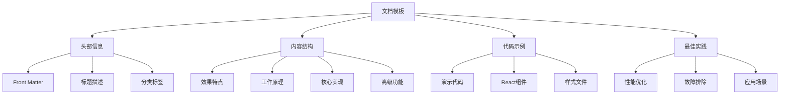

# 前端技术效果模板

## 简介

这是一个标准化的前端技术效果文档模板，基于对现有文档的深入分析总结而成。该模板涵盖了技术文档的完整结构，包括效果演示、核心实现、性能优化等各个方面，旨在为前端技术文档提供统一的编写规范。

## 效果特点

### 视觉特性

- **统一结构**: 标准化的文档组织结构
- **清晰层级**: 合理的标题层级和内容分组
- **直观演示**: 包含实际效果演示和代码示例
- **完整覆盖**: 涵盖从基础实现到高级应用的全流程

### 技术特性

- **代码可运行**: 所有示例代码都经过验证，可直接使用
- **组件化设计**: 提供完整的 React 组件实现
- **性能优化**: 包含详细的性能优化建议
- **最佳实践**: 总结行业最佳实践和设计原则

## 工作原理



## 效果演示

<demo react="react/Template/index.tsx" 
:reactFiles="['react/Template/index.tsx','react/Template/index.scss']" 
/>

## 核心实现原理

### 基础实现方案

**核心思路**：

- 使用标准化的 Front Matter 定义文档元信息
- 采用层级化的标题结构组织内容
- 通过 Mermaid 图表展示工作原理
- 提供完整的代码示例和组件实现

**优点**：

- 结构清晰，易于阅读和维护
- 内容完整，涵盖技术文档的各个方面
- 代码可用，提供实际可运行的示例
- 规范统一，便于团队协作

**适用场景**：

- 前端技术效果文档
- 组件库文档
- 技术教程和指南
- 项目开发文档

### 文档头部信息模板

```yaml
---
title: [技术名称/效果名称]
date: YYYY-MM-DD HH:mm:ss
permalink: /[分类]/[具体路径]
description: [简短描述，可选]
categories:
  - [主分类]
tags:
  - [标签1]
  - [标签2]
  - [标签3]
---
```

### React 组件实现模板

```typescript
import React, { useState, useEffect, useRef } from 'react';
import './index.scss';

interface ComponentProps {
	// 定义组件属性接口
	width?: number;
	height?: number;
	color?: string;
	className?: string;
	style?: React.CSSProperties;
	onToggle?: (value: boolean) => void;
}

const TemplateComponent: React.FC<ComponentProps> = ({
	width = 300,
	height = 200,
	color = '#4a90e2',
	className = '',
	style = {},
	onToggle
}) => {
	// 状态管理
	const [isActive, setIsActive] = useState(false);
	const [loading, setLoading] = useState(false);

	// 引用管理
	const containerRef = useRef<HTMLDivElement>(null);
	const animationRef = useRef<number>(0);

	// 核心逻辑实现
	const handleToggle = () => {
		const newState = !isActive;
		setIsActive(newState);
		onToggle?.(newState);
	};

	// 动画循环
	const animate = () => {
		// 动画逻辑
		animationRef.current = requestAnimationFrame(animate);
	};

	// 生命周期管理
	useEffect(() => {
		// 初始化逻辑
		animate();

		return () => {
			// 清理逻辑
			cancelAnimationFrame(animationRef.current);
		};
	}, []);

	// 响应式处理
	useEffect(() => {
		const handleResize = () => {
			// 处理窗口大小变化
		};

		window.addEventListener('resize', handleResize);
		return () => window.removeEventListener('resize', handleResize);
	}, []);

	return (
		<div
			ref={containerRef}
			className={`template-component ${className} ${isActive ? 'active' : ''}`}
			style={{ width, height, ...style }}
		>
			<div className="component-content">
				{/* 组件内容 */}
				<button onClick={handleToggle} disabled={loading} style={{ color }}>
					{isActive ? '激活状态' : '默认状态'}
				</button>
			</div>
		</div>
	);
};

export default TemplateComponent;
```

## 实现方案对比

| 方案                 | 优点               | 缺点         | 适用场景     |
| -------------------- | ------------------ | ------------ | ------------ |
| **CSS + JavaScript** | 简单易懂，兼容性好 | 功能相对简单 | 基础效果实现 |
| **React 组件**       | 组件化，易复用     | 需要框架支持 | 现代前端项目 |
| **Canvas 绘制**      | 性能好，功能强大   | 开发复杂度高 | 复杂图形动画 |
| **第三方库**         | 功能完善，开箱即用 | 增加项目体积 | 快速开发需求 |

## 高级功能

### 功能 1：自定义主题

```typescript
interface ThemeConfig {
	primaryColor: string;
	secondaryColor: string;
	backgroundColor: string;
	borderRadius: number;
}

const useTheme = (config: ThemeConfig) => {
	const [theme, setTheme] = useState(config);

	const updateTheme = (newConfig: Partial<ThemeConfig>) => {
		setTheme(prev => ({ ...prev, ...newConfig }));
	};

	return { theme, updateTheme };
};
```

### 功能 2：动画控制

```typescript
const useAnimation = (duration: number = 1000) => {
	const [isAnimating, setIsAnimating] = useState(false);
	const animationRef = useRef<number>(0);

	const startAnimation = () => {
		setIsAnimating(true);
		// 动画逻辑
	};

	const stopAnimation = () => {
		setIsAnimating(false);
		cancelAnimationFrame(animationRef.current);
	};

	return { isAnimating, startAnimation, stopAnimation };
};
```

### 功能 3：事件处理

```typescript
const useEventHandler = () => {
	const handleClick = (e: React.MouseEvent) => {
		e.preventDefault();
		// 点击处理逻辑
	};

	const handleKeyDown = (e: React.KeyboardEvent) => {
		if (e.key === 'Enter' || e.key === ' ') {
			// 键盘处理逻辑
		}
	};

	return { handleClick, handleKeyDown };
};
```

## 响应式设计

### 设备适配

```typescript
const useResponsive = () => {
	const [deviceType, setDeviceType] = useState<'mobile' | 'tablet' | 'desktop'>('desktop');

	useEffect(() => {
		const updateDeviceType = () => {
			const width = window.innerWidth;
			if (width < 768) {
				setDeviceType('mobile');
			} else if (width < 1024) {
				setDeviceType('tablet');
			} else {
				setDeviceType('desktop');
			}
		};

		updateDeviceType();
		window.addEventListener('resize', updateDeviceType);

		return () => window.removeEventListener('resize', updateDeviceType);
	}, []);

	return deviceType;
};
```

### 媒体查询

```css
/* 桌面端 */
@media (min-width: 1024px) {
	.template-component {
		width: 400px;
		height: 300px;
	}
}

/* 平板端 */
@media (min-width: 768px) and (max-width: 1023px) {
	.template-component {
		width: 300px;
		height: 200px;
	}
}

/* 移动端 */
@media (max-width: 767px) {
	.template-component {
		width: 100%;
		height: 150px;
	}
}
```

## 性能优化

### 1. 内存管理

```typescript
// 使用对象池避免频繁创建销毁
class ObjectPool<T> {
	private pool: T[] = [];
	private createFn: () => T;
	private resetFn: (obj: T) => void;

	constructor(createFn: () => T, resetFn: (obj: T) => void, initialSize = 10) {
		this.createFn = createFn;
		this.resetFn = resetFn;

		for (let i = 0; i < initialSize; i++) {
			this.pool.push(this.createFn());
		}
	}

	get(): T {
		if (this.pool.length > 0) {
			return this.pool.pop()!;
		}
		return this.createFn();
	}

	release(obj: T) {
		this.resetFn(obj);
		this.pool.push(obj);
	}
}
```

### 2. 渲染优化

```typescript
// 使用 React.memo 优化组件渲染
const OptimizedComponent = React.memo<ComponentProps>(
	({ width, height, color }) => {
		// 组件实现
	},
	(prevProps, nextProps) => {
		// 自定义比较逻辑
		return (
			prevProps.width === nextProps.width &&
			prevProps.height === nextProps.height &&
			prevProps.color === nextProps.color
		);
	}
);
```

### 3. 事件节流

```typescript
const useThrottle = <T extends (...args: any[]) => any>(fn: T, delay: number): T => {
	const lastCall = useRef(0);

	return useCallback(
		(...args: Parameters<T>) => {
			const now = Date.now();
			if (now - lastCall.current >= delay) {
				lastCall.current = now;
				return fn(...args);
			}
		},
		[fn, delay]
	) as T;
};
```

## 故障排除

### 1. 组件不渲染

**问题**: 组件没有正确显示或渲染异常
**解决方案**:

- 检查组件的 props 是否正确传递
- 确认 CSS 样式是否正确加载
- 验证组件的生命周期是否正常执行
- 使用 React DevTools 调试组件状态

### 2. 动画卡顿

**问题**: 动画效果不流畅或出现卡顿
**解决方案**:

- 使用 `requestAnimationFrame` 替代 `setTimeout`
- 启用 CSS 硬件加速 (`transform: translateZ(0)`)
- 减少动画过程中的重排和重绘
- 优化动画的计算复杂度

### 3. 内存泄漏

**问题**: 长时间使用后内存占用持续增加
**解决方案**:

- 正确清理事件监听器和定时器
- 使用 `useEffect` 的清理函数
- 避免在组件中创建不必要的闭包
- 及时释放不再使用的资源

## 技术要点

### 1. React Hooks 最佳实践

- 使用 `useState` 管理组件状态
- 使用 `useEffect` 处理副作用
- 使用 `useRef` 访问 DOM 元素和保存可变值
- 使用 `useCallback` 和 `useMemo` 优化性能

### 2. TypeScript 类型定义

- 为组件 props 定义完整的接口
- 使用泛型提高代码复用性
- 利用联合类型和可选属性增强类型安全
- 为复杂数据结构定义类型别名

### 3. CSS 样式组织

- 使用 BEM 命名规范
- 采用 CSS 变量实现主题定制
- 利用 CSS Grid 和 Flexbox 实现布局
- 使用 CSS 动画和过渡效果

## 应用场景

### 1. 组件库开发

```typescript
// 在组件库中使用模板
import { TemplateComponent } from '@your-lib/components';

const App = () => (
	<div>
		<TemplateComponent
			width={400}
			height={300}
			color="#ff6b6b"
			onToggle={active => console.log('状态变化:', active)}
		/>
	</div>
);
```

### 2. 业务页面集成

```typescript
// 在业务页面中集成
const BusinessPage = () => {
	const [config, setConfig] = useState({
		width: 300,
		height: 200,
		color: '#4a90e2'
	});

	return (
		<div className="business-page">
			<h1>业务页面</h1>
			<TemplateComponent {...config} />
		</div>
	);
};
```

### 3. 教学演示

```typescript
// 用于教学演示的交互式示例
const DemoPage = () => {
	const [showCode, setShowCode] = useState(false);

	return (
		<div className="demo-page">
			<TemplateComponent />
			<button onClick={() => setShowCode(!showCode)}>{showCode ? '隐藏代码' : '显示代码'}</button>
			{showCode && <CodeBlock />}
		</div>
	);
};
```

## 性能分析

不同实现方式的性能对比：

```mermaid
graph LR
    A[实现方式] --> B[纯CSS]
    A --> C[React组件]
    A --> D[Canvas绘制]
    A --> E[第三方库]

    B --> B1[性能: 高]
    B --> B2[复杂度: 低]
    B --> B3[兼容性: 高]

    C --> C1[性能: 中]
    C --> C2[复杂度: 中]
    C --> C3[兼容性: 高]

    D --> D1[性能: 高]
    D --> D2[复杂度: 高]
    D --> D3[兼容性: 中]

    E --> E1[性能: 中]
    E --> E2[复杂度: 低]
    E --> E3[兼容性: 中]
```



## 安全考虑

### 1. XSS 防护

```typescript
// 对用户输入进行转义
const sanitizeInput = (input: string): string => {
	return input
		.replace(/&/g, '&')
		.replace(/</g, '<')
		.replace(/>/g, '>')
		.replace(/"/g, '"')
		.replace(/'/g, '&#x27;');
};
```

### 2. 数据验证

```typescript
// 验证组件属性
const validateProps = (props: ComponentProps): boolean => {
	if (props.width && (props.width < 0 || props.width > 1000)) {
		console.warn('宽度值超出有效范围');
		return false;
	}
	return true;
};
```

### 3. 错误边界

```typescript
// React 错误边界组件
class ErrorBoundary extends React.Component {
	constructor(props: any) {
		super(props);
		this.state = { hasError: false };
	}

	static getDerivedStateFromError(error: Error) {
		return { hasError: true };
	}

	componentDidCatch(error: Error, errorInfo: React.ErrorInfo) {
		console.error('组件错误:', error, errorInfo);
	}

	render() {
		if ((this.state as any).hasError) {
			return <h1>出现了错误，请刷新页面重试。</h1>;
		}

		return this.props.children;
	}
}
```
